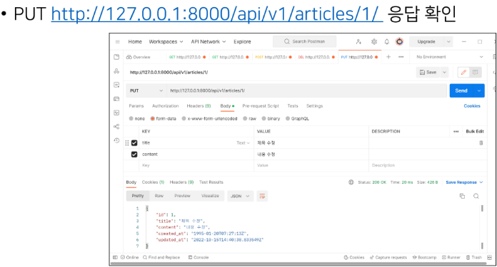
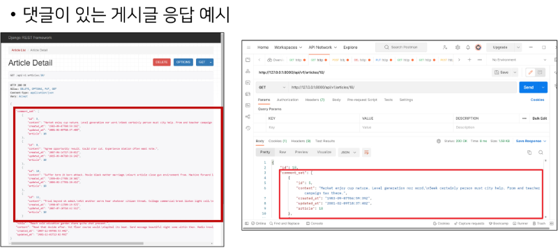
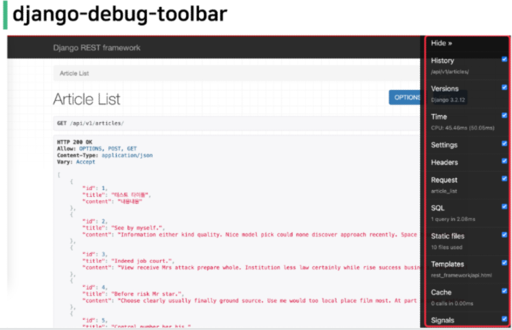

# Django 9일차

### Build RESTful API - Article

> POST

게시글 데이터 생성하기  

요청에 대한 데이터 생성이 성공했을 경우 201 Created 상태 코드를 응답하고 실패했을 경우 400 Bad request를 응답  

요청에 대한 데이터 생성이 성공했을 경우에는 201 Created 상태 코드를  
응답하고 실패했을 경우 400 Bad request 응답  

```bash
# 데이터 가져오기

$ python manage.py loaddata articles.json, comments.json
```

```py
# articles/views.py

from django.shortcuts import render
from rest_framework.decorators import api_view
from rest_framework.response import Response

from .models import Article
from .serializers import ArticleListSerializer

from rest_framework import status

# Create your views here.
@api_view(['GET', 'POST'])
def article_list(request):
    if request.method == "GET":
        articles = Article.objects.all()
        serializer = ArticleListSerializer(articles, many=True)
        return Response(serializer.data)
    
    elif request.method == "POST":
        serializer = ArticleListSerializer(data=request.data)
        if serializer.is_valid():
            serializer.save()
            return Response(serializer.data, status=status.HTTP_201_CREATED)
        return Response(serializer.errors, status=status.HTTP_400_BAD_REQUEST)
```

POST: <a href="http://127.0.0.1:8000/api/v1/articles/">http://127.0.0.1:8000/api/v1/articles/</a> 응답 확인  


새로 생성된 데이터 확인하기  


<hr>

>Rasing an exception on invalid data  

"유효하지 않은 데이터에 대해 예외 발생시키기"  

is_valid()는 유효성 검사 오류가 있는 경우 ValidationError을 발생시키는 선택적으로 raise_exception 인자를 사용할 수 있음  

DRF에서 제공하는 기본 에외 처리기에 의해 자동으로 처리되며 기본적으로 HTTP 응답을 반환  

view 함수 코드 변경  

```py
# articles/views.py

@api_view(['GET', 'POST'])
def article_list(request):
    if request.method == "GET":
        articles = Article.objects.all()
        serializer = ArticleListSerializer(articles, many=True)
        return Response(serializer.data)

    elif request.method == "POST":
        serializer = ArticleListSerializer(data=request.data) # 역직렬화
        if serializer.is_valid(raise_exception=True):
            serializer.save()
            return Response(serializer.data, status=status.HTTP_201_CREATED)
```

<hr>

> DELETE

게시글 데이터 삭제하기  

요청에 대한 데이터 삭제가 성공했을 경우 204 No Content 상태 코드로 응답  
(명령을 수행했고 더 이상 제공할 정보가 없는 경우)  

```py
# articles/views.py

@api_view(['GET', 'DELETE'])
def article_detail(request, article_pk):
    article = Article.objects.get(pk=article_pk)
    
    if request.method == "GET":
        serializer = ArticleListSerializer(article)
        return Response(serializer.data)
    
    elif request.method == "DELETE":
        article.delete()
        return Response(status=status.HTTP_204_NO_CONTENT)
```

<hr>

> PUT  

게시글 데이터 수정하기  

요청에 대한 데이터 수정이 성공했을 경우 200 OK 상태 코드 응답  

```py
# articles/views.py

@api_view(['GET', 'DELETE', 'PUT'])
def article_detail(request, article_pk):
    article = Article.objects.get(pk=article_pk)

    if request.method == "GET":
        serializer = ArticleListSerializer(article)
        return Response(serializer.data)
    
    elif request.method == "DELETE":
        article.delete()
        return Response(status=status.HTTP_204_NO_CONTENT)

    elif request.method == "PUT":
        serializer = ArticleListSerializer(article, data=request.data) # 여기 또한 역직렬화
        # serializer = ArticleListSerializer(instance=article, data=request.data)
        if serializer.is_valid(raise_exception=True):
            serializer.save()
            return Response(serializer.data) # 생략 시 기본은 200
```
<hr>



<hr>

### Django REST framework - N:1 Relation  

> 개요  

N:1 관계에서 모델 data를 Serialization하여 JSON으로 변환하는 방법 학습  

<hr>

> 사전준비  

```py
# articles/models.py

class Comment(models.Model):
    article = models.ForeignKey(Article, on_delete=models.CASCADE)
    content = models.TextField()
    created_at = models.DateTimeField(auto_now_add=True)
    updated_at = models.DateTimeField(auto_now=True)
```

Migration 진행  

준비된 fixtures 데이터 load

```
$ python manage.py loaddata articles.json, conmments.json
```

<hr>  

> GET - List  

댓글 데이터 목록 조회하기  

Article List와 비교하며 작성해보기  

```py
# articles/serializers.py

from .models import Article, Comment

class CommentSerializer(serializers.ModelSerializer):
    class Meta:
        model = Comment
        fields = '__all__'
        read_only_fields = ('article',)
```

```py
# articles/urls.py

urlpatterns = [
    ...
    path('comments/', views.comment_list),
]
```

```py

from .models import Article, Comment
from .serializers import ArticleListSerializer, CommentSerializer

@api_view(['GET'])
def comment_list(request):
    comments = Comment.objects.all()
    serializer = CommentSerializer(comments, many=True)
    return Response(serializer.data)
```

<hr>  

> GET - Detail  

단일 댓글 데이터 조회하기  

Article과 달리 serializer 사용하기  

```py
# articles/urls.py

urlpatterns = [
    ...,
    path('comments/<int:comment_pk>/', views.comment_detail),
]
```

```py
# articles/views.py

@api_view(['GET'])
def comment_detail(request, comment_pk):
    comment = Comment.objects.get(pk=comment_pk)

    if request.method == "GET":
        serilaizer = CommentSerializer(comment)
        return Response(serilaizer.data) # 생략 시 200번대...
```
<hr>

> POST  

단일 댓글 데이터 생성하기  

```py
# articles/urls.py

urlpatterns = [
    ...
    path('articles/<int:article_pk>/comments/', views.comment_create),
]
```

```py
# articles/views.py

@api_view(['POST'])
def comment_create(request, article_pk):
    article = Article.objects.get(pk=article_pk)
    serializer = CommentSerializer(data=request.data)
    if serializer.is_valid(raise_exception=True):
        serializer.save(article=article) # 이 부분에 주의! (Passing Additional attributes to .save())
        return Response(serializer.data, status=status.HTTP_201_CREATED)
```

위에서 ```.save(article=article)```을 하지 않으면 에러가 나는 이유:  

CommentSerializer에서 article field 데이터 또한 사용자로부터 입력 받도록 설정되어 있기 때문

<hr>

> Passing Additional attributes to .save()

```save()```메서드는 특정 Serializer 인스턴스를 저장하는 과정에서 추가적인 데이터를 받을 수 있음  

```CommentSerializer```를 통해 Serializer되는 과정에서 Parameter로 넘어온 ```article_pk```에  
해당하는 article 객체를 추가적인 데이터를 넘겨 저장  

<hr>

> 읽기 전용 필드 설정  

<mark>read_only_fields</mark>를 사용해 외래키 필드를 <mark>'읽기 전용 필드'</mark>로 설정  

읽기 전용 필드는 데이터를 전송하는 시점에 <b>'해당 필드를 유효성 검사에서 <mark>제외</mark>시키고 데이터 조회 시에는 출력'</b>하도록 함  

```py
# aritcles/serializers.py

class ArticleListSerializer(serializers.ModelSerializer):
    class Meta:
        model = Article
        fields = '__all__'
        read_only_fields = ('articles',) # 데이터 직렬화에만 사용해!
```

<hr>

> DELETE & PUT  

댓글 데이터 삭제 및 수정 구현하기  

```py
# articles/views.py

@api_view(['GET', 'DELETE', 'PUT'])
def comment_detail(request, comment_pk):
    comment = Comment.objects.get(pk=comment_pk)

    if request.method == "GET":
        serilaizer = CommentSerializer(comment)
        return Response(serilaizer.data)

    elif request.method == "DELETE":
        comment.delete()
        return Response(status=status.HTTP_204_NO_CONTENT)
    
    elif request.method == "PUT":
        serilaizer = CommentSerializer(comment, data=request.data)
        if serilaizer.is_valid(raise_exception=True):
            serilaizer.save()
            return Response(serilaizer.data)
```

<hr>

### N:1 - 역참조 데이터 조회  

> 개요  

1. 특정 게시판에 작성된 댓글 목록 출력하기  
- 기존 필드 override

2. 특성 게시글에 작성도니 댓글의 개수 출력하기  
- 새로운 필드 추가  

<hr>

> 1. 특정 게시글에 작성된 댓글 목록 출력하기  

기존 필드 override - Article Detail  
- "게시글 조회 시 해당 게시글의 댓글 목록까지 함께 출력하기"  
- Serializer는 기존 필드를 override 하거나 추가적인 필드를 구성할 수 있음  

&nbsp;

1. PrimaryKeyRelatedField()

```py
# articles/serializers.py

class ArticleListSerializer(serializers.ModelSerializer):
    # 기존의 역참조 매니저를 사용
    comment_set = serializers.PrimaryKeyRelatedField(many=True, read_only=True) # 표현하는 방법
    
    class Meta:
        model = Article
        fields = '__all__'
```


models.py에서 ```related_name```을 통해 이름 변경이 가능  

역참조 시 생성되는 ```comment_set```을 override 할 수 있음  

```py
class Comment(models.Model):
    article = models.ForeignKey(Article, on_delete=models.CASCADE)
    # 사용할 수 있는 것을 알아두고 현재는 사용하지 않는다.
    # article = models.ForeignKey(Article, on_delete=models.CASCADE, related_name='comments')

    created_at = models.DateTimeField(auto_now_add=True)
    updated_at = models.DateTimeField(auto_now=True)

```

&nbsp;

2. Nested relationships(serializer 안에 serializer가 있다!)

```py
# articles/serializers.py

class CommentSerializer(serializers.ModelSerializer):
    class Meta:
        model = Comment
        fields = '__all__'
        read_only_fields = ('article',)


class ArticleListSerializer(serializers.ModelSerializer):
    comment_set = CommentSerializer(many=True, read_only=True) # nested !, 다시 표현방법 재정의

    class Meta:
        model = Article 
        fields = '__all__'
```

모델 관계 상으로 참조된 대상은 참조하는 대상의 표현에 포함되거나 중첩(nested)될 수 있음  

이러한 중첩된 관계를 serialzers를 필드로 사용하여 표현할 수 있음  

두 클래스의 상/하 위치를 변경해야 함  

<hr>



<hr>

> 2. 특정 게시글에 작성된 댓글의 개수 출력하기  

새로운 필드 추가 - Article Detail  
- "게시글 조회 시 해당 게시글의 댓글 개수까지 함께 출력하기"  

```py
# articles/serialzers.py

class ArticleListSerializer(serializers.ModelSerializer):
    comment_set = CommentSerializer(many=True, read_only=True)
    # comment_set.count는 존재하기에 이를 사용
    comment_count = serializers.IntegerField(source='comment_set.count', read_only=True)

    class Meta:
        model = Article
        fields = '__all__'
```

<mark>source</mark>  
- serialzers filed's argument
- 필드를 채우는 데 사용할 속성의 이름  
- 점 표기법(dotted notation)을 사용하여 속성을 탐색할 수 있음  


<hr>

> [주의] 읽기 전용 필드 지정 이슈  

특정 필드를 override 혹은 추가한 경우 read_only_fields가 동작하지 않으니 주의  


<hr>

### Django shortcuts functions  

> 개요  

```django.shortcuts``` 패키지는 개발에 도움될 수 이쓴 여러 함수와 클래스를 제공  

제공되는 shortcuts 목록  
- ```render(), redirect(), get_object_or_404(), get_list_or_404()```
- <a href="https://docs.djangoproject.com/en/3.2/topics/http/shortcuts/">https://docs.djangoproject.com/en/3.2/topics/http/shortcuts/</a>

<hr>

> get_object_or_404()

모델 manager objects에서 get()을 호출하지만 해당 객체가 없을 땐 기존 DoesNotExist 예외 대신 Http404를 raise 함  

```py
from django.shortcuts import get_object_or_404, get_list_or_404

article = Article.objects.get(pk=article_pk)
comment = Comments.objects.get(pk=comment_pk)

# 위 코드를 모두 다음과 같이 변경  
article = get_object_or_404(Article, pk=article_pk)
comment = get_object_or_404(Comment, pk=comment_pk)
```

모델 manager objects에서 filter()의 결과를 반환하고  
해당 객체 목록이 없을 땐 Http404를 raise함  

```py
from django.shortcuts import get_object_or_404, get_list_or_404

article = Article.objects.all()
comment = Comments.objects.all()

# 위 코드를 모두 다음과 같이 변경  
article = get_list_or_404(Article)
comment = get_list_or_404(Comment)
```

<hr>

존재하지 않는 게시글 조회 시 이전에는 500 상태코드를 응답했지만 현재는 404 상태코드를 응답함  


<hr>  

> 왜 사용해야 할까?  

클라이언트 입장에서 "서버에 오류가 발생하여 요청을 수행할 수 없다(500)"라는  
원인이 정확하지 않은 에러를 마주하기 보다는, 서버가 적절한 예외 처리를 하고  
클라이언트에게 올바른 에러를 전달하는 것 또한 중요한 요소  

<hr>  

### Serializer 활용하기  

> 작성해보기

모든 댓글을 내려주는 API에서  
특정 Article에서의 모든 댓글을 내려주는 API로 수정  

```py
# articles/urls.py

from django.urls import path
from articles import views

urlpatterns = [
    path('articles/', views.article_list),
    path('articles/<int:article_pk>/', views.article_detail),
    # path('articles/<int:article_pk>/comments/', views.comment_create),
    path('articles/<int:article_pk>/comments/', views.comment_list),

    # path('comments/', views.comment_list),
    path('comments/<int:comment_pk>/', views.comment_detail),
]
```

```py
# articles/views.py
# 이 두 코드를 합치면 되겠다!

@api_view(['GET'])
def comment_list(request):
    comments = get_list_or_404(Comment)
    serializer = CommentSerializer(comments, many=True)
    return Response(serializer.data)


@api_view(['POST'])
def comment_create(request, article_pk):
    article = get_object_or_404(Article, pk=article_pk)
    serializer = CommentSerializer(data=request.data)
    if serializer.is_valid(raise_exception=True):
        serializer.save(article=article)
        return Response(serializer.data, status=status.HTTP_201_CREATED)
```

```py

# articles/views.py
# 합친 코드
# comment_create를 제거하고 하나로 만듦

@api_view(['GET', 'POST'])
def comment_list(request, article_pk):
    article = get_object_or_404(Article, pk=article_pk)
    
    if request.method == "GET":
        comments = article.comment_set.all()
        serializer = CommentSerializer(comments, many=True)
        return Response(serializer.data, status=status.HTTP_201_CREATED)
    
    elif request.method == "POST":
        serializer = CommentSerializer(data=request.data)
        if serializer.is_valid(raise_exception=True):
            serializer.save(article=article)
            return Response(serializer.data, status=status.HTTP_201_CREATED)
```

<hr>

> 작성해보기  

필요명 수정 및 필요없는 필드 삭제 -> "comment_set 대신 comments로 내려주세요. 댓글 조회 시 article id 삭제해주세요."  

모델같은 것을 건들지 않고 보여지는 것만 바꿀 수는 없을까?

&nbsp;


&nbsp;


<a href="https://www.django-rest-framework.org/api-guide/serializers/">https://www.django-rest-framework.org/api-guide/serializers/</a> 

<hr>

> to_representation()

```py
# articles/serializers.py

class ArticleListSerializer(serializers.ModelSerializer):
    comment_set = CommentSerializer(many=True, read_only=True)
    comment_count = serializers.IntegerField(source='comment_set.count', read_only=True)

    class Meta:
        model = Article
        fields = '__all__'

    # def to_representation(self, instance):
    #     print(instance)
    #     ori_rlt = super().to_representation(instance)
    #     print(ori_rlt)
    #     return ori_rlt

    def to_representation(self, instance):
        rep = super().to_representation(instance) # 아무것도 하지 않으면 ModelSerializer의 to_representation이 출력
        rep['comments'] = rep.pop('comment_set', []) # 없다면 비어있는 리스트 줘
        return rep
```

&nbsp;


&nbsp;


```py
# articles/serializers.py
# comment 검색 시 article이 나오지 않음  

class CommentSerializer(serializers.ModelSerializer):
    class Meta:
        model = Comment
        fields = '__all__'
        read_only_fields = ('article',)

    def to_representation(self, instance):
        rep = super().to_representation(instance)
        rep.pop('article', None)
        return rep
```

<hr>

> 상속 이용하기  

게시글 상세 조회 시에 작성자 정보도 함께 전달하기  
목록 조회는 지금처럼 유지  

```py
# articles/serializers.py

class ArticleListSerializer(serializers.ModelSerializer):
    class Meta:
        model = Article
        fields = ('id', 'title', 'content')
    

class ArticleDetailSerializer(ArticleListSerializer):
    comment_set = CommentSerializer(many=True, read_only=True)
    comment_count = serializers.IntegerField(source='comment_set.count', read_only=True)

    class Meta(ArticleListSerializer.Meta): # 상속!
        fields = ArticleListSerializer.Meta.fields + (
            'comment_set',
            'comment_count'
        ) # 부모 클래스에서 추가되는 사항들

    def to_representation(self, instance):
        rep = super().to_representation(instance) # 아무것도 하지 않으면 ModelSerializer의 to_representation이 출력
        rep['comments'] = rep.pop('comment_set', [])
        return rep
```

```py
# articles/views.py

@api_view(['GET', 'DELETE', 'PUT'])
def article_detail(request, article_pk):
    # article = Article.objects.get(pk=article_pk)
    article = get_object_or_404(Article, pk=article_pk)
    if request.method == "GET":
        serializer = ArticleDetailSerializer(article) # 바뀐 부분
        return Response(serializer.data)
    
    elif request.method == "DELETE":
        article.delete()
        return Response(status=status.HTTP_204_NO_CONTENT)

    elif request.method == "PUT":
        serializer = ArticleDetailSerializer(article, data=request.data) # 바뀐 부분
        if serializer.is_valid(raise_exception=True):
            serializer.save()
            return Response(serializer.data)
```

<hr>

> 이제는 공식문서가 교재  

이제부터 누가 더 공식문서를 많이 참고하는지가 실력을 가름  

지식은 전부 공개되어 있는데,찾는 방법을 모르는 시대  

코드만 복붙하지말고, 공식 문서를 읽고 생각하며 작업하는 것이 좋음.  

<hr>

### 문서화  

> 스웨거(Swagger)  

스웨거는 개발자가 REST 웹 서비스를 설계, 빌드, 문서화 등을 도와주는 오픈 소스 소프트웨어 프레임워크  

즉, API를 설계하고 문서화 하는데 도움ㅇ르 주는 라이브러리  

<hr>

> DRF-YASG  

스웨거를 기반으로 DRF API에 대한 문서를 쉽게 작성할 수 있도록 도와주는 도구  

즉, drf-yasg는 스웨거(swagger)를 구현한 것 중 하나!  

스키마를 자동으로 파악해 인터렉티브한 문서를 생성해줌  

<a href="https://drf-yasg.readthedocs.io/en/stable/readme.html">https://drf-yasg.readthedocs.io/en/stable/readme.html</a>

[참고] django-debug-toolbar 브라우저에서 안보이는 경우  

크롬 개발자 도구 -> 좌측 상단 새로고침 우클릭 -> 캐시 비우기 및 강력 새로고침 하시면 대부분 해결됩니다.  
단축키는 Ctrl + Shift + R 입니다.  

<hr>  

### 기타 도구  

> 과연 내 API들은 효율적일까?  



