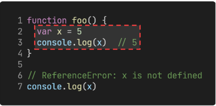
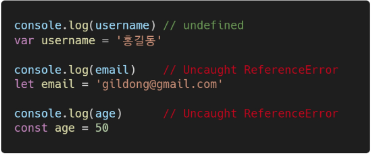
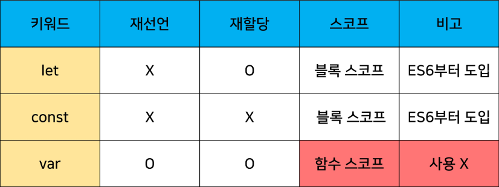

# JavaScript 1일차

### JavaScript란?

> JavaScript란?  

JavaScript는 클라이언트 측 웹(<font color="red">브라우저</font>)에서  실행  
JavaScript는 <font color="red">쉽게 배울 수 있고</font> 강력한 스크립트 언어  

웹페이지가 <font color="red">이벤트</font> 발생 시에 어떻게 작동하는 지 <font color="red">디자인 / 프로그래밍</font>  
<font color="red">웹 페이지 동작을 제어</font>하는 데 널리 사용  

<hr>

> Web 기술의 기반이 되는 언어  

 HTML 문서의 콘텐츠를 <mark>동적으로 변경</mark>할 수 있는 언어  

 Web이라는 공간에서 채팅, 게임 등 다양한 동작을 할 수 있게 된 기반  

 <a href="http://info.cern.ch/">최초의 웹</a>
 <a href="https://html-css-js.com">html-css-js.com</a>

 <hr>

 ### JavaScript Engine 

 > 개요  

 JavaScript Engine은 자바스크립트 코드를 실행하는 프로그램 또는 인터프리터  
 여러 목적으로 자바스트 엔지을 사용하지만, <mark>대체적으로 웹 브라우저</mark>에서 사용  

 <hr>

 > 웹 브라우저의 역할  
 
 URL을 통해 WEB(WWW)을 탐색  

 <mark>HTML/CSS/JavaScript를 이해한 뒤 해석</mark>해서 사용자에게 하나의 화면으로 보여줌  

 웹 서비스 이용 시 클라이언트의 역할을 함  

 즉, 웹 페이지 코드를 이해하고, 보여주는 역할을 하는 것이 바로 웹 브라우저  

 <hr>  

 > JavaScript Engine  

 <mark>HTML/CSS/JavaScript를 이해한 뒤 해석</mark>  
- JavaScript를 해석하는 것이 JavaScript Engine의 역할  

각 브라우저마다 자체 JavaScript Engine을 개발, 사용하고 있음  
- <font color="red">V8</font> - Chrome
- Chakra - Microsoft Edge
- JSC (JavaScript Core) - Apple(safari)  
- SpiderMonkey - FireFox  

<mark>대체적으로</mark> 웹 브라우저에서 사용  

웹 브라우저 외에는 어떻게 활용?  
- Node.js
    - Node.js는 V8 엔진을 사용하여 서버 측에서 자바스크립 코드를 실행 가능  
    - 브라우저 조작 이외에도 역할도 수행  

<hr>  

### JavaScript 실행 환경 구성  

> 개요  

Web Browser로 실행하기  

1. HTML 파일에 포함시키기  
2. 외부 JavaScript 파일 사용하기  
3. Web Browser에서 바로 입력하기  

<hr>  

Web Browser로 실행하기  

HTML 파일에 직접 JavaScript 코드를 작성 후 웹 브라우저로 파일 열기  

자바스크립트는 반드시 body 태그 마지막에 작성하는 것을 권장한다.

```html

<!DOCTYPE html>
<html lang="en">
<head>
  <meta charset="UTF-8">
  <meta http-equiv="X-UA-Compatible" content="IE=edge">
  <meta name="viewport" content="width=device-width, initial-scale=1.0">
  <title>Document</title>
</head>
<body>
  <script>
    console.log("안녕하세요. 반가워요.")
  </script>  
</body>
</html>
```

Chrome 개발자 도구 - Console 탭에서 결과 확인 가능  

.png)

&nbsp;

.js 확장자를 가진 파일에 JavaScript를 작성하고, 해당 파일을 HTML에 포함 가능  

```html
<!-- hello.html
 -->
<!DOCTYPE html>
<html lang="en">
<head>
  <meta charset="UTF-8">
  <meta http-equiv="X-UA-Compatible" content="IE=edge">
  <meta name="viewport" content="width=device-width, initial-scale=1.0">
  <title>Document</title>
</head>
<body>
  <script type="text/javascript" src="hello.js">
  </script>  
</body>
</html>
```

```js
// hello.js

console.log("안녕하세요. 반가워요.")
```

&nbsp;

웹 브라우저의 console에서 바로 JavaScript를 입력해도 된다. (엔진이 있으니까..)

.png)

&nbsp;

특별하게 웹 브라우저에서 바로 실행할 수 있는 JavaScript 문법들을 <font color = "red">Vanilla JavaScript</font>라고 부름  

순수한 JavaScript라는 의미 (모든 아이스크림의 순정의 Vanilla라는 어원)  

<hr>  

> 정리 

웹 브라우저는 JavaScript를 해석하는 엔진을 가지고 있음  

특히 Chrome V8의 경우 JavaScript를 번역하는 속도가 매우 빠름  
- Web Brower에서만 사용하지 말고 개발에서도 활용할 수 있음  
- node.js, react.js, electon 등의 내부 엔진으로 사용됨  
- 그 결과, back-end, mobile, desktop app 등을 모두 JavaScript로 개발이 가능해짐  

현재 JavaScript는 이제 시장에서 자리 잡은 언어이며, 개발에서 큰 축을 담당하는 언어  

<hr>  

### JavaScript를 시작하기에 앞서  

> EcmaScript  

EchmaScript란, Ecma International(전자 정보 통신 시스템 표준화 기구)이 Ecma-262 규격에 따라  
정의하고 있는 표준화된 스크립트 프로그래밍 언어를 뜻함  

즉 <mark>JavaScript를 표준화</mark>하기 위해 만들어짐  

<hr>  

> EcmaScript는 무엇을 정의하는가?  

JavaScript의 기본적인 문법, 데이터 타입, 객체 모델, 함수, 연산자 등을 정의  
- 수업 시간에 작성하는 코드는 ES6+(2015년 이후) 정의된 내용을 토대로 진행  

<hr>  

> 주석  

한 줄 주석 ```//```과 여러 줄 주석 ```/* */```  

<hr>

> 들여쓰기와 코드 블럭  

python은 4칸 들여쓰기를 사용했으나, <mark>JavaScript는 2칸</mark> 들여쓰기를 사용  

<mark>블럭(block)</mark>은 if, for, 함수에서 중괄호<mark>{}</mark> 내부를 말함  
- python은 들여쓰기를 이용해서 코드 블럭을 구분  
- JavaScript는 중괄호 {}를 사용해 코드 블럭을 구분  

```js
if (isClean){
    consol.log('clean!')
}
```

<hr>  

> 코드 스타일 가이드  

python에도 PEP8이라는 코드 스타일 가이드가 있었듯, JavaScript에도 코드 스타일 가이드가 존재  

다만 JavaScript는 여러 코드 스타일 가이드가 회사마다 존재하는데, 수업에서는 airbnb Style Guide를 기반으로 사용할 것  
- <font color="red">단, 가이드의 일부 항목은 문법 및 개념적 측면에 집중하기 위해 변형해서 사용하는 경우 있음</font>  

<hr>  

> [참고] 다양한 JavaScript 코드 스타일 가이드  

- AirBnb JavaScript Style Guide
- Google JavaScript Style Guide  
- JavaScript Standard Style  

<hr>  

> 세미콜론(semicolon)  

자바스크립트는 세미콜론을 선택적으로 사용가능  

세미콜론이 없으면 ASI에 의해 자동으로 세미콜론이 삽입됨  
- ASI (Automatic Semicolon Insertion, 자동 세미콜론 삽입 규칙)  

본 수업에서는 자바스크립트 문법 및 개념적 측면에 집중하기 위해 세미콜론을 사용하지 않고 진행  

세미콜론 사용 여부에 대해서는 여전히 논란이 많은 주제  
-  일관성 있게 회사/팀의 스타일 가이드에 맞춰서 사용하면 된다.  

<hr>  

### 변수와 식별자  

> 식별자 정의와 특징 

식별자(identifier)는 변수를 구분할 수 있는 변수명을 말함  

식별자는 반드시 문자, 달러($) 또는 밑줄(_)로 시작  

대소문자를 구분하며, 클래스명 외에는 모두 소문자로 시작  

예약어 사용 불가능  
- 예약어 예시: for, if, function 등...

카멜 케이스(camelCase)  
- 변수, 객체, 함수에 사용  

파스칼 케이스(Pascal Case)  
- 클래스, 생성자 사용에 사용  

대문자 스네이크 케이스(SNAKE_CASE)  
- 상수(constants)에 사용  
- 상수: 개발자의 의도와 상관없이 변경될 가능성이 없는 값을 의미  

<hr>

> 식별자 정의와 특징

카멜 케이스
```js
// 변수  

let dog
let variableName  

// 객체  
const userInfo = {name: 'Tom', age: 20}

// 함수  
function add(){}
function getName(){}
```

파스칼 케이스(PascalCase)  
```js
// 클래스
class User{
    constructor(options){
        this.name = options.name
    }
}

//생성자 함수  
function User(options){
    this.name = options.name
}
```

대문자 스네이크 케이스 (SNAKE_CASE)
```js
// 값이 바뀌지 않을 상수
const API_KEY = "my-key"
const PI = Math.PI

// 재할당이 일어나지 않는 변수  
const NUMBERS= [1, 2, 3]
```

<hr>

> 변수 선언 키워드  

python과 다르게 Javascript는 변를 선언하는 키워드가 정해져 있음  

1. let
- 블록 스코프 지역 변수를 선언 (추가로 동시에 값을 초기화)  

2. const
- 블록 스코프 읽기 전용 상수를 선언 (추가로 동시에 값을 초기화)  

3. var
- 변수를 선언(추가로 동시에 값을 초기화)  

<hr>

> [참고] 선언, 할당, 초기화  

선언 (Declaration)  
- 변수를 생성하는 행위 또는 시점  

할당 (Assignment)  
- 선언된 변수에 값을 저장하는 행위 또는 시점  

초기화 (Initialization)  
- 선언된 변수에 처음으로 값을 저장하는 행위 또는 시점  

```js
let foo // 선언
consol.log(foo) // undefined

foo = 11 // 할당
console.log(foo) // 11

let bar = 0 // 선언 + 할당
console.log(bar) // 0
```

<hr>

> 변수 선언 키워드 let  

let  
- 재할당 가능 & 재선언 불가능  

```js
let number = 10 // 1. 선언 및 초기값 할당  
number = 20 // 2. 재할당  

let number = 10 // 1. 선언 및 초기값 할당  
let number = 20 // 2. 재선언 불가능
```
- 블록 스코프를 갖는 지연 변수를 선언, 선언과 동시에 원하는 값으로 초기화할 수 있음

<hr>  

> 변수 선언 키워드 - const  

const 
- 재할당 불가능 & 재선언 불가능  
```js
const number = 10 // 1. 선언 및 초기값 할당  
number = 10 // 2. 재할당 불가능  

const number = 10 // 1. 선언 및 초기값 할당  
const number = 20 // 2. 재선언 불가능
```
선언 시 반드시 초기값을 설정해야 하며, 이후 값 변경이 불가능  

let과 동일하게 블록 스코프를 가짐  

<hr>

> [참고] 블록 스코프 (block scope)  

if, for, 함수 등의 중괄호({}) 내부를 가리킴  

블록 스코프를 가지는 변수는 블록 바깥에서 접근 불가능  

```js
let x = 1

if (x == 1){
    let x = 2
    console.log(x) // 2

console.log(x) // 1
}
```

<hr>

> 변수 선언 키워드 - var  

var
- 재할당 가능 & 재선언 가능  
- ES6 이전에 변수를 선언할 때 사용되던 키워드  
- <mark>"호이스팅"</mark>되는 특성으로 인해 <font color="red">예기치 못한 문제 발생</font> 가능  
    - 따라서 ES6 이후부터는 var 대신 const와 let을 사용하는 것을 권장  
- 함수 스코프(function scope)를 가짐  
<font color="red">변수 선언 시 var, const, let 키워드 중 하나를 사용하지 않으면 자동으로 var로 선언됨</font>  

<hr>  

> [참고] 함수 스코프(function scope)  

- 함수의 중괄호 내부를 가리킴  
- 함수 스코프를 가지는 변수는 함수 바깥에서 접근 불가능  



<hr>  

> [참고] 호이스팅 (hosting)  

변수를 선언 이전에 참조할 수 있는 현상  

var로 선언된 변수는 선언 이전에 참조할 수 있으며, 이러한 현상을 호이스팅이라 함  

변수 선언 이전의 위치에서 접근 시 **undefined**를 반환  

```js
console.log(name) // undefine => 선언 이전에 참조  

var name = "홍길동"// 선언
```

```js
// 위 코드를 암묵저긍로 아래와 같이 이해함
var name // undefined로 초기화  
console.log(name)  

var name = "홍길동"
```

즉 JavaScript에서 변수들을 실제 실행 시에 코드의 최상단으로 끌어 올려지게 되며  
(hosted) 이러한 이유 때문에 var로 선언된 변수는 선언 시에 undefined로  
값이 초기화되는 과정이 동시에 일어남  

반면 let, const는 호이스팅이 일어나면 에러를 발생시킴  



변수를 선언하기 전에 접근이 가능한 것은 코드의 논리적인 흐름을 깨뜨리는 행위이며  
이러한 것을 방지하기 위해 let, const가 추가 되었음  
- <mark>즉 var는 사용하지 않아야 하는 키워드</mark>  

다만, 아직까지도 많은 기존의 JavaScript 코드는 ES6 이전의 문법으로 작성되어 있으므로  
호이스팅에 대한 이해가 필요  

<hr>  

> 변수 선언 키워드 정리  



어디에 변수를 쓰고 상수를 쓸지 결정하는 것은 프로그래머의 몫  

Airbnb 스타일 가이드에서는 기본적으로 <mark>const 사용을 권장</mark>  
- 재할당해야 하는 경우만 let

다만 실습에서는 편의를 위해 재할당이 가능한 let을 기본적으로 사용  

<hr>

### 데이터 타입

> 데이터 타입  

JavaScript는 모든 값은 특정한 데이터 타입을 가짐  

크게 <mark>원시 타입(Primitive type</mark>과 <mark>참조 타입(Reference type)</mark>으로 분류됨  


<hr>

> 원시타입 (Primitive type): 값을 직접 지정한다고 생각하면 쉬움  

1. Number - 정수 또는 실수형 숫자를 표현하는 자료형  
2. String - 문자열을 표현하는 자료형  
3. null - 값이 없음을 나타냄  
4. undefined - 값이 할당되지 않은 변수를 나타냄  
5. Boolean - 참과 거짓을 표현하는 자료형  
6. Symbol - 유일한 값을 표현하는 자료형 ES6에서 추가  

<hr>  

> Number  

정수 또는 실수형 숫자를 표현하는 자료형  

```js
const a = 13
const b = -5
const c = 3.14 // float - 숫자표현
const d = 2.998e8 // 2.998 * 10^8
const e = Infinity
const f = -Infinity
const g = NaN // Not a(available) Number를 나타내는 값
```

NaN을 반환하는 경우  
1. 숫자로서 읽을 수 없음 ```(parseInt("어쩌구"), Number(undefined))```
2. 결과가 허수인 수학 계산식 ```(Math.sqrt(-1))```
3. 피연산자가 NaN ```(7 ** NaN)```
4. 정의할 수 없는 계산식 ```(0 * Infinity)```  
5. 문자열을 포함하면 덧셈이 아닌 계산식 ```("가" / 3)```

<hr>  

> String  

문자열을 표현하는 자료형  

작은 따옴표 또는 큰 따옴표 모두 가능  

```js
const sentence1 = 'Ask and go to the blue' // single quote
const sentence2 = "Ask and go to the blue" // double quote

console.log(sentence1)
console.log(sentence2)
```

곱셈, 나눗셈, 뺄셈은 안되지만 덧셈을 통해 문자열끼리 붙일 수 있음  

```js
const firstName = 'Tony'
const lastName = 'Stark'  
const fullName = firstName + lastName  

console.log(fullName)
```

따옴표를 사용하면 선언 시 줄 바꿈 불가능  
대신 escape sequence를 사용할 수 있기 때문에 "/n"를 사용  

```js
// Bad
const word = "안녕
하세요" // Uncaught SyntaxError: Invalid or unexpected token  

// Good
const word1 = "안녕\n하세요"  
console.log(word1)
```

<mark>Template Literal</mark>을 사용하면 줄 바꿈이 가능, 문자열 사이에 변수도 삽입 가능  

```js
const word2 = `안녕
들 하세요`
console.log(word2)

const age = 10
const message = `홍길동은 ${age}세 입니다.`
console.log(message)
```

<hr>  

> Template literals (템플릿 리터럴)  

내장된 표현식을 허용하는 문자열 작성 방식  

ES6+ 부터 지원  

Backtick(``)을 이용하며, 여러 줄에 걸쳐 문자열을 정의할 수도 있고  
JavaScript의 변수를 문자열 안에 바로 연결할 수 있는 이점이 생김  

표현식을 넣을 수 있는데, 이는 $와 중괄호 \(\${expression}\)로 표기

```js
const age = 10
const message  = `홍길동은 ${age}세 입니다.`
```

<hr>  

> Empty Value  

값이 존재하지 않음을 표현하느 값으로 JavaScript에서는  
<mark>null</mark>과 <mark>undefined</mark>가 존재  

동일한 역할을 하는 이 두 개의 키워드가 존재하는 이유는 단순한 JavaScript의 설계 실수  

<hr>  

> null  

null 값을 나태는 특별한 키워드  

변수의 <mark>값이 없음을 의도적으로 표현</mark>할 때 사용  

```js
let lastName = null
console.log(lastName) // null
```

<hr>  

> undefined  

값이 정의되어 있지 않음을 표현하는 값  

변수 선언 이후 <mark>직접 값을 할당하지 않으면 자동으로 할당</mark>됨  

```js
let firstName // 선언만 하고 할당하지 않음  
console.log(firstName) // undefined
```

<hr>  

> null과 undefined  

null과 undefined의 가장 대표적인 차이점은 ```typeof``` 연산자를 통해  

타입을 확인했을 때 나타남  

```js
typeof null // "object"
typeof undefined // "undefined"
```

null이 원시 타입임에도 불구하고 object로 출력되는 이유는  
<mark>Javascript 설게 당시 버그를 지금까지 해결하지 못한 것</mark>  

쉽게 해결할 수 없는 이유는 이미 null 타입에 의존성을 띄고 있는 많은 프로그램들이 망가질 수 있기 때문(하위 호환 유지)  

<hr>  

> Boolean  

true와 false  

참과 거짓을 표현하는 값  

조건문 또는 반복문에서 유용하게 사용  
- 조건문 또는 반복문에서 boolean이 아닌 데이터 타입은 <mark>자동 형변환 규칙</mark>에 따라 true 또는 false로 변환됨  

<hr>  

> Empty Value  

값이 존재하지 않음을 표현하느 값으로 JavaScript에서는  
<mark>null</mark>과 <mark>undefined</mark>가 존재  

동일한 역할을 하는 이 두 개의 키워드가 존재하는 이유는 단순한 JavaScript의 설계 실수  

<hr>  

> 참조 타입(Reference type)  

1. Object - 이름과 값을 가진 속성(property)들의 집합으로 이루어진 자료 구조  
2. Array - 여러 개의 값을 순서대로 저장하는 자료구조  
3. function - function 키워드를 통해 생성하며, 호출 시 실행될 코드를 정의  

<hr>

> 객체 (Object)  

객체는 속성(property)의 집합이며, 중괄호 내부에 key와 value의 쌍으로 표현  

key  
- 문자열 타입만 가능  
- key 이름에 띄어쓰기 등의 구분자가 있으면 따옴표로 묶어서 표현  

value
- 모든 타입(함수포함) 가능  

객체 요소 접근  
- 점(.) 또는 대괄호([])로 가능  
- key 이름에 띄어쓰기 같은 구분자가 있으면 대괄호 접근만 가능  

<hr>


<hr>

> 배열(Array)  

키와 속성들을 담고 있는 참조 타입의 객체  

순서를 보장하는 특징이 있음  

주로 대괄호([])를 이용하여 생성하고, 0을 포함한 양의 정수 인덱스로 특정 값에 접근 가능함  

배열의 길이는 array.length 형태로 접근  
- (참고) 배열의 마지막 원소는 array.length - 1로 접근  

```js
const numbers = [1, 2, 3, 4, 5]

console.log(numbers[0])  // 1
console.log(numbers[-1])  // undefined
console.log(numbers.length) // 5
```

```js
const numbers = [1, 2, 3, 4, 5]

console.log(numbers[numbers.length - 1]) // 5
console.log(numbers[numbers.length - 2]) // 4
...
```

<hr>  

> 함수 (Function)  

참조 타입 중 하나로써 function 타입에 속함  

JavaScript에서 함수를 정의하는 방법은 주로 2가지로 구분됨  
- 함수 선언식 (function declaration)  
- 함수 표현식 (function expression)  

<hr>  

> 함수 선언식 (function declaration)  

일반적인 프로그래밍 언어의 함수 정의 방식  

```js
function 함수명(매개변수){
    //do something
}
```

예시  

```js
function add(num1, num2){
    return num1 + num2
}

add(2, 7) // 9
```

<hr>  

> 함수 표현식 (Function expression)  

표현식 내에서 함수를 정의하는 방식  

함수 표현식은 함수의 이름ㅇ르 생략한 익명 함수로 정의 가능함  

```js
변수키워드 함수명 = function(매개변수){
    //do something
}
```

예시
```js
cosnt sub = function(num1, num2){
    return num1 - num2
}

sub(7, 2) // 5
```

표현식에서 함수 이름을 명시하는 것도 가능  

다만 이 경우는 함수 이름은 호출에 사용되지 못하고 디버깅 용도로 사용됨  

```js
const mySub = function nameSub(num1, num2){
    return num1 - num2
}

mySub(1, 2) // -1
nameSub(1, 2) // ReferenceError: nameSub is not defined
```

<hr>


<hr>

### 연산자  

> 할당 연산자  

오른쪽에 있는 피연산자의 평가 결과를 왼쪽 피연산자에 할당하는 연산자  

다양한 연산에 대한 단축 연산자 지원  

Increment 및 Decrement 연산자  
- Increment(++): 피연사자의 값을 1 증가시키는 연산자  
- Decrement(--): 피연산자의 값을 1 감소시키는 연산자  
- += 또는 -=와 같이 더 분명한 표현으로 적을 것을 권장함  

```js

let c = 0

c += 10
console.log(c) // 10

c -= 3
console.log(c) // 7

c *= 10  
console.log(c) // 70

c++ 
console.log(c) // 71

c-- 
console.log(c) // 70
```

<hr>  

> 비교 연산자  

피연산자들(숫자, 문자, Boolean 등)을 비교하고 결과값을 boolean으로 반환하는 연산자  

문자열은 유니코드 값을 사용하며 표준 사전 순서를 기반으로 비교  
- ex) 알파벳 기리 비교할 경우  
    - 알파벳 순서상 후순위가 더 크다
    - 소무자가 대문자보다 크다  

```js
3 > 2 // true
3 < 2 // false

'A' < 'B' // true
'Z' > 'a' // true
'가' < '나' // true  
```

<hr>  

> 동등 연산자(==)  

두 피연산자가 같은 값으로 평가되는지 비교 후 boolean 값을 반환  

비교할 때 <mark>암묵적인 타입 변환</mark>을 통해 타입을 일치시킨 후 같은 값인지 비교  

두 피연사자가 모두 객체일 경우 메모리의 같은 객체를 바라보는지 판별  

<font color="red">예상치 못한 결과가 발생할 수 있으므로 특별한 경우를 제외하고 사용하지 않음</font>  

```js
const a = 1
const b = '1'

const.log(a == b) // true
const.log(a == true) // true

// 자동 형변환 예시
console.log(8 * null) // 0, null은 0
console.log('5' - 1) // 4
console.log('5' + 1) // '51'
console.log('five' * 2) // NaN
```

<hr>  

> 일치 연산자(===)  

두 피연산자의 값과 타입이 모두 같은 경우 true를 반환  

같은 객체를 가리키거나, 같은 타입이면서 같은 값인지를 비교  

엄격한 비교가 이뤄지며 <mark>암묵적 타입 변환이 발생하지 않음</mark>  
- 엄격한 비교 - 두 비교 대상의 타입과 값 모두 같은 지 비교하는 방식  

<hr>  

> 논리 연산자  

세 가지 논리 연산자로 구성  
- and 연산은 '&&' 연산자  
- or 연산은 '||' 연산자
- not 연산은 '!' 연산자  

단축 평가 지원  
- ex) false && false => false
- ex) true || false => true  

```js
true && false // false
true && true // true

false || true // true
false || false // false

!true // false

// 단축 평가  

1 && 0 // 0
0 && 1 // 0
4 && 7 // 7

1 || 0 // 1
0 || 1 // 1
4 || 7 // 4
```

<hr>

> 삼항 연산자(Ternary Operator)  

3개의 피연산자를 사용하여 조건에 따라 값을 반환하는 연산자  

가장 앞의 조건식이 참이면 :(콜론) 앞의 값이 반환되면, 그 반대일 경우 : 뒤의 값이 반환되는 연산자  

삼항 연산자의 결과 값이기 때문에 변수에 할당 가능  

```js
true? 1:2 // 1
false? 1:2 // 2

const result = Math.PI > 4? 'Yep':'Nope'
console.log(result) // Nope
```

<hr>

> 스프레드 연산자(Spread Operator)  

배열이나 객체를 전개하여 각 요소를 개별적인 값으로 분리하는 연산자  

주로 함수 호출 시 매개변수로 배열이나 객체를 전달할 때 사용  

깊은 복사를 위해서도 활용 가능(얕은 복사는 그냥 등호를 사용하면 된다.)  

```js
const numbers = [1, 2, 3]
const otherNumbers = [...numbers, 4, 5] // [1, 2, 3, 4, 5]
const copyNumbers = [...numbers] // [1, 2, 3]
```

```js
const obj = {a: 1, b: 2}
const otherObj = {c: 3, ... obj} // {a: 1, b :2, c: 3}
const CopyObj = {...obj} // {a: 1, b: 2}
```

<hr>

### 조건문  

> 조건문의 특징  

if statement  
- 조건 표현식의 결과값을 boolean 타입으로 변화 후 참/거짓을 판단

<hr>  

if, else if, else  
- 조건은 소괄호(condition) 안에 작성  
- 실행할 코드는 중괄호{} 안에 작성  
- 블록 스코프 생성  

```js
const name = 'manager'

if (name == 'admin') {
    console.log('관리자님 환영합니다.')
}
elif (name == "manger") {
    console.log("매니저님 환영합니다.")
}
else {
    console.log(`${name}님 환영합니다.`)
}
```

<hr>  

### 반복문  

> 반복문 종류  

- while
- for
- for ... in
- for ... of
- Array.forEach

<hr>

> while  

조건문이 참이기만 하면 문장을 계속해서 수행  

```js
while (조건문) {
    // do something
}
```

예시  

```js
let i = 1

while (i < 6) {
    console.log(i)
    i++
}

// 0, 1, 2, 3, 4, 5
```

<hr>

> for 

특정한 조건이 거짓으로 판별될 때까지 반복  

```js
for ([초기문]; [조건문]; [증감문]) {
    // do something
}
```

예시  

```js
for (let i = 0; i < 6; i++) {
    console.log(i)
}

// 0, 1, 2, 3, 4, 5
```

<hr>

> for 동작 예시  

```js
for (let i = 0; i < 6; i++) {
    console.log(i)
}

// 0, 1, 2, 3, 4, 5
```

<hr>

> for ...in

객체(object)의 속성을 순회할 때 사용  

배열도 순회 가능하지만 인덱스 순으로 순회한다는 보장이 없으므로 권장하지 않음  

```js
for (variable in object) {
    statements
}
```

예시  

```js
const fruits = {a: "apple", b: "banana"}

for (const key in fruits) {
    console.log(key) // a, b
    console.log(fruit[key])  // apple, banana
}
```

<hr>  

> for ...of

반복 가능한 객체를 순회할 때 사용  

반복 가능한(iterable) 객체의 종류: Array, Set, String 등  

```js
for (varible of object) {
    statements
}
```

예시  

```js
const numbers = [0, 1, 2, 3]

for (const number of numbers) {
    console.log(number) // 0, 1, 2, 3
}
```

<hr>  

> for ...in 과 for ...of의 차이  

for ...in 은 "속성 이름"을 통해 반복  

for ...of 는 "속성 값"을 통해 반복  

```js
const arr = [3, 5, 7]

for (const i in arr) {
    console.log(i) // 0 1 2
}

for (const i of arr){
    console.log(i) // 3 5 7
}
```

&nbsp;

for ...in (객체 순회 적합)  

```js
// array

const numbers = [10, 20, 30]
for (const number in numbers) {
    console.log(number)
}
// 0 1 2

// object

const capitals = {
    korea: '서울',
    france: '파리',
    japan: '도쿄'
}

for (const capital in capitals) {
    console.log(capital)
}

// korea france japan  
```

for ...of(Iterable 순회 적합)  

```js
// array  

const numbers = [10, 20, 30]

for (const number of numbers) {
    console.log(number)
}

// 10 20 30

// object  

const capitals = {
    korea: '서울',
    france: '파리',
    japan: '도쿄'
}

for (const capital of capitals) {
    console.log(capital)
}

// typeError: capitals is not iterable
```

<hr>

> [참고] for ...in, for ...of 와 const  

for문
- for (let i = 0; i < arr.length; i++){...}의 경우에는 최초 정의한 i를 재할당하면서 사용하기 때문에 const를 사용하면 에러 발생  

for ...in, for ...of  
- 재할당이 아니라, 매 반복 시 해당 변수를 새로 정의하여 사용하므로 에러가 발생하지 않음  

<hr>  

> [참고] array.forEach()

배열 메서드 중 하나  

```js
Array.forEach(function (param) {
    // 배열이 가진 각 요소를 순회하면서 함수를 실행  
    // 아래에 실행할 코드 작성
})
```

```js
const numbers = [1, 2, 3]
numbers.forEach(function(element){
    console.log(element)
})

// 1
// 2
// 3
```


