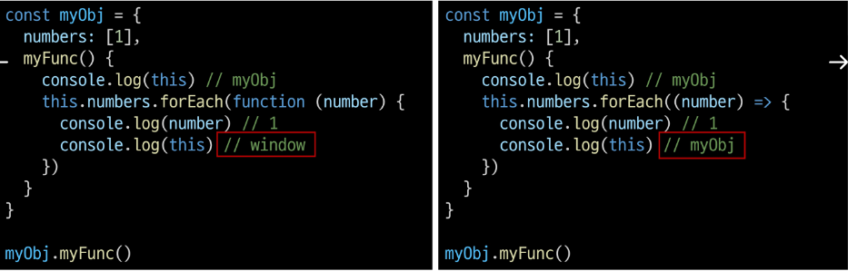
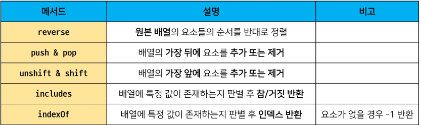
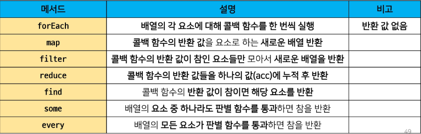
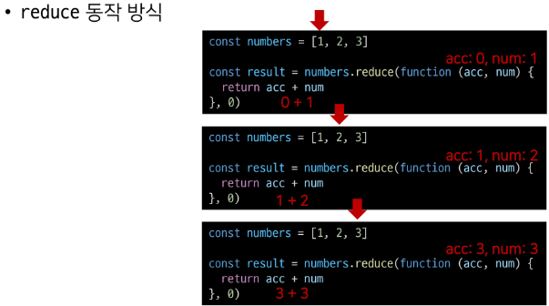
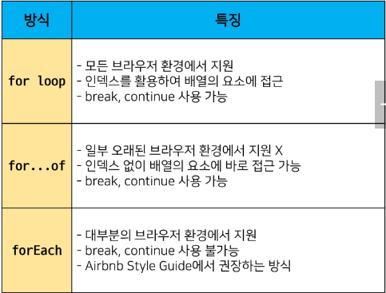
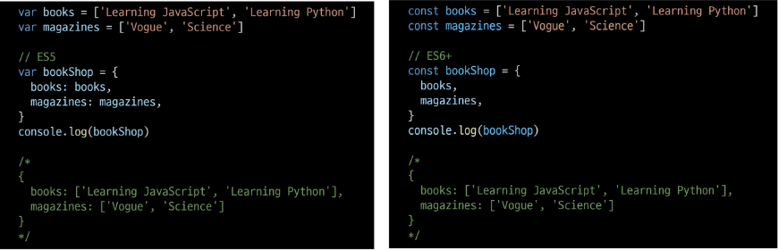
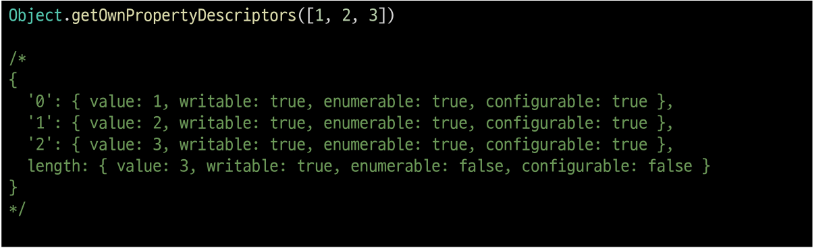

# JavaScript 2일차  

### 함수

> 개요  

참조 타입 중 하나로써 function 타입에 속함  

JavaScript에서 함수를 정의하는 방법으 주로 2가지로 구분됨  
- 함수 선언식(function delaration)
- 함수 표현식(function expression)

<hr>

### 함수의 정의  

> 함수 선언식(Function delaration)

일반적인 프로그래밍 언어의 함수 정의 방식  

```js
function 함수명() {
    // do something
}
```

예시  

```js
function add(num1, num2) {
    return num1 + num2
}

add(2, 7)
```

<hr>  

> 함수 표현식 (Function expression)  

표현식 내에서 함수를 정의하는 방식  

함수 표현식은 함수의 이름을 생략한 익명 함수로 정의 가능  

```js
변수키워드 함수명 = function () {
    // do something
}
```

```js
const sub = function (num1, num2) {
    return num1 - num2
}

sub(7, 2) // 5
```

&nbsp;

표현식에서 함수 이름을 명시하는 것도 가능  

다만 이 경우 함수 이름은 호출에 사용되지 못하고 디버깅 용도로 사용됨  

```js
const mySub = function nameSub(num1, num2) {
    return num1 - num2
}

mySub(1, 2) // - 1
nameSub(1, 2) // ReferenceError: nameSub is not defined
```

<hr>

> 기본 인자 (Default arguments)

인자 작성시 '=' 문자 뒤 기본 인자 선언 가능  

```js
const greeting = function (name = "Anonymous") {
    return `Hi ${name}`
}

greeting() // Hi Anonymous
```

<hr>

> 매개변수와 인자의 개수 불일치 허용  

매개변수보다 인자의 개수가 많을 경우  

```js
const noArgs = function() { // 인자 0개
    return 0
}

noArgs(1, 2, 3) // 0

cost twoArgs = function(arg1, arg2) {
    return [arg1, arg2]
}

twoArgs(1, 2, 3) // [1, 2]
```

&nbsp;

매개변수보다 인자의 개수가 적을 경우  

```js
const threeArgs = function(arg1, arg2, arg3) {
    return [arg1, arg2, arg3]
}

threeArgs() // [undefined, undefined, undefined]
threeArgs(1) // [1, undefined, undefined]
threeArgs(2, 3) // [2, 3, undefined]
```

<hr>  

> Spread syntax(...)  

"전개 구문"  

전개 구문을 사용하면 배열이나 문자열과 같이 반복 가능한 객체를 배열의  
경우는 요소, 함수의 경우는 인자로 확장할 수 있음  

1. 배열과의 사용
2. 함수와의 사용(Rest parameters)  

&nbsp;

1. 배열과의 사용 (배열 복사)  

```js
let parts = ['어깨', '무릎']
let lyrics = ['머리', ...parts, '발'] 
const.log(lyrics)  

console.log(lyrics)
// ['머리', '어깨', '무릎', '발']
```

&nbsp;

2. 함수와의 사용 (Rest parameters)  
- 정해지지 않은 수의 매개변수를 배열로 받을 수 있음  

```js
function func(a, b, ...theArgs) {
    //
}

const restOpr = function (arg1, arg2, ...restArgs) {
    return [arg1, arg2, restArgs]  
}

restArgs(1, 2, 3, 4, 5) // [1, 2, [3, 4, 5]]
restArgs(1, 2) // [1, 2, []]
```

<hr>

### 선언식과 표현식  

> 함수의 타입  

선언식 함수와 표현식 함수 모두 타입은 function으로 동일  

```js
// 함수 표현식  
const sum = function (args) { }

// 함수 선언식  
function sub(args) {}

console.log(typeof sum) // function
console.log(typeof sub) // function
```

<hr>  

> 호이스팅 - 선언식  

함수 선언식으로 정의한 함수는 var로 정의한 변수처럼 호이스팅이 발생  

즉 함수 호출 이후 선언해도 동작함  

```js
sum(2, 7) // 9
function sum(num1, num2) {
    return num1, num2
}
```

&nbsp;

반면 함수 표현식으로 선언한 함수는 함수 정의 전에 호출 시 에러 발생  

함수 표현식으로 정의된 함수는 변수로 평가되어 변수의 scope 규칙을 따름  

```js
sub(7, 2) // Uncaught ReferenceError: Cannot access 'sub' before initialization

const sub = function(num1, num2) {
    return num1 - num2
}
```

<hr>


<hr>

### Arrow Function  

> 화살표 함수(Arrow function)  

"함수를 비교적으로 간결하게 정의할 수 있는 문법"  

function 키워드와 중괄호를 이용한 구문을 짧게 사용하기 위해 탄생  

1. function 키워드 생략 가능  
2. 함수의 매개변수가 하나 뿐이라면 매개변수의 '()' 생략 가능  
3. 함수의 내용이 한 줄이라면 '{}'와 'return' 도 생략 가능  

화살표 함수는 항상 익명 함수  
- === 함수 표현식에서만 사용 가능  

<hr>

> 화살표 함수 (Arrow function) 에시  

```js
const arrow1 = function(name) {
    return `hello ${name}`
}


// 1. function 키워드 삭제
const arrow2 = (name) => {
    return `hello ${name}`}


// 인자가 1개일 경우만 () 생략 가능
const arrow3 = name => {
    return `hello ${name}`
}


// 3. 함수 바디가 return을 포함한 표현식 1개일 경우에 {} & return 삭제 가능
const arrow4 = name => `hello ${name}`
```

<hr>  

> 화살표 함수 (Arrow Function) 응용

```js
// 1. 인자가 없다면? () or _ 로 표시 가능  

let noArgs = () => 'No args'
nowArgs = _ => 'No args'


// 2 - 1. object를 return 한다면  
let returnObject = () => {return {key: 'value'}} // return을 명시적으로 적어준다.  

// 2 - 2. return을 적지 않으려면 괄호를 붙여야 함  
returnObject = () => ({key: 'value'})
```

<hr>  

### this  

> this

어떠한 object를 가리키는 키워드  
 - (java에서 this와 python에서의 self는 인스턴스 자기 자신을 가리킴)  

JavaScript의 함수는 호출될 때 this를 암묵적으로 전달 받음  

JavaScript에서의 this는 일반적인 프로그래밍 언어에서의 this와 조금 다르게 동작  

JavaScript는 해당 <mark>함수 호출 방식</mark>에 따라 this에 바인딩되는 객체가 달라짐  

즉, 함수를 선언할 때 this 객체가 결졍되는 것이 아니고,  
함수를 호출할 때 <mark>함수가 어떻게 호출되었느닞에 따라 동적으로 결정</mark>됨  

<hr>  

> this INDEX 

1. 전역 문맥에서의 this  
2. 함수 문맥에서의 this  
- 단순 호출
- Method(객체의 메서드로서)
- Nested

<hr>  

> 전역 문맥에서의 this 확인  

브라우저의 전역 객체인 window를 가리킴  
- 전역객체는 모든 객체의 유일한 최상위 객체를 의미  

```js
console.log(this) // window
```

<hr>

> 함수 문맥에서의 this  

함수의 this 키워드는 다른 언어와 조금 다르게 동작  
- this의 값은 함수를 호출한 방법에 의해 결정됨  
- 함수 내부에서 this의 값은 함수를 호출한 방법에 의해 좌우됨  

&nbsp;

1. 단순 호출  
- 전역 객체를 가리킴  
- 브라우저에서 전역은 window를 의미함  

```js
const myFunc = function () {
    console.log(this)
}

// 브라우저
myFunc() // window
```

&nbsp;

2. Method (Function in Object, 객체의 메서드로서)  
- 메서드로 선언하고 호출한다면, 객체의 메서드이므로 해당 객체가 바인딩  

```js
const myObj = {
    data: 1,
    myFunc() {
        console.log(this) // myObj
        console.log(this.data) // 1
    }
}

myObj.myFunc() // myObj
```

&nbsp;

콜백 함수(callback function) : 함수의 재료로 들어가는 함수

3. Nested (Function 키워드)  
- for Each의 콜백 함수에서의 this가 메서드의 객체를 가리키지 못하고 전역 객체 window를 가라킴  
- 단순  호출 방식으로 사용되었기 때문
- 이를 해결하기 위해 등장한 함수 표현식이 바로 "화살표 함수"

```js
const myObj = {
    number = [1],
    myFunc() {
        console.log(this) // myObj
        this.numbers.forEach(function (num)
        {
            console.log(num) // 1
            console.log(this) //window
        })
    }
}

myObj.myFunc() // myObj
```

&nbsp;

3. Nested (화살표 함수)  
- 이전에 일반 function 키워드와 달리 메서드의 객체를 잘 가리킴  
- 화살표 함수에서 this는 자신을 감싼 정적 범위  
- 자동으로 한 단계 상위의 scope의 context를 바인딩  

```js
const myObj = {
    number = [1],
    myFunc() {
        console.log(this) // myObj
        this.numbers.forEach((number) => {
            console.log(num) // 1
            console.log(this) // myObj
        })
    }
}

myObj.myFunc() // myObj
```

&nbsp;

3. Nested(function 키워드와 화살표 함수 비교)



<hr>

> 화살표 함수  

화살표 함수는 호출의 위치와 상관없이 상위 스코프를 가리킴(Lexical scope this)  

Lexical scope  
- 함수를 어디서 호출하는지가 아니라 <mark>어디에 선언</mark>하였는지에 따라 결정  
- Static scope라고도 하며 대부분의 프로그래밍 언어에서 따르는 방식  

따라서 함수 내의 상황에서 화살표 함수를 쓰는 것을 권장  

<hr>  

> Lexical scope  

함수를 어디서 호출하는지가 아니라 <mark>어디에 선언</mark>하였는지에 따라 결정  

```js
let x = 1 // global

function first() {
    let x = 10
    second()
}

function second() {
    console.log(x)
}

first() // 1
second() // 1
```

<hr>

> this 정리  

이렇게 this가 런타임이 결정되면 장점도 있고 단점도 있음  

함수(메서드가)를 하나만 만들어 여러 객체에서 재사용할 수있다는 것은 장점이지만,  
이런 유연함이 실수로 이어질 수 있다는 것은 단점  

JavaScript가 this를 다루는 방식이 좋은지, 나쁜지는 우리가 판단할 문제가 아님!  

중요한 것은 개발자는 this의 동작 방식을 충분히 이해하고 장점을 취하면서 실수를 피하는 데만 집중하면 됨  

<hr>  

> Array와 Object  

> 개요  

JavaScript의 데이터 타입 중 참조 타입(refernece)에 해당하는 타입은 <mark>Array, Object</mark>이며, 객체라고도 말함  

객체는 속성들의 모음(collection)  
- 속성이란?
    - 예) 컵
        - 색: 빨간색
        - 길이: 15cm
        - 소재: 플라스틱

<hr>

### 배열(Array)

> 배열 (Array)

키와 속성들을 담고 있는 참조 타입의 객체  

순서를 보장하는 특징이 있음  

주로 대괄호([])를 이용하여 생성하고, 0을 포함한 양의 정수 인덱스로 특정 값에 접근 가능  

배열의 길이는 array.length 형태로 접근 가능  
- (참고) 배열의 마지막 원소는 array.length - 1 로 접근  

```js
const numbers = [1, 2, 3, 4, 5]

console.log(number[0]) // 1
console.log(number[-1]) // undefined
console.log(numbers.length) // 5
```

```js
const numbers = [1, 2, 3, 4, 5]

console.log(numbers[numbers.length - 1]) // 5
console.log(numbers[numbers.length - 2]) // 4
...
```

<hr>

### 배열 메서드 기초  

> 배열 메서드 기초  



&nbsp;

array.reverse()
- 원본 배열 요소들의 순서를 반대로 정렬  

```js
const numbers = [1, 2, 3, 4, 5]

numbers.reverse()
console.log(numbers) // [5, 4, 3, 2, 1]
```

&nbsp;

array.push()  
- 배열의 가장 뒤 요소 추가

array.pop()
- 배열의 마지막 요소 제거  

```js
const numbers = [1, 2, 3, 4, 5]

numbers.push(100)
console.log(numbers) // [1, 2, 3, 4, 5, 100]

console.log(number.pop()) // 100
console.log(numbers) // [1, 2, 3, 4, 5]
```

&nbsp;

array.includes(value)  
- 배열에 특정 값(value)이 존재하는지 판별 후 true 또는 false 반환  

```js
const numbers = [1, 2, 3, 4, 5]

console.log(numbers.include(1)) // true
console.log(numbers.include(100)) // false
```

&nbsp;

array.indexOf(value)  
- 배열에 특정 값이 존재하는지 확인 후 가장 첫 번째로 찾은 요소의 인덱스 반환  
- 마약 해당 값이 없을 경우 -1 반환  

```js
const numbers = [1, 2, 3, 4, 5]

console.log(numbers.indexOf(3)) // 2
console.log(numbers.indexOf(100)) // -1
```

<hr>

### 배열 메서드 심화  

> Array Helper Methods

배열을 순회하며 특정 로직을 수행하는 메서드  

메서드 호출 시 인자로 <font color="red">callback 함수</font>를 받는 것이 특징  
- <font color="red">callback 함수: 어떤 함수의 내부에서 실행될 목적으로 인자로 넘겨받는 함수</font>



<hr>

> 콜백 함수란?

특별한 함수가 아니라 <mark>다른 함수의 인자로 전달되는 함수</mark>를 명명한다.

<hr>

> 콜백함수 예시

```js
const numbers = [1, 2, 3]
numbers. forEach(function (num){
    console.log(number ** 2)
})
// 1
// 4
// 9
```

```js
const callBackFunction = function (num) {
    console.log(num ** 2)
}

const numbers = [1, 2, 3]
numbers.forEach(callBackFunction)
// 1
// 4
// 9
```

&nbsp;

python의 map에 square 함수를 인자로 넘겨 numbers 배열의 각 요소를 square 함수의 인자로 사용하였음  

```py
number = [1, 2, 3]

def square(num):
    return num ** 2

square_numbers = list(map(square, numbers))
print(squared_numbers) # [1, 4, 9]
```

forEach 메서드에 callBackFunc 함수를 인자로 넘겨 numbers 배열의 각 요소를 callbackFunc 함수의 인자로 사용하였음

```js
const callBackFunc = function (num) {
    console.log(num ** 2)
}

// 1
// 4
// 9

const numbers = [1, 2, 3]
numbers.forEach(callBackFunc)
```

<hr>

> Array Helper Methods - forEach

```js
array.forEach(function(element, index, array) {
    // do something
})
```

```array.forEach(callback(element[, index[, array]]))```  

인자로 주어지는 함수(콜백 함수)를 배열의 각 요소에 대해 한 번씩 실행  
- 콜백 함수는 3가지 매개 변수로 구성  
    - 1. element: 배열의 요소
    - 2. index: 배열 요소의 인덱스
    - 3. array: 배열 자체
- 반환 값(return) 없음  


<hr>

### Array Helper Methods

> Array Helper Methods - forEach  

```js
// 1. 일단 사용해보기

const colors = ['red', 'blue', 'green']  

printFunc = function (color) {
    console.log(color)
}

colors.forEach(printFunc)

// red
// blue
// green
```

```js
// 2. 함수 정의를 인자로 넣어보기  

colors.forEach(function(color) {
    console.log(color)
})
```

```js
// 3. 화살표 함수 적용하기

colors.forEAch((color) => {
    return console.log(color)
})
```

<hr>

> Array Helper Methods - map  

```js
array.map(function (element, index, array){
    // do something
})
```
```array.map(callback(element[, index[, array]]))```

배열의 각 요소에 대해 콜백 함수를 한 번씩 실행  

콜백 함수의 반환 값을 요소로 하는 새로운 배열 반환  

기존 배열 전체를 다룬 형태로 바꿀 때 유용  
- forEach - return 이라고 생각하기  

&nbsp;

```js
// 1. 일단 사용해보기

const numbers = [1, 2, 3]

// 함수 정의 (표현식)  
const doubleFunc = function (number) {
    return number * 2
}

// 함수를 다른 함수의 인자로 넣기 (콜백 함수)
const doubleNumbers = numbers.map(doubleFunc)
console.log(doubleNumbers) // [2, 4, 6]
```

```js
// 2. 함수 정의를 인자로 넣어보기  

const doubleNumbers = numbers.map(function (number){
    return number * 2
})

console.log(doubleNumbers) // [2, 4, 6]
```

```js
// 3. 화살표 함수 적용하기

const doubleNumbers = numbers.map((number) => {
    return number * 2
})

console.log(doubleNumbers) // [2, 4, 6]
```

<hr>

> Array Helper Methods - filter  

```js
array.filter(function (element, index, array) {
    // do something
})
```

```array.filter(callback(element[, index[, array]]))```  

배열의 각 요소에 대해 콜백 함수를 한 번씩 실행  

콜백 함수의 반환 값이 true인 요소들만 모아서 새로운 배열 반환  

기존 배열의 요소들을 필터링할 때 유용  

&nbsp;

```js
// 1. 일단 사용해보기  

const product = [
    {name: 'cucumber', type: 'vegetable'},
    {name: 'banana', type: 'fruit'},
    {name: 'carrot', type: 'vegetable'},
    {name: 'apple', type: 'fruit'},
]

// 함수 정의하고
const fruitFilter = function (product) {
    return product.type === 'fruit'
}

// 콜백으로 넘기고
const fruits = products.filter(fruitFilter)
console.log(fruits)

// [{name: 'banana', type: 'fruits'}, {name: 'apple', type: 'fruit'}]
```

```js
// 2. 함수 정의를 인자로 넣어보기  

const fruits = products.filter(function (product) {
    return product.type == 'fruit'
})

console.log(fruits)
```

```js
// 3. 화살표 함수 적용하기  

const fruits = products.filter((product) => {
    return product.type === 'fruit'
})

console.log(fruits)
```

<hr>

> Array Helper Methods - reduce  

```js
array.reduce(function (acc, element, index, array) {
    // do something
}, intialValue)
```

```array.reduce(callback(acc, element, [index[, array]])[, initialValue])```

인자로 주어지는 함수(콜백 함수)를 배열의 각 요소에 대해 한 번씩 실행해서, 하나의 결과 값을 반환  

즉, 배열을 하나의 값으로 계산하는 동작이 필요할 때 사용(총합, 평균 등)  

map,filter 등 여러 배열 메스드 동작을 대부분 대체할 수 있음  

&nbsp;

```js
array.reduce(function (acc, element, index, array) {
    // do something
}, intialValue)
```
reduce 메서드의 주요 매개 변수  

- acc
    - 이전 callback 함수의 반환 값이 누적되는 변수  

- initialValue(optional)
    - 최초의 callback 함수 호출 시 acc에 할당되는 값, default 값은 배열의 첫 번째 값  

reduce의 첫 번째 매개변수인 콜백함수의 첫 번째 매개변수(acc)는 누적된 값(전 단계까지의 결과)  

reduce의 두 번째 매개변수인 initialValue는 누적될 값의 초기값, 지정하지 않을 시 첫 번째 요소의 값이 됨  
- <font color='red'>빈 배열의 경우 initialValue를 제공하지 않으면 에러 발생</font>  

&nbsp;

```js
// 이제 부터는 바로 콜백 함수를 정의해보자  

const tests = [90, 90, 80, 77]

// 총합 
const sum = tests.reduce(function (total, x) {
    return total + x
}, 0) // 여기서 0 생략 가능 결과 : 337

// 화살표 함수  
const sum = tests.reduce((total, x) => total + x, 0)
console.log(sum) // 337

// 평균
const sum = tests.reduce((total, x) => total + x, 0) / tests.length
console.log(sum) // 84.25
```

&nbsp;



<hr>

> Array Helper Methods - find  

```js
array.find(function (element, index, array) {
    // do something
})
```

```array.find(callback(element[, index[, array]]))```

배열의 각 요소에 대해 콜백 함수를 한 번씩 실행  

콜백 함수의 반환 값이 true면, 조건을 만족하는 첫 번째 요소를 반환  

찾는 값이 배열에 없으면 undefined 반환  

&nbsp;

```js
const avengers = [
    {name: 'Tony Stark', age: 45},
    {name: 'Steve Rogers', age: 32},
    {name: 'Thor', age: 40},
]

const avenger = avengers.find(function (avenger) {
    return avenger.name === 'Tony Stark'
})

console.log(avenger) // {name: 'Tony Stark', age: 45}

// 화살표 함수 적용  
const avenger = avengers.find((avenger) => {
    return avenger.name === 'Tony Stark'
})

console.log(avenger) // {name: 'Tony Stark', age: 45}
```

<hr>

> Array Helper Methods - some  

```js
array.some(function (element, index, array) {
    // do something
})
```

```array.some(callbcak(element[, index[, array]]))```

배열의 요소 중 하나라도 주어진 판별 함수를 통과하면 true를 반환  

모든 요소가 통과하지 못하면 거짓 반환  

빈 배열은 항상 false 반환  

&nbsp;

```js
const arr = [1, 2, 3, 4, 5]

const result = arr.some((elem) => {
    return elem % 2 === 0
})

// true
```

<hr>

> Array Helper Methods - every  

```js
array.every(function (element, index, array) {
    // do something
})
```

```array.every(callback(element[, index[, array]]))```

배열의 모든 요소가 주어진 판별 함수르 통과하면 true 반환  

하나의 요소라도 통과하지 못하면 false를 반환  

빈 배열은 항상 true 반환  

&nbsp;

```js
const arr = [1, 2, 3, 4, 5]

const result = arr.every((elem) => {
    return elem % === 0
})
// false
```
<hr>

> 배열 순회 비교  

```js
const chars = ['A', 'B', 'C', 'D']

// for loop
for (let idx = 0; idx < chars.length; idx++) {
    console.log(idx, chars[idx])
}

// for of
for (const char of chars) {
    console.log(char)
}

// forEach
chars.forEach((char, idx) => {
    console.log(idx, char)
})

char.forEach(char => {
    console.log(char)
})
```


<hr>

### 객체 (Object)  

> 개요  

객체는 속성(property)의 집합이며, 중괄호 내부에 key와 value의 쌍으로 표현  

key  
- 문자열 타입만 가능  
- key 이름에는 띄어쓰기 등의 구분자가 있으면 따옴표로 묶어서 표현  

value  
- 모든 타입(함수포함) 가능  

객체 요소 접근  
- 점(.) 또는 대괄호([]) 로 가능  
- key 이름에 띄어쓰기 같은 구분자가 잇으면 대괄호 접근만 가능  

<hr>  

> 객체 (Object) 예시  

객체는 속성으로 함수를 정의할 수 있음 (메서드)  

```js
// 객체 리터럴 방식으로 객체 생성  
const person = {
    name: 'Viktor',
    age: 30,
    greeting: function() {
        console.log(`Hello, my name is ${this.name}.`)
    }
}

// 객체의 메서드 호출
person.greeting(); // "Hello, my name is Viktor."
```

<hr>

> [참고] 생성자 함수  

JS에서 객체를 하나 생성한다고 하면?
- 하나의 객체를 선언하여 생성  

```js
const member = {
    name: 'aiden',
    age: 22,
    sID: 20230419,
}
```

동일한 형태의 객체를 또 만든다면?
- 또 다른 객체를 선언하여 생성  

```js
const member = {
    name: 'haley',
    age: 20,
    sID: 20230420,
}
```

불편한데 좋은 방법 없을까?

&nbsp;

동일한 구조의 객체를 여러 개 만들고 싶다면?  

생성자 함수는 특별한 함수를 의미하는 것이 아니다.  

new 연산자로 사용하는 함수  

```js
function Member(name, age, sId) { // 대문자에 주의
    this.name = name,
    this.age = age,
    this.sId = sId
}

const members3 = new Member('issac', 21, 20230419)
```

&nbsp;

함수 이름은 반드시 대문자로 시작  

생성자 함수를 사용할 때 반드시 new 연산자를 사용  

<hr>  

### 객체 관련 문법  

> 객체 관련 ES6 문법 익히기  

ES6에 새로 도입된 문법들로 객체 생성 및 조작에 유용하게 사용 가능  

1. 속성명 축약
2. 메서드명 축약
3. 계산된 속성명 사용하기  
4. 구조 분해 할당
5. 객체 전개 구문(Spread Operator)

<hr>

> 1. 속성명 축약

객체를 정의할 때 key와 할당하는 변수의 이름이 같으면 예시와 같이 축약이 가능  



<hr>

> 2. 메서드명 축약

메서드 선언 시 function 키워드 생략 가능  

```js
//ES5
var obj = {
    greeting: function () {
        console.log('Hi!')
    }
}

obj.greeting() // Hi!
```

```js
//ES6+
var obj = {
    greeting() {
        console.log('Hi!')
    }
}

obj.greeting() // Hi!
```

<hr>

> 3. 계산된 속성 (computed property name)  

객체를 정의할 때 key의 이름을 표현식을 이용하여 동적으로 생성 가능  

```js
const key = "country"
const value = ['한국', '미국', '일본', '중국']

const myObj = {
    [key]: value,
}

console.log(myObj) // {country: ['한국', '미국', '일본', '중국']}
console.log(myObj.country) // ['한국', '미국', '일본', '중국']
```

<hr>

> 4. 구조 분해 할당 (destructing assignment)  

배열 또는 객체를 분해하여 속성을 변수에 쉽게 할당할 수 있는 문법  

```js
// ES5
const userInformation = {
    name: 'ssafy kim',
    userId: 'ssafyStudent1234',
    email: 'ssafy@ssfay.com'
}

const name = userInformation.name
const userId = userInformation.userId
const email = userInformation.email
```

```js
// ES6+
const userInformation = {
    name: 'ssafy kim',
    userId: 'ssafyStudent1234',
    email: 'ssafy@ssfay.com'
}

const {name} = userInformation
// 아래와 같은 형태로도 가능  
const {userId, email} = userInformation
```

<hr>

> 5. Spread syntax(...)

배열과 마찬가지로 전개구문을 사용해 객체 내부에서 객체 전개 가능  

깊은(얕은?) 복사에 활용 가능  

```js
const obj = {b: 2, c: 3, d: 4}
const newObj = {a: 1, ...obj, e: 5}

console.log(newObj) // {a: 1, b:2, c:3, d:4, e:5}
```

<hr>

> JSON

JavaScript Object Notation  

Key-Value 형태로 이루어진 자료 표기법  

JavaScript의 Object와 유사한 구조를 가지고 있지만 Object는 그 자체로 타입이고, JSON은 형식이 있는 "문자열"  

**즉, JSON을 Object로 사용하기 위해서는 변환 작업이 필요함**

<hr>

> JSON 변환  

```js
const jsObject = {
    coffee: 'Americano',
    iceCream: 'Cookie and Cream',
} 
```

```js
// Object -> JSON

const objtoJson = JSON.stringify(jsObject)

console.log(objToJson) // {"coffee": "Americano", "iceCream": "Cookie and Cream"}
console.log(typeof objToJson) // string
```

```js
// JSON -> Obj

const jsontoObj = JSON.parse(objToJson)

console.log(jsonToObj) // {coffee: "Americano", iceCream: "Cookie and Cream"}
console.log(typeof jsonToObj) // object
```

<hr>  

> [참고] 배열은 객체이다.  

배열은 키와 속성들을 담고 있으며 참조 타입의 객체  

배열은 인덱스를 키로 가지며 length 프로퍼티를 갖는 특수한 객체  



<hr>
