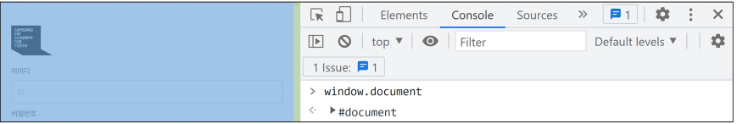

# JavaScript 3일차

### DOM

> 개요  

"브라우저에서의 JavaScript"  

- JavaScript는 웹 페이지에서 다양한 기능을 구현하는 스크립트 언어  
- 정적인 정보만 보여주던 웹 페이지를 데이터가 주기적으로 갱신되거나, 사용자와 상호 작용을 하거나, 애니메이션 등이 동작하게 하는 것을 가능하게 함  
- [참고] 스크립트 언어 (Script Language)  
    - 기존에 존재하는 응용 소프트웨어를 제어하는 컴퓨터 프로그래밍 언어  


<hr>  

> 웹 페이지에서의 JavaScript  

JavaScript는 프로그래밍 언어로서의 역할도 가능하지만 클라이언트 사이드 JavaScript 언어 위에 올라가 있는 기능들은 더 다양함  

API라고 부르는 이 기능들은 JavaScript 코드에서 사용할 수 있는 것들을 더 무궁무진하게 만들어줌  

이 API는 일반적으로 2개의 범주로 분류할 수 있으며 이번 시간에는 Browser APIs에 대해 알아볼 것  

1. <mark>Browser APIs</mark>  
2. Third party APIs 
    - 브라우저에 탑재되지 않는 API
    - 웹에서 직접 코드와 정보를 찾아야 함  
    - Google map api, kakao login api 등  

<hr>

# DOM  

> Browser APIs  

웹 브라우저에 내장된 API로, 웹 브라우저가 현재 컴퓨터 환경에 관한 데이터를 제공하거나,  
오디오를 재생하는 등 여러가지 유용하고 복잡한 일을 수행할 수 있게 함  

JavaScript로 Browser API들을 사용해서 여러가지 기능을 사용할 수 있음  

종류  
- DOM
- Geolocation API
- WebGL 등  

<hr>  

> 브라우저가 웹 페이지를 불러오는 과정  

웹 페이지를 브라우저로 불러오면, 브라우저는 코드 (HTML, CSS, JavaScript)를 실행 환경(브라우저 탭)에서 실행  

JavaScript <mark>DOM API</mark>를 통해 HTML과 CSS를 동적으로 수정, 사용자 인터페이스를 업데이트하는 일에 가장 많이 쓰임  

<hr>  

> DOM  

"문서 객체 모델 (Document Object Model)"  

<mark>문서의 구조화된 표현을 제공</mark>하며 프로그래밍 언어가 DOM 구조에 접근할 수 있는 방법을 제공  

- 문서 구조, 스타일, 내용 등을 쉽게 변경할 수 있게 도움  
- HTML 콘텐츠를 추가, 제거, 변경하고, 동적으로 페이지에 스타일을 추가하는 등 HTML/CSS를 조작할 수 있음  

<mark>HTML 문서를 구조하여 각 요소를 객체(object)로 취급</mark>  

단순한 속성 접근, 메서드 활용 뿐만 아니라 프로그래밍 언어적 특성을 활용한 조작이 가능함  

&nbsp;

DOM은 문서를 논리 트리로 표현  

DOM 메서드를 사용하려면 프로그램적으로 트리에 접근할 수 있고 이를 통해 문서의 구조, 스타일, 컨테츠를 변경할 수 있음  


&nbsp;

웹 페이지는 일종의 문서(document)  

이 문서는 웹 브라우저를 통해 그 내용이 해석되어 웹 브라우저 화면에 나타나거나 HTML 코드 자체로 나타나기도 함  

DOM은 동일한 문서를 표현하고, 저장하고, 조작하는 방법을 제공  

DOM은 웹 페이지의 객체 지향 표현이며, JavaScript와 같은 스크립트 언어를 이용해 DOM을 수정할 수 있음  

<hr>  

### DOM 기본 구조  

> DOM Tree  

DOM은 문서를 논리 트리로 표현  

DOM에서 모든 것은 <mark>Node</mark>  

즉, HTML 요소, 속성, 텍스트 모든 것이 노드  

각 노드는 부모, 자식 관계를 형성하고 이에 따라 상속 개념도 동일하게 적용됨  


<hr>  

> Node  

DOM의 구성 요소 중 하나  

HTML 문서의 모든 요소를 나타냄  
- 각각의 HTML 요소는 DOM Node로서 특정한 노드 타입을 가짐  
- Document Node === HTML 문서 전체를 나타내는 노드  
- Element Node === HTML 요소를 나타내는 노드 ex) \<p\>
- Text Node === HTML 텍스트, Element Node 내의 텍스트 컨텐츠를 나타냄  
- Attribute Node === HTML 요소의 속성을 나타내는 노드  

<hr>  

> DOM에 접근하기  

DOM을 사용하기 위해 특별히 해야 할 일은 없음  

모든 웹 브라우저는 스크립트 언어가 손쉽게 웹 페이지의 요소에 접근할 수 있도록 만들기 위해 DOM 구조를 항상 사용  

우리는 "DOM 주요 객체"들을 활용하여 문서를 조작하거나 특정 요소들을 얻을 수 있음  

<hr>  

> DOM의 주요 객체  

- window
- document
- navigator, location, history, screen 등  

<hr>  

> window object  

DOM을 표현하는 창  

가장 최상위 객체 (작성 시 생략 가능)  

탭 기능이 있는 브라우저에서는 각가의 탭을 각각의 window 객체로 나타냄  


<hr>  

> window의 메서드 예시  


<hr>

> document object  

브라우저가 불러온 웹 페이지  

페이지 컨텐츠의 진입점 역할을 하며, \<body\> 등과 같이 수많은 다른 요소들을 포함하고 있음  


<hr>  

> document의 속성 예시  


<hr>  

> [참고] document는 window의 속성이다.  



&nbsp;

> [참고] Node vs Element  


예시 코드의 모든 것은 Node  

\<head\>, \<body\>는 HTML 요소로 element  

\<title\>, \<p\>는 Text Node이면서 element  

id = "unique"는 DOM에서는 Attr Node이고, HTML 요소인 \<p\>의 속성이므로 element는 아님  

<hr>

### DOM 조작

> 개요  

Document가 제공하는 기능을 사용하는 웹 페이지 문서 조작하기  

DOM 조작 순서  

1. 선택 (Select)  
2. 조작 (Manipulation)  
    - 생성, 추가, 삭제 등 

<hr>  

> 선택 관련 메서드  

```document.querySelector(selector)```  
- 제공한 선택자와 일치하는 element 한 개 선택  
- 제공한 CSS selector를 만족하는 첫 번째 element 객체를 반환 (없다면 null 반환)  

```document.querySelectorAll(selector)```
- 제공한 선택자와 일치하는 여러 element를 선택  
- 매칭할 하나 이상의 셀렉터를 포함하는 유효한 CSS selector를 인자 (문자열)로 받음  
- 제공한 CSS selector를 만족하는 NodeList를 반환  

<hr>  

> 선택 관련 메서드 실습  


&nbsp;


<hr>  

> [참고] NodeList  

DOM 메서드를 사용해 선택한 노드의 목록  

배열과 유사한 구조를 가짐  

Index로만 각 항목에 접근 가능  

배열의 forEach 메서드 및 다양한 배열 메서드 사용 가능  
- <font color='red'>단, 배열의 모든 메서드를 사용할 수 있는 것은 아님 ex) push(), pop()</font>

querySelectorAll()에 의해 반환되는 NodeList는 DOM의 변경사항을 실시간으로 반영하지 않음  

<hr>  

> 조작 관련 메서드 (생성)  

```document.createElement(tagName)```  
- 작성한 tagName의 HTML 요소를 생성하여 반환  

<hr>  

> 조작 관련 메서드 (생성)  
```HTML.innerText```  

- Node 객체와 그 자손의 텍스트 컨텐츠 (DOMString)를 표현(해당 요소 내부의 raw text)  
- 사람이 읽을 수 있는 요소만 남김  
- 즉, 줄 바꿈을 인식하고 숨겨진 내용을 무시하는 등 최종적으로 스타일링이 적용된 모습으로 표현됨  

<hr>  

> 조작 관련 메서드 (추가)  

```Node.appendChild()```
- 한 Node를 특정 부모 Node의 자식 NodeList 중 마지막 자식으로 삽입  
- 한 번에 오직 하나의 Node만 추가할 수 있음  
- 추가된 Node 객체를 반환  

<hr>  

> 조작 관련 메서드 (삭제)  

```Node.removeChild()```  
- DOM에서 자식 Node를 제거  
- 제거된 Node를 반환  

<hr>


&nbsp;


<hr>

> [참고] Node.appendChild()

- 새롭게 생성한 Node가 아닌 이미 문서에 존재하는 Node를 다른 Node의 자식으로 삽입하는 경우, 위치를 이동  


<hr>  

> 속성 조회 및 설정  

```Element.getAttribute(attributeName)```  
- 해당 요소의 지정된 값(문자열)을 반환
- 인자 (attributeName)는 값을 얻고자 하는 속성의 이름  

```Element.setAttribute(name, value)```  
- 지정된 요소의 값을 설정  
- 속성이 이미 존재하면 값을 갱신, 존재하지 않으면 지정된 이름과 값으로 새 속성을 추가  

<hr>  


&nbsp;


<hr>

> [참고] 그 외 다양한 속성 조작 방법  

```Element.setAttribute(name, value)```
- 해당 속성이 이미 존재하는 경우 갱신(즉, 새로운 값을 추가 또는 수정이 아닌, 주어진 value로 새롭게 설정)  

만약 기존 속성은 유지한 채로, 새로운 값을 추가하고자 한다면  
```Element.classList, Element.style```등을 통해  
직접적으로 해당 요소의 각 속성들을 제어할 수 있음  

<hr>  

> DOM 조작 정리  

1. 선택한다
- querySelector()
- querySelectorAll()

2. 조작한다.  
- innerText()
- setAttribute()
- getAttribute()
- createElement()
- appendChild()
...

<hr>

> 기타 html 파일들

```html
<!-- page_39_dom_extra.html -->

<!DOCTYPE html>
<html>
<head>
  <meta charset="utf-8">
  <meta name="viewport" content="width=device-width">
  <title>JS DOM</title>
</head>
<style>
  .red {
    color: red;
  }

  .big {
    font-size: 32px;
  }
</style>
<body>
  <h1>selector test</h1>

  <button id="event-button">커져라!</button>

  <ul id="list">
    <li class="red">apple</li>
    <li>orange</li>
    <li id="banana">banana</li>
    <li>grape</li>
    <li class="red">strawberry</li>
  </ul>

  <script>
    // 1. strawberry 아래에 새로운 과일 하나를 추가
    // 망고 생성
    const mango = document.createElement("li")
    mango.innerText = '망고'
    
    // 부모 객체 선택
    const parent = document.querySelector("#list")
    // const parent = document.querySelector("url")
    parent.appendChild(mango) // 뒤에 붙이기

    // 2. apple 위에 새로운 과일을 하나 더 추가하시오.
    const pineapple = document.createElement("li")
    pineapple.innerText = '파인애플'

    parent.prepend(pineapple) // 앞에 붙이기

    // 3. orange 와 banana 사이에 새로운 과일을 추가하시오.
    const kiwi = document.createElement("li")
    kiwi.innerText = '키위'

    const banana = document.querySelector('#banana')
    parent.insertBefore(kiwi, banana)    

    // 4. class가 'red'인 모든 노드 삭제
    const red_arr = document.querySelectorAll('.red')

    red_arr.forEach(elem => elem.remove())

    // 5. 모든 li 태그의 글자 크기를 키워보시오.
    const li_arr = document.querySelectorAll("li")
    
    li_arr.forEach(elem => elem.classList.add('big'))

    // 6. 버튼을 누르면 이벤트 실행하기 (4일차 맛보기 내용)   
    const button1 = document.querySelector('#event-button')

    addEventListener('click', () => {
      changeFont()
    })
    
    function changeFont() {
      const LiTags = document.querySelectorAll('li')
      
      LiTags.forEach(elem => elem.classList.add('big'))
    }

  </script>
</body>
</html>
```

```html
<!-- append_forEach.html -->

<!DOCTYPE html>
<html lang="en">
<head>
  <meta charset="UTF-8">
  <meta http-equiv="X-UA-Compatible" content="IE=edge">
  <meta name="viewport" content="width=device-width, initial-scale=1.0">
  <title>Document</title>
</head>
<style>
  .red {
    color: red;
  }
</style>
<body>
  <ul id="fruits-list">
  </ul>
  <script>
    const fruits = ['Apple', 'Banana', 'Orange']

    //
    const fruits_list = document.querySelector('#fruits-list')
    
    fruits.forEach(elem => {
      const temp = document.createElement("li")
      temp.innerText = elem
      temp.classList.add('red')

      fruits_list.appendChild(temp)
    })

  </script>
</body>
</html>
```

<hr>

# 번외

Object(객체): 키(key)와 값(value)으로 이루어진 속성(property)의 모음  

자바스크립트는 객체지향, 객체 내부에 함수를 메소드라고 부른다.  

자바스크립트의 객체는 변경할 수 있으며, 쿼리 셀렉터를 이용해서 이를 조작하고, 종합적으로  
동적인 구성을 할 수 있다.(기존의 html, css는 단순히 구조였다면, 움직이게 만든다는 것)   

<hr>
쿼리 셀렉터는 css의 선택자를 이용해서 사용할 수 있다.  
만약 많다면 가장 상위 것을 가져온다.  


이벤트가 발생했을 때, 함수를 사용함으로써 명령을 수행한다.  


왜 타입스크립트를 쓰는가?  


1. 디버깅을 위해서 -> 자바스크립트는 명시해서 데이터 타입을 받지 않음  
2. 스프링, 리액트 -> 할 수 있어야 한다.  

<hr>

```html
<!DOCTYPE html>
<html lang="en">
<head>
  <meta charset="UTF-8">
  <meta http-equiv="X-UA-Compatible" content="IE=edge">
  <meta name="viewport" content="width=device-width, initial-scale=1.0">
  <title>Document</title>
</head>
<body>
  <ul>
    <li>시</li>
    <li>공</li>
    <li>의</li>
    <li>폭</li>
    <li>풍</li>
    <li>은</li>
    <li>최</li>
    <li>고</li>
    <li>야</li>
    <li>!</li>
  </ul>
  <script src="js.js"></script>
</body>
</html>
```

```js
// queryselectorAll은 완벽한 배열 X
// Array.from 으로 감싸고 배열 메서드 사용
// lists.map(li => console.log(li)) // 안되는 코드

Array.from(lists).map(li => console.log(li))


// 작성한 innerText만 담긴 배열 만들기
// 내 답안
let lst = []

for (let list of lists) {
    lst.push(list.innerText)
}

console.log(lst)
lst.forEach(elem => console.log(elem))

// 예시 답안
const results = Array.from(lists).map(li => li.textContent)
console.log(results);
```

<hr>

```html
<!DOCTYPE html>
<html lang="en">
<head>
  <meta charset="UTF-8">
  <meta http-equiv="X-UA-Compatible" content="IE=edge">
  <meta name="viewport" content="width=device-width, initial-scale=1.0">
  <title>Document</title>
</head>
<body>
  <div class = 'hello hello2' id = 'hello3' style = "color: red;">안녕하세요.</div>
  <script src="js.js"></script>
</body>
</html>
```

```js
const div = document.querySelector('div')
div.setAttribute("style", "color: blue")
```

<hr>

```html
<!DOCTYPE html>
<html lang="en">
<head>
  <meta charset="UTF-8">
  <meta http-equiv="X-UA-Compatible" content="IE=edge">
  <meta name="viewport" content="width=device-width, initial-scale=1.0">
  <title>Document</title>
</head>
<body>
  <div class = 'hello hello2' id = 'hello3' style = "color: red;">안녕하세요.</div>
  
  <br>
  <button>클릭!</button>
  <script src="js.js"></script>
</body>
</html>
```

```js
// 버튼 만들기
// img 태그를 넣을 것
// 버튼을 클릭했을 경우 기존 이미즤를 다른 img로 갈아치우기

const img = document.querySelector("img")
const btn = document.querySelector("button")
const cat_url = "https://cdn.pixabay.com/photo/2017/02/20/18/03/cat-2083492__340.jpg"
const tiger_url = 'https://cdn.pixabay.com/photo/2014/10/22/18/19/tiger-498543__340.jpg'

btn.addEventListener('click', () => {
    img.setAttribute('src', tiger_url)
})
```