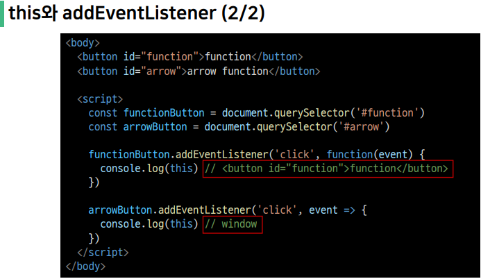

# JavaSript 4일차

### Event

> 개요  

<mark>Event</mark>란 HTML 요소에서 발생하는 모든 상황을 의미
- 예를 들어 사용자가 웹 페이지 버튼을 클릭한다면 클릭에 대해 이벤트가 발생하고 우리는 이벤트를 통해 클릭이라는 사건에 대한 결과를 받거나, 조작을 할 수 있음  

클릭 말고도 웹에서는 각양각색의 Event가 존재  
- 키보드 키 입력, 브라우저 닫기, 데이터 제출, 텍스트 복사 등  

<hr>  

### Event Intro

> Event object  

네트워크 활동이나 사용자와의 상호작용 같은 사건의 발생을 알리기 위한 객체  

이벤트가 발생했을 때 생성되는 객체  

Event 발생  
- 마우스를 클릭하거나 키보드를 누르는 등 사용자 행동으로 발생할 수도 있고  
- 특정 메서드를 호출하여 프로그래밍적으로도 만들어 낼 수 있음  

&nbsp;

DOM 요소는 Event를 받고 ("수신")

받은 Event를 "처리"할 수 있음  
- Event 처리는 주로 <code>addEventListener()</code> 메서드를 통해 Event 처리기(Event handler)를 다양한 html 요소에 "부착"해서 처리함  

<hr>  

> Event handler

특별한 함수가 아닌 일반적인 JavaScript Function을 정의하여 사용  

웹 페이지에서 발생하는 Event에 대해 반응하여 동작하는 함수를 지칭  

Event handler 함수는 이벤트가 발생했을 때 호출되며, Event 객체를 매개 변수로 전달 받음  

<hr>  

Event handler - <mark>addEventLister()</mark>

<h4>"<font color='red'>대상</font>에게 <font color='green'>특정 Event</font>가 발생히면, <font color="blue">할 일</font>을 등록하자"</h4>  

<h4><font color='red'>EventTarget</font>.addEventListener(<font color='green'>type</font>, <font color="blue">handler function</font>)</h4>  

&nbsp;

<code>EventTarget.addEventListener(type, handler function[, options])</code>  
- 지정한 Event가 대상에게 전달될 때마다 호출할 함수를 설정  
- Event를 지원하는 모든 객체(Element, Document, window 등)를 대상 (EventTarget)으로 지정  

&nbsp;

- type
    - 반응할 Event 유형을 나타내는 대소문자를 구분하는 문자열  
    - 대표 이벤트  
        - input, click, submit ...
        - 다양한 이벤트 확인(<a href="https://developer.mozilla.org/en-US/docs/Web/Events">https://developer.mozilla.org/en-US/docs/Web/Events</a>)

&nbsp;

- hander function  
    - 지정된 타입의 Event를 수신할 객체
    - JavaScript function(콜백 함수)여야 함  
    - 콜백 함수는 발생할 Event의 데이터를 가진 Event 객체를 유일한 매개변수로 받음  

<hr>

### Event 실습

> button 실습

버튼을 클릭하면 특정 변수 값으로 변경  

```html
<!-- 01_pg14_button.html -->

<!DOCTYPE html>
<html lang="en">
<head>
  <meta charset="UTF-8">
  <meta http-equiv="X-UA-Compatible" content="IE=edge">
  <meta name="viewport" content="width=device-width, initial-scale=1.0">
  <title>Document</title>
</head>
<body>
  <button id="btn">버튼</button>
  <p id="counter">0</p>
  <script>
  // 초기값
    let countNumber = 0
  // ID가 btn인 요소를 선택
    const btn = document.querySelector('#btn')

  // btn이 클릭 되었을 때마다 함수가 실행됨
    btn.addEventListener("click", function(event) {
      console.log("버튼을 클릭했어요!")
      countNumber += 1

      const counter = document.querySelector('#counter')
      counter.innerText = countNumber
    })
  </script>
</body>

</html>
```

<hr>

> 값 입력 실습  

input에 입력하면 입력 값을 실시간으로 출력하기  

```html
<!-- 02_pg16_input.html -->

<!DOCTYPE html>
<html lang="en">
<head>
  <meta charset="UTF-8">
  <meta http-equiv="X-UA-Compatible" content="IE=edge">
  <meta name="viewport" content="width=device-width, initial-scale=1.0">
  <title>Document</title>
</head>
<body>
  <input type="text" id="text-input">
  <p></p>
  <script>
    // 1. input 선택
    const textInput = document.querySelector('input')
    // 2. input 이벤트 등록
    textInput.addEventListener('input', function(event) {
      console.log(event)
      // input은 이벤트의 대상
      // console.log(event.tag)
      console.log(event.target)
      // input의 value를 받아오기
      console.log(event.target.value)
      
      // 3. input에 작성한 값을 p 태그에 출력하기
      const pTag = document.querySelector('p')
      pTag.innerText = event.target.value
    })
  </script>
</body> 
</html>
```

<hr>

> 복합 실습  

input에 입력하면 입력값을 실시간으로 출력하고  
버튼을 클릭하면 출력된 값의 클래스를 토글하기  

```html
<!-- 03_pg18_button_input.html -->
<!DOCTYPE html>
<html lang="en">
<head>
  <meta charset="UTF-8">
  <meta http-equiv="X-UA-Compatible" content="IE=edge">
  <meta name="viewport" content="width=device-width, initial-scale=1.0">
  <title>Document</title>
  <style>
    .blue {
      color: blue;
    }
  </style>
</head>
<body>
  <h1></h1>
  <button id="btn">클릭</button>
  <input type="text">

  <script>
    const btn = document.querySelector('#btn')

    // btn이 클릭되면 함수 실행  
    btn.addEventListener('click', function() {
      // h1 태그를 선택해서
      const h1 = document.querySelector('h1')
      // 클래스 blue를 토글하기
      h1.classList.toggle('blue')
    })

    // input
    const input = document.querySelector('input')
    // input에 값이 입력되면 함수 실행  
    input.addEventListener('input', function(event) { 
      // h1 태그를 선택해서
      const h1Tag = document.querySelector('h1')
      // input값을 태그의 컨텐츠로 채우기  
      h1Tag.innerText = event.target.value
    })
  </script>

</body>
</html>
```

<hr>  

> addEventListener 정리  

"~하면 ~한다."  
- "클릭하면, 경고창을 띄운다."
- "특정 Event가 발생하면, 할 일(콜백 함수)을 등록한다."  

<hr>  

### Event 전파와 취소  

> Event 전파란?  

DOM 요소에서 발생한 이벤트가 상위 노드에서 하위 노드 혹은, 하위 노드에서 상위 노드로 전파되는 현상을 의미  

addEventListener 메서드를 사용하여 전파 방식을 제어할 수 있음. 기본 값은 하위 노드에서 상위 노드로 전파되는 방식을 사용 - Event Bubblding  

또한, 이러한 이벤트 전파 상황을 필요에 따라 제어할 수도 있음  

<hr>  

> event.<mark>preventDefault()</mark>  

현재 Event의 기본 동작을 중단  

HTML 요소의 기본 동작을 작동하지 않게 막음  

HTML 요소의 기본 동작 예시  
- a tag: 클릭 시 특정 주소로 이동  
- form 태그: form 데이터 전송  

<hr>  

### Event 취소 실습  

> 이벤트 취소 실습  

웹 페이지 내용을 복사하지 못하도록 하기  


```html
<!-- 04_pg25_prevent.html -->

<!DOCTYPE html>
<html lang="en">
<head>
  <meta charset="UTF-8">
  <meta http-equiv="X-UA-Compatible" content="IE=edge">
  <meta name="viewport" content="width=device-width, initial-scale=1.0">
  <title>Document</title>
</head>
<body>
  <div>
    <h1>정말 중요한 내용</h1>
  </div>
  
  <script>
    const h1 = document.querySelector('h1')
    h1.addEventListener('copy', function(event){
      console.log(event)
      event.preventDefault()
      alert("복사할 수 없습니다.")
    })
  </script>

</body>
</html>
```

<hr>

[번외] 이벤트 전파 상세하게 알아보기(중요!)  

```html
<!-- 04_pg22_event.html -->

<!DOCTYPE html>
<html lang="en">
<head>
  <meta charset="UTF-8">
  <meta http-equiv="X-UA-Compatible" content="IE=edge">
  <meta name="viewport" content="width=device-width, initial-scale=1.0">
  <title>Document</title>
  <style>
    div {
      background-color: #ccc;
      padding: 20px;
      display: block;
    }

    p {
      background-color: #aaa;
      padding: 20px;
      display: block;
    }

    span {
      background-color: #888;
      padding: 20px;
      display: block;
    }

    section {
        background-color: #4477AA;
        padding: 0 10px 30px 20px;
        margin: 50px 0 0 0;
    }

    section:before {
        background-color: #114477;
        padding: 5px;
        margin: 0 0 0 -20px;
        border-bottom: 2px solid #002244;
        border-bottom-right-radius: 5px;
        font-size: 12px;
        font-weight: bold;
        color: white;
        content:"결과 콘솔";
    }
  </style>
</head>
<body>
  <div id="divTag">
    DIV영역
    <p id="pTag">
        P영역
        <span id="spanTag">SPAN영역</span>
    </p>
</div>

<section id="console"><br></section>

<script>
  const divTag = document.querySelector('#divTag')
  
  const pTag = document.querySelector('#pTag')
  const spanTag = document.querySelector('#spanTag')
  const consoleSection = document.querySelector('#console')

  divTag.addEventListener('click', function() {
    const message = document.createElement("li")
    message.innerText = "div 클릭"
    consoleSection.append(message)
    // consoleSection.innerHTML += "<br> div 클릭"
  })

  pTag.addEventListener('click', function() {
    // consoleSection.innerHTML += "<br> p 클릭"
    const message = document.createElement("li")
    message.innerText = "p 클릭"
    consoleSection.append(message)
  })

  spanTag.addEventListener('click', function() {
    const message = document.createElement("li")
    message.innerText = "span 클릭"
    consoleSection.append(message)

    // 상위로 이벤트가 전파되지 않도록 중단한다.
    event.stopPropagation();

    //상위 뿐 아니라 같은 레벨로도 이벤트가 전파되지 않도록 중단한다.
    event.stopImmediatePropagation();
    
    
  })
  
  // span 태그에 2번째 이벤트 등록
  spanTag.addEventListener('click', function() {
    const message = document.createElement("li")
    message.innerText = "span 클릭2"
    consoleSection.append(message)

    // 상위로 이벤트가 전파되지 않도록 중단한다.
    event.stopPropagation();

  })
</script>
</body>
</html>
```

<hr>  

### Event 종합 실습  

> 종합 실습 1

버튼을 클리갛면 랜덤 로또 번호 6개 출력하기  

```html
<!-- 05_pg28_lotto.html -->

<!DOCTYPE html>
<html lang="en">
<head>
  <meta charset="UTF-8">
  <meta http-equiv="X-UA-Compatible" content="IE=edge">
  <meta name="viewport" content="width=device-width, initial-scale=1.0">
  <title>프로젝트</title>
  <style>
    /* 스타일은 수정하지 않습니다. */
    .ball {
      width: 10rem;
      height: 10rem;
      margin: .5rem;
      border-radius: 50%;
      text-align: center;
      line-height: 10rem;
      font-size: xx-large;
      font-weight: bold;
      color: white;
    }
    .ball-container {
      display: flex;
    }
  </style>
</head>
<body>
  <h1>로또 추천 번호</h1>
  <button id="lotto-btn">행운 번호 받기</button>
  <div id="result"></div>

  <!-- lodash를 참고하자 -->
  <script src="https://cdn.jsdelivr.net/npm/lodash@4.17.21/lodash.min.js"></script> 
  <script>
    // 버튼을 클릭하면 로또 번호 뽑아주기  
    const btn = document.querySelector('#lotto-btn')

    btn.addEventListener('click', function() {
      const ballContainer = document.createElement('div')
      ballContainer.classList.add('ball-container')

      // 로또 숫자 6개 뽑기  
      const numbers = _.sampleSize(_.range(1, 46), 6)
      // console.log(numbers)

      numbers.forEach(number => {
        const ball = document.createElement('div')
        ball.classList.add('ball')
        ball.innerText = number
        ball.style.backgroundColor = 'crimson'

        // ball을 ballContainer에 넣어주기
        ballContainer.appendChild(ball)
      })

      // ball 6개 ballContainer에 들어가 있음
      const result = document.querySelector('#result')
      result.appendChild(ballContainer)
    })

  </script>
</body>
</html>
```

<hr>

> [참고] lodash  

모듈성, 성능 및 추가 기능을 제공하는 JavaScript 유틸리티 라이브러리  

array, object 등 자료 구조를 다룰 때 사용하는 유용하고 간편한 유틸리티 함수들을 제공  

함수 예시  
- reverse, sortBy, range, random ...

<a href="https://lodash.com/">https://lodash.com/</a>  

<hr>

> 종합 실습 2  

CREATE, READ 기능을 충족하는 todo app 만들기  

```html
<!-- 06_pg32_todo.html -->

<!DOCTYPE html>
<html lang="en">
<head>
  <meta charset="UTF-8">
  <meta http-equiv="X-UA-Compatible" content="IE=edge">
  <meta name="viewport" content="width=device-width, initial-scale=1.0">
  <title>Document</title>
</head>
<body>
  <form action="#">
    <input type="text" class="inputData">
    <input type="submit" value="Add">
  </form>
  <ul></ul>

  <script>
    const formTag = document.querySelector('form')

    const addTodo = function (event) {
      event.preventDefault() // form 제출 기능 막기

      const inputTag = document.querySelector('.inputData')
      const data = inputTag.value

      if (data.trim()) { // 데이터가 공백이 아니라면
        const liTag = document.createElement('li')
        liTag.innerText = data
  
        const ulTag = document.querySelector('ul')
        ulTag.appendChild(liTag)
  
        event.target.reset()
      }
      else {  
        alert("할 일을 입력하세요.")
        event.target.reset()
      }

    }

    formTag.addEventListener('submit', addTodo)
  </script>
</body>
</html>
```

<hr>  

> [참고] this와 addEventListener

addEventListener에서 콜백 함수는 특별하게 function 키워드의 경우 addEventListener를 호출한 대상을 (event.target) 뜻함  

반면 화살표 함수의 경우 상위 스코프를 지칭하기 때문에 window 객체가 바인딩 됨  

결론  
- "addEventListener의 콜백 함수는 function 키워드를 사둉하기"  

&nbsp;

