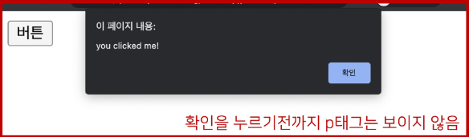

# JavaScript 5일차  

### 동기와 비동기  

> 개요  

JavaScript에서 비동기 처리 학습  

<hr>  

> Intro  

주문 후 커피가 나올 때까지 기다려야 함 (동기식)  

주문 후 진동벨이 울리면 커피를 가져옴 (비동기)  

\<오늘의 할 일 \> &nbsp;&nbsp;&nbsp; 만약 위에서부터 <font color='red'>순서대로만</font> 처리 해야 한다면?

1. 교수님께 이메일 보내기
- 교수님 답장 확인하기
- 교수님께 답장 보내기  

2. 저녁 식사하기

3. 부모님께 안부 전화하기  
- 전화 통화가 안되면 문자로 안부 물어보기  

4. 꿀잠자기  

&nbsp;

교수님의 답장이 오지 않으면, 영원히 저녁 식사를 할 수 없다!  

<hr>  

### 동기(Synchronous)  

> 동기(Synchronous)  

모든 일을 <mark>순서대로 하나씩</mark> 처리하는 것  

순서대로 처리한다 == 이전 작업이 끝나면 다음 작업을 시작한다.  

우리가 작성했던 Python 코드가 모두 동기식  

```py
print('첫 번째 작업')
for i in range(10):
    print('두 번째 작업')
    print(i)
print('세 번째 작업')
```

요청과 응답을 동기식으로 처리한다면?  
- 요청을 보내고 응답이 올때가지 기다렸다가 다음 로직을 처리  

<hr>  

웹에서의 동기 경험하기  

```html
<!-- 01_sync_page11.html -->

<!DOCTYPE html>
<html lang="en">
<head>
  <meta charset="UTF-8">
  <meta http-equiv="X-UA-Compatible" content="IE=edge">
  <meta name="viewport" content="width=device-width, initial-scale=1.0">
  <title>Document</title>
</head>
<body>
  <button>버튼</button> 
  <script>
    const btn = document.querySelector('button')
    btn.addEventListener('click', () => {
      alert('you clicked me!')
      const pElem = document.createElement('p')
      pElem.innerText = 'p Element'
      document.body.appendChild(pElem)
    })
  </script>
</body>
</html>
```


<hr>

### 비동기(Asynchoronous)  

> 비동기(Asynchronous)  

작업을 시작한 후 <mark>결과를 기다리지 않고</mark> 다음 작업을 처리하는 것 (병렬적 수행)  

시간이 필요한 작업들은 요청을 보낸 뒤 응답이 빨리 오는 작업부터 처리  

예시) Gmail에서 메일 전송을 누르면 목록화면으로 전환되지만 실제로 메일을 보내는 작업은 병렬적으로 뒤에서 처리됨  


&nbsp;

```js
function slowRequest(callBack) {
  console.log('1. 오래 걸리는 작업 시작 ...')
  setTimeout(function () {   // 3초를 기다리는 함수 (오래 걸리는 작업)
    callBack()
  }, 3000)
}

function myCallBack() {
  console.log('2. 콜백함수 실행됨') // 가장 마지막에 출력
}

slowRequest(myCallBack)
console.log('3. 다른 작업 실행')

// 출력 결과
// 1. 오래 걸리는 작업 시작 ...
// 3. 다른 작업 실행
// 2. 콜백함수 실행됨
```

<hr>  

> 비동기(Asynchronous)를 사용하는 이유  

<mark>사용자 경험</mark>  
- 예를 들어 아주 큰 데이털르 불러온 뒤 실행되는 앱이 있을 때, 동기로 처리한다면 데이털르 모두 불러온 뒤에야 앱이 실행 로직이 수행되므로 사용자들은 마치 앱이 멈춘 것과 같은 경험을 겪게 됨  
- 즉, 동기식 처리는 특정 로직이 실행되는 동안 다른 로직 실행을 차단하기 때문에 마치 프로그램이 응답하지 않는 듯한 사용자 경험을 만들게 됨  
- <mark>비동기 처리한다면 먼저 처리되는 부분 부터 보여줄 수 있으므로,</mark> 사용자 경험에 긍정적인 효과를 볼 수 있음

이와 같은 이유로 많은 웹 기능은 비동기 로직을 사용해서 구현되어 있음  

<hr>  

### JavaScript의 비동기 처리  

> Single Thread 언어, JavaScript  

그러면 응답이 먼저 오는 순서대로 처리하지 말고, 아예 여러 작업을 동시에 처리하면 되지 않을까?  

<mark>JavaScript는 한 번에 하나의 일만 수행할 수 있는 Single Thread 언어</mark>로 동시에 여러 작업을 처리할 수 없음  

[참고] Thread란?  
> 작업을 처리할 때 실제로 작업을 수행하는 주체로,  
> multi-thread라면 업무를 수행할 수 있는 주체가 여러 개라는 의미  

[참고] 프로그램 작동 원리  
> 프로그램은 할 일이 순서대로 적힌 파일, 이것이 실제로 수행되면 프로세스가 되며 이것을 처리하는 것이 > 쓰레드이다.  
Single Thread라고 해서 단점만 존재하는 것은 아니다.  

즉 <mark>JavaScript는 하나의 작업을 요청한 순서대로 처리</mark>할 수 밖에 없다!  
그러면 어떻게 Single Thread인 JavaScript가 비동기 처리를 할 수 있을까?  

<hr>  

> JavaScript Runtime  

JavaScript 자체는 Single Thread이므로 비동기 처리를 할 수 있도록 도와주는 환경이 필요함  

특정 언어가 동작할 수 있는 환경 "런타임(Runtime)"이라 함  

JavaScript에서 <mark>비동기와 관련한 작업은 브라우저 또는 Node 환경에서 처리</mark>  

이중에서 브라우저 환경에서 비동기 동작은 크게 아래 요소들로 구성됨  

1. JavaScript Engine의 <mark>Call Stack</mark>  
2. Web API
3. Task Queue
4. Event Loop

<hr>  

> 비동기 처리 동작 방식  

브라우저 환경에서의 JavaScript의 비동기는 아래와 같이 처리된다.  

1. 모든 작업은 <font color='red'>Call stack</font>(LIFO)으로 들어간 후 처리된다.  

2. 오래 걸리는 작업이 Call Stack으로 들어오면 <font color='red'>Web API</font>(:주방장)로 보내 별도로 처리하도록 한다.  

3. Web API에서 처리가 끝난 작업들은 곧바로 Call Stack(:알바)으로 들어가지 못하고 <font color='red'>Task Queue(FIFO)(:대기열) </font>에 순서대로 들어간다.  

4. <font color='red'>Event Loop</font>(:사장님)가 Call Stack이 비어 있는 것을 계속 체크하고 Call Stack이 빈다면 Task Queue에서 가장 오래된 (가장 앞에 있는) 작업을 Call Stack으로 보낸다.  

<hr>  

> 비동기 처리 동작 요소  

1. Call Stack(:알바)  
- 요청이 들어올 때마다 순차적으로 처리하는 Stack(LIFO)?  
- 기본적인 JavaScript의 Single Thread 작업 처리  

2. Web API(:주방장)  
- JavaScript 엔진이 아닌 브라우저에서 제공하는 runtime 환경  
- 시간이 소요되는 작업을 처리 (setTimeout, DOM Event, AJAX 요청 등)  

&nbsp;

3. Task Queue(:요리(가판대))  
- 비동기 처리된 Callback 함수가 대기하는 Queue(FIFO)  

4. Event Loop(:사장님)  
- Call Stack과 Task Queue를 지속적으로 모니터링  
- Call Stack이 비어 있는지 확인 후 비어 있다면 Task Queue에서 대기 중인 오래된 작업을 Call Stack으로 Push  

<hr>

> 그림으로 보는 비동기 처리(Runtime)  

```js
    console.log('Hi')

    setTimeout(function () {
      console.log('SSAFY')
    }, 3000)

    console.log('Bye')
```

  

전체 그림은 pdf를 참조할 것!  

&nbsp;

```js
    console.log('Hi')

    setTimeout(function () {
      console.log('SSAFY')
    }, 0)

    console.log('Bye')
```

이러면 어떨가?


똑같이 일단 Web API에 넘기기 때문에 순서의 변화가 없다.  

<hr>  

> 정리  

JavaScript는 한 번에 하나의 작업을 수행하는 Single Thread 언어로 동기적 처리를 하지만,  
브라우저 환경에서 Web API에서 처리된 작업이 지속적으로 Task Queue를 거쳐 Event Loop에 의해  
Call Stack에 들어와 순차적으로 실행됨으로써 비동기 작업이 가능한 환경이 됨  

<hr>  

### Axios  

> Axios  

JavaScript의 HTTP 웹 통신을 위한 라이브러리  

확장 가능한 인터페이스와 쉽게 사용할 수 있는 비동기 통신 기능을 제공  

node 환경은 npm을 이용해서 설치 후 사용할 수 있고, browser 환경을 CDN을 이용해서 사용할 수 있음  

Axios 공식 문서 및 github  

<a href="https://axios-http.com/kr/docs/intro">https://axios-http.com/kr/docs/intro</a>  
<a href="http://github.com/axios/axios">http://github.com/axios/axios</a>  

<hr>  

### Axios 기본 구조  

> Axios 사용해보기

```html
<script src="https://cdn.jsdelivr.net/npm/axios/dist/axios.min.js"></script>
<script>
    axios.get('요청할 URL')  
    .then(성공하면 수행할 콜백함수)  
    .catch(실패하면 수행할 콜백함수)
</script>
```
get, post 등 여러 method 사용가능  
<font color='red'>then</font>을 이용해서 성공하면 수행할 로직을 작성  
<font color='red'>catch</font>를 이용해서 실패하면 수행할 로직을 작성  
<font color='red'>finally</font>를 이용해서 무조건 수행할 로직을 작성  

<hr>  

> 고양이 사진 가져오기  

The Cat API(<a href="https://api.thecatapi.com/v1/images/search">https://api.thecatapi.com/v1/images/search</a>)
- 이미지를 요청에서 가져오는 작업을 비동기로 처리  

response 구조  

```json
// 20230425100916
// https://api.thecatapi.com/v1/images/search

[
  {
    "id": "d86",
    "url": "https://cdn2.thecatapi.com/images/d86.jpg",
    "width": 320,
    "height": 240
  }
]
```

&nbsp;

python으로 요청해보기 (동기)  

```py
import requests 

print('고양이는 야옹')

cat_image_search_url = 'https://api.thecatapi.com/v1/images/search'
response = requests.get(cat_image_search_url)

if response.status_code == 200:
    print(response.json())
else: 
    print('실패했다옹')
    
print('야옹야옹')

# 실행 결과
# 고양이는 야옹
# [{'id': 'ci9', 'url': 'https://cdn2.thecatapi.com/images/ci9.jpg', 'width': 500, 'height': 374}]
# 야옹야옹
```

&nbsp;

axios로 요청해보기 (비동기)
```html
<!-- 05_cat_api.html -->

<!DOCTYPE html>
<html lang="en">
<head>
  <meta charset="UTF-8">
  <meta http-equiv="X-UA-Compatible" content="IE=edge">
  <meta name="viewport" content="width=device-width, initial-scale=1.0">
  <title>Document</title>
</head>
<body>

  <button>야옹아 이리온</button>

  <script src="https://cdn.jsdelivr.net/npm/axios/dist/axios.min.js"></script>
  <script>
      console.log('고양이는 야옹')
      const catImageSearchURL = 'https://api.thecatapi.com/v1/images/search'
      
      axios.get(catImageSearchURL)
        .then((response) => {
          console.log(response.data)
        })
        .catch((error) => {
          console.log('실패했다옹')
        })

      console.log('야옹야옹')


  </script>
  
</body>
</html>

```


<hr>  

> 고양이 사진 가져오기 (결과 비교)  

동식 코드 (python)는 위에서부터 순서대로 처리가 되기 때문에 첫 번째 print가  
출력되고 이미지를 가져오는 처리를 기다렸다가 다음 print가 출력되는 반면  

비동기식 코드(JavaScript)는 바로 처리가 가능한 작업(console.log)은  
바로 처리하고, 오래 걸리는 작업인 이미지를 요청하고 가져오는 일은 요청을  
보내 놓고 기다리지 않고 다음 코드로 진행 후 완료가 된 시점에 결과 출력이 진행됨  

<hr>  

> 고양이 사진 가져오기 (완성하기)

작업 Flow  

1. 버튼을 누르면  
2. 고양이 이미지를 요청하고  
3. 요청이 처리되어 응답이 오면  
4. 처리된 response에 있는 url을 img 태그에 넣어 보여주기  

```html

<!DOCTYPE html>
<html lang="en">
<head>
  <meta charset="UTF-8">
  <meta http-equiv="X-UA-Compatible" content="IE=edge">
  <meta name="viewport" content="width=device-width, initial-scale=1.0">
  <title>Document</title>
</head>
<body>

  <button>야옹아 이리온</button>

  <script src="https://cdn.jsdelivr.net/npm/axios/dist/axios.min.js"></script>
  <script>
      console.log('고양이는 야옹')
      const catImageSearchURL = 'https://api.thecatapi.com/v1/images/search'

      const btn = document.querySelector('button')
      btn.addEventListener('click', function() {
        axios.get(catImageSearchURL)
          .then((response) => {
            // console.log(response.data)
            // console.log(response.data[0].url)
            imgElem = document.createElement('img')
            imgElem.setAttribute('src', response.data[0].url)
            document.body.appendChild(imgElem)
          })
          .catch((error) => {
            console.log('실패했다옹')
          })
  
        console.log('야옹야옹')
      })
      


  </script>
  
</body>
</html>

```

<hr>

> axios 다양하게 사용하기  

```html
<!-- 06_axios.html -->

<!DOCTYPE html>
<html lang="en">
<head>
  <meta charset="UTF-8">
  <meta http-equiv="X-UA-Compatible" content="IE=edge">
  <meta name="viewport" content="width=device-width, initial-scale=1.0">
  <title>Document</title>
</head>
<body>
  <script src="https://cdn.jsdelivr.net/npm/axios/dist/axios.min.js"></script>
  <script>
    const URL = 'https://jsonplaceholder.typicode.com/todos/1/'
    // 1. Axios
    // 1-1. Axios의 return 값은 Promise
    const myPromise = axios.get(URL)
    // console.log(myPromise) // Promise Object

    myPromise // axios.get(URL)로 사용해도 무방하다.
      .then(response => {
        // console.log(response.data)
        return response.data
      })
    

    // 1-2. chaining
    axios.get(URL)
      .then(response => {
        console.log(1)
        console.log(response)
        return response.data
      })
      .then(response => {
        console.log(2)
        console.log(response)
        return response.title
      }) 
      .then(response => {
        console.log(3)
        console.log(response)
      })
      .catch(error => {
        console.log(error)
      })
    
    // 1-3. 다른 표기법(권장)
    axios({ // 객체 형식으로 되어있어 가독성도 좋으며, 바꾸기가 편하기에 권장됨  
      method: 'get', 
      url: URL,
    })
      .then(response => {
        console.log(response)
        return response.data
      }) 
      .then(response => {
        console.log(response)
        return response.title
      })
      .then(response => {
        console.log(response)
      })
      .catch(error => {
        console.log(error)
      })
  </script>
</body>
</html>
```

<hr>  

> 정리  

axios는 비동기 데이터 통신을가능하게 하는 라이브러리  

같은 방식으로 우리가 배운 Django REST API로 요청을 보내서 데이터를 받아온 후 처리할 수 있음  

<hr>  

### Callback과 Promise  

> 비동기 처리의 단점  

비동기 처리의 핵심은 Web API로 들어오는 순서가 아니라  
<mark>작업이 완료되는 순서에 따라 처리</mark>한다는 것!  

그런데 이는 개발자 입장에서 코드의 실행 순서가 불명확하다는 단점이 있음  
이와 같은 단점은 <mark>실행 결과를 예상하면서 코드를 작성할 수 없게 함</mark>  
-> 어떻게 해야할까? -> 콜백 함수를 사용하자!  

<hr>  

### 콜백 함수(Callback function)  

> 콜백 지옥 (Callback Hell)  

콜백 함수는 연쇄적으로 발생하는 비동기 작업을 순차적으로 동작할 수 있게 함  

보통 어떤 기능의 실행 결과를 받아서 다른 기능을 수행하기 위해 많이 사용하는데, 이 과정을 작성하다 보면 비슷한 패턴이 계속 발생하게 됨  

&nbsp;

비동기 처리를 위한 콜백을 작성할 때 마주하는 문제를 Callback Hell(콜백 지옥)이라 하며,  
그 때의 코드 작성형태가 마치 "피라미드"와 같다고 해서 "Pyramid of doom(파멸의 피라미드)"라고도 부름  

&nbsp;


<hr>  

> 정리  

콜백 함수는 비동기 작업을 순차적으로 실행할 수 있게하는 반드시 필요한 로직  

비동기 코드를 작성하다 보면 콜백 함수로 인한 콜백 지옥(callback hell)은 반드시 나타나는 문제  

- 코드의 가독성을 해침  
- 유지 보수가 어려워짐  

<hr>  

### 프로미스(Promise)  

> 프로미스(Promise)

Callback Hell 문제를 해결하기 위해 등장한 비동기 처리를 위한 객체  

"작업이 끝나면 실행 시켜줄게"라는 약속(promise)  

<mark>비동기 작업의 완료 또는 실패를 나타내는 객체</mark>  

Promise 기반의 클라이언트가 바로 이전에 사용한 <mark>Axios</mark> 라이브러리!  
- "Promise based HTTP client for the browser and node.js"  
- 성공에 대한 약속 <font color='red'>then()</font>  
- 실패에 대한 약속 <font color='red'>catch()</font>

<hr>  

> then & catch  

<mark>then(callback)</mark>  
- 요청한 작업이 성공하면 callback 실행  
- callback은 **이전 작업의 성공 결과를 인자로 전달 받음**

<mark>catch(callback)</mark>  
- then()이 하나라도 실패하면 callback 실행  
- callback은 이전 작업의 실패 객체를 인자로 전달 받음  

&nbsp;

then과 catch 모두 항상 promise 객체를 반환  
즉, 계속해서 **chaining을 할 수 있음**  

<mark>axios로 처리한 비동기 로직이 항상 promise 객체를 반환</mark>  
그래서 then을 계속 이어 나가면서 작성할 수 있던 것  

  

<hr>  

> 비동기 콜백 vs Promise  

  

&nbsp;

promise 방식은 비동기 처리를 마치 우리가 일반적으로 위에서 적는 방식처럼 코드를 작성할 수 있음  

<hr>  

> Promise가 보장하는 것 (vs 비동기 콜백)  

비동기 콜백 작성 스타일과 달리 Promise가 보장하는 특징  

1. callbakc 함수는 JavaScript의 Event Loop가 현재 실행 중인 Call Stack을 완료하기 이전에 절대 호출되지 않음  
- Promise callback 함수는 Event Queue에 배치되는 엄격한 순서로 호출  

2. 비동기 작업이 성공하거나 실패한 뒤에 .then() 메서드를 이용하여 추가한 경우에도 1번과 똑같이 동작  

3. .then()을 여러 번 사용하여 여러 개의 callback 함수를 추가할 수 있음 (Chaining)  
- 각각의 callback은 주어진 순서대로 하나하나 실행하게 됨  
- Chaining은 Promise의 가장 뛰어난 장점  

<hr>  

추가 작업: 강아지 이미지 불러오기!  

```html
<!-- 07_dog_api.html -->

<!DOCTYPE html>
<html lang="en">
<head>
  <meta charset="UTF-8">
  <meta http-equiv="X-UA-Compatible" content="IE=edge">
  <meta name="viewport" content="width=device-width, initial-scale=1.0">
  <title>Document</title>
</head>
<body>
  <button>멍멍아 이리온</button>

  <script src="https://cdn.jsdelivr.net/npm/axios/dist/axios.min.js"></script>
  <script>
    const dogImageSearchURL = "https://dog.ceo/api/breeds/image/random"
    // const dogImageSearchURL = "https://dog.ceo/api/breeds/image/randomzzz" // 실패하는 url

    const dogBtn = document.querySelector('button')

    // 버튼을 누를 때마다 강아지 사진 보여주기  
    dogBtn.addEventListener('click', function() {
      // 비동기 요청 보내기  
      axios({
        method: 'get',
        url: dogImageSearchURL,
      })
      .then((response) => {
        // console.log(response.data.message)
        const imgSrc = response.data.message
        return imgSrc
      })
      .then((imgSrc) => {
        const imgTag = document.createElement('img')
        imgTag.setAttribute('src', imgSrc)
        document.body.appendChild(imgTag)
      })
      .catch((error) => {
        console.log(error)
      })

    })
  </script>
</body>
</html>
```

<hr>

### Promise 객체 사용하기

<a href="https://developer.mozilla.org/ko/docs/Web/JavaScript/Reference/Global_Objects/Promise/Promise">https://developer.mozilla.org/ko/docs/Web/JavaScript/Reference/Global_Objects/Promise/Promise</a>

```html

<!DOCTYPE html>
<html lang="en">
<head>
  <meta charset="UTF-8">
  <meta http-equiv="X-UA-Compatible" content="IE=edge">
  <meta name="viewport" content="width=device-width, initial-scale=1.0">
  <title>Document</title>
</head>
<body>
  <script>
    console.log('Hi')

    const promise = new Promise((resolve, reject) => {
      setTimeout(function () {
        console.log('SSAFY')
        resolve()
      }, 3000)
    })

    promise
    .then(() => console.log('Bye'))
  </script>
</body>
</html>

```