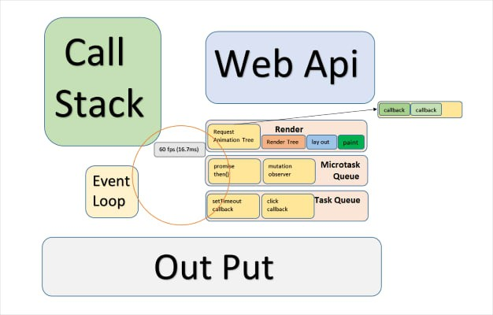
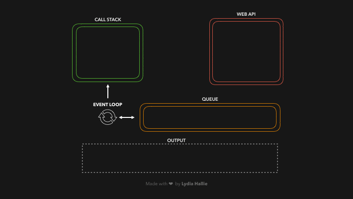

# 비동기 통신

오늘은 비동기 통신!! axios라는 라이브러리를 사용한다. 

axios는 Javascript의 HTTP 웹 통신을 위한 라이브러리로써 비동기통신 기능을 제공해 준다.

비동기 통신이 무엇이냐? 비동기 라는 말의 뜻은?

- 동기 -> 순서 또는 순차적으로 코드가 실행되도록 하고 결과 역시 코드 실행 순서대로 순차적으로 확인 가능함
- 비동기 - > 순서 또는 순차 없이 코드가 완료되는 순서에 따라 결과를 확인 할 수 있음

비동기 코드의 예시를 확인해 보자.

```jsx
<script>

    console.log('1')
    setTimeout(() => {
        console.log('2')
    }, 1000);
    console.log('3')

 </script>
```

만약에 코드를 동기적으로 코드를 작성 했다면 1->2->3 순으로 출력되야 하지만 위의 코드는 

비동기 적으로 실행되는 코드이다. 그래서 출력 결과는 1->3->2가 된다.

비동기적으로 실행되는 위 코드의 실행 순서는 다음과 같다.

1. console.log('1') 을 통해서 1출력 후
2. setTimeout 메서드를 사용해서 1000ms (1초) 후에 2가 출력이 실행 되도록 코드를 작성했다. 2가 출력완료 까지 기다리는 1초 동안에 
3. 3을 먼저 출력을 하고 1초 후에 2가 출력이 완료된다.

예를 하나 더 보자.

빨래와 설거지를 하는 동기 코드를 하나 적어 보겠다. 나는 빨래를 하고 설거지를 할 것이다.

세탁기를 돌려 놓으면 3초라는 시간이 걸린다.

```jsx
    <script>

      function sleep(delay){
         const start=Date.now()
         let limit = start+ delay
         while(Date.now()<limit){ }
      }

       console.log("laundary")
       sleep(3000)
       console.log("washdishes")
    </script>
```

동기식으로 코드가 실행 된다면

1. 세탁기를 돌려 놓고 (console.log("laundary"))
2. 세탁기가 다 돌아갈 때 까지 3초간 대기한다 (sleep(3000))
3. 3초 후 빨래가 완료되면 설거지를 한다. (console.log("washdishes"))

위 코드를 비동기 식으로 바꿔보자.

위의 동기 코드가 비동기로 바뀌게 된다면..

```jsx
    <script>

       setTimeout(function(){
         console.log('laudary')
       },3000)

       console.log('washdishes')

    </script>
```

세탁기 돌려 놓고 빨래가 완료되는 동안에 기다림 없이 설거지를 한다.

그리고 3초가 지난 후에는 빨래가 완료 되어있을 것이다.

웹에서 수많은 코드들을 동기적으로만 처리 한다면 하나의 이벤트가 모두 끝날때 까지 다른 코드들은 실행시키지 못하는 최적화 문제가 발생 할 수가 있다. 

만약에 브라우저가 백엔드 서버와 HTTP 통신하는 함수 코드를 작업할 때 HTTP 통신이 끝날 때 까지 브라우저 상에서 그 어떠한 여타 작업과 코드실행을 하지 못한다면 유저는 화면이 웹 화면이 랜더링하는데 기다리는 시간이 오래 걸릴 것이다. 이러한 이유로 비동기 함수 작업을 하는 문법이 존재하는 것이다.

그러면 javascript에서 코드를 비동기 또는 동기식으로 처리하는 과정을 보자





1. Call Stack 에서 들어오는 코드 중 비동기 함수를 일단 브라우저의 WebAPI로 보내 작업을 맡긴다.
2. WebAPI 에서 비동기 코드들이 (예를들어 빨래 3초) 작업이 끝나는 순서대로 해당 비동기 함수들을 Queue에 줄을 세운다.
3. EVENT LOOP에 의해 Queue에 있는 코드들이 Call Stack 보내진 후 코드들이 하나씩 수행 되는 원리다.

웹 브라우저는 비동기를 통해서 UI를 랜더링 하는 과정에서 실행이 오래 걸리는 테스크를 처리해야 할 때 발생하는 블로킹을 막는다. 그리고  싱글스레드 언어인 자바스크립트의 동기적인 실행 컨택스트인 스택을 벗어나 효율적으로 스케줄링 하기 위해 비동기 처리를 사용한다.

setTimeout() // Http request // Dom Event 등이 모두 비동기 처리 방식으로 동작을 한다. 즉, API를 통해 Data를 받아오는 과정, Data를 서버에 업로드하는 과정, HTML 요소로 만든 애니메이션 효과 등은 모두 비동기적으로 처리됨으로써 브라우저 사용자가 기다림, 블로킹 없이 웹 화면을 볼 수 있는 것이다.

비동기 작업을 구현하는 방법은 여러가지가 있다. 먼저 콜백함수로 비동기 처리되는 코드를 구현한다고 해보자. 

일단 콜백 함수를 사용해서 비동기 코드를 구현해 보자.

1. 항상 설거지가 빨래보다 늦게 출력이 되도록 코드 수정해 볼 것이다.
   
     (설거지 빨래 둘다 비동기 함수 사용)

```html
    <script>
    setTimeout(function(){

        console.log('laudary')

                setTimeout(function(){
            console.log('washdishes')
        },0)

    },0)

    </script>
```

비동기 안에 비동기를 넣다보니 콜백 함수 안에 또 콜백 함수가 들어간다. 

만약에 해야 할 집안 일이 엄청 많다면? 콜백함수 안에 또 콜백함수가 들어가고 그 콜백함수 안에 또 콜백 함수가 들어 갈 것이다. 콜백 함수 안에 또 콜백 함수가 자꾸 들어가다 보면 즉, 콜백지옥 발생 한다. 그래서 콜백함수를 사용해서는 비동기 코드를 잘 구현하지 않는다. 비동기 처리가 필요할 때 promise  또는 라이브 시간에 다루지는 않았지만 Async-Await 문법을 이용해서 비동기 코드를 구현 한다.

promise 를 보자.  promise 사용 하는 목적, 이유를 보자.

사용목적1. 비동기 코드 구현하는데 있어 콜백 지옥 해결

사용목적2. 만약에 콜백 함수를 이용해서 비동기 코드를 구현하다 보면 상위 함수 실행에 성공 했을 시에만 다음의 하위 함수가 실행된다. 즉, 상위 함수가 실행 안된다면 하위함수도 실행하지 않을 것이다. 그러나 promise를 사용하면 이러한 문제가 해결된다.

promise에서 상위 함수가 **실행 될 경우**(.then) 그리고 상위 함수가 **실행 안될경우**(.catch) 모두 실행 할 코드(약속)을 정해 줄 수 있다.

Promise 예시

[https://jsonplaceholder.typicode.com](https://jsonplaceholder.typicode.com/) 를 이용해서 무료로 제공해 주는 fake API를 제공 받아서 테스트 해보자. 위 링크에 들어가서 스크롤을 조금 내려 살펴보자.

`https://jsonplaceholder.typicode.com/todos/1`을 주소창에 통으로 복사해 보면 우리가 사용할 Json 객체를 브라우저상 확인 할 수 있다. 

```jsx
<script>
  const url = 'https://jsonplaceholder.typicode.com/todos/1'

    fetch(url)
    .finally(()=>(console.log("설겆이")))

        // ret는 서버로 부터 받아온 데이터를 의미하며
        // ret.json()은 받아온 파일을 제이슨 형식으로 변환 하겠다는 의미

    .then(ret => {
       //console.log(ret)
        return ret.json()})

        // ret_json은 json 형식으로 바뀐 값을 저장하는 매개변수를 의미
    .then(ret_json=> console.log(ret_json))

    .catch(error=>
        console.log(error)    
    )
    .finally(()=>(console.log("빨래")))
  </script>
```

promise 코드를 하나 예시로 보기 위하여 promise로 만들어진 함수 중 하나인 fetch()를 사용해 보았다.  fetch() 기본 문법은 다음과 같다.

```jsx
       fetch("url",{option}).then(response => {
                    // 예시 let ret = response.text();
                })
```

fetch() 함수는 첫번째 인자로 URL 를 받는다. 두번째 인자{option}로는 예외(error)시 반환 받을 객체를 넣어준다. fetch()함수를 통해서 반환된 객체는, API 호출이 성공했을 경우에는 url로 부터 응답받은(response)객체를 resolve 할 것이고(ret에 담을 것이고) 실패 했을 경우에는 두번째 인자객체{option}을 반환한다.

아까 promise 예시 코드의 fetch() 함수를 보면 예외(error)시 반환받을 객체는 생략했다.  

코드를 조금 더 살펴 보면 Promise에서는 then이 실행한 후 이래 then이 순차적으로 실행된다. catch는 위에 여러개의 then중 어느 한개의 then에서 실패를 하면 바로 catch를 실행한다. 그래서 일반적으로 catch는 마지막에 적어준다. 그리고 .finally는 무조건 바로 실행 하겠다는 의미 이다. 코드 작성 후 개발자 도구를 통해서 잘 출력 되는지 확인해 보자.

---

이번에는 비동기통신을 쉽게 구현해 주는 axios 를 사용해 보자. axios는 내부적으로 Promise 로 구현되어 있으며 Promise를 잘 사용하기 위한 라이브러리다. 그리고 axios는HTTP 요청과 응답을 JSON 형태로 자동 변경을 해준다.

구글에 `axios` 를 검색해서 [https://axios-http.com/kr/docs/intro](https://axios-http.com/kr/docs/intro) 에 접속해 서 스크롤 가장 아래있는 `unpkg CDN`을 복붙하자. 

```jsx
<body>
  <script src="https://cdn.jsdelivr.net/npm/axios/dist/axios.min.js"></script>

  <script>

    console.log('hi')

    const url = 'https://jsonplaceholder.typicode.com/todos/1'

    const ret = axios.get(url)
      .then((ret) =>
        console.log(ret.data.title)
      )

  </script>

  <script src="https://unpkg.com/axios/dist/axios.min.js"></script>
</body>
```

title이 잘 출력이 되었다면 성공이다.  간단하게 기본 폼만 보았다. 라이브 교재에 이미 있는 코드들 (0이미지를 서버로 부터 받아와서 출력하는 코드)을 연습해 보고 데일리실습을 하나씩 진행해 보자. <끝>