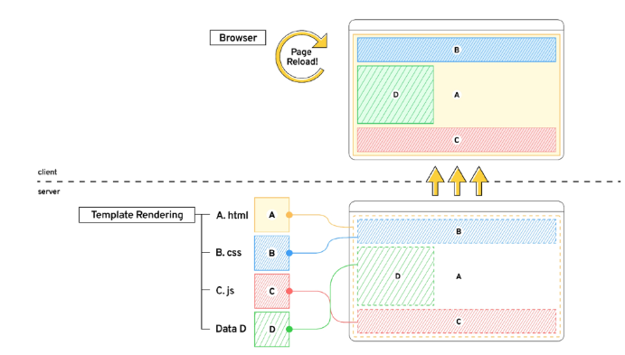
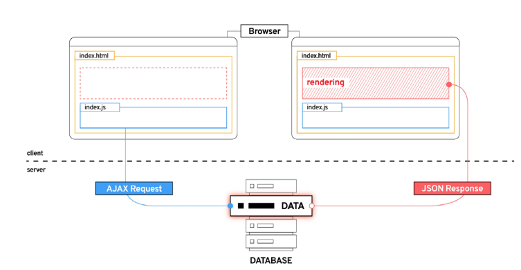
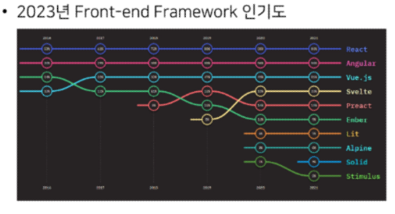
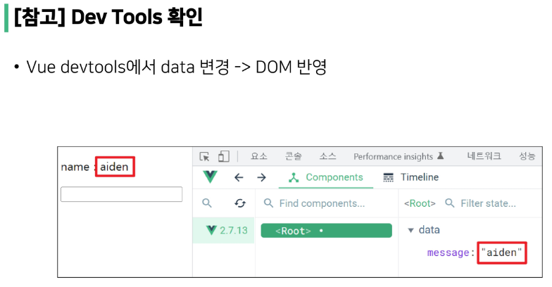
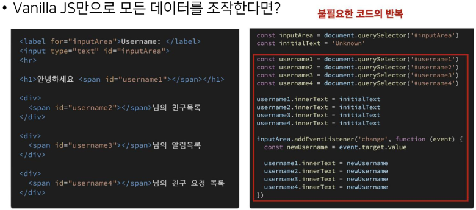
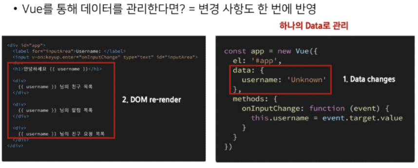
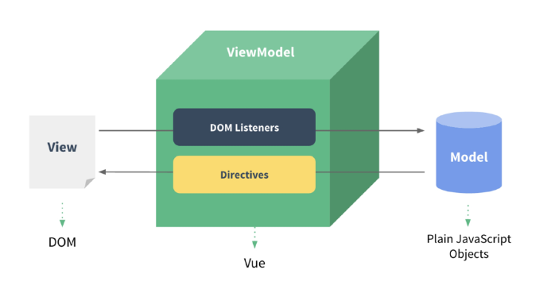
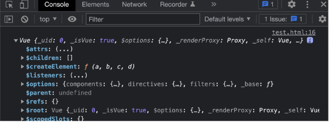
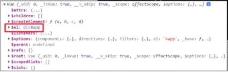

# Vue 1일차  

### Vue Intro  

> 사전 준비  

공통 노션 "Vue.js 사전 준비 사항" 문서 참고  

VSCode Vetur extension 설치  
- 문법 하이라이팅, 자동완성, 디버깅 기능 제공  

Chrome Vue devtools extension 설치 및 설정  
- 크롬 브라우저 개발자 도구에서 vue 디버깅 기능 제공  

<hr>  

> 개요  

Front-end 개발이란 무엇인가  

Front-end framework란 무엇인가  

Vue를 배우는 이유  

Vue 기초 문법  

<hr>  

### Front-end Development  

> 개요 (What is Front-end Development)  

Front-end 개발은 Web App 또는 Web Site의 UI/UX를 제작하고 관리하는 과정  

Front-end 프레임워크와 라이브러리(React, Angular, Vue.js)를 사용하여  
개발 효율성을 높이고, Web App의 복잡성을 관리  

Front-end 개발에 사용되는 주요 기술은 HTML, CSS, JavaScript  

<hr>  

> Web App이란?  

웹 브라우저에서 실행되는 어플리케이션 소프트웨어  

VIBE 웹 사이트로 이동  
<a href="https://vibe.naver.com/today">https://vibe.naver.com/today</a>  

&nbsp;

개발자 도구 > 디바이스 모드  

웹 페이지가 그대로 보이는 것이 아닌 디바이스에 설치된 App처럼 보이는 것  

웹 페이지가 디바이스에 맞는 적절한 UX/UI로 표현되는 형태  

<hr>  

> SPA(Single Page Application)  

Web App과 함께 자주 등장할 용어 SPA  

이전까지는 사용자의 요청에 대해 적절한 페이지 별 template을 반환  

SPA 서버에서 최초의 1장 HTML만 전달받아 모든 요청에 대응하는 방식  
- 어떻게 한 페이지로 모든 요청에 대응할 수 있을까?  
- <mark>CSR</mark>(Client Side Rendering) 방식으로 요청하기 때문  

<hr>  

> [참고] SSR (Server Side Rendering)이란  

기존의 요청 처리 방식은 SSR  

Server가 사용자의 요청에 적합한 HTML을 렌더링하여 제공하는 방식  

전달받은 새 문서를 보여주기 위해 브라우저는 새로고침을 진행  

```html
  


    <h1>User List Page</h1>
    
        <p>{{ user.pk }}</p>
        <p>{{ user.username }}</p>
        <p>{{ user.password }}</p>
        <hr>
    
        <p>아직 가입한 유저가 없습니다.</p>
    

```
&nbsp;

  


1. HTML 구조 
2. JS 구조 

순서대로 받으며, 처음에 거의 완성된 상태로 전달받는다.  

이러한 페이지를 받자마자 화면이 보이긴하나 동작이 바로 일어나지는 않음  

<hr>  

> CSR (Client Side Rendering)이란?  

최초의 한 장의 HTML을 받아오는 것은 동일  
- 단, server로 부터 최초의 받아오는 문서는 빈 HTML 문서  

```html
<body>
    <noscript>
        <strong>We're sorry but ...</strong>
    </noscript>
    <div id='app'></div>
    <!-- built files will be auto injected -->
</body>
```

&nbsp;

각 요청에 대한 대응을 JavaScript를 사용하여 필요한 부분만 다시 렌더링  

1. 필요한 페이지를 서버에 <mark>AJAX</mark>로 요청  

2. 서버는 화면을 그리기 위해 필요한 데이터를 JSON 방식으로 전달  

3. JSON 데이터를 JavaScript로 처리, DOM 트리에 반영(렌더링)  

```js

axios.get(
    HOST_URL,
    {
        headers:{
            Authorization: `Token ${key}`
        }
    }
)
.then(res => {
    this.todos = res.data
})
.catch(err => console.log(err))
```

&nbsp;

  

<hr>  

> 왜 CSR 방식을 사용하는 걸까?  

1. 모든 HTML 페이지를 서버로부터 받아서 표시하지 않아도 됨  
    - == 클라이언트 - 서버 간 통신 즉, 트래픽 감소  
    - == 트래픽이 감소한다. = 응답 속도가 빨라진다  

2. 매번 새 문서를 받아 새로고침하는 것이 아니라 필요한 부분만 고쳐 나가므로 각 요청이 끊김없이 진행  
- SNS에서 추천을 누를 때마다 첫 페이지로 돌아간다. - 끔찍한 App!  
- 요청이 자연스럽게 진행이 된다. = UX 향상  

3. BE와 FE의 작업 영역을 명확히 분리할 수 있음  
- 각자 맡은 역할을 명확히 분리한다. == 협업이 용이해짐  

<hr>  

> CSR은 만능일까?  

첫 구동 시 필요한 데이터가 많으면 많을수록 최초 작동 시간까지 오랜 시간이 소요  

Naver, Netflix, Disney+ 등 모바일에 설치된 Web-App을 실행하게 되면 잠깐의 로딩 시간이 필요  

&nbsp;

<mark>검색 엔진 최적화(SEO, Search Engine Optimization)</mark>가 어려움  
- 서버가 제공하는 것은 텅빈 HTML(크롤링 등이 어려움)  
- 내용을 채우는 것은 AJAX 요청으로 얻은 JSON 데이터로 클라이언트 (브라우저)가 진행  
- 대체적으로 HTML에 작성된 내용을 기반으로 하는 검색 엔진에 빈 HTML에 공유하는 SPA 서비스가 노출되기는 어려움  

<hr>  

> CSR vs SSR  

CSR과 SSR은 흑과 백이 아님  
- 내 서비스에 적합한 렌더링 방식을 적절하게 활용할 수 있어야 함  

SPA 서비스에서도 SSR을 지원하는 Framework이 발전하고 있음  
- Vue의 Nuxt.js
- React의 Next.js  
- Angular Universal 등  

<hr>  

> 여러가지 Front-end Framework  

Front-end Framework == HTML + CSS + JS 를 더 편하게 작업하기 위한 툴  
- Reaction, Angular, Svelte, Vue 등  

  

<hr>  

### Why Vue  

> 왜 우리는 Vue를 배울까?  

쉽다.  

Vue는 타 Framework에 비해 입문자가 시작하기에 좋은 Framework  

왜 Vue는 상대적으로 낮은 진입 장벽을 가질 수 있었을까?  

&nbsp;

Vue를 발표한 개발자는 Evan You  

학사- 미술, 미술사/ 석사 - 디자인 & 테크놀로지 전공  

구글의 Angular 개발자 출신  

- Vue는 타 Framework에 비해 입문자가 시작하기에 좋은 Framework  
- Angular보다 <mark>가볍고, 간편하게 사용할 수 있는</mark> Framework를 만들기 위해 퇴사  
- 2014년 Vue 발표  

<hr>  


<hr>  

> Vue의 기본 구조  

Vue 구조는 매우 직관적  

```vue
// 01_vue_intro.vue

<template>
  <!-- HTML -->
  <div>
    <p>Hello :)</p>
  </div>
</template>

<script>
  // JavaScript
</script>

<style>
  /* CSS */
  p {
    color: black;
  }
</style>
```

<hr>  

> Vue 없이 코드 작성하기  

```html
// 02_html_only.html

<!DOCTYPE html>
<html lang="en">
<head>
  <meta charset="UTF-8">
  <meta http-equiv="X-UA-Compatible" content="IE=edge">
  <meta name="viewport" content="width=device-width, initial-scale=1.0">
  <title>Document</title>
</head>
<body>
  <div id="app">
    <p id="name">name : </p>
    <input id="inputName" type="text">
  </div>
  <script>
    const nameTag = document.querySelector('#name')
    const input = document.querySelector('input')

    input.addEventListener('input', function(event) {
      nameTag.innerText = 'name: ' + event.target.value

    })

  </script>
    
</body>
</html>
```

입력 받은 데이터를 p tag에 추가하려고 한다면?  

기존에 가지고 있던 text도 신경 써야함  
- data를 관리하기 위한 추가 작업이 필요함  

<hr>  

> Vue CDN  

Vue로 작업을 시작하기 위하여 CDN을 가져와야 함  

Django == Python Web FrameWrok  

- pip install  

Vue == JS Front-end-Framework  
- Bootstrap에 서 사용하였던 CDN 방식 제공  
- npm 활용은 추후에 진행 예정  

&nbsp;

Vue CDN을 위하여 Vue2 공식 문서 참고  
<a href ="https://v2.ko.vuejs.org/v2/guide">https://v2.ko.vuejs.org/v2/guide</a>  

<hr>  

> Vue로 코드 작성하기  

입력 받은 값을 name 뒤에 출력하기  

1. Vue CDN 가져오기  
2. Vue instance 생성  
    - Vue instance - 1개의 Object  
    - 미리 정해진 속성명을 가진 Object  
3. el, data 설정  
    - data에 관리할 속성 정의  
4. 선언적 렌더링 {{ }}
    - Vue data를 화면에 렌더링  
5. input tag에 <mark>v-model</mark> 작성
    - input에 값 입력 -> Vue data 반영  
    - Vue data -> DOM 반영

```html
<!DOCTYPE html>
<html lang="en">
<head>
  <meta charset="UTF-8">
  <meta http-equiv="X-UA-Compatible" content="IE=edge">
  <meta name="viewport" content="width=device-width, initial-scale=1.0">
  <title>Document</title>
</head>
<body>
  <div id="app">
    <p id="name">name : {{ message }}</p>
    <input id="inputName" type="text" v-model="message">
  </div>
  
  <script src="https://cdn.jsdelivr.net/npm/vue@2/dist/vue.js"></script>
  <script>
    // CODE HERE
    const app = new Vue({
      el: '#app',
      data: {
        message: '',
      }
    })
  </script>
</body>
</html>
```

&nbsp;



<hr>

> Facebook 예시  

- 한 명의 유저가 이름을 변경한다면 화면에서 조작해야 할 영역이 매우 많음  



&nbsp;

  

<hr>  

### Vue2 vs Vue3

> Vue3  

2022년 02월부터 Vue 프레임워크의 기본 버전이 3버전으로 전환  

대체적인 설정들이 Vue3을 기본으로 적용되어 있음  
- ex) 공식문서, CDN, NPM 등  

<hr>

> Vue2  

여전히 Vue2가 많이 사용됨  

사용된 기간이 긴 만큼 상대적으로 많은 문서의 양, 참고자료, 질문/답변  

<hr>  

### Vue instance  

> MVVM Pattern  

소프트웨어 아키텍처 패턴의 일종  

마크업 언어로 구현하는 그래픽 사용자 인터페이스(<mark>view</mark>)의 개발을 Back-end(<mark>model</mark>)로부터 분리시켜  
view가 어느 특정한 모델 플랫폼에 종속되지 않도록 함  

&nbsp;

  

&nbsp;

<mark>View</mark> - 우리 눈에 보이는 부분 = DOM!  
<mark>Model</mark> - 실제 데이터 = JSON!  
<mark>View Model</mark>(Vue)  

- View를 위한 Model  
- View와 연결(binding)되어 Action을 주고 받음  
- Model이 변경되면 View Model도 변경되고 바인딩된 View도 변경됨  
- View에서 사용자가 데이터를 변경하면 View Model의 데이터가 변경되고 바인딩된 다른 View도 변경됨  

[참고] Vue와 React는 컴포넌트 기반이며, Virtual DOM 방식이라는 공통점이 있고, 가볍고 빠르다.  

<hr>  

> MVVM Pattern 정리  

MVC 패턴에서 Controller를 제외하고 View Model을 넣은 패턴  

View는 Model을 모르고, Model도 View를 모른다.  
== DOM은 Data를 모른다, Data도 DOM을 모른다. (독립성 증가, 적은 의존성)  

View에서 다른 데이터를 변경하면 View Model의 데이터가 변경되고, 연관된 다른 View도 함께 변경된다.  

<hr>  

> Vue instance  

1. Vue CDN 가져오기  
2. <mark>new</mark> 연산자를 사용한 생성자 함수 호출  
    - vue instance 생성  
3. 인스턴스 출력 및 확인  

```html

<script>
  const app = new Vue({
  })

  console.log(app)
  </script>
```

&nbsp;

  

Vue instance === 1개의 객체  

아주 많은 속성과 메서드를 이미 가지고 있고, 이러한 기능들을 사용하는 것  

<hr>  

> el(element)  

Vue instance와 DOM을 mount(연결)하는 옵션  
- View와 Model을 연결하는 역할  
- HTML id 혹은 class와 마운트 가능  

Vue instance와 **연결되지 않은 DOM 외부는 Vue의 영향을 받지 않음**  
- Vue 속성 및 메서드 사용 불가  

&nbsp;

새로운 Vue instance 생성  

생성자 함수 첫 번째 인자로 <mark>Object</mark> 작성  

el 옵션에 #app 작성 = DOM 연결  

인스턴스 출력  

```html
<script>
  const app = new Vue({
    el: '#app',
  })
  console.log(app)
</script>
```

&nbsp;



Vue와 연결되지 않은 div 생성  
- 두 div 모두에 <mark>{{ message }}</mark> 작성  
- 결과 확인  

message 속성이 정의되지 않았다는 경고와 {{ message }}가 그대로 출력되는 차이  

```html

<div id="app">
  <p>{{ message }}</p>
  <p>{{ movie }}</p>
</div>
<div>
  <p>{{ message }}</p>
  <p>{{ movie }}</p>
</div>

<!-- Vue CDN -->
<script>
const app = new Vue({
  el: '#app',
})
console.log(app)
</script>
```

<hr>  

> data  

Vue instance의 <mark>데이터 객체</mark> 혹은 <mark>인스턴스 속성</mark>  

데이터 객체는 반드시 기본 객체 {} (Object)여야 함  

객체 내부의 아이템들은 value로 모든 타입의 객체를 가질 수 있음  

정의된 속성은 <mark>interpolation {{}}</mark>을 통해 view에 렌더링 가능함  

&nbsp;

Vue instance에 <mark>data</mark> 객체 추가  

data 객체에 message 값 추가  

결과 확인  

추가된 객체의 각 값들은 <mark>this.message</mark>형태로 접근 가능  

```html  
<!-- Vue CDN -->
<script src="https://cdn.jsdelivr.net/npm/vue@2/dist/vue.js"></script>
<script>
  const app = new Vue({
    el: '#app',
    data: {
      message: '',
      movie: '아바타-ENFP',
      
    },
  })
</script>
```

<hr>  

> methods  

Vue instance의 <mark>method들을 정의하는 곳</mark>  

method 객체 정의  
- 객체 내 print method 정의  
- print method 실행 시 Vue instance의 data 내 message 출력  

콘솔창에서 app.print() 실행  

```html  
<script>
  const app = new Vue({
    el: '#app',
    data: {
      message: '',
      movie: '아바타-ENFP',
      
    },
    methods: {
      print: function() {
        console.log('print 입니당!')
      },
    }
  })
</script>
```

&nbsp;

method를  호출하여 data 변경 가능  
- 객체 내 bye method 정의  
- print method 실행 시 Vue instance의 data 내 message 변경  

콘솔창에서 app.bye() 실행  
- DOM에 바로 변경된 결과 반영  
- Vue의 강력한 반응성(reactivity)

```html
<script>
  const app = new Vue({
    el: '#app',
    data: {
      message: '',
      movie: '아바타-ENFP',
      
    },
    methods: {
      print: function() {
        console.log('print 입니당!')
      },
      bye() {
        this.message = this.message + "a"
      }
    },
  })
</script>
```

<hr>  

> [주의]  methods with Arrow Function  

메서드를 정의할 때, Arrow Function을 사용하면 안됨  

Arrow Function의 this는 함수가 선언될 때 상위 스코프를 가리킴  

즉 this가 상위 객체 window를 가라킴  

호출은 문제 없이 가능하나 this로 Vue의 data를 변경하지 못함  

<hr>

> 부가적인 설명  

```html
<!DOCTYPE html>
<html lang="en">
<head>
  <meta charset="UTF-8">
  <meta http-equiv="X-UA-Compatible" content="IE=edge">
  <meta name="viewport" content="width=device-width, initial-scale=1.0">
  <title>Document</title>
</head>
<body>
  <!-- 여기서 view에서 보여줄 화면이 출력됨 (새로고침없이 바로) -->
  <div id="app">
    <!-- {{}} 안에는 변수명이 들어가는데, data 객체의 속성 값 message가 {{}}를 통해서 message 변수에 접근이 가능 -->
    <p id="name">name : {{ message }}</p>
    <!-- 메서드 안에 있는 함수 출력 -->
    <p>{{ print() }}</p> 
    <input id="inputName" type="text" v-model="message">
    <!-- v-model을 통해서 입력된 후 -->
    <!-- v-model은 <input> 태그에 쓰이고, <input> 태그가 나오면 무조건 v-model을 사용한다. -->
  </div>
  
  <script src="https://cdn.jsdelivr.net/npm/vue@2/dist/vue.js"></script>
  <script>
    // CODE HERE
    const app = new Vue({  // 1. Vue 객체 생성(new를 써주는 이유는 Vue가 제공하는 객체의 '생성자 함수' 선언 -> Vue instance 생성)

      el: '#app', // 2. elements에 view(DOM)의 id를 적어줌으로써 id가 "app"인 DOM과 연결함 (<div id='app'>)

      data: {         // 3. data는 Vue 인스턴스가 사용할 정보를 가지고 ㅣㅇㅆ는 정보를 저장하는 속성
        message: '',    // Vue 인스턴스와 연결되어 있는 앱에 적용시킬 data 객체를 추가해준 것!
      },                 // message에 들어갈 값들

      methods: {      // methods는 Vue 인스턴스가 사용할 함수를 저장하고 있는 속성명
        print:function(){
          console.log(this.message)
        },
        greeting(){
          this.message='cute boy'
        }
      }
    })
  </script>
</body>
</html>

```