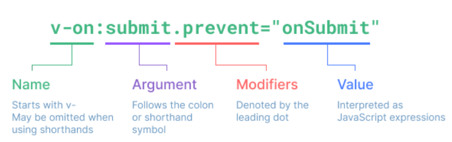
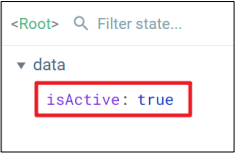
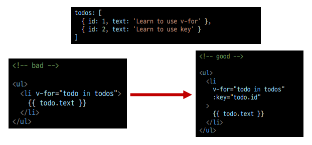
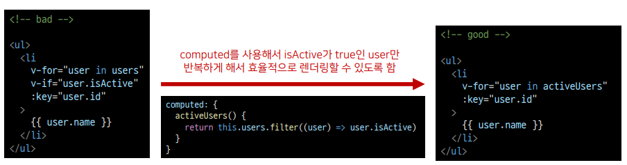
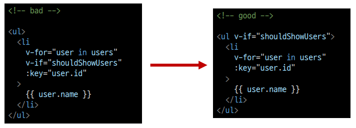

# Vue 2일차  

### Basic of Syntax  

> Template Syntax  

Vue2 guide > Template Syntax 참고  

<mark>렌더링 된 DOM</mark>을 기본 Vue instance의 data에 <mark>선언적으로 바인딩</mark> 할 수 있는 HTML <mark>기반 template syntax를 사용</mark>  
- 렌더링된 DOM: 브라우저에 의해 보기 좋게 그려질 HTML 코드  
- HTML 기반 template syntax: HTML 코드에 직접 작성할 수 있는 문법 제공  
- 선언적으로 바인딩: Vue instance와 DOM을 연결  

<hr>  

> Text Interpolation  

가장 기본적인 바인딩(연결) 방법  

중괄호 2개로 표기  

DTL과 동일한 형태로 작성  

Text interpolation 방법은 모두 일반 텍스트로 표현  

<hr>  

> RAW HTML  

<mark>v-html</mark> directive을 사용하여 data와 바인딩  

directive-HTML 기반 tempalte syntax  

HTML의 기본 속성이 아닌 Vue가 제공하는 특수 속성의 값으로 data를 작성  

```html
<!-- 1. Text interpolation -->
<div id="app">
  <p>메시지: {{ msg }}</p>   
  <p>HTML 메시지 : {{ rawHTML }}</p>
</div>

<script src="https://cdn.jsdelivr.net/npm/vue@2/dist/vue.js"></script>
<script>
  // 1. Text interpolation
  const app = new Vue({
    el: '#app',
    data: {
      msg: "Text interpolation",
      rawHTML: "<span style='color: red;'>빨간 글씨</span>"

    }
  })
</script>
```

<hr>

> [참고] JS 표현식  

표현식 형태로 작성 가능  

```html
<!-- 1. Text interpolation -->
<div id="app">
    <p>{{ msg.split('').reverse().join('') }}</p>
</div>

<script src="https://cdn.jsdelivr.net/npm/vue@2/dist/vue.js"></script>
<script>
  // 1. Text interpolation
  const app = new Vue({
    el: '#app',
    data: {
      msg: "Text interpolation",
      rawHTML: "<span style='color: red;'>빨간 글씨</span>"

    }
  })
</script>
```

<hr>  

### Directives  

> Directives 기본 구성  

v-접두사가 있는 특수 속성에는 갑승ㄹ 할당할 수 있음  
- 값에는 JS 표현식을 작성할 수 있음  

directive의 역할은 <b>표현식의 값</b>이 <b>변경</b>될 때 <b>반응적</b>으로 DOM에 적용하는 것  

<br>



`:`을 통해 전달인자를 받을 수 있음  
`.`으로 표시되는 특수 접미사-directive를 특별한 방법으로 바인딩해야 함  

<hr>  

> 새 Vue instance 생성  

각각의 instance들은 연결된 DOM element에만 영향을 미침  

연결되지 않은 DOM이 Vue의 영향을 받지 않았던 것과 동일한 상황  

```html
<div id="app">
  ...
</div>
<div id="app2">
</div>

<!-- Vue CDN -->
<script>
  ...
  const app2 = new Vue({
    el: '#app2',
  })
</script>
```

<hr>

> v-text  

Template Interpolation과 함께 가장 기본적인 바인딩 방법  

`{{ }}`와 동일한 역할  
- 정확히 동일한 역할인 것은 아님  

```html
<!-- 2. v-text & v-html -->
<div id="app2">
  <!-- 2-1. v-text & {{}} -->
  <p v-text="message"></p>
  <!-- 같음 -->
  <p>{{ message }}</p>
</div>

<script src="https://cdn.jsdelivr.net/npm/vue@2/dist/vue.js"></script>
<script>
  // 2. v-text && v-html
  const app2 = new Vue({
    el: '#app2',
    data: {
      message: "Hello 근로자의 날",
    }
  })
</script>
```

<hr>

> v-html  

RAW HTML을 표현할 수 있는 방법  

단, 사용자가 입력하거나 제공하는 컨텐츠에는 <font color="red">절대 사용 금지</font>  
XXS 공격 참고  

```html
<!-- 2. v-text & v-html -->
<div id="app2">
  <!-- 2-1. v-text & {{}} -->
  <p v-text="message"></p>
  <!-- 같음 -->
  <p>{{ message }}</p>

  <!-- 2-2. v-html -->
  <p v-html="html"></p>
</div>

<script src="https://cdn.jsdelivr.net/npm/vue@2/dist/vue.js"></script>
<script>
  // 2. v-text && v-html
  const app2 = new Vue({
    el: '#app2',
    data: {
      message: "Hello 근로자의 날",
      html: '<a href="https://google.com">Google</a>',

    }
  })
</script>
```

<hr>  

> v-show  

표현식에 작성된 값에 따라 element를 보여줄 것인지 결정  
- boolean 값이 변경될 때마다 반응

대상 element의 display 속성을 기본 속성과 none으로 toggle  

요소 자체는 항상 DOM에 렌더링됨

```html
<!-- 3. v-show && v-if -->
<div id="app3">
  <p v-show="isActive">보이니? 안보이니?</p>
</div>

<script src="https://cdn.jsdelivr.net/npm/vue@2/dist/vue.js"></script>
<script>
  // 3. v-show && v-if
  const app3 = new Vue({
    el: '#app3',
    data: {
      isActive: true,
    }
  })
</script>
```

<br>

바인딩된 isActive의 값이 false이므로 첫 방문 시 p tag는 보이지 않음  
- Vue dev tools에서 isActive 변경 시 화면에 출력  
- 값을 false로 변경 시 다시 사라짐  

화면에서만 사라졌을 뿐, DOM에는 존재한다.  
- display 속성이 변경되었을 뿐  



<hr>

> v-if  

v-show와 사용 방법은 동일  

isActive의 값이 변경될 때 반응  

단, 값이 false인 경우 <mark>DOM에서 사라짐</mark>  

v-if v-else-if v-else 형태로 사용

```html
<!-- 3. v-show && v-if -->
<div id="app3">
  <p v-if="isActive">안보이니? 보이니?</p>
</div>

<script src="https://cdn.jsdelivr.net/npm/vue@2/dist/vue.js"></script>
<script>
  // 3. v-show && v-if
  const app3 = new Vue({
    el: '#app3',
    data: {
      isActive: true,
    }
  })
</script>
```

<hr>  

> v-show VS v-if  

v-show(Expensive initial load, cheap toggle)
- 표현식 결과와 관계없이 렌더링되므로 초기 렌더링에 필요한 비용은 v-if보다 높을 수 있음  
- display 속성 변경으로 표현 여부를 판단하므로 렌더링 후 togggle 비용은 적음  

v-if (Cheap initial load, expensive toggle)
- 표현식 결과가 false인 경우 렌더링조차 되지 않으므로 초기 렌더링 비용은 v-show보다 낮을 수 있음  
- 단, 표현식 값이 자주 변경되는 경우 잦은 재 렌더링으로 비용이 증가할 수 있음  

<hr>  

> v-for  

`for ... in ...` 형식으로 작성  

반복한 데이터 타입에 모두 사용 가능  

index를 함께 출력하고자 한다면 `(char, index)` 형태로 사용 가능  

```html
  <!-- 3. v-for -->
<div id="app">
  <h2>1. String</h2>
  <div v-for="char in myStr">
    {{ char }}
  </div>
  <div v-for="(char, index) in myStr" :key="index">
    <p>{{ index }}번째 문자열 {{ char }}</p>
  </div>
</div>

<script src="https://cdn.jsdelivr.net/npm/vue@2/dist/vue.js"></script>
<script>
  const app = new Vue({
    el: '#app',
    data: {
      // 1. String
      myStr: 'Hello, World!',
    }
  })
</script>
```

<br>

배열 역시 문자열과 동일하게 사용 가능  

각 요소가 객체라면 `dot notation`으로 접근할 수 있음  

```html
<div id="app">
  <h2>2. Array</h2>
  <div v-for="(item, index) in myArr" :key="`ssafy-${index}`">
    <p>{{ index }}번째 아이템 {{ item }}</p>
  </div>

  <div v-for="(item, index) in myArr2" :key="`arry-${index}`">
    <p>{{ index }}번째 아이템</p>
    <p>{{ item.name }}</p>
  </div>
</div>

<script src="https://cdn.jsdelivr.net/npm/vue@2/dist/vue.js"></script>
<script>
  const app = new Vue({
    el: '#app',
    data: {
      // 2-1. Array
      myArr: ['python', 'django', 'vue.js'],

      // 2-2. Array with Object
      myArr2: [
        { id: 1, name: 'python', completed: true},
        { id: 2, name: 'django', completed: true},
        { id: 3, name: 'vue.js', completed: false},
      ],

    }
  })
</script>
```

<br>  

> [참고] 특수 속성 key  

<mark>"v-for 사용 시 반드시 key 속성을 각 요소에 작성"</mark>  

주로 v-for directive 작성 시 사용  

vue 화면 구성 시 이전과 달라진 점을 확인하는 용도로 활용  
- 따라서 각 key가 중복되어서는 안됨  

각 요소가 고유한 값을 가지고 있다면 생략할 수 있음  

```html
<div v-for="(item, index) in myArr2" :key="`arry-${index}`">
  <p>{{ index }}번째 아이템</p>
  <p>{{ item.name }}</p>
</div>
```

<hr>

> v-for (이어서)  

객체 순회 시 value가 할당되어서 출력  

2 번째 변수 할당 시 key 출력 가능  

```html
<div id="app">

  <h2>3. Object</h2>
  <div v-for="value in myObj">
    <p>{{ value }}</p>
  </div>

  <div v-for="(value, key) in myObj" :key="key">
    <p>{{ key }} : {{ value }}</p>
  </div>
</div>

<script src="https://cdn.jsdelivr.net/npm/vue@2/dist/vue.js"></script>
<script>
  const app = new Vue({
    el: '#app',
    data: {
      // 3. Object
      myObj: {
        name: 'harry',
        age: 27
      },
    }
  })
</script>
```

<hr>  

> v-on  

`:`을 통해 전달받은 인자를 확인  

값으로 JS 표현식 작성  

addEventListener의 첫 번째 인자와 동일한 값들로 구성  

대기하고 있던 이벤트가 발생하면 할당된 표현식 실행  

```html  
<div id="app">
  <button v-on:click="number++">increase Number</button>
  <p>{{ number }}</p>
  <!-- <button @click="number++">increase Number</button>
  <p>{{ number }}</p> -->
</div>

<script src="https://cdn.jsdelivr.net/npm/vue@2/dist/vue.js"></script>
<script>
  const app = new Vue({
    el: '#app',
    data: {
      number: 0,
    },
  })
</script>
```

<br>  

method를 통한 data 조작도 가능  

method에 인자를 넘기는 방법은 일반 함수를 호출할 때와 동일한 방식  

`:`을 통해 전달된 인자에 따라 특별한 modifiers (수식어)가 있을 수 있음  

- ex) `v-on: keyup.enter` 등  
- vue2 가이드 > api > v-on 파트 참고  

`@` shortcut 제공  
- ex) `@keyup.click`

```html
<div id="app">
  <button v-on:click="number++">increase Number</button>
  <p>{{ number }}</p>
  <!-- <button @click="number++">increase Number</button>
  <p>{{ number }}</p> -->

  <button v-on:click="toggleActive">toggle isActive</button>
  <p>{{ isActive }}</p>

  <button @click="checkActive(isActive)">check isActive</button>
</div>

<script src="https://cdn.jsdelivr.net/npm/vue@2/dist/vue.js"></script>
<script>
  const app = new Vue({
    el: '#app',
    data: {
      number: 0,
      isActive: false,
    },
    methods: {
      toggleActive: function () {
        this.isActive = !this.isActive
      },

      checkActive: function (check) {
        console.log(check)
      }
    }
  })
</script>
```

[이벤트 목록 확인하기]
<a href="https://www.w3schools.com/js/js_events_examples.asp">https://www.w3schools.com/js/js_events_examples.asp</a>

<hr>

> v-bind  

HTML 기본 속성에 Vue data를 연결  

class의 경우 다양한 형태로 연결 가능  
- <mark>조건부 바인딩</mark>  
    - `{'class Name': '조건 표현식'}`
    - 삼항 연산자도 가능  

- <mark>다중 바인딩</mark>
    - ['JS 표현식', 'JS 표현식', ...]

<br>

Vue data의 변화에 반응하여 DOM에 반영하므로 상황에 따라 유동적 할당 가능  

`:` shortcut 제공  
- ex) `:class` 등  
- v-for에서 사용하였던 `:key`는 v-bind의 shortcut을 활용한 것  

```html
<div id="app2">
  <a :href="url">Go to Naver</a>
  <!-- <a v-bind:href="url">Go to Naver</a> -->
  <p :class="redTextClass">빨간 글씨</p>
  <p :class="{'red-text': true}">빨간 글씨</p>
  <p :class="{'red-text': false}">빨간 글씨 non</p>
  <p :class="[redTextClass, borderBlack]">빨간 글씨, 테두리</p>

  <p :class="theme">상황에 따른 유연한 활성화</p>
  <button @click="darkmodeToggle">다크 모드 토글 {{ isActive }} </button>
</div>

  <script src="https://cdn.jsdelivr.net/npm/vue@2/dist/vue.js"></script>
  <script>
    const app2 = new Vue({
      el: '#app2',
      data: {
        url: 'https://www.naver.com/',
        redTextClass: 'red-text',
        borderBlack: 'border-black',
        isActive: true,
        theme: 'dark-mode',
      },
      methods: {
        darkmodeToggle() {
          this.isActive = !this.isActive
          
          if (this.isActive) {
            this.theme = 'dark-mode'
          }
          else {
            this.theme = 'white-mode'
          }
        }
      }
    })
```

<hr>

> v-model

Vue instance와 DOM의 <mark>양뱡향 바인딩</mark>  

Vue data 변경 시 v-model로 연결된 사용자 입력 element에도 적용  

```html
<div id="app">
  <h2>1. Input -> Data</h2>
  <h3>{{ myMessage }}</h3>
  <input @input="onInputChange" type="text">
  <hr>

  <h2>2. Input <-> Data</h2>
  <h3>{{ myMessage2 }}</h3>
  <input v-model="myMessage2" type="text">
  <hr>
</div>

<script src="https://cdn.jsdelivr.net/npm/vue@2/dist/vue.js"></script>
<script>
  const app = new Vue({
    el: '#app',
    data: {
      // 단방향
      myMessage: '',
      // 양방향
      myMessage2: '',
    },
    methods: {
      onInputChange: function (event) {
        this.myMessage = event.target.value
      },
    }
  })
</script>
```

<hr>

### Vue advanced

> computed  

Vue instance가 가진 options 중 하나  

computed 객체 정의 함수를 페이지가 최초로 렌더링 될 때 호출하여 계산  
- 계산 결과가 변화기 전까지 함수를 재호출하는 거싱 아닌 계산된 값을 반환  

<mark>10_computed.html</mark>에서 methods와의 차이를 확인  

```html
<!-- 10_computed.html -->

<!DOCTYPE html>
<html lang="en">
<head>
  <meta charset="UTF-8">
  <meta http-equiv="X-UA-Compatible" content="IE=edge">
  <meta name="viewport" content="width=device-width, initial-scale=1.0">
  <title>Document</title>
</head>
<body>
  <div id="app">
    <h1>data_01 : {{ number1 }}</h1>
    <h1>data_02 : {{ number2 }}</h1>
    <hr>
    <h1>add_method : {{ add_method() }}</h1>
    <h1>add_method : {{ add_method() }}</h1>
    <h1>add_method : {{ add_method() }}</h1>
    <hr>
    <!-- 괄호가 없다는 것을 확인! -->
    <h1>add_computed : {{ add_computed }}</h1> 
    <h1>add_computed : {{ add_computed }}</h1>
    <h1>add_computed : {{ add_computed }}</h1>
    <hr>
    <button v-on:click="dataChange">Change Data</button>
  </div>

  <script src="https://cdn.jsdelivr.net/npm/vue@2/dist/vue.js"></script>
  <script>
    const app = new Vue({
      el: '#app',
      data: {
        number1: 100,
        number2: 100
      },
      computed: {
        add_computed: function () {
          console.log('computed 실행됨!')
          return this.number1 + this.number2
        },
      },
      methods: {
        add_method: function () {
          console.log('method 실행됨!')
          return this.number1 + this.number2
        },
        dataChange: function () {
          this.number1 = 200
          this.number2 = 300
        },
      }
    })
  </script>
</body>
</html>
```

<hr>

> methods VS computed  

methods  
- 호출될 때마다 함수를 실행  
- 같은 결과여도 매번 새롭게 계산  

computed: 계산 저장 -> 재활용  
- 함수의 종속 대상의 변화에 따라 계산 여부가 결정됨  
- 종속 대상이 변하지 않으면 항상 저장(캐싱)된 값을 반환  

<hr>  

> watch: 처음부터 끝까지 본다.  

특정 데이터의 변화를 감지하는 기능  
1. watch 객체를 정의  
2. 감시할 대상 data를 지정  
3. data가 변할 시 실행할 함수를 정의  

첫 번째 인자는 변동 후 data

두 번째 인자는 변동 전 data

```html
<div id="app">
  <button @click="number++">+</button>
</div>

  <script src="https://cdn.jsdelivr.net/npm/vue@2/dist/vue.js"></script>
  <script>
    const app = new Vue({
      el: '#app',
      data: {
        number: 0,
      },
      watch: {
        number: function (val, oldVal) { // val: 변동 후, oldVal : 변동 전
          console.log(val, oldVal)
        },
      }
    })
  </script>
```

<br>  

실행 함수를 Vue method로 대체 가능  
1. 감시 대상 data의 이름으로 객체 생성  
2. 실행하고자 하는 method를 handler에 문자열 형태로 할당  

```html
<!-- watch에서 handler를 통해서 사용하는 방식 -->

<div id="app">
  <h3>Change name</h3>
  <p>{{ name }}</p>
  <input type="text" v-model="name">
</div>

<script src="https://cdn.jsdelivr.net/npm/vue@2/dist/vue.js"></script>
<script>
  const app = new Vue({
    el: '#app',
    data: {
      name: '',
    },  
    methods: {
      nameChange: function () {
        console.log('name is changed')
      },
    },
    watch: {
      name: {
        handler: 'nameChange'
      },
    }
  })
</script>
```

<br>
Array, Object의 내부 요소 변경 감지를 위해서는 `deep` 속성 추가 필요  

```html
<div id="app">
    <h3>push myObj</h3>
    <p>{{ myObj }}</p>
    <button @click="itemChange">change Item</button>
</div>

<script src="https://cdn.jsdelivr.net/npm/vue@2/dist/vue.js"></script>
  <script>
    const app = new Vue({
      el: '#app',
      data: {
        myObj: {completed: true}
      },  
      methods: {
        itemChange: function () {
          this.myObj.completed = !this.myObj.completed
        }
      },
      watch: {
        myObj: {
          handler: function (val) {
            console.log(val)
          },
          // 이 부분!
          deep: true // object의 내부 요소 변화를 확인하기 위해서
        },
      }
    })
  </script>
```

<hr>

```html
<!-- 11_watch_yesorno.html -->
<!DOCTYPE html>
<html lang="en">
<head>
    <meta charset="UTF-8">
    <meta http-equiv="X-UA-Compatible" content="IE=edge">
    <meta name="viewport" content="width=device-width, initial-scale=1.0">
    <title>Document</title>
</head>
<body>
    <div id="watch-example">
        <p>
          yes/no 질문을 물어보세요:
          <input v-model="question">
        </p>
        <p>{{ answer }}</p>
      </div>

    <script src="https://cdn.jsdelivr.net/npm/vue/dist/vue.js"></script>
    <script src="https://unpkg.com/axios@0.12.0/dist/axios.min.js"></script>
    <script src="https://unpkg.com/lodash@4.13.1/lodash.min.js"></script>
<script>
const watchExampleVM = new Vue({
  el: '#watch-example',
  data: {
    question: '',
    answer: '질문을 하기 전까지는 대답할 수 없습니다.'
  },
  watch: {
    // 질문이 변경될 때 마다 이 기능이 실행됩니다.
    question: function () {
      this.answer = '입력을 기다리는 중...'
      this.debouncedGetAnswer()
    }
  },
  created: function () {
    // _.debounce는 lodash가 제공하는 기능으로
    // 특히 시간이 많이 소요되는 작업을 실행할 수 있는 빈도를 제한합니다.
    // 이 경우, 우리는 yesno.wtf/api 에 액세스 하는 빈도를 제한하고,
    // 사용자가 ajax요청을 하기 전에 타이핑을 완전히 마칠 때까지 기다리길 바랍니다.
    // _.debounce 함수(또는 이와 유사한 _.throttle)에 대한
    // 자세한 내용을 보려면 https://lodash.com/docs#debounce 를 방문하세요.
    this.debouncedGetAnswer = _.debounce(this.getAnswer, 500)
  },
  methods: {
    getAnswer: function () {
      if (this.question.indexOf('?') === -1) {
        this.answer = '질문에는 일반적으로 물음표가 포함 됩니다. ;-)'
        return
      }
      this.answer = '생각중...'
      const vm = this
      
      axios.get('https://yesno.wtf/api')
        .then(function (response) {
          vm.answer = _.capitalize(response.data.answer)
          
        })
        .catch(function (error) {
          vm.answer = '에러! API 요청에 오류가 있습니다. ' + error
        })
    }
  }
})
</script>
</body>
</html>
```

<hr>  

> filters  

텍스트 형식화를 적용할 수 있는 필터  

interpolation 혹은 v-bind를 이용할 때 사용 가능  

필터 자바스크립트 표현식 마지막에 `|`(파이프)와 함께 추가되어야 함  

이어서 사용 (chaining) 가능  

```html
<!-- 12_filters_page33.html -->

<!DOCTYPE html>
<html lang="en">
<head>
  <meta charset="UTF-8">
  <meta http-equiv="X-UA-Compatible" content="IE=edge">
  <meta name="viewport" content="width=device-width, initial-scale=1.0">
  <title>Document</title>
</head>
<body>
  <div id="app">
    <p>{{ numbers }}</p>
    <p>{{ numbers|getOddNums }}</p>
    <p>{{ numbers|getUnderTenNums }}</p>
  </div>

  <script src="https://cdn.jsdelivr.net/npm/vue@2/dist/vue.js"></script>
  <script>
    const app = new Vue({
      el: '#app',
      data: {
        numbers: [1, 2, 3, 4, 5, 6, 7, 8, 9, 10, 11, 12, 13, 14, 15],
      },
      filters: {
        getOddNums: function (nums) {
          const oddNums = nums.filter((num) => {
            return num % 2
          })
          return oddNums
        },
        
        getUnderTenNums: function (nums) {
          const underTen = nums.filter((num) => {
            return num < 10
          })
          return underTen
        }
      }
    })
  </script>
</body>
</html>
```

<hr>  

### Vue Style Guide  

> Vue Style Guide  

Vue의 스타일 가이드 규칙은 우선순위 기준으로 4가지 범주를 설정  

우선순위  
- A: 필수 (Essential)
- B: 적극 권장 (Strongly Recommended)
- C: 권장 (Recommended)
- D: 주의 필요 (Use with Caution)

<a href="https://v2.vuejs.org/v2/style-guide/">https://v2.vuejs.org/v2/style-guide/</a>  

<hr>

> 우선순위 특징  

A: 필수 (Essential)  
- 오류를 방지하는 데 동무이 되므로 어떤 경우에도 규칙을 학습하고 준수  

B: 적극 권장 (Strongly Recommended)  
- 규칙을 어겨도 코드는 여전히 실행되겟지만, 규칙 위반은 드물어야 함  

C: 권장 (Recommended)  
- 일관성을 보장하도록 임의의 선택을 할 수 있음  

D: 주의 필요 (Use with Caution)  
- 잠재적 위험 특성을 고려함  

<hr>  

> 오늘 학습하고 지켜야 할 스타일 가이드 2가지  

우선순위 A  
1. v-for는 항상 key와 함께 사용하기  
2. v-for를 슨 엘리먼트에 절대 v-if를 사용하지 말기  

<hr>  

> 1. v-for는 항상 key와 함께 사용하기  

내부 컴포넌트의 상태를 일관되게 유지하기 위해 v-for에 항상 key를 사용하기  

데이터 예측 가능한 행동을 유지 시키기 (객체 불변성)  

  

<hr>  

2. v-for를 쓴 엘리먼트에 절 v-if를 사용하지 말기  

함께 쓸 수 있다고 생각되는 2가지 경우  

1. 목록의 항목을 필터링할 때  
`(v-for="user in users" v-if="user.isActive")`  

2. 숨김 목록의 렌더링을 피할 때  
`(v-for="user in users" v-if="shouldShowUsers")`  

<hr>  

> 1. 목록의 항목을 필터링 할 때  

Vue가 디렉티브를 처리할 때 v-for는 v-if보다 우선순위가 높음  

즉 user의 일부분만 렌더링하고 싶은데도 불구하고, v-for가 우선순위를 가지기 때문에 모든 user에 대해 반복해야 함  



<hr>  

> 2. 숨김 목록의 렌더링을 피할 때  

v-if를 컨테이너 엘리먼트로 옮기기  
- 더 이상 목록의 모든 사용자에 대해 shouldShowUsers를 확인하지 않도록  함  

한번 확인하고 shouldShowUsers가 false인 경우 v-for를 평가하지도 않음  

  

<hr>  

> Vue Style Guide 정리  

우선순위에 상관없이 최대한 스타일 가이드를 지키며 작성하기  
<a href="https://v2.vuejs.org/v2/style-guide/">https://v2.vuejs.org/v2/style-guide/</a>