# Vue 3일차  

### Vue CLI  

> 사전 준비  

공통  노션 문서 참고  

Node.js LTS 버전 설치  

<hr>  

### Node.js  

> Node.js  

자바스크립트는 브라우저를 조작하는 유일한 언어  
- 하지만 브라우저 밖에서는 구동할 수 없었음  

자바스크립트를 구동하기 위한 런타임 환경인 Node.js로 인해 브라우저가 아닌 환경에서도 구동할 수 있게 됨  
- Chrome V8엔진을 제공하여 여러 OS 환경에서도 실행할 수 있는 환경 제공  
- Browser만 조작 가능했으나, Server-Side-Programming 또한 가능해짐  

<hr>  

> NPM (Node Package Manager)  

자바스크립트 패키지 관리자  
- Python의 pip와 동일한 역할을 하는 Node.js의 npm  
- pip와 마찬가지로 다양한 의존성 패키지를 관리  

Node.js의 기본 패키지 관리자  

node.js 설치 시 함께 설치됨  

<hr>  

### Vue CLI  

> Vue CLI  

Vue 개발을 위한 표준 도구  

프로젝트의 구성을 도와주는 역할  

확장 플러그인, GUI, Babel 등 다양한 tool 제공   

<hr>  

> Vue CLI Quick Start  

설치  
`$ npm install -g @vue/cli`  

프로젝트 생성  
- vscode terminal에서 진행  
`$ vue create vue-cli`  

<br>  

Vue 버전 선택 (Vue2)  

`Vue CLI v5.0.8`

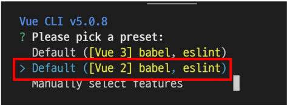  

<br>  

프로젝트 생성 성공  

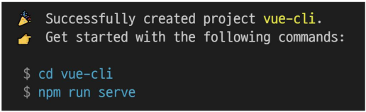  

<br>  

출력된 명령어 실행  
- 프로젝트 디렉토리로 이동  
`$ cd vue-cli`  

- 프로젝트 실행  
`$ npm run serve`

<br>  

주소 ctrl + 클릭  

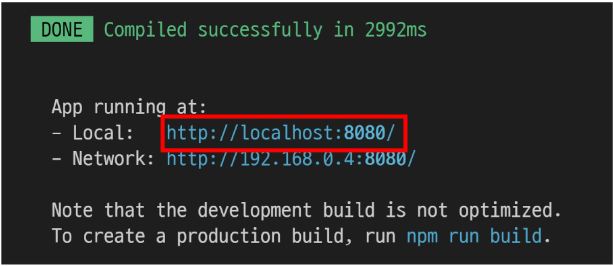

<hr>  

### Vue CLI 프로젝트 구조  

> Vue CLI 프로젝트 구조  

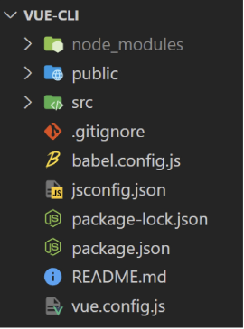  

<hr>  

> node_modules  

node.js 환경의 여러 의존성 모듈  

python의 venv와 비슷한 역할을 함(용량이 매우 크다)  
- 따라서 .gitignore에 넣어주어여야 하며, Vue 프로젝트를 생성하면 자동으로 추가됨  

<hr>  

> npm_modules-<mark>Babel</mark>  

"JavaScript complier"  

자바스크립의 ES6+ 코드를 구버전으로 번역/변환 해주는 도구  

자바스크립트의 파편화, 표준화의 영향으로 작성된 코드의 스펙트럼이 매우 다양  
- 최신 문법을 사용해도 브라우저의 버전 별로 동작하지 않는 상황이 발생  
- 버전에 따른 같은 의미의 다른 코드를 작성하는 등의 대응이 필요해졌고, 이러한 문제를 해결하기 위한 도구  
- 원시 코드(최신 버전)를 목적 코드(구 버전)으로 옮기는 번역기가 등장하면서 더 이상 코드가 특정 브라우저에서 동작하지 않는 상황에 대해 크게 고민하지 않을 수 있음  

<hr>  

> Babel의 동작 예시  

```js
// Babel Input: ES2015 arrow function(원시 코드: ES6+)  
[1, 2, 3].map((n) => n + 1)

// compile !

// Babel Output: ES5 equivalent(목적 코드: ES5)  
[1, 2, 3].map(function(n) {
    return n + 1
})
```

<hr>  

> node_moduels-<mark>Webpack</mark>  

"static module bundler"  

모듈 간의 의존성 문제를 해결하기 위한 도구  

프로젝트에 필요한 모든 모듈을 매핑하고 내부적으로 종속성 그래프르 빌드함  

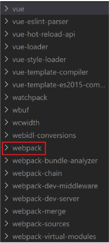  

<hr>  

> <mark>Module</mark>  

개발하는 애플리케이션의 크기가 커지고 복잡해지면 파일 하나에 모든 기능을 담기가 어려워짐  

따라서 자연스럽게 파일을 여러 개로 분리하여 관리하게 되었고, 이 때 분리된 파일 각각이 모듈(module) 즉, js 파일 하나가 하나의 모듈  

모듈은 대개 기능 단위로 분리하며, 클래스 하나 혹은 특정한 목적을 가진 복수의 함수로 구성된 라이브러리 하나로 구성됨  

여러 모듈 시스템  
- ESM(ECMA Script Module), AMD, CommonJS, UMD  

<hr>  

> Module 의존성 문제  

모듈의 수가 많아지고 라이브러리 혹은 모듈 간의 의존성(연결성)이 깊어지면서 특정한 곳에서 발생한 문제가 어떤 모듈 간의 문제인지 파악하기 어려움  
- Webpack은 이 모듈 간의 의존성 문제를 해결하기 위해 등장  

<hr>  

> <mark>Bundler</mark>  

모듈 의존성 문제를 해결해주는 작업이 Bundling  

이러한 일을 해주는 도구가 Bundler이고, Webpack은 다양한 Bundler 중 하나  

모듈들을 하나로 묶어주고 묶인 파일은 하나(혹은 여러 개)로 만들어짐  

Bundling된 결과물은 개별 모듈의 실행 순서에 영향을 받지 않고 동작하게 됨  

snowpack, parcel, rollup.js 등의 webpack 이외에도 다양한 모듈 번들러 존재  

<mark>Vue CLI는 이러한 Babel, webpack에 대한 초기 설정이 자동으로 되어 있음</mark>  

<hr>  

> node_moduels의 의존성 깊이  

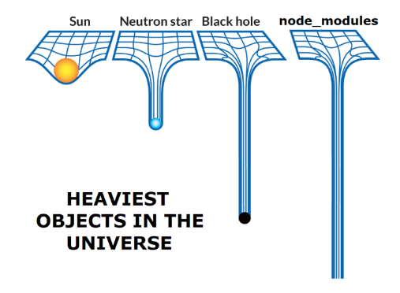  

<hr>  

> Webpack - static module bundler  

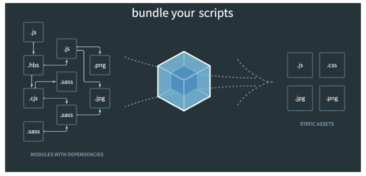  

<br>  

의존성을 Webpack이 담당해주므로 개발자 npm install을 사용해 다양한 모듈을 한 번에 설치하고 각 모듈을 사용해 개발에 집중할 수 있음  

  

<hr>  

> package.json  

프로젝트의 종속성 목록과 지원되는 브라우저에 대한 구성 옵션을 포함  

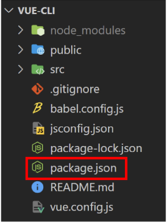  

<hr>   

> package-lock.json  

node-lock.json  

node_modules에 설치되는 모듈과 관련된 모든 의존성을 설정 및 관리  

협업 및 배포 환겨엥서 정확히 동일한 종속성을 설치하도록 보장하는 표현  

사용할 패키지의 버전을 고정  

개발 과정 간의 의존성 패키지 충돌 방지  

python의 requirement.txt와 같은 역할  

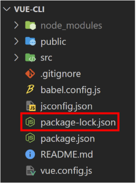  

<hr>  

> public/index.html  

Vue 앱의 뼈대가 되는 html 파일(base.html)  

Vue 앱과 연결될 요소가 있음  

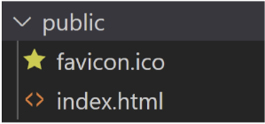

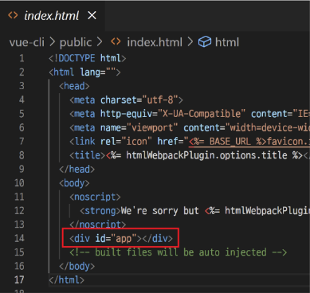  

<hr>  

> src/  

src/assets  
- 정적 파일을 저장하는 디렉토리  

src/components  
- 하위 컴포넌트들이 위치  

src/App.vue  
- 최상위 컴포넌트  
- public/index.html과 연결됨  

<br>  

src/main.js  
- webpack이 빌드를 시작할 때 가장 먼저 불러오는 entry point  
- public/index.html과 src/App.vue를 연결시키는 작업이 이루어지는 곳  
- Vue 전역에서 활동할 모듈을 등록할 수 있는 파일  

<hr>  

### Component  

> Component  

UI를 독립적이고 재사용 가능한 조각들로 나눈 것  
- 즉, 기능별로 분화한 코드 조각  

CS에서는 다시 사용할 수 있는 범용성을 위해 개발된 소프트웨어 구성 요소를 의미  

하나의 app을 구성할 때 중첩된 컴포넌트들의 tree로 구성하는 것이 보편적임  
- Web 시간에 배운 HTML 요소들의 중첩을 떠올려 보자!  
    - body tag를 root node로 하는 tree 구조이다.  
    - 마찬가지로, Vue에서는 src/App.vue를 root node로 하는 tree의 구조를 가짐  

컴포넌트는 유지보수를 쉽게 만들어줄 뿐만 아니라 재사용의 측면에서도 매우 강력한 기능을 제공  

<br>  

  

우리가 사용하는 웹 서비스는 여러 개의 컴포넌트로 이루어져 있음  

하나의 컴포넌트를 만들어두면 반복되는 UI를 쉽게 처리할 수 있음  

<br>  

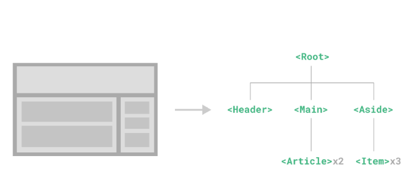  

<hr>  

> Django에서의 예시  

우리는 base.html과 index.html을 분리하여 작성하였지만, 하나의 화면으로 볼 수 있다.  
- 즉, 한 화면은 여러 개의 컴포넌트로 이루어질 수 있다.  

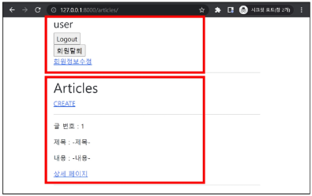  

<br>  

base.html을 변경하면 이를 extends하는 모든 화면에 영향을 미침  

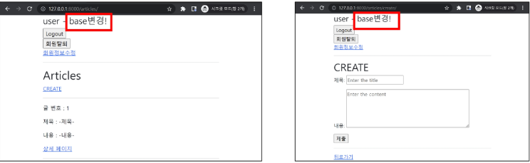  

<br>  

index.html에서 for 문을 통해 여러 게시글들을 하나의 형식으로 맞추어서 출력해줌  
- 형식을 재사용하고 있었음  

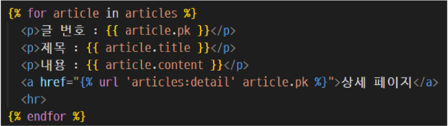  

-> 우리는 너무 자연스럽게 컴포넌트 기반으로 개발을 진행하고 있었다!  

<hr>  

> Component based architecture 특징  

관리가 용이  
- 유지/보수 비용 감소  

재사용성  

확장 가능성  

캡슐화  

독립적  

<hr>  

### SFC  

> component in Vue  

그렇다면 Vue에서 말하는 component란 무엇일까?  
- 이름이 있는 재사용 가능한 Vue instance  

그렇다면 Vue instance란?  
- 앞서 수업에서 사용한 `new Vue()`로 만든 인스턴스  

<hr>  

> SFC (Sing File Componet)  

하나의 <mark>.vue</mark> 파일이 하나의 <mark>Vue instance</mark>이고, 하나의 <mark>컴포넌트</mark>이다.  
- 즉, Single File Component  

Vue instance에서는 HTML, CSS, JavaScript 코드를 한 번에 관리  
- 이 Vue instance를 기능 단위로 작성하는 것이 핵심!  

컴포넌트 기반 개발의 핵심 기능  

<hr>  

> 정리  

HTML, CSS 그리고 JavaScript를 .vue라는 확장자를 가진 파일 안에서 관리하며 개발  

이 파일을 Vue instance, 또는 Vue component라고 하며, 기능 단위로 작성  

Vue CLI가 Vue를 Component based하게 사용하도록 도와줌  

<hr>  

# Vue component  

> Vue component 구조  

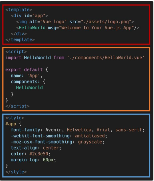

템플릿 (HTML)  
- HTML의 body 부분  
- 눈의 보여지는 요소 작성  
- 다른 컴포넌트를 HTML 요소처럼 추가 가능  

<br>  

스크립트(JavaScript)  
- JavaScript 코드가 작성되는 곳  
- 컴포넌트 정보, 데이터, 메서드 등 vue 인스턴스를 구성하는 대부분이 작성 됨  

<br>  

스타일(CSS)  
- CSS가 작성되며 컴포넌트의 스타일을 담당  

<hr>  

> Vue component 구조 정리  

컴포넌트들이 tree 구조를 이루어 하나의 페이지를 만듦  

root에 해당하는 최상단의 component가 <mark>App.vue</mark>  

이 App.vue를 index.html과 연결  

결국 index.html 파일 하나만을 rendering  
- 이게 바로 SPA  

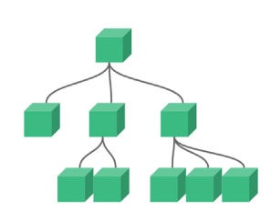  

<hr>  

### Vue component 실습  

> 현재 구조  

Vue CLI를 실행하면 이미 HelloWorld.vue 라는 컴포넌트가 생성되어 있고 App.vue에 등록되어 사용되고 있음  
- `npm run serve` 명령어를 진행했을 때 나온 화면의 대부분이 HelloWorld.vue  

<br>  

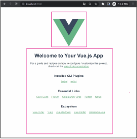  

```vue
//App.vue  

<template>
  <div id="app">
    
    <HelloWorld msg="Welcome to Your Vue.js App"/>
  </div>
</template>
```

<hr>  

> MyComponent.vue  

1. src/components/ 안에 생성  
2. script에 이름 등록  
3. template에 요소 추가  

<font color="red">
주의) template 안엔는 반드시 하나의 요소만 추가 가능  <br>

- 비어  있어도 안됨  
- 해당 요소 안에 추가 요소를 작성해야 함  
</font>

```vue
// MyComponent.vue  

<template>
  <div>
    <h1>This is my component</h1>
  </div>
</template>

<script>
export default {
  name: 'MyComponent'
}
</script>

<style>

</style>
```

<hr>  

> component 등록 3단계  

1. 불러오기  
2. 등록하기  
3. 보여주기  

```vue  
// App.vue

<template>
  <div id="app">
    
    <!-- 3. 사용한다. -->
    <MyComponent />
    <MyComponent />
    <MyComponent />
    <HelloWorld msg="Welcome to Your Vue.js App"/>
  </div>
</template>

<script>
import HelloWorld from './components/HelloWorld.vue'
import MyComponent from './components/MyComponent.vue' // 1. 불러온다.
// import MyComponent from '@/components/MyComponent.vue' // 1. 불러온다.
// @: src를 의미한다.


export default {
  name: 'App',
  components: {
    HelloWorld,
    MyComponent // 2. 등록한다.
  }
}
</script>

<style>
#app {
  font-family: Avenir, Helvetica, Arial, sans-serif;
  -webkit-font-smoothing: antialiased;
  -moz-osx-font-smoothing: grayscale;
  text-align: center;
  color: #2c3e50;
  margin-top: 60px;
}
</style>
```

<hr>

> component 등록-불러오기  

`import {instance name} from {위치}`  

instance name은 instance 생성 시 작성한 name  

`@`는 src의 sortcut  

`vue`는 생략 가능  

<hr>

> component 등록 - 등록하기  

```vue
// App.vue


<script>
import HelloWorld from './components/HelloWorld.vue'
import MyComponent from './components/MyComponent.vue'

export default {
  name: 'App',
  components: {
    HelloWorld,
    MyComponent
  }
}
</script>
```

<hr>

> component 등록 - 보여주기  

닫는 태그만 있는 요소처럼 사용  

```vue  
// App.vue

<template>
  <div id="app">
    
    <!-- 3. 사용한다. -->
    <MyComponent />
    <MyComponent />
    <MyComponent />
    <HelloWorld msg="Welcome to Your Vue.js App"/>
  </div>
</template>
```

<hr>  

> 자식 컴포넌트 작성  

이제 Mycomponent의 자식 컴포넌트를 만들어보자  

자식 관계를 표현하기 위해 기존 MyComponent에 간단한 border를 추가  

```vue
// MyComponent.vue

<template>
  <div class="border">
    <h1>This is MyComponent</h1>
  </div>
</template>


<style>
  .border {
    border: solid;
  }
</style>
```

<br>  

src/component 안에 MyChild.vue 생성  

```vue
// MyChild.vue

<template>
  <div>
    <h3>This is child components</h3>
    <h3>동작그만 밑장빼기냐?</h3>
    <a href="">건드리는 즉시 손모가지 날아가불 건께!</a>
  </div>
</template>

<script>
export default {
  name: 'MyChild'
}
</script>

<style>
</style>
```

<br>  

MyComponent에 MyChild 등록  

component의 재사용성

```vue
//MyComponent.vue  

<template>
  <div class="border">
    <h1>This is MyComponent</h1>
    // component의 재사용성
    <MyChild />
    <MyChild />
    <MyChild />
    <MyChild />
  </div>
</template>

<script>
import MyChild from '@/components/MyChild.vue'

export default {
  name: 'MyComponent',
  components: {
    MyChild,
  }
}
</script>
```