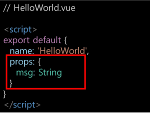

# Vue 4일차  

### Vue Data Management  

### Data in components  

> Data in components  

우리는 정적 웹페이지가 아닌, 동적 웹페이지를 만들고 있음  
- 즉 웹페이지에서 다뤄야 할 데이터가 등장  
- User data, 게시글 data, 등 ...

한 페이지 내에서 같은 데이터를 공유해야 함  
- 하지만 페이지들을 components로 구분이 되어있음  

MyComponent에 정의된 data를 MyChild에서 사용하려면 어떻게 해야 할까?  

  

<br>  

MyChild에도 똑같은 data를 정의  
- MyComponent의 data와 MyChild의 데이터가 동일한 data가 맞는가?  
- MyComponenet의 data가 변경된다면 MyChild도 같이 변경이 될까?  
- 아니다. 각 Component는 독립적이므로 서로 다른 data를 갖게 될 것이다.  
- 그렇다면 완전히 동일한 data를 서로 다른 Component에서 보여주려면 어떻게 해야 할까?  

<br>  

필요한 컴포넌트끼리 데이터를 주고 받으면 될까?  
- 데이터의 흐름을 파악하기 어려움  
- 개발 속도의 저하  
- 유지보수 난이도 증가  

  

<br>  

컴포넌트는 부모-자식 관계를 가지고 있으믈, 부모-자식 관계만 데이터를 주고 받게 하자!  
- 데이터의 흐름을 파악하기 용이  
- 유지보수하기 쉬워짐  

  

<br>  

> pass props & emit event  

부모 => 자식으로의 데이터 흐름  
- pass <font color="red">props</font>의 방식  

자식 => 부모로의 데이터의 흐름  
- <font color="red">emit</font> event의 방식  

<hr>  

> Pass Props  

요소의 속성(property)을 사용하여 데이터 전달  

props는 부모(상위) 컴포넌트 정보를 전달하기 위한 사용자 지정 특성  

자식(하위) 컴포넌트는 props 옵션을 사용하여 수신하는 props를 명시적으로 선언해야 함  

<hr>  

> props in HelloWorld  

사실, 우리의 Vue app은 이미 propsㄹ를 사용하고 있었다!  

Vue CLI를 설치할 때 만들어주었던 App.vue의 HelloWorld 컴포넌트를 살펴보면 msg라는 property가 작성되어 있음  

```vue

//App.vue  

<template>
  <div id="app">
    
    <MyComponent />
    <HelloWorld msg="Welcome to Your Vue.js App"/> // msg <- 요거
  </div>
</template>
```

<hr>

> props in HelloWorld 정리  

App.vue의 `<HelloWorld/>` 요소에 `msg='"Welcome to Your Vue.js App"`라는 property를 설정하였고, 하위 컴포넌트인 HelloWorld는 자신에게 부여된 msg property를 template에서 `{{ msg }}`의 형태로 사용하는 것  

<hr>  

> props in HelloWorld 실습  

msg property의 value를 바꾸면 화면에 보이는 문장이 달라짐  

```Vue
<template>
  <div id="app">
    
    <MyComponent />
    <HelloWorld msg="반갑다. 나는 Vue다. 이제 나를 섬겨라"/>
  </div>
</template>
```

  

<hr>  

> Pass Props  

이렇게 부모 => 자식으로 data 전달 방식을 pass props라고 함  

정적인 데이터를 전달하는 경우 static props라고 명시하기도 함  

요소에 속성을 작성하듯이 사용 가능하여,  `prop-data-name="value"`의 형태로 전달  
- 이 때 속성의 키 값은 kebab-case를 사용함  

<br>  

Props 명시  
데이터를 받는 쪽, 즉 하위 컴포넌트에서도 props에 대해 명시적으로 작성 해주어야 함  

전달받은 props를 type과 함께 명시  

컴포넌트를 문서화할 뿐만 아니라, 잘못된 타입이 전달하는 경우 브라우저의 자바스크립트 콘솔에서 사용자에게 경고  



<a href="https://v2.vuejs.org/v2/guide/components-props.html#Prop-Validation">https://v2.vuejs.org/v2/guide/components-props.html#Prop-Validation</a>  

<br>  

> MyComponent to MyChild

```vue
// MyComponent.vue  

<template>
  <div class="border">
    <h1>This is MyComponent</h1>
    <MyChild static-props="component에서 child로"/>
  </div>
</template>
```

```vue
//MyChlid.vue

<template>
  <div>
    <h3>This is child component</h3>
    <p>{{ staticProps }}</p>
  </div>
</template>

<script>
export default {
  name: 'MyChild',
  props: {
    staticProps: String,
  }
}
</script>
```

<br>  

  

<hr>  

> Pass Props convention  

부모에게 넘겨주는 props  
- <mark>kebab-case</mark> (HTML 속성명은 대소문자를 구분하지 않기 때문)  

자식에게서 받는 props  
- <mark>camelCase</mark>  

부모 템플릿(html)에서 kebab-case로 넘긴 변수를 자식 스크립트(vue)에서 자동으로 camelCase로 변환하여 인식함  

kebab-case: '-'로 연결한 스트링  
camelCase: 맨 첫 글자를 제외한 각 합성어의 첫 글자만 대문자로 표기한 스트링  

<hr>  

> Dynamic props  

변수를 props로 전달할 수 있음  

v-bind directive를 사용해 데이터를 동적으로 바인딩  

부모 컴포넌트를 데이터가 업데이트 되면 자식 컴포넌트로 전달되는 데이터 또한 업데이트 됨  

<hr>  

> Dynamic props 실습  

```vue
// MyCompoent.vue  

<template>
  <div class="border">
    <h1>This is MyComponent</h1>
    <MyChild static-props="component에서 child로"
    :dynamic-props="dynamicProps"/>
  </div>
</template>

<script>
import MyChild from '@/components/MyChild'

export default {
  name: 'MyComponent',
  components: {
    MyChild,
  },
  data() {
    return {
      dynamicProps: "It's in data"
    }
  }
}
```

```vue
// MyChild.vue

<template>
  <div>
    <h3>This is child component</h3>
    <p>{{ staticProps }}</p>
    <p>{{ dynamicProps }}</p>
  </div>
</template>

<script>
export default {
  name: 'MyChild',
  props: {
    staticProps: String,
    dynamicProps: String,
  }
}
</script>
```

<hr>  

> 컴포넌트의 data 함수  

각 vue 인스턴스는 같은 data 객체를 공유하므로 새로운 data 객체를 반환(return)하여 사용해야 함  

```vue
<script>
  data: function(){
    return {
        // component's data in here
    }
}
</script>
```

<a href="https://v2.vuejs.org/v2/guide/components.html#data-Must-Be-a-Function">https://v2.vuejs.org/v2/guide/components.html#data-Must-Be-a-Function</a>  

<br>  

:<font color="red">dynamic-props</font>="<font color="blue">dynamicProps</font>"는 앞 key값(<font color="red">dynamic-props</font>)이란 이름으로 뒤의 " "안에 오는 데이터(<font color="cyan">dynamicProps</font>)를 전달하겠다는 뜻  

즉 `:my-props="dynamicProps"`로 데이터를 넘긴다면, 자식 컴포넌트에서 `myProps`로 데이터를 받아야 함  

<br>

```vue
//MyComponet.vue  

<template>
  <div class="border">
    <h1>This is MyComponent</h1>
    <MyChild static-props="component에서 child로"
    :my-props="dynamicProps"/>
  </div>
</template>
```

```vue
// MyChild.vue

<template>
  <div>
    <h3>This is child component</h3>
    <p>{{ staticProps }}</p>
    <p>{{ myProps }}</p>
  </div>
</template>

<script>
export default {
  name: 'MyChild',
  props: {
    staticProps: String,
    myProps: String,
  }
}
</script>
```

<br>

v-bind로 묶여있는 " "안의 구문은 javascript의 구문으로 볼 수 있음  
- 따라서 <font color="red">dynamicProps</font>라고 하는 변수에 대한 data를 전달할 수 있는 것  

그렇다면, 숫자를 props로 전달하기 위해서 다음 두 방법 중 어떤 게 맞을까?  

```vue
// 1
<template>
  <SomeComponent num-props="1"/>
</template>

// 2
<template>
  <SomeComponent :num-props="1"/> // 숫자로 전달
  <SomeComponent :num-props="'1'"/> // 문자열로 전달
</template>
```

<br>  

첫 번째 방식은 sttic props로 String으로써 "1"을 전달  

두 번째 방식은 dynamic props로 숫자로써의 1을 전달  

<hr>  

> <mark>단방향 데이터 흐름</mark>  

모든 props는 부모에서 자식으로 즉 아래로 단방향 바인딩을 형성  

부모 속성이 업데이트되면 자식으로 흐르지만 반대 방향은 아님  
- 부모 컴포넌트가 업데이트 될 때마다 자식 컴포넌트의 모든 prop들이 최신 값으로 새로고침됨  

목적  
- 하위 컴포넌트가 실수로 상위 컵포넌트 상태를 변경하여 앱 데이터 흐름을 이해하기 힘들게 만드는 것을 방지  

하위 컴포넌트에서 props를 변경하려고 시도해서는 안되며 그렇게 하면 Vue는 콘솔에서 경고를 출력함  

<hr>  

### Emit Event  

> Emit Event  

부모 컴포넌트에서 자식 컴포넌트로 데이터를 전달할 때는 <mark>이벤트를 발생시킴</mark>  

이벤트를 발생시키는 게 어떻게 데이터를 전달하는 것이냐?  

1. 데이터를 이벤트 리스터의 <b>콜백함수의 인자로 전달</b>  
2. 상위 컴포넌트는 해당 <b>이벤트를 통해 데이터를 받음</b>  

<hr>  

> $emit  

`$emit` 메서드를 통해 부모 컴포넌트에 이벤트를 발생시킴  
- `$emit('event-name')` 형식으로 사용하며 부모 컴포넌트에 `event`이라는 이벤트가 발생했다는 것을 알림  

마치 사용자가 <font color="cyan">마우스 클릭</font>을 하면 <font color="cyan">click</font> 이벤트가 발생하는 것처럼 `emit('event-name')`가 실행되면 `event-name` 이벤트가 발생하는 것  

[참고] `$`  
- JavaScript는 변수에 _, $ 두 개의 특수문자를 사용 가능  
- 이 때, 기존에 사용하던 변수, 메서드들과 겹치지 않게 하기 위해서 vue는 $emit를 이벤트 전달을 위한 방식으로 채택함  

<hr>  

> Emit Event  

1. 자식 컴포넌트에 버튼을 만들고 이벤트를 추가

2. $emit을 통해 부모 컴포넌트에게 child-to-parent 이벤트를 트리거

```vue
// MyChild.vue

<template>
  <div>
    <h3>This is child component</h3>
    <p>{{ staticProps }}</p>
    <p>{{ myProps }}</p>
    <button @click="ChildToParent">클릭!</button>
  </div>
</template>

<script>
export default {
  name: 'MyChild',
  props: {
    staticProps: String,
    myProps: String,
  },
  methods: {
    ChildToParent() {
      this.$emit('child-to-parent')
    }
  }
}
</script>
```

<hr>  

emit된 이벤트를 상위 컴포넌트에서 청취 후 핸드럴 함수 실행  

```vue
// MyComponent.vue


<template>
  <div class="border">
    <h1>This is MyComponent</h1>
    <MyChild static-props="component에서 child로"
    :dynamic-props="dynamicProps"
    @child-to-parent="parentGetEvent" // 이 부분!
    />
    <!-- <MyChild static-props="1"
    :my-props="'1'"/> -->
  </div>
</template>

<script>
import MyChild from '@/components/MyChild'

export default {
  name: 'MyComponent',
  components: {
    MyChild,
  },
  data() {
    return {
      dynamicProps: "It's ..."
    }
  },
  methods: {
    parentGetEvent(){
      console.log("자식 컴포넌트에서 발생한 이벤트!")
    }
  }
}
</script>
```

<hr>  

> Emit Event 흐름 정리  

1. 자식 컴포넌트에 있는 버튼 클릭 이벤트를 청취하여 연결된 핸들러 함수(ChildToParent) 호출  
2. 호출된 함수에서 `$emit`을 통해 상위 컴포넌트에 이벤트(<font color="cyan">child-to-parent</font>) 발생  
3. 상위 컴포넌트는 자식 컴포넌트가 발생시킨 이벤트(<font color="cyan">child-to-parent</font>)를 청취하여 연결된 핸들러 함수 (<font color="red">parentGetEvent</font>) 호출  

<hr>  

> emit with data  

이벤트를 발생(emit) 시킬 때 인자로 데이터를 전달 가능  

```vue
// MyChild.vue  

<template>
  <div>
    <h3>This is child component</h3>
    <p>{{ staticProps }}</p>
    <p>{{ myProps }}</p>
    <button @click="ChildToParent">클릭!</button>
    <input type="text" v-model="ChildInputData" @keyup.enter="ChildInput">
  </div>
</template>

<script>
export default {
  name: 'MyChild',
  data() {
    return {
      ChildInputData: null
    }
  },
  props: {
    staticProps: String,
    myProps: String,
  },
  methods: {
    ChildToParent() {
      this.$emit('child-to-parent')
    },
    ChildInput() {
      this.$emit('child-input', this.ChildInputData)
      this.ChildInputData = ""
    }
  }
}
</script>
```

<br>

이렇게 전달한 데이터는 이벤트와 연결된 부모 컴포넌트의 핸들러 함수의 인자로 사용 가능  

```vue
// MyComponent.vue

<template>
  <div class="border">
    <h1>This is MyComponent</h1>
    <MyChild static-props="component에서 child로"
    :dynamic-props="dynamicProps"
    @child-to-parent="parentGetEvent"
    @child-input="getDynamicData"
    />
    <!-- <MyChild static-props="1"
    :my-props="'1'"/> -->
  </div>
</template>

<script>
import MyChild from '@/components/MyChild'

export default {
  name: 'MyComponent',
  components: {
    MyChild,
  },
  data() {
    return {
      dynamicProps: "It's ..."
    }
  },
  methods: {
    parentGetEvent(){
      console.log("자식 컴포넌트에서 발생한 이벤트!")
    },
    getDynamicData(inputData) {
      console.log(`child component로 부터 ${inputData}를 받음!`)
    }
  }
}
</script>

<style>
  .border {
    border: solid;
  }
</style>
```

<hr>  

> emit with data 흐름 정리  

1. 자식 컴포넌트에 있는 버튼 클릭 이벤트를 청취하여 연결된 핸들러 함수 (<font color="red">ChildToParent</font>) 호출  

2. 호출된 함수에서 `$emit`을 통해 부모 컴포넌트에 이벤트(<font color="cyan">child-to-parent</font>)를 발생  

3. 부모 컴포넌트는 자식 컴포넌트의 이벤트 (<font color="cyan">child-to-parent</font>)를 청취하여 연결된 핸들러 함수(<font color="red">parentGetEvent</font>) 호출, 함수의 인자로 전달된 (<font color="green">child data</font>)가 포함되어 있음  

4. 호출된 함수에서 `console.log(`~child data~`)`가 실행됨

<hr>  

> emit with dynamic data 흐름 정리  

1. 자식 컴포넌트에 있는 keyup.enter 이벤트를 청취하여 연결된 핸들러함수 (<font color="red">ChildInput</font>) 호출  
2. 호출된 함수에서 $emit을 통해 부모 컴포넌트에 이벤트(<font color="cyan">child-input</font>)를 발생  
이벤트에 v-model로 바인딩 된 <font color="green">입력받은 데이터</font>를 전달  
3. 상위 컴포넌트는 자식 컴포넌트의 이벤트(child-input)를 청취하여 연결된 핸들러 함수(<font color="red">getDynamicData</font>) 호출, 함수의 인자로 전달된 데이터가 포함되어 있음  
4. 호출된 함수에서 `console.log(`~입력받은 데이터~`)` 실행

<hr>  

> 정리 

자식 컴포넌트에서 부모 컴포넌트로 이벤트를 발생시킴  
- 이벤트에 데이터를 담아 전달 가능  

부모 컴포넌트에서 자식 컴포넌트의 이벤트를 청취  
- 전닯다은 데이터는 이벤트 핸들러 함수의 인자로 사용  

<hr>  

> pass props / emit event 컨벤션  

아니 그래서 언제는 kebab-case이고 언제는 camelCase야?  
- HTML 요소에서 사용할 때는 kebab-case
- JavaScript 요소에서 사용할 때는 camelCase  

props
- 상위 => 하위 흐름에서 HTML 요소를 내려줌: kebab-case  
- 하위에서 받을 때 JavaScript에서 받음: camelCase  

emit  
- emit 이벤트를 발생시키면 HTML 요소가 이벤트를 청취함: kebab-case  
- 메서드, 변수명은 등은 JavaScript에서 사용함: camelCase  

<hr>  

### Lifecycle Hooks  

> Lifecycle Hooks  

각 Vue 인스턴스는 생성과 소멸의 과정 중 단계별 초기화 과정을 거침  
- Vue 인스턴스가 생성된 경우, 인스턴스를 DOM에 마운트하는 경우, 데이터가 변경되어 DOM를 업데이트하는 경우 등  

각 단계가 트리거가 되어 특정 로직을 실행할 수 있음  

이를 Lifecycle Hooks이라고 함  

[참고] 탄생 => mount => update => destroy

  

<hr>  

> Lifecycle Hooks 맛보기  

제공된 스켈레톤 코드를 기반으로 진행  

<hr>

> created

Vue instance가 생성된 후 호출됨  

data, computed 등의 설정이 완료된 상태  

서버에서 받은 데이터를 vue instance의 data에 할당하는 로직을 구현하기 적합  

단, mount되지 않아 (HTML)요소에 접근할 수 없음  

<br>  

JavaScript에서 학습한 Dog API 활용 실습의 경우  
- 버튼을 누르면 강아지 사진을 보여줌  

버튼을 누르지 않아도 첫 실행 시 기본 사진이 출력되도록 하고 싶다면?  
- create 함수에 강아지 사진을 가져오는 함수를 추가  

```vue
// components/DogComponent.vue

<script>
export default {
  ...
  created() {
    this.getDogImage()
  }
}
</script>
```

<hr>  

> mounted  

Vue instance 요소에 mount된 후 호출됨  

mount된 요소를 조작할 수 있음  

```vue
// components/DogComponent.vue  

<script>
  export default {
    ...
    mounted() {
      const button = document.querySelector("button")
      button.innerText = "멍멍!"
    }
  }
</script>
```

<br>  

create의 경우, mount되기 전이기 때문에 DOM에 접근할 수 없으므로 동작하지 않음  

mounted는 주석 처리  

```vue
// components/DogComponent.vue  

<script>
  export default {
    ...
    created() {
      this.getDogImage()
      const button = document.querySelector('button')
      button.innerText = '멍멍' // 바뀌지 않음, 콘솔에서 에러 출력
    }
  }
</script>
```

<hr>  

> updated  

데이터가 변경되어 DOM에 변화를 줄 때 호출  

```vue
// components/DogComponent.vue  

<script>
  export default {
    ...
    updated() {
      console.log('새로운 멍멍이!')
    }
  }
</script>
```

<hr>  

> Lifecycle Hooks 특징  

instance마다 각각 Lifecycle을 가지고 있음  

```vue
// App.vue  

<script>
  ...
  create() {
    console.log('App created!')
  },
  mounted() {
    console.log('App mounted!')
  }
</script>
```

```vue
// DogComponent.vue

<script>
  ...,
  created() {
    this.getDogImage()
    console.log('Dog created!')
  },
  mounted() {
    console.log('Dog mounted!')
    const button = document.querySelector('button')
    button.innerText = '멍멍!'
    console.log('Child mounted!')
  },
  updated() {
    console.log('새로운 멍멍이!')
    console.log('Dog updated!')
  }
</script>
```

<br>  

Lifecycle Hooks는 컴포넌트별로 정의할 수 있음  

현재 해당 프로젝트는  

App.vue 생성 => ChildComponent 생성 => ChildComponent 부착  
=> App.vue 부착 => ChildComponent 업데이트 순으로 동작한 것  

<br>  

부모 컴포넌트의 mounted hook이 실행되었다고 해서 자식이 mount된 것이 아니고,  
부모 컴포넌트가 updated hook이 실행되었다고 해서 자식이 updated 된 것은 아님  
- 부착 여부가 부모-자식 관계에 따라 순서를 가지고 있지 않은 것  

<mark>instance마다 각각의 Lifecycle를 가지고 있기 때문</mark>