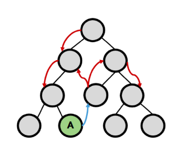
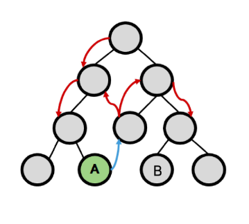
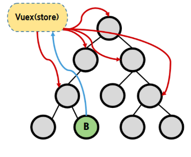
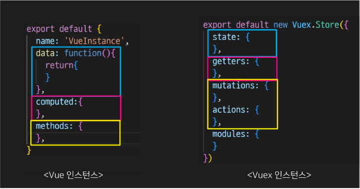
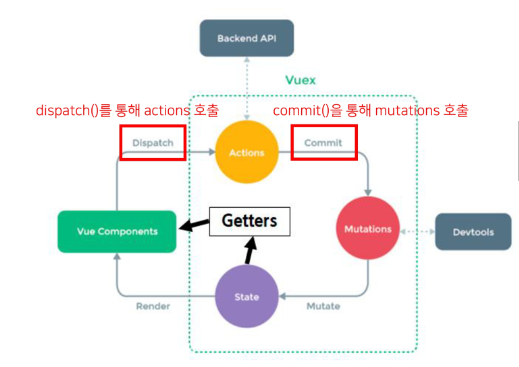
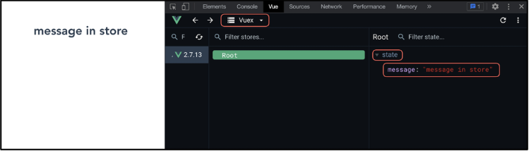

# Vue 5일차

### Vue State Management  

> 개요  

상태 관리 (state Management)가 무엇인지 이해하기  

Vuex가 무엇인지, 왜 필요한지 이해하기  

Vuex 기본 문법 알아보기  

<hr>  

### State Management  

> 상태 관리  

상태(State)란?  
- <mark>현재에 대한 정보(data)</mark>  

나의 상태가 어때? 라는 질문에 어떻게 대답할 수 있을까?  
- 나는 지금 집에 가고 싶어  

<br>  

그럼 Web Application에서의 상태는 어떻게 표현할 수 있을까?  

<mark>현재 App이 가지고 있는 Data로 표현</mark>할 수 있음  

<br>  

우리는 여러 개의 component를 조합해서 하나의 App을 만들고 있음  

각 component는 독립적이기 때문에 각각의 상태(data)를 가짐  

하지만 결국 이러한 component들이 모여서 하나의 App을 구성할 예정  
즉, <mark>여러 개의 component가 같은 상태(data)를 유지할 필요가 있음</mark>  
-> 상태 관리(State Management) 필요!  

<hr>  

> Pass Props & Emit Event  

지금까지 우리는 props와 event를 이용해서 상태 관리를 하고 있음  

각 컴포넌트는 독립적으로 데이터를 관리  

<mark>같은 데이터를 공유하고 있으므로</mark>, 각 컴포넌트가 동일한 상태를 유지하고 있음  

데이터의 흐름을 직관적으로 파악 가능  

  

<br>  

그러나 component의 중첩이 깊어지면 데이터 전달이 쉽지 않음  

공통의 상태를 유지해야 하는 component가 많아지면 데이터 전달 구조가 복잡해짐  

만약 A에서 B로 데이터를 전달해야 한다면? -> 어떻게 하면 쉽게 해결할 수 있을까?  

  

<hr>  

> Centralize Store  

<mark>중앙 저장소(store)에 데이터를 모아서 상태 관리</mark>  

각 component는 중앙 저장소의 데이터를 사용  

component의 계층에 상관없이 중앙 저장소에 접근해서 데이터를 얻거나 변경할 수 있음  

중앙 저장소의 데이터가 변경되면 각각 component는 해당 데이터의 변황 ㅔ반응하여 새로 변경된 데이터를 반영함  

규모가 크거나 컴포넌트 중첩이 깊은 프로젝트의 관리가 매우 편리  

  

<hr>  

> Vuex  

"state management pattern + Library" for vue.js  
(상태 관리 패턴 + 라이브러리)  

중앙 저장소를 통해 상태 관리를 할 수 있도록 하는 라이브러리  

데이터가 예측 가능한 방식으로만 변경될 수 있도록 하는  
<mark>규칙을 설정하며, Vue의 반응성을 효율적으로 사용하는 상태관리 기능</mark>을 제공  

Vue의 공식 도구로써 다양한 기능을 제공  

<hr>  

### Vuex 시작하기  

> 프로젝트 with vuex  

```bash
$ vue create vuex-app // vue 프로젝트 생성  

$ cd vuex-app // 디렉토리 이동  

$ vue add vuex // vue CLI를 통해 vuex plugin 적용  
```

<br>  

`src / store / index.js`가 생성됨  

vuex의 핵심 컨셉 4가지  
1. state
2. getters
3. mutations  
4. actions  

```js
// index.js  

import Vue from 'vue'
import Vuex from 'vuex'

Vue.use(Vuex)

export default new Vuex.Store({
  state: {
  },
  getters: {
  },
  mutations: {
  },
  actions: {
  },
  modules: {
  }
})
```

<hr>  

> Vue와 Vuex 인스턴스 비교  

  

<hr>  

> 1. State  

vue 인스턴스의 data에 해당  

<mark>중앙에서 관리하는 모든 상태 정보</mark>  

개별 component는 state에서 데이터를 가져와서 사용  
- 개별 component가 관리하는 data를 중앙 저장소(Vuex Store의 state)에서 관리하게 됨  
- 개별 component 간의 통신을 금지하는 것은 아님  

state의 데이터가 변화하면 해당 데이터를 사용(공유)하는 component도 자동으로 다시 렌더링  

`$store.state`로 state 데이터에 접근  

<hr>  

> 2. Mutations  

<mark>실제로 state를 변경하는 유일한 방법</mark>  

vue 인스턴스의 methods에 해당하지만 Mutations에서 호출되는 핸들러(handler) 함수는 반드시 <mark>동기적</mark>으로 함  
- 비동기 로직으로 mutation를 사용해서 state를 변경하는 경우, state의 변화의 시기를 특정할 수 없기 때문  

첫 번째 인자로 `state`를 받으며, component 혹은 Actions에서 `commit()`메서드로 호출됨  

<font color="red">mutation, action에서 호출되는 함수를 handler 함수라고 함</font>  

<hr>  

> Actions  

mutations와 비슷하지만 <mark>비동기</mark> 작업을 포함할 수 있다는 차이가 있음  

<mark>state를 직접 변경하지 않고 `commit()`메서드로 mutations를 호출해서 state를 변경함</mark>  

`context` 객체를 인자로 받으며, 이 객체를 통해 store.js의 모든 요소와 메서드에 접근할 수 있음  
(== 즉, state를 직접 변경할 수 있지만 하지 않아야 함)  

component에서 `dispatch()` 메서드에 의해 호출됨  

<hr>  

> Mutations & actions  

vue component의 methods 역할이 vuex에서는 아래와 같이 분화됨  
(이 부분 다시 듣기 수업시간 30분 정도 쯤)

Mutations  
- state를 변경  

Actions  
- state 변경을 제외한 나머지 로직  

  

<hr>  

> 4. Getters  

vue 인스턴스의 computed에 해당  

<mark>state를 활용하여 계산된 값을 얻고자 할 때 사용</mark>  
state의 원본 데이터를 건드리지 않고 계산된 값을 얻을 수 있음  

computed와 마찬가지고 getters의 결과는 캐시(cache) 되며, 종속된 값이 변경된 경우에만 재계산됨  

getters에서 계산된 값은 state에 영향을 미치지 않음  

첫 번째 인자로 `state`, 두 번째 인자로 `getter`를 받음  

<hr>  

> 그럼 이제 모든 데이터를 Vuex에서 관리해야 하는가?  

Vuex를 사용한다고 해서 모든 데이터를 state에 넣어야 하는 것은 아님  

Vuex에서도 여전히 pass pros, emit event를 사용하여 상태를 관리할 수 있음  

개발 환경에 따라 적절하게 사용하는 것이 필요함  

<hr>  

> 정리  

`state`  
- 중앙에서 관리하는 <mark>모든 상태 정보</mark>  

`mutations`  
- <mark>state를 변경</mark>하기 위한 methods  

`actions`  
- <mark>비동기 작업이 포함될 수 있는(외부 API와의 소통 등)</mark> methods
- state를 변경하는 것 외의 모든 로직 진행  

`getters`  
- state를 활용해 <mark>계산한 새로운 변수 값</mark>  

<br>  

component에서 데이터를 조작하기 위한 데이터의 흐름  
- component => (action) => mutations => state  

component에서 데이터를 사용하기 위한 데이터의 흐름  
- state => (getters) => component  

<hr>  

### Vuex 실습  

> 시작하기 전 - Object method shorthand  

이제부터는 객체 메서드 축양형을 사용할 것  

```js
// before  
const obj1 = {
  addValue: function(value) { 
      return value
  }
}

// after
const obj2 = {
  addValue(value) {
    return value
  }
}
```

<hr>  

> src / store / index.js  

Vuex의 핵심 컨셉 4가지  
- state
- getters
- mutations
- actions  

```js
// store/index.js  

import Vue from 'vue'
import Vuex from 'vuex'

Vue.use(Vuex)

export default new Vuex.Store({
  state: {
  },
  getters: {
  },
  mutations: {
  },
  actions: {
  },
  modules: {
  }
})
```

<hr>  

> state  

중앙에서 관리하는 모든 상태 정보  

<mark>$store.state</mark>로 접근 가능  

store의 state에 messsage 데이터 정의  

```js
// store/index.js

import Vue from 'vue'
import Vuex from 'vuex'

Vue.use(Vuex)

export default new Vuex.Store({
  state: {
    message: 'message in store'
  },
  getters: {
  },
  mutations: {
  },
  actions: {
  },
  modules: {
  }
})
```
<br>

component에서 state 사용 가능  

```vue
// App.vue  

<template>
  <div id="app">
    <h1>{{ $store.state.message }}</h1>
  </div>
</template>
```

<br>

`$store.state`로 바로 접근하기보다 <mark>computed</mark>에 정의 후 접근하는 것을 권장

```vue
// App.vue

<template>
  <div id="app">
    <h1>{{ message }}</h1>
  </div>
</template>

<script>

export default {
  name: 'App',
  components: {
  },
  computed: {
    message() {
      return this.$store.state.message
    }
  }
}
</script>
```

<br>  

Vue 개발자 도구에서의 Vuex  

관리 화면을 Vuex로 변경  

관리 되고 있는 state 확인 가능  

  

<hr>  

> actions  

state를 변경할 수 있는 <mark>mutations 호출</mark>  

component에서 <mark>dispatch()에 의해 호출됨</mark>  

`dispatch(A, B)`  
- A: 호출하고자 하는 action 함수  
- B: 넘겨주는 데이터(payload)  

<hr>  

action에 정의된 changeMessage 함수에 데이터 전달하기  

component에서 actions는 `dispatch()`에 의해 호출됨  

```vue
// App.vue  

<template>
  <div id="app">
    <h1>{{ message }}</h1>
    <input type="text" @keyup.enter="changeMessage" v-model="inputData">
  </div>
</template>

<script>

export default {
  name: 'App',
  data() {
    return {
      inputData: null
    }
  },
  methods: {
    changeMessage() {
      const newMessage = this.inputData
      this.$store.dispatch('changeMessage', newMessage)
      this.inputData = null
    }
  },
  components: {
  },
}
</script>
```

<hr>  

actions의 첫 번째 인자는 `context`  
- context는 store의 전반적인 속성을 모두 가지고 있으므로 context.state와 

context.getters를 통해 mutations를 호출하는 것이 모두 가능  
- `dispatch()`를 사용해 다른 action도 호출할 수 있음  
- <font color="red">단, action에서 state를 직접 조작하는 것은 삼가야 함</font>  

actions의 두 번째 인자는 `payload`  
- 넘겨준 데이터를 받아서 사용  

```js
// store/index.js
Vue.use(Vuex)

export default new Vuex.Store({
  ...
  actions: {
    changeMessage(context, message) {
      console.log(context)
      console.log(message)
    }
  },
  ...
})
```

<hr>  

> mutations  

"actions에서 `commit`을 통해 mutations 호출하기"  

mutations는 state를 변경하는 유일한 방법  

component 또는 actions에서 <mark>commit()에 의해 호출됨</mark>  

`commit(A, B)`  
- A: 호출하고자 하는 mutations 함수  
- B: payload  

```js
// store/index.js  

Vue.use(Vuex)

export default new Vuex.Store({
  ...
  actions: {
    changeMessage(context, message) {
      context.commit('CHANGE_MESSAGE', message)
    }
  }
  ...
})
```

<br>  

"mutations 함수 작성하기"  

mutation는 state를 변경하는 유일한 방법  

mutation 함수의   
- 첫 번째 인자는 state  
- 두 번째 인자는 payload  

```js
// store.index.js

Vue.use(Vuex)

export default new Vuex.Store({
  ...
  mutations: {
    CHANGE_MESSAGE(state, payload) {
      // console.log(state)
      // console.log(message)
      state.message = payload
      // console.log(state.message)
    }
  },
  ...
})
```

<hr>  

> getter  

"getter 사용해 보기"  

<mark>getters는 state를 활용한 새로운 변수</mark>  

getters 함수의  
- 첫 번째 인자는 state  
- 두 번째 인자는 getters  

```js
// store/index.js  

Vue.use(Vuex)

export default new Vuex.Store({
  ...
  getters: {
    messageLength(state) {
      return state.message.length
    },
    doubleLength(state, getters) {
      return getters.messageLength * 2
    }
  }
  ...
})
```

<br>  

"getters 출력하기"  

getters 역시 state와 마찬가지로 computed에 정의해서 사용하는 것을 권장  

```js
// App.vue  

...
<script>
  computed: {
    message() {
      return this.$store.state.message
    },
    messageLength() {
      return this.$store.getters.messageLength
    },
    doubleLength() {
      return this.$store.getters.doubleLength
    }
  }
</script>
```

<br>  

```vue
// App.vue

<template>
  <div id="app">
    <h1>{{ message }}</h1>
    <h1>{{ message }}의 길이는 {{ messageLength }}</h1>
    <h2>X2: {{ doubleLength }}</h2>
    <input type="text" @keyup.enter="changeMessage" v-model="inputData">
  </div>
</template>
```

<hr>  

### 마무리  

> 그냥 mutations으로만으로 state를 변경하면 안될까?  

"가능하다."  

단, 저장소의 각 컨셉(state, getters, mutations, actions)은 각자의 역할이 존재하도록 설계되었음  

물론 우리가 작성한 todo app처럼 actions의 로직이 특별한 작업없이 단순히 mutations만을   
호출하는 경우도 있으나 이 경우는 Vuex 도입의 적절성을 판단해 볼 필요가 있음

<hr>  

> Vuex, 그럼 언제 사용해야 할까?  

Vuex는 공유된 상태 관리를 처리하는데 유용하지만, 개념에 대한 이해와 시작하는 비용이 큼  

애플리케이션이 단순하다면 Vuex가 없는 것이 더 효율적일 수 있음  

그러나 중대형 규모의 SPA를 구축해야하는 경우 Vuex는 자연스럽게 선택할 수 있는 단계가 오게 됨  

결과적으로 역할에서 적절한 상황에서 활용했을 때 Vuex 라이브러리 효용을 극대화 할 수 있음  

즉, 필요한 순간이 왔을 때 사용하는 것을 권장  

<hr>

```vue
<!-- 중요할 거 같은 표현! -->
<template>
<input type="text" v-model.trim="todoTitle" @keyup.enter="createTodo">
</template>

<template>
<TodoListItem v-for="(todo, index) in todos" :key="index" :todoitem="todo"/>
</template>
```