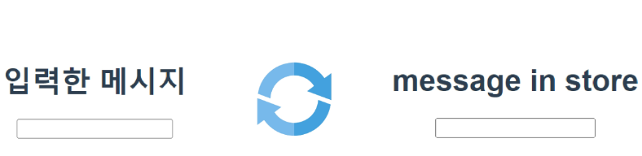
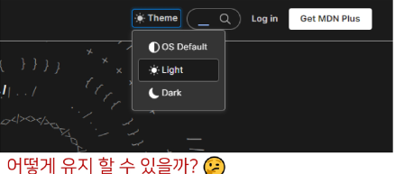
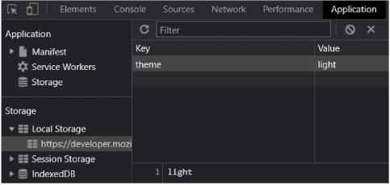
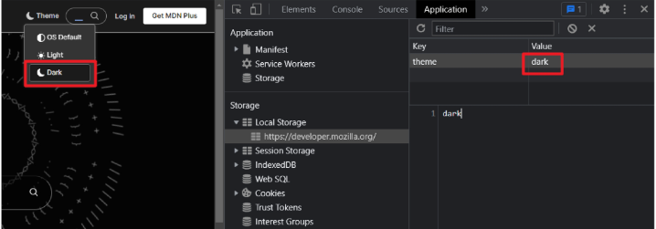
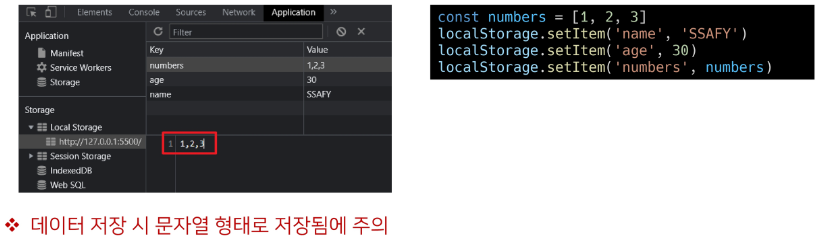
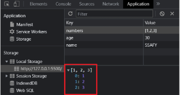
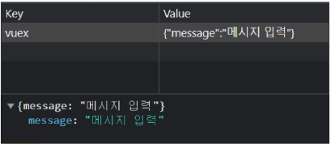
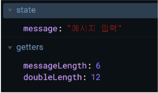
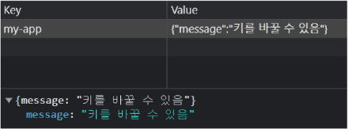

# Vue 6일차  

### Vuex Advanced  

> 개요  

Vuex로 관리중인 상태를 로컬에 저장하기  
- 관련 plugin 알아보기  

Vuex Helper method 알아보기  

<hr>  

### Local Storage  

> 상태 유지하기  

현재 앱을 재실행하거나, 새로고침하면 초기값으로 돌아감  

  

<hr>  

> 상태 유지하기  

MDN 메인 페이지에서 테마를 설정하고, 새로고침해도 테마는 유지되어 있음  

  

<br>  

개발자 도구 > Application > Local Storage에서 확인  

<mark>theme</mark> Key에 <mark>light</mark> Value가 저장되어 있음  

  

<br>  

<mark>theme</mark> Key에 <mark>dark</mark> Value 값으로 변경하고 새로고침을 한다면?  

  

<hr>  

> Window.<mark>localStorage</mark>  

브라우저의 내장 객체 중 하나  

Key-Value 형태로 데이터를 저장할 수 있는 저장소  

localStorage에 저장된 데이터는 브라우저를 종료해도 계속해서 유지됨  
- 다른 탭에서도 동일한 데이터를 공유할 수 있는 반면, 다른 도메인에서는 접근할 수 없음  

<font color="red">단, 보안과 관련된 중요한 정볼르 저장하기에는 적합하지 않음</font>  

<br>  

<mark>setItem(key, value)</mark> - key, value 형태로 데이터를 저장  

  

<br>  

<mark>getItem(key)</mark> - key 값으로 저장된 데이터 불러오기  

```js
const numbers = [1, 2, 3]
localStorage.setItem('name', 'SSAFY')  
localStorage.setItem('age', 30)
localStorage.setItem('numbers', numbers)

const name = localStorage.getItem('name')
const age = localStorage.getItem('age')
const nums = localStorage.getItem('numbers')

console.log(name)
console.log(age)
console.log(nums)

console.log(typeof age)
console.log(typeof nums)
```

<font color="red">데이터 저장 시 문자열로 저장하였으므로, 불러올 때도 문자열로 불러옴</font>

<hr>  

> JSON.<mark>stringify</mark>

JSON(JavaScript Object Notation) 객체의 메서드  

자바스크립트 객체를 <font color='red'>JSON 형식의 문자열</font>로 변환하여 반환  

```js
const numbers = [1, 2, 3]
const stringifyNumbers = JSON.stringify(numbers)

console.log(stringifyNumbers)
console.log(typeof stringifyNumbers)

localStorage.setItem('numbers', stringifyNumbers)
```

  

> JSON.<mark>parse</mark>  

<font color="red">JSON 형식의 문자열</font>을 자바스크립트 객체로 변환하여 반환  

```js
// parse 전 출력 결과  

const age = localStorage.getItem('age')
const numbers = localStorage.getItem('numbers')  

console.log(age) // 30
console.log(typeof age) // string

console.log(numbers) // [1, 2, 3]
console.log(typeof numbers) // string
```

```js
// parse 후 출력 결과  

const parsedAge = JSON.parse(age)
const parsedNumbers = JSON.parse(numbers)  

console.log(parsedAge) // 30
console.log(typeof parsedAge) // number

console.log(parsedNumbers) // [1, 2, 3]
console.log(typeof parsedNumbers) // object
```

<hr>  

> Vuex에 적용하기  

```vue
// App.vue

<template>
  <div id='app'>
    <h1>{{ message }}</h1>
    <input type="text"
    @keyup.enter="changeMessage"
    v-model="inputData">
  </div>
</template>

<script>
export default {
  ...
  create() {
    this.$store.dispatch('loadMessage')
  }
}
</script>
```

```js
// src/store/index.js

export default new Vuex.Store({
  ...
  mutation: {
    ...
    LOAD_MESSAGE(state) {
      const parseMessage = JSON.parse(localStorage.getItem('message'))
      state.message = parseMessage? parseMessage:null
    }  
  },
  actions: {
    changeMessage(context, message) {
        context.commit("CHANGE_MESSAGE", message)
        context.dispatch('messageSaveToLocalStorage')
    },
    messageSaveToLocalStorage(context) {
        const message = JSON.stringify(context.state.message)
        localStorage.setItem('message', message)
    },
    loadMessage(context) {
        context.commit('LOAD_MESSAGE')
    }
  },
})
```

<hr>  

### plugins

> plugins?  

Vuex store에 추가적인 기능을 제공하는 확장 기능  

일반적으로 state의 변화를 감지해, 어플리케이션의 성능을 최적화하는 목적을 가짐  

<hr>  

> vuex-persistedstate

Vuex store의 상태를 브라우저 local storage에 저장해주는 plugin  

페이지를 새로고침하거나 브라우절르 종료하였다가 다시 열었을 때, <mark>이전 상태를 유지</mark>할 수 있도록 해줌  

<br>  

설치  

`$ npm i vuex-persistedstate`  

적용
```js
// index.js

import createPersistedState from 'vuex-persistedstate'

Vue.use(Vuex)

export default new Vuex.Store({
    plugins: [
        createPersistedState(), // 대괄호인 것을 명심하자
    ]
})
```

<br>  

메시지, 입력 후 Local Storage 확인  



<mark>vuex</mark> key에 state의 message가 가진 값들이 value로 할당 됨  

<br>

브라우저를 종료 후, 다시 서버를 열었을 때도 vuex의 상태가 유지됨을 확인  

  

<hr>  

> [참고]  vuex-persiststate

추가 옵션을 사용하여 필요에 따라 저장 방식을 변경할 수 있음  

```js

const persistedState = createPersistedState({
  // key를 변경  
  key: 'my-app',
  // 저장 위치를 변경
  storage: window.localStorage,
  // 상태 중 일부만 저장  
  reducer: state => ({
    message = state.message
  })
})

export default new Vuex.Store({
  plugins: [
    persistedState
  ],
  state: {
    message: 'message in store',
    age: 30
  }
})
```

  

<hr>  

### Vuex Binding Helper  

> Vuex Binding Helper   

Vuex store의 state, mutations, actions 등을 간단하게 사용할 수 있도록 만들어진 헬퍼 함수  

mapState, mapActions 와 같은 형식으로 사용  

사용하기 위해서는 import 받아와야 함  

```js
import { mapState, mapActions } from 'vuex'
```

<hr>  

> mapState  

Vuex store의 상태를 컴포넌트의 데이터에 매핑할 때 사용  

객체(이름을 바꿀 때) 혹은 배열(있는 그대로 사용할 때) 형태로 상태를 매핑하여 사용할 수 있음  

<br>  

객체 형태로 매핑  

1. mapState를 import  
2. Spread operator(...)을 사용하여 mapState를 전개  
3. mapState 내부에 불러오고자 하는 값을 정의  
화살표 함수를 사용하여 message key에 state의 message 값을 할당   
- key 값은 컴포넌트에서 사용하고자하는 다른 이름으로 변경하여 사용할 수 있음  

```vue
<template>
  <div id="app">
    <h1>길이 {{ messageLength }}의 메시지 {{ msg }}를 입력받음</h1>
    <h3>x2 : {{ doubleLength }}</h3>
  </div>
</template>

<script>
import { mapState } from 'vuex'

export default {
  name: 'App',
  components: {
  },
  ...
  computed: {
    // message() {
    //   return this.$store.state.message
    // },
    ...mapState({
      msg: state => state.message,
      }), // 위와 같은 역할
    messageLength() {
        return this.$store.getters.messageLength
    },
    doubleLength() {
        return this.$store.getters.doubleLength
    },
  },
}
</script>
```

<hr>  

배열 형태로 매핑  

1. mapState를 import 
2. Spread operator를 사용하여 mapState를 전개  
3. vuex store의 상태 중, 불러오고자 하는 대상 배열의 원소로 정의  

```vue
<template>
  <div id="app">
    <h1>길이 {{ messageLength }}의 메시지 {{ message }}를 입력받음</h1>
    <h3>x2 : {{ doubleLength }}</h3>
  </div>
</template>

<script>
import { mapState } from 'vuex'

export default {
  name: 'App',
  components: {
  },
  ...
  computed: {
    // message() {
    //   return this.$store.state.message
    // },
    ...mapState(['message']),
    messageLength() {
        return this.$store.getters.messageLength
    },
    doubleLength() {
        return this.$store.getters.doubleLength
    },
  },
}
</script>
```

<hr>  

> mapActions  

컴포넌트에서 `this.$store.dispatch()`를 호출하는 대신, 액션 메서들르 직접 호출하여 사용할 수 있음  

mapState와 같이 객체(이름을 바꿀 때) 혹은 배열(있는 그대로 사용할 때) 형태로 매핑 가능  

<br>  

배열 형태로 매핑  

1. mapState와 동일한 형식으로 사용  
- 단, 이 경우 changeMessage에 넘겨주어야 할 inputData를 changeMessage 호출 시 인자로 직접 값을 넘겨 주어야 함  

```vue
<template>
  <div id="app">
    <h1>길이 {{ messageLength }}의 메시지 {{ msg }}를 입력받음</h1>
    <h3>x2 : {{ doubleLength }}</h3>
    <input type="text" @keyup.enter="changeMessage(inputData)"
     v-model="inputData">
  </div>
</template>

<script>
import { mapState, mapActions } from 'vuex'

export default {
  name: 'App',
  components: {
  },
  ...
  computed: {
    ...mapState({
      msg: state => state.message,
      }), // 위와 같은 역할
    messageLength() {
        return this.$store.getters.messageLength
    },
    doubleLength() {
        return this.$store.getters.doubleLength
    },
  },
  data() {
    return {
      inputData: null,
    }
  },
  methods: {
    // changeMessage() {
    //   const newMessage = this.inputData
    //   this.$store.dispatch('changeMessage', newMessage)
    //   this.inputData = null
    // },
    ...mapActions(['changeMessage']),
  },
}
</script>
```

<br>

객체 형태로 매핑  
1. Actions의 changeMessage를 actionChangeMessage에 매핑  
2. this.actionsChangeMessage 형식으로 사용  
3. payload를 넘겨주거나 추가적인 로직 작성 가능  

```vue
<template>
  <div id="app">
    <h1>길이 {{ messageLength }}의 메시지 {{ msg }}를 입력받음</h1>
    <h3>x2 : {{ doubleLength }}</h3>
    <input type="text" @keyup.enter="onSubmit"
     v-model="inputData">
  </div>
</template>

<script>
import { mapState, mapActions } from 'vuex'

export default {
  name: 'App',
  components: {
  },
  ...
  computed: {
    ...mapState({
      msg: state => state.message,
      }), // 위와 같은 역할
    messageLength() {
        return this.$store.getters.messageLength
    },
    doubleLength() {
        return this.$store.getters.doubleLength
    },
  },
  data() {
    return {
      inputData: null,
    }
  },
  methods: {
    // changeMessage() {
    //   const newMessage = this.inputData
    //   this.$store.dispatch('changeMessage', newMessage)
    //   this.inputData = null
    // },
    // ...mapActions(['changeMessage']),
    ...mapActions({
      actionsChangeMessage: 'changeMessage',
      uplevel: 'incrementLevel',
    }),
    onSubmit() {
      const newMessage = this.inputData
      this.actionsChangeMessage(newMessage)
      this.inputData = null
    },
  },
}
```

<hr>  

> mapGetters  

mapState, mapActions와 동일한 방식으로 사용가능  

```vue
<template>
  <div id="app">
    <h1>길이 {{ messageLength }}의 메시지 {{ msg }}를 입력받음</h1>
    <h3>x2 : {{ doubleLength }}</h3>
    <input type="text" @keyup.enter="onSubmit" v-model="inputData">
  </div>
</template>

<script>
import { mapState, mapActions, mapGetters } from 'vuex'

export default {
  ...
  computed: {
    // message() {
    //   return this.$store.state.message
    // },
    ...mapState({
      msg: state => state.message,
      })
    // messageLength() {
    //     return this.$store.getters.messageLength
    // },
    // doubleLength() {
    //     return this.$store.getters.doubleLength
    // },
    ...mapGetters(['messageLength', 'doubleLength'])
  },
  data() {
    return {
      inputData: null,
    }
  },
  methods: {
    // changeMessage() {
    //   const newMessage = this.inputData
    //   this.$store.dispatch('changeMessage', newMessage)
    //   this.inputData = null
    // },
    // ...mapActions(['changeMessage']),
    ...mapActions({
      actionsChangeMessage: 'changeMessage',
      uplevel: 'incrementLevel',
    }),
    onSubmit() {
      const newMessage = this.inputData
      this.actionsChangeMessage(newMessage)
      this.inputData = null
    },
  },
}
</script>
```

<hr>  

> [참고]  

상황에 따라서는 배열과 객체 형태로 각각 매핑하여 사용할 수 있음  

```vue
<template>
  <div id='app'>
    <h1>{{ age }}  {{ message }}</h1>
  </div>
</template>

<script>
import { mapState } from 'vuex'
export default {
  ...
  computed: {
    ...mapState(['message']),
    ...mapState({
      age: state => state.age
    })
  },
}
</script>
```

<hr>  

### Modules  

> Modules(파일 분리로 생각하면 됨)  

Vuex store를 여러 파일로 나눠서 관리할 수 있게 해주는 기능  

Vuex store와 동일한 구성을 가진 별도의 객체를 정의하여 modules 옵션에 작성한 객체를 추가하여 사용  

별개의 .js 파일에 정의하고 import하는 방식으로도 사용 가능  

Store의 가독성을 향상시킬 수 있음  

<br>  

별도의 js 파일에 객체 정의  

```js
// store/modules/myModules.js

const myMudule = {
  state: {
    level: 20,
  },
  mutations: {
    INCREMENT_Level(state) {
      state.level += 1
    }
  },
  actions: {
    incrementLevel(context) {
      context.commit('INCREMENT_Level')
    }
  }
}

export default myMudule
```

<br>

정의한 js 파일의 객체를 import  

Store의 modules 옵션에 추가  

```js
import Vue from 'vue'
import Vuex from 'vuex'
import myModule from './modules/myModule'

Vue.use(Vuex)  

export default new Vuex.Store({
  modules: {
    myModule
  }
})
```