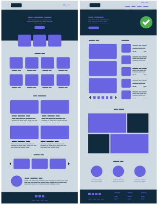
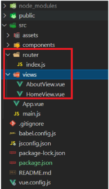
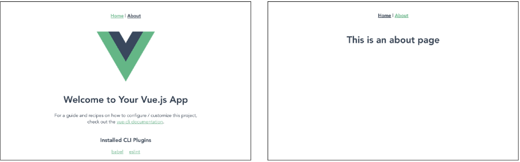
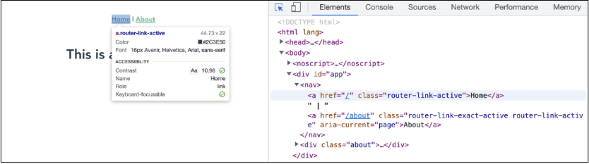
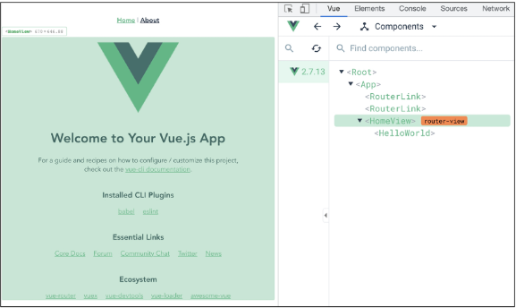
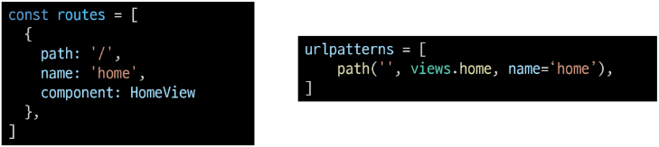
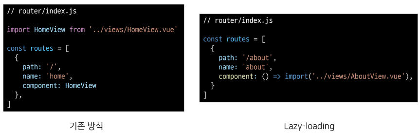

# Vue 7일차  

### UX & UI

### INTRO  

> 개요  

두 개의 같은 기능을 하는 웹사이트가 있을 때, 어느 웹 사이트가 더 사용하기 편할까?  

만약 선택을 했다면 왜 그럴까?  

<br>  

우리는 비슷한 것끼리 묶거나 내용을 구성해서 인지하는 것이 편하다는 것을 알고 있다.  
만약 그렇지 않을 경우 불편하다는 느낌을 받거나 의사결정을 하는데 많은 시간이 걸리기도 한다.  

이러한 요소들은 유저와 밀접한 부분이기에 매우 중요하며 모든 서비스에서 반드시 고려되어야 한다.  

단순한 느낌이나 심미적인 부분만 고려하는 것이 아닌 <mark>체계적인 설계를 통해 기획</mark>해야 한다.  




<hr>  

### UX & UI  

> UX (User Experience)  

"데이터를 보니 사람들ㄹ이 여기 있는 메뉴바를 잘 사용하지 않는 것 같아"  
"차라리 크기를 확 줄이거나 위치를 조정해보면 어떨까?"  

유저와 가장 가까이에 있는 분야, 데이터를 기반을 유저를 조사하고 분석해서 개발자, 디자이너가 이해할 수 있게 소통  

유저가 느끼는 느낌, 태도 그리고 행동을 디자인  
- 백화점 1층에서 느껴지는 좋은 향수 향기  
- 러쉬 매장 근처만 가도 맡을 수 있는 러쉬 향기  
- 로딩이 너무 길어서 사용하고 싶지 않았던 사이트 등  

<hr>  

> 좋은 UX를 설계하기 위해서는  

사람들의 마음과 생각을 이해하고 정리해서 우리 제품에 녹여내는 과정이 필요  

유저 리서치, 데이터 설계 및 정제, 유저 시나리오, 프로토타입 설계 등이 필요  

<hr>  

> UI (User Interface)  

"메뉴바의 위치는 다른 구성 요소 배치와 함께 생각했을 때 여기가 좋겠어."  
"유저는 위에서부터 내려와서 여기에서 결정하는 시나리오를 따를 것 같아"

유저에게 보여지는 화면을 디자인  

UX를 고려한 디자인을 반영, 이 과정에서 기능 개선 혹은 추가가 필요한 경우  

Front-end 개발자와 가장 많이 소통  

<hr>  

> [참고]  

서로 다른 두 개의 시스템, 장치 사이에서 정보나 신호를 주고받는 경우의 접점  
- 즉, 사용자가 기기를 쉽게 동작 시키는데 도움을 주는 시스템  

우리 일상 속에 인터페이스 예시  
- CLI(command-line interface)나 GUI(Graphic User Interface)를 사용해서 컴포터를 조작  
- [참고] API (Application Programming Interface)

<hr>

> 좋은 UI 설계하기 위해서는  

예쁜 디자인 즉 심미적인 부분만 중요하다기보다는 사용자가 보다 쉽고 편리하게 사용할 수 있도록 하는 부분까지 고려되어야 함  

통일된 디자인을 위한 디자인 시스템, 소통을 위한 중간 산출물, 프로토타입 등이 필요  

UI 다자인에 있어 가장 중요한 것은 <mark>협업</mark>  

<hr>   

> 디자이너와 기획자 그리고 개발자  

많은 회사에서 UX/UI 디자인을 함께하는 디자이너를 채용하거나 UX는 기획자, UI는 디자이너의 역할로 채용하기도 함  

<br>  

<b>UX (직무: UX Researcher, User Researcher)</b>  
- (구글) 사용자의 경험을 이해하기 위한 통계 모델을 설계  
- (MS) 리서치를 기획하고 사용자에 대한 지표를 정의  
- (Meta) 정성적인 방법과 정량적인 방법을 사용해서 사용자 조사를 실시  

<b>UI (직무: Product Designer, Interaction Desinger)</b>  
- (구글) 다양한 디자인 프로토타이핑 툴을 사용해서 개발 가이드를 제공  
- (MS) 시각 디자인을 고려해서 체계적인 디자인 컨셉을 보여줌  
- (Meta) 제품을 이해하고 더 나은 UI Flow와 사용자 경험을 디자인  

<br>  

개발자는 단순히 기능 개발만 하는 사람이 아니며 제품에 대해 고민하고 소통하는 능력이 반드시 필요  

즉 다양한 분야와의 협업이 필수적이기에 기본적인 UX/UI에 대한 이해가 있어야 함  

<a href="https://cantunsee.space/">https://cantunsee.space/</a>  
<a href="https://developer.apple.com/kr/design/tips/">https://developer.apple.com/kr/design/tips/</a>

<hr>  

### Vue Router  

### Routing  

> Routing  

네트워크에서 경로를 선택하는 프로세스  

웹 페이지에서의 라우팅  
- 유저가 방문한 URL에 대해 적절한 결과를 응답하는 것  

예시  
- /articles/index/에 접근하면 articles의 index에 대한 결과를 보내줌  

<hr>  

> Routing in SSR  

Server가 모든 라우팅을 통제  

URL로 요청이 들어오면 응답으로 완성된 HTML 제공  
- Django로 보낸 요청이 응답 HTML은 완성본인 상태였음  

결론적으로, Routing(URL)에 대한 결정권을 서버가 가짐  

<hr>  

> Routing in SPA / CSR  

서버는 하나의 HTML(index.html)만을 제공  

이후에는 모든 동작은 하나의 HTML 문서 위에서 JavaScript 코드를 활용  
- DOM을 그리는데 필요한 추가적인 데이터가 있다면 axios와 같은 AJAX 요청을 보낼 수 있는 도구를 사용하여 데이터를 가져오고 처리  

즉, <mark>하나의 URL만 가질 수 있음</mark>  

<hr>  

> Why routing?  

그럼 동작에 따라 URL이 반드시 바뀌어야 하나?  
그렇지는 않다! 단 유저의 사용성 관점에서는 필요함  

Routing이 없다면,  
- 유저가 URL을 통한 페이지의 변화를 감지할 수 없음  
- 페이지가 무엇을 렌더링 중인지 대한 상태를 알 수 없음  
    - 새로고침 시 처음 페이지로 돌아감  
    - 링크를 공유할 시 처음 페이지만 공유 가능  
- <mark>브라우저의 뒤로가기 기능을 사용할 수 없음</mark>  

<hr>  

### Vue Router  

> Vue Router  

Vue의 공식 라우터  

SPA 상에서 라우팅을 쉽게 개발할 수 있는 기능을 제공  

라우트(routes)에 컴포넌트를 매핑한 후, 어떤 URL에서 렌더링할 지 알려줌  
- 즉, SPA를 MPA처럼 URL을 이동하면서 사용 가능  
- SPA의 단점 중 하나인 "URL이 변경되지 않는다."를 해결  

[참고] MPA (multi Page Application)  
- 여러 개의 페이지로 구성된 애플리케이션  
- SSR 방식으로 렌더링  

<hr>  

> Vue Router 시작하기  

Vuex와 마찬가지의 방식으로 설치 및 반영  

```bash
$ vue create vue-router-app // Vue 프로젝트 생성  

$ cd vue-router-app // 디렉토리 이동  

$ vue add router // Vue CLI를 통해 router plugin 적용
```

<font color="red">기존에 프로젝트를 진행하고 있던 중 router를 추가하게 되면 App.vue를 덮어쓰므로 필요한 경우 명령을 실행하기 전에 파일을 미리 백업해두어야 함</font>  

<br>  

> history mode 사용여부 -> Yes  

```bash
? User history mode for router? (requires proper server setup for 
index forback in production) (Y/n) y
```

<hr>  

> History mode  

브라우저의 History API를 활용한 방식  
- 새로고침 없이 URL 이동 기록을 남길 수 있음  

우리에게 익숙한 URL 구조로 사용 가능  
- 예시) `http://localhost:8080/index`

[참고] History mode를 사용하지 않으면  
Default 값인 hash mode로 설정됨 ('#'을 통한 URL을 구분하는 방식)  
- 예시 `http://localhost:8080#index`  

<hr>  

> Vue Router 시작하기(계속)  

App.vue  
- router-link 요소 및 router-view가 추가됨  

```vue
<template>
  <div id="app">
    <nav>
      <router-link to="/">Home</router-link> |
      <router-link to="/about">About</router-link>
    </nav>
    <router-view/>
  </div>
</template>
```

<br>  

router/index.js 생성  

view 폴더 생성  



<br>  

서버 실행하기  



<hr>  

> <mark>router-link</mark>  

a 태그와 비슷한 기능 -> URL을 이동시킴  
- routes에 등록된 컴포넌트와 매핑됨  
- 히스토리 모드에서 router-link는 클릭 이벤트를 차단하여 a태그와 달리 브라우저가 페이지를 다시 로드하지 않도록 함  

목표 경로는 `'to'`속성으로 지정됨  

기능에 맞게 HTML에서 a 태그로 rendering 되지만, 필요에 따라 다른 캐그로 바꿀 수 있음  

개발자도 도구 확인  



<hr>  

> <mark>router-view</mark>  

주어진 URL에 대해 일치하는 컴포넌트를 렌더링하는 컴포넌트  

실제 componenet가 DOM에 부착되어 보이는 자리를 의미  

router-link를 클릭하면 routes에 매핑된 컴포넌트를 렌더링  


Django에서는 block tag와 비슷함  
- App.vue는 base.html의 역할  
- route-view는 block 태그로 감싼 부분  

<br>  

개발자 도구 확인  

  

<hr>  

> src/router/index.js  

라우터에 관련된 정보 및 설정이 작성되는 곳  

Django에서의 urls.py에 해당  

routes에 URL와 컴포넌트를 매핑  

```js
// src/router/index.js  

import Vue from 'vue'
import VueRouter from 'vue-router'
import HomeView from '../views/HomeView.vue'

Vue.use(VueRouter)

const routes = [
  {
    path: '/',
    name: 'home',
    component: HomeView
  },
  {
    path: '/about',
    name: 'about',
    // route level code-splitting
    // this generates a separate chunk (about.[hash].js) for this route
    // which is lazy-loaded when the route is visited.
    component: () => import(/* webpackChunkName: "about" */ '../views/AboutView.vue')
  }
]

const router = new VueRouter({
  mode: 'history',
  base: process.env.BASE_URL,
  routes
})

export default router
```

<br>  

Django와의 비교  

  


<hr>  

> src/Views  

router-view에 들어갈 component 작성  

기존에 컴포넌트를 작성하던 곳은 component 폴더 뿐이지만 이제 두 폴더로 나뉘어짐  

각 폴더 안의 .vue 파일들이 기능적으로 다른 것은 아님  

<br>  

이제 폴더별 컴포넌트 배치는 다음과 같이 진행 (규약은 아님)  

**views/**
- routes에 매핑되는 컴포넌트, 즉 \<router-view\>의 위치에 렌더링되는 컴포넌트를 모아두는 폴더  
- 다른 컴포넌트와 구분하기 위해 View로 끝나도록 만드는 것을 권장  
- ex) App 컴포넌트 내부의 AboutView & HomeView 컴포넌트  

**componets/**  
- routes에 매핑된 컴포넌트의 하위 컴포넌트를 모아두는 폴더  
- ex) Homeview 컴포넌트 내부의 HelloWorld 컴포넌트  

<hr>  

### Vue Router 실습  

> 주소를 이동하는 2가지 방법  

1. 선언적 방식 네비게이션  
2. 프로그래밍 방식 네비게이션  

<hr>  

> 선언적 방식 네비게이션  

router-link의 `'to'`속성으로 주소 전달  
- routes에 등록된 주소와 매핑된 컴포넌트로 이동  

```vue
// App.vue  

<template>
  <div id="app">
    <nav>
      <router-link to="/">Home</router-link> |
      <router-link to="/about">About</router-link>
    </nav>
    <router-view/>
  </div>
</template>
```

<hr>  

> Named Routes  

이름을 가지는 routes  
- Django에서 path 함수의 name 인자의 활용과 같은 방식  

```js
// router/index.js

const routes = [
  {
    path: '/',
    name: 'home',
    component: HomeView
  },
  ...
]
```

<hr>  

> 동적 방식의 네비게이션

동적인 값을 사용하기 때문에 v-bind를 사용해야 정상적으로 작동  

```vue
// App.vue

<template>
  <div id="app">
    <nav>
      <router-link :to="{ name: 'home' }">Search</router-link> |
      <router-link :to="{ name: 'about' }">Later</router-link> |
    </nav>
    <router-view />
  </div>
</template>
```

<hr>  

> 프로그래밍 방식 네비게이션  

Vue 인스턴스 내부에서 라우터 인스턴스에 `$router`로 접근할 수 있음  

다른 URL로 이동하려면 this.$router.push를 사용  
- history stack에 이동할 URL을 넣는 (push) 방식  
- history stack에 기록이 남기 때문에 사용자가 브라우저의 뒤로가기 버튼을 클릭하면 이전 URL로 이동할 수 있음  

결국 `<router-link :to="...">`를 클릭하는 것과 `$router.push(...)`를 호출하는 것은 같은 동작  

<br>  

동작 원리는 선언적 방식과 같음  


```vue
// AboutView.vue

<template>
  <div class="about">
    <h1>This is an about page</h1>
    <router-link :to="{ name: 'home'}">Home</router-link>|
    <button @click="toHome">홈으로</button>
  </div>
</template>

<script>
export default {
  name: 'AboutView',
  methods: {
    toHome() {
      this.$router.push({ name: 'home' })
    }
  }
}
</script>
```

<hr>  

> Dynamic Route Matching  

동적 인자 전달  
- URL의 특정 값을 변수처럼 사용할 수 있음  

ex) Django에서의 variable routing  

<br>  

HelloView.vue 작성 및 route 추가  

route를 추가할 때 동적 인자를 명시  

```js
// router/index.js

import HelloView from '@/views/HelloView.vue'

Vue.use(VueRouter)

const routes = [
  ...
  {
    path: '/hello/:userName',
    name: 'hello',
    component: HelloView
  }
]
...
```

```vue
// views/HelloView.vue

<template>
  <div>
  </div>
</template>

<script>
export default {
  name: "HelloView",
}
</script>

<style>

</style>
```

<br>  

`$route.params`로 변수에 접근 가능  

HTML에서 직접 사용하기 보다는 data에 넣어서 사용하는 권장함

```vue
// views/HelloView.vue

<template>
  <div>
    // <h1>hello, {{ $route.params.userName }}</h1>
    <h1>hello, {{ userName }}</h1>
  </div>
</template>

<script>
export default {
  name: "HelloView",
  data() {
    return {
      userName: this.$route.params.userName
    }
  }
}
</script>

<style>

</style>
```

<hr>  

> Dynamic Route Matching - 선언적 방식 네비게이션  

App.vue에서 harry에게 인사하는 페이지로 이동해보기  

params를 이용하여 동적 인자 전달 가능  

```vue
// App.vue  

<template>
  <div id="app">
    <nav>
      <router-link :to="{ name: 'home'}">Home</router-link> |
      <router-link :to="{ name: 'about' }">About</router-link> |
      <router-link :to="{ name: 'hello', params: { userName : 'harry' }}">Hello</router-link>
    </nav>
    <router-view/>
  </div>
</template>
```

<hr>  

> Dynamic Route Mathcing - 프로그래밍 방식 네비게이션  

AboutView에서 데이터를 입력 받아 HelloView로 이동하여 입력받은 데이터에게 인사하기  

```vue
// views/AboutView.vue

<template>
  <div class="about">
    <h1>This is an about page</h1>
    <router-link :to="{ name: 'home'}">Home</router-link>|
    <button @click="toHome">홈으로</button>

    <input type="text" @keyup.enter="goToHello" v-model="inputData">
  </div>
</template>

<script>
export default {
  name: 'AboutView',
  data() {
    return {
      inputData: null
    }
  },
  methods: {
    toHome() {
      this.$router.push({ name: 'home' })
    },
    goToHello() {
      this.$router.push({ name: 'hello', params: { userName: this.inputData } })
    }
  }
}
</script>
```

<hr>  

> router에 컴포넌트를 등록하는 또 다른 방법  

router/index.js에 컴포넌트를 드록하는 또 다른 방식이 주어지고 있음 (about)  

  

<hr>  

> lazy-loading  

모든 파일을 한 번에 로드하려고 하면 모든 걸 다 읽는 시간이 매우 오래 걸림  

미리 로드를 하지 않고 특정 라우트에 방문할 때 매핑된 컴포넌트의 코드를 로드하는 방식을 활용할 수 있음  
- 모든 파일을 한 번에 로드하지 않아도 되기 때문에 최초에 로드하는 시간이 빨라짐  
- 당장 사용하지 않을 컴포넌트는 먼저 로드하지 않는 것이 핵심  

<br>

검사 - Network를 통해서 확인할 수 있음  

서브로 사용하는 것은 lazy-loading을 적용하는 것이 올바른 것을 보임  