# Vue 9일차  

### Vue with DRF

> 개요  

Server와 Client 통신 방법 이해하기  

CORS 이슈 이해하고 해결하기  

Vue와 API server 통신하기  

<hr>  

### Server & Client  

> Server  

서버란?  
- 클라이언트에게 <mark>정보</mark>와 <mark>서비스</mark>를 제공하는 컴퓨터 시스템  
- 서비스 전체를 제공 == Django Web Service  
- 정보를 제공 == DRF API Service  

<br>  

서비스 전체를 제공 == Django Web Service  
- Django를 통해 전달받은 HTML에는 하나의 웹페이지를 구성할 수 있는 모든 데이터가 포함됨  
- 즉, 서버에 모든 내용을 렌더링, 하나의 HTML 파일로 제공  
- 정보를 포함한 web 서비스를 구성하는 모든 내용을 서버 측에서 제공  

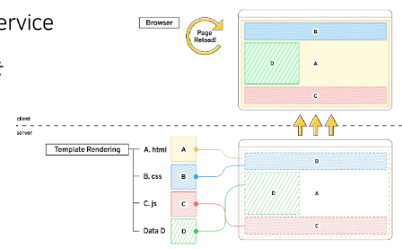  

<br>  

정보를 제공 == DRF API Service  
- Django를 통해 관리하는 정보만을 클라이언트에게 제공  
- DRF를 사용하여 JSON으로 변환  

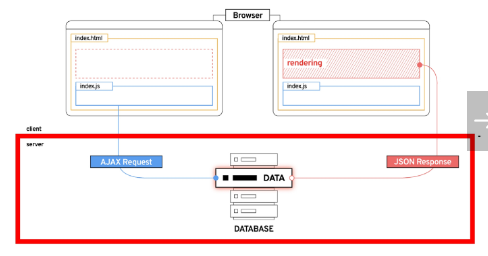  

<hr>  

> Client  

클라이언트(Client)란?  
- <mark>Server가 제공하는 서비스에 적절한 요청</mark>을 통해 <mark>Server로 부터 반환 받는 응답을 사용자에게 표현</mark>하는 기능을 가진 프로그램 혹은 시스템  

<br>  

Server가 제공하는 서비스에 적절한 요청  
- Server가 정의한 방식대로 요청 인자를 넘겨 요청  
- Server는 정상적인 요청에 적합한 응답 제공  

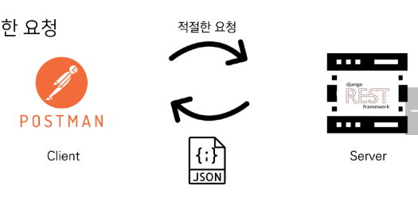  

<br>  

잘못된 요청의 예  

아래와 같은 Model이 정의되어 있다면  

```python
class Aritcle(models.Model):
    title = models.CharField(max_length=100)
    content = models.TextField()
```

잘못된 field명으로 요청을 보낼 경우 처리할 수 없음   

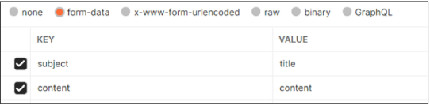  

<br>  

Server로부터 반환 받은 응답을 사용자에게 표현  
- 사용자의 요청에 적합한 data를 server에 요청하여 응답받은 결과로 적절한 화면을 구성  

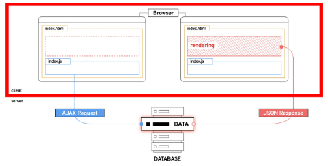  

<br>  

> 정리  

Server는 정보와 서비스를 제공  
- DB와 통신하면 데이터를 생성, 조회, 수정, 삭제를 담당  
- 요청을 보낸 Client에게 정상적인 요청이었다면 처리한 결과를 응답  

Client는 사용자의 정보 요청을 처리, server에게 응답받은 정보를 표현  
- Server에게 정보(데이터)를 요청  
- 응답받은 정보를 가공하여 화면에 표현  

<hr>  

### Again DRF  

<hr>

> Skeleton code 확인  

back-server 코드 확인  

<br>  

Model 구조 확인  

```py
# articles/models.py

from django.db import models
from django.conf import settings

# Create your models here.
class Article(models.Model):
    # user = models.ForeignKey(settings.AUTH_USER_MODEL, on_delete=models.CASCADE)
    title = models.CharField(max_length=100)
    content = models.TextField()
    created_at = models.DateTimeField(auto_now_add=True)
    updated_at = models.DateTimeField(auto_now=True)


class Comment(models.Model):
    article = models.ForeignKey(Article, on_delete=models.CASCADE)
    content = models.TextField()
    created_at = models.DateTimeField(auto_now_add=True)
    updated_at = models.DateTimeField(auto_now=True)
```

<br>  

요청 경로 확인  

```py
my_api/urls.py  

from django.contrib import admin
from django.urls import path, include

urlpatterns = [
    path('admin/', admin.site.urls),
    path('api/v1/', include('articles.urls')),
    # path('accounts/', include('dj_rest_auth.urls')),
    # path('accounts/signup/', include('dj_rest_auth.registration.urls'))
]
```

```py
# articles/urls.py

# from drf_spectacular.views import SpectacularAPIView, SpectacularSwaggerView
from django.urls import path
from . import views


urlpatterns = [
    path('articles/', views.article_list),
    path('articles/<int:article_pk>/', views.article_detail),
    path('comments/', views.comment_list),
    path('comments/<int:comment_pk>/', views.comment_detail),
    path('articles/<int:article_pk>/comments/', views.comment_create),
    # # 필수 작성
    # path('schema/', SpectacularAPIView.as_view(), name='schema'),
    # # optional UI
    # path('swagger/', SpectacularSwaggerView.as_view(url_name='schema'), name='swagger-ui'),
]
```

<br>  

Dummy data 확인  

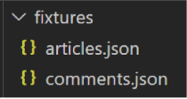  

데이터 삽입  

```bash
# migrations 정보는 이미 있음  
$ python manage.py migrate  

# aritcles와 comments 동시 삽입 > N:1 관계 유지  
$ python manage.py loaddata articles.json comments.json
```

<br>  

서버 실행 후, 전체 게시글 조회  
- Browser에서 server에 전체 게시글 조회 요청 -> 데이터 반환 확인  

<br>  

서버 실행 후, 전체 게시글 조회  
- Postman에서 올바른 방법으로 요청 -> 데이터 반환 확인  

<hr>  

### Back to Vue

> Skeleton code 확인  

front-server 폴더 구조 확인 및 서버 구동 준비  

```bash
# package insatll

$ npm install

$ npm run serve
```

<hr>  

> 컴포넌트 구조 확인  

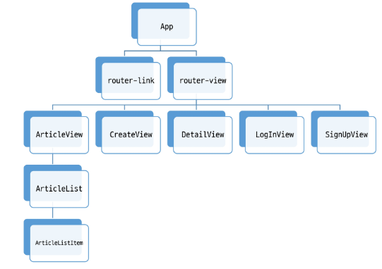  

<hr>  

> 메인 페이지 구성  

`views/ArticleView.vue` component 확인 및 route 등록  

```vue
// src/views/ArticleView.vue

<template>
  <div>
    <h1>Article Page</h1>
    <hr>
  </div>
</template>

<script>
import ArticleList from '@/components/ArticleList.vue'

export default {
  name: 'ArticleView',
}
</script>
```

```js
// src/router/index.js  

import Vue from 'vue'
import VueRouter from 'vue-router'
import ArticleView from '@/views/ArticleView'

Vue.use(VueRouter)

const routes = [
  {
    path: '/',
    name: 'ArticleView',
    component: ArticleView
  },
]
...
```

<br>  

`src/App.vue` route-link 주석 해제 및 결과 확인  

```vue
// src/App.vue  

<template>
  <div id="app">
    <nav>
      <router-link :to="{ name: 'ArticleView' }">Articles</router-link> | 
    </nav>
    <router-view/>
  </div>
</template>
```

<br>  

`coponents/AritclesList.vue` 확인  
- 전체 게시물을 표현할 컴포넌트  
- 화면 구성을 위한 최소한의 style 포함  

```vue
// components/ArticleList.vue

<template>
  <div class="article-list">
    <h3>Article List</h3>
  </div>
</template>

<script>
export default {
  name: 'ArticleList',
}
</script>

<style>
.article-list {
  text-align: start;
}
</style>

```

<br>  

`views/ArticleView.vue` 주석 해제  

`ArticleList` 하위 컴포넌트 등록  
1. 불러오기  
2. 등록하기  
3. 보여주기  

```vue
<template>
  <div>
    <h1>Article Page</h1>
    <ArticleList />
    <hr>
  </div>
</template>

<script>
import ArticleList from '@/components/ArticleList.vue'

export default {
  name: 'ArticleView',
  components: {
    ArticleList
  },
}
</script>
```

<br>  

`components/ArticleListItem.vue` 확인  
- 각 게시글의 정보를 표현할 컴포넌트  
- 데이터없이 최소한의 기본 구조만 확인  

<br>  

`components/ArticleList.vue` 주석 해제  

`ArticleListItem` 하위 컴포넌트 등록  
1. 불러오기  
2. 보여주기  
3. 등록하기  

```vue
// components/AritcleList.vue

<template>
  <div class="article-list">
    <h3>Article List</h3>
    <ArticleListItem />
  </div>
</template>

<script>
import ArticleListItem from './ArticleListItem.vue'

export default {
  name: 'ArticleList',
  components: {
    ArticleListItem,
  },
}
</script>
```

<br>  

`store/index.js` 주석 해제  

state에 articles 배열 정의  

화면 표현 체크용 데이터 생성  

```js
// store/index.js  

export default new Vuex.Store({
  state: {
    articles: [
      {
        id: 1,
        title: '제목',
        content: '내용'
      },
      {
        id: 2,
        title: '제목2',
        content: '내용2'
      },
    ],
  },
})
```

<br>  

`components/ArticleList.vue` 코드 수정  
- state에서 articles 데이터 가져오기  
- v-for 디렉티브를 활용하여 하위 컴포넌트에서 사용할 article 단일 객체 정보를 pass props  

```vue
// components/Articles.vue  

<template>
  <div class="article-list">
    <h3>Article List</h3>
    <ArticleListItem v-for="article in aritcles" :key="article.id"
    :article="article"/>
  </div>
</template>

<script>
import ArticleListItem from './ArticleListItem.vue'
import { mapState } from 'vuex'

export default {
  name: 'ArticleList',
  components: {
    ArticleListItem,
  },
  computed: {
    ...mapState({
      aritcles: 'articles'
    })
  }
}
</script>
```

<br>  

`components/ArticleListItem.vue` 수정  
- 내려 받은 props 데이터로 화면 구성  
- props 데이터의 타입을 명확히 표현할 것  

```vue

<template>
  <div>
    <h5>{{ article.id }}</h5>
    <p>{{ article.title }}</p>
    <hr>
  </div>
</template>

<script>
export default {
  name: 'ArticleListItem',
  props: {
    article: Object
  }
}
</script>
```

<hr>  

### Vue with DRF

> AJAX 요청 준비  

axios 설정  

설치  

```bash
$ npm install axios
```

`store/index.js`에서 불러오기  
- 요청 보낼 API server 도메인 변수에 담기  

```js
// store/index.js  

import axios from 'axios'  

const API_URL = 'https://127.0.0.1:8000'
```

<br>  

<mark>store/index.js</mark> 주석 해제  
- `getArticles` 메서드 정의  
- 요청 보낼 경로 확인 필수  
- 성공 시 .then  
- 실패 시 .catch  

```js

export default new Vuex.Store({
  ...
  actions: {
    getArticles(context) {
      axios({
        method: "GET",
        url: `${API_URL}/api/v1/articles/`
      })
      .then((response) => {
        // console.log(response, context)
        context.commit("GET_ARTICLES", response.data)
      })
      .catch((error) => {
        console.log(error)
      })
    }
  },
})
```

<br>  

`views/Articles.vue` 주석 해제  
- `getArticles` actions 호출  
- 인스턴스가 생성도니 직후 요청을 보내기 위해 `create()` hook 사용  

```vue
// views/ArticleView.vue  

<script>
<template>
  <div>
    <h1>Article Page</h1>
    <hr>
  </div>
</template>

<script>
import ArticleList from '@/components/ArticleList.vue'

export default {
  name: 'ArticleView',
  components: {
    ArticleList
  },
  computed:{
  },
  created() {
    this.getArticles()
  },
  methods: {
    getArticles() {
      this.$store.dispatch('getArticles')
    }
  }
}
</script>
```

<hr>  

> 요청 결과 확인  

Vue와 Django 서버를 모두 켠후 메인 페이지 접속  

Server에서는 200을 반환하였으나 Client Console에서는 Error를 확인  

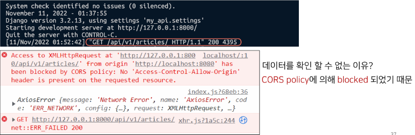  

<hr>  

> CORS  

### Cross-Origin Resource Sharing  

> What Happened?  

브라우저가 요청을 보내고 서버의 응답이 브라우저에 도착  
- Server의 log는 200(정상) 반환  
- 즉, Server는 정상적으로 응답했지만 브라우저가 막은 것  

보안상의 이유로 브라우저는 <mark>동일 출처 정책(SOP: Same-Origin Policy)</mark>에 의해 다른 출처의 리소스와 상호작용하는 것을 제한함  


<hr>  

> SOP(Same-Origin Policy)  

"동일 출처 정책"  

불러온 무서나 스클비트가 다른 출처에서 가져온 리소스와 상호작용하는 것을 제한하는 보안 양식  

잠재적으로 해로울 수 있는 문서를 분리함으로써 공격받을 수 있는 경로를 줄임  
<a href="https://developer.mozilla.org/en-US/docs/Web/Security/Same-origin_policy">https://developer.mozilla.org/en-US/docs/Web/Security/Same-origin_policy</a>  

<hr>  

> Origin - "출처"  

<mark>URL의 Protocol, Host, Port</mark>를 모두 포함하여 출처라고 부름  

Same Origin 예시  
- 아래의 세 영역이 일치하는 경우에만 동일한 출처로 인정  

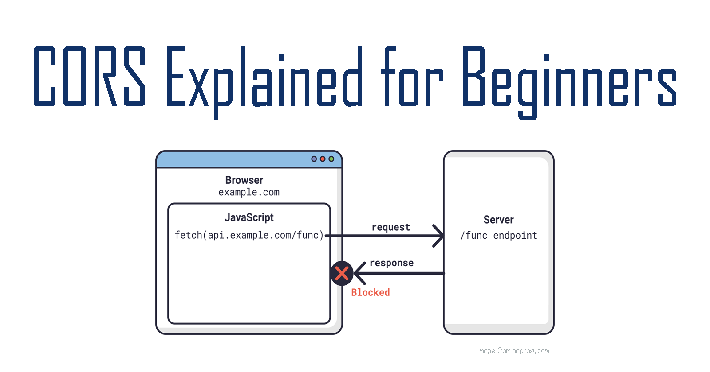

<br>  

- `http://localhost:3000/posts/3/'을 기준으로 출처를 비교  

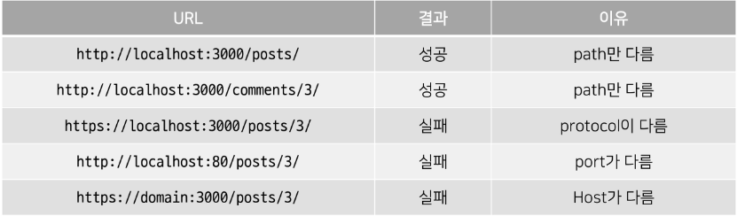  

<hr>  

> CORS - 교차 출처 리소스 공유  

추가 <mark>HTTP Header</mark>를 사용하여, 특정 출처에서 실행 중인 웹 애플리케이션이 <mark>다른 출처의 자원에 접근할 수 있는 권한</mark>을 부여하도록 브라우저에 알려주는 체제  
- 어떤 출처에서 자신의 컨텐츠를 불러갈 수 있는지 서버에 지정할 수 있는 방법  

리소스가 자신의 출처와 다를 때 교차 출처 HTTP 요청을 실행  
- 만약 다른 출처의 리소스를 가져오기 위해서는 이를 제공하는 서버가 브라우저에게 **다른 출처지만 접근해도 된다는 사실을 알려야 함**  
- "교차 출처 리소스 공유 정책(CORS policy)"

<hr>  

> CORS policy - 교차 출처 리소스 공유 정책  

다른 출처에서 온 리소스를 공유하는 것에 대한 정책  

CORS policy에 위배되는 경우 브라우저에서 해당 응답 결과를 사용하지 않음  
- Serve에서 응답을 주더라도 브라우저에서 거절  

다른 출처의 리소스를 부러오면 그 출처에서 <mark>올바른 CORS header</mark>를 포함한 응답을 반환해야 함  

<a href="https://developer.mozilla.org/ko/docs/Web/HTTP/CORS">https://developer.mozilla.org/ko/docs/Web/HTTP/CORS</a>  

<br>  

### How to set CORS  

> How to set CORS  

CORS 표준에 의해 추간 HTTP Response Header를 통해 이를 통제 가능  

HTTP Response Header 예시  
- <mark>Access-Control=Allow-Origin</mark>/Access-Control-Allow-Credentials/  
- Access-Control-Allow-Headers / Access-Control-Allow-Methods  

Access-Control-Allow-Origin  
- 단일 출처를 지정하여 브라우저가 해당 출처가 리소스에 접근하도록 허용  

<hr>  

> django-cors-headers library 사용하기  

django-cors-headers github에서 내용 확인  
- <a href="https://github.com/adamchainz/django-cors-headers">https://github.com/adamchainz/django-cors-headers</a>  

- <mark>응답에 CORS header를 추가</mark>해주는 라이브러리  
- 다른 출처에서 Django 애플리케이션에 대한 브라우저 내청을 허용함  

<br>

라이브러리 설치 및 `requirements.txt` 업데이트  

```bash
# venv를 사용
$ pip intall django-cors-headers
$ pip freeze > requirements.txt
```

<br>  

<mark>App</mark> 추가 및 <mark>MIDDLEWARE</mark>추가 주석 해제  
<font color="red">주의) CorsMiddleware는 가능한 CommonMiddleware 보다 먼저 정의 되어야 함</font>  

```py
# my_api/settings.py

INSTALLED_APPS = [
    ...
    # CORS policy
    "corsheaders",
]
...

MIDDLEWARE = [
    ...
    "corsheaders.middleware.CorsMiddleware",
    'django.middleware.common.CommonMiddleware',
    ...
]
```

<br>  

`CORS_ALLOWED_ORIGINS`에 교차 출처 자원 공유를 허용할 Domain 등록  

```py
# 특정 Origin만 선택적으로 허용
CORS_ALLOWED_ORIGINS = [
    'http://localhost:8080',
]

# 모든 Origin 허용  
CORS_ALLOW_ALL_ORIGINS = True
```

<hr>

> 결과 확인  

console 창에 정상적으로 출력되는지 확인  

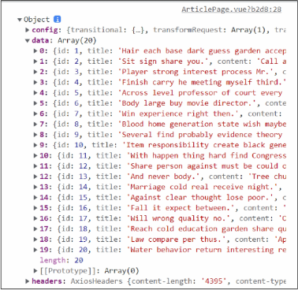  

<br>

응답에 Access-Control-Allow-Origin 헤더가 있는 것을 확인  

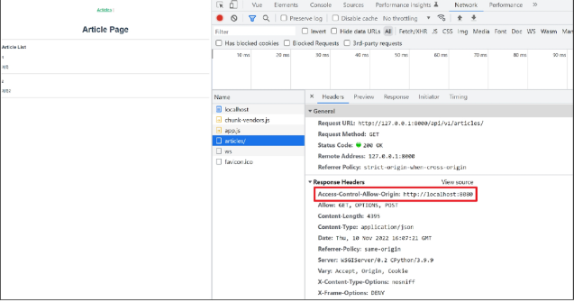  

<hr>  

### Vue with DRF(feat.CORS)  

### Aritcle Read  

> Article Read  

응답받은 데이터 구조 확인  

`data Array`에 각 게시글 객체  

각 게시글 객체는 다음으로 구성  

1. id
2. title
3. content  

<br>  

`store/index.js` 수정 
- 기존 articles 데이터 삭제  
- Mutation 정의  
    - 응답 받아온 데이터를 state에 저장  

```js
// store/index.js  

import Vue from 'vue'
import Vuex from 'vuex'
import axios from 'axios'

Vue.use(Vuex)
const API_URL = "http://127.0.0.1:8000"

export default new Vuex.Store({
  state: {
    articles: [],
  },
  getters: {
  },
  mutations: {
    GET_ARTICLES(state, articles) {
      state.articles = articles
    }
  },
  actions: {
    getArticles(context) {
      axios({
        method: "GET",
        url: `${API_URL}/api/v1/articles/`
      })
      .then((response) => {
        // console.log(response, context)
        context.commit("GET_ARTICLES", response.data)
      })
      .catch((error) => {
        console.log(error)
      })
    }
  },
  modules: {
  }
})
```

<br>  

결과 확인  
- 사전에 `ArticleList.vue`에서 state 화면으로 구성하도록 설정  
- 정상적으로 데이터 출력 확인  

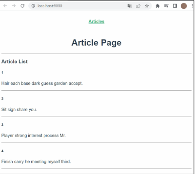  

<hr>  

### Article Create

> Article Create  

`views/CreateView.vue` 코드를 확인  
- 게시글 생성을 위한 form을 제공  
- (선택)  `v-model-trim`을 활용해 사용자 입력 데이터에서 공백 제거  
- `prevent` 를 활용해 form의 기본 이벤트 동작 막기  

```vue
// views/CreateView.vue

<template>
  <div>
    <h1>게시글 작성</h1>
    <form @submit.prevent="createArticle">
      <label for="title">제목 : </label>
      <input type="text" id="title" v-model.trim="title"><br>
      <label for="content">내용 : </label>
      <textarea id="content" cols="30" rows="10" v-model="content"></textarea><br>
      <input type="submit" id="submit">
    </form>
  </div>
</template>
```

<br>  

`views/CreateView.vue` 코드 확인  
- title content가 비었다면 `alert`를 통해 경고창을 띄우고 AJAX 요청을 보내지 않도록 `return` 시켜 함수 종료  

```vue
// views/CreateView.vue

<script>
const API_URL = "http://127.0.0.1:8000"
import axios from 'axios'

export default {
  name: 'CreateView',
  data() {
    return {
      title: "",
      content: "",
    }
  },
  methods: {
    createArticle() {
      const title = this.title
      const content = this. content

      if (!title) {
        alert("제목을 입력해주세요.")
        return
      }
      else if (!content) {
        alert("내용을 입력해주세요.")
        return
      }
      axios({
        method: "POST",
        url: `${API_URL}/api/v1/articles/`,
        data: {title, content}
      })
      .then(() => {
        console.log(response)

      })
      .catch((error) => {
        console.log(error)
      })

    }
  }
}
</script>
```

<br>  

`views/CreateView.vue` 코드 확인  
- axios를 사용해 server에 게시글 생성 요청  

`actions`를 사용하지 않나요?  
- state를 변화 시키는 것이 아닌 DB에 게시글 생성 후, ActionView로 이동할 것이므로 methods에서 직접 처리  

<br>  

`router/index.js`에서 CreateView 주석 해제  

```js
//router/index.js  

...
import CreateView from '@/views/CreateView'
...

Vue.use(VueRouter)

const routes = [
  ...,
  {
    path: '/create',
    name: 'CreateView',
    component: CreateView
  }
]
```

<br>  

`views/ArticleVeiw.vue` 주석 해제  
- route-link를 통해 CreateView로 이동  

```vue
// views/ArticleView.vue  

<template>
  <div>
    <h1>Article Page</h1>
    <router-link :to="{ name: 'CreateView' }">[Create]</router-link>
    <ArticleList />
    <hr>
  </div>
</template>
```

<br>  

게시글 작성 요청 결과 확인  
- 정상 작동 확인  

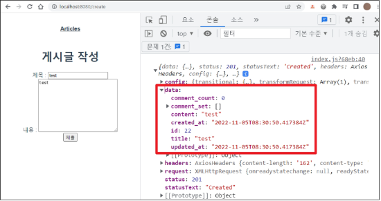  

<br>  

`views/CreateView.vue` 코드 수정  
- createAritcle method 수정 -> 게시글 생성 완료 후, ArticleView로 이동  
- 응답 확인을 위해 정의한 인자 `response` 제거

```vue
// views/CreateView.vue

<script>
const API_URL = "http://127.0.0.1:8000"
import axios from 'axios'

export default {
  name: 'CreateView',
  data() {
    return {
      title: "",
      content: "",
    }
  },
  methods: {
    createArticle() {
      const title = this.title
      const content = this. content

      if (!title) {
        alert("제목을 입력해주세요.")
        return
      }
      else if (!content) {
        alert("내용을 입력해주세요.")
        return
      }
      axios({
        method: "POST",
        url: `${API_URL}/api/v1/articles/`,
        data: {title, content}
      })
      .then(() => {
        // console.log(response)
        this.$router.push({ name: 'ArticleView' })

      })
      .catch((error) => {
        console.log(error)
      })

    }
  }
}
</script>
```

<br>  

> 게시글 작성 요청 결과 재확인  
- 게시글 생성 후, AritclesView로 이동  
- 새로 생성된 게시글 확인 가능  

어떻게 router로 이동만 했는 보일까?  
- ArticleView가 create될 때마다 server에 게시글 전체 데이터를 요청하고 있기 때문  

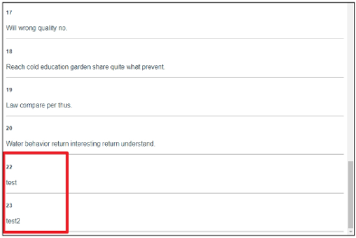  

<hr>  

> [참고] 지금 요청 방식은 효율적인가?  

비효율적인 부분이 존재  
- 전체 게시글 정보를 요청해야 새로 생성된 게시글을 확인할 수 있음  
- 만약 vuex state를 통해 전체 게시글 정보를 관리하도록 구성한다면?  
    - 내가 새롭게 생성한 게시글을 확인할 수 있겠지만 ...
    - 나 이외의 유저들이 새롭게 생성한 게시글은 언제 불러와야 할까?  
    - 무엇을 기준을 새로운 데이터가 생겼다는 것을 확인할 수 있을까?  

내가 구성하는 서비스에 따라 데이터 관리 방식을 고려해 보아야 함  

<hr>  

### Aritcle Detail  

> Article Detail  

`views/DetailView.vue` 코드 확인  
- 게시글 상세 정보를 표현할 컴포넌트  
- AJAX 요청으로 응답 받아올 article의 상세 정보들을 표현  

```vue
// views/DetailView.vue  

<template>
  <div>
    <h1>Detail</h1>
  </div>
</template>

<script>
export default {
  name: 'DetailView',
}
</script>
```

<br>  

`router/index.js` 주석 해제  
- id를 동적 인자로 입력받아 특정 게시글에 대한 요청  

```js
// router/index.js  
...
import DetailView from '@/views/DetailView'
...

Vue.use(VueRouter)

const routes = [
  ...,
  {
    path: '/:id',
    name: 'DetailView',
    component: DetailView,
  },
  ...
]
```

<br>  

`components/AritcleListItem.vue` 주석 해제  
- router-link를 통해 특정 게시글의 id 값을 동적 인자로 전달  
- 게시글 상세 정보를 Server에 요청  

```vue
<template>
  <div>
    <h5>{{ article.id }}</h5>
    <p>{{ article.title }}</p>
    <router-link :to="{
      name: 'DetailView',
      params: {
        id: article.id
      }
    }">
      [Detail]
    </router-link>
    <hr>
  </div>
</template>
```

<br>  

```vue
// views/DetailView.vue  

<script>
const API_URL = "http://127.0.0.1:8000"
import axios from 'axios'

export default {
  name: 'DetailView',
  data() {
    return {
      article: null
    }
  },
  created() {
    this.getArticleDetail()
  },
  methods: {
    getArticleDetail() {
      axios({
        method: 'GET',
        url: `${API_URL}/api/v1/articles/${this.$route.params.id}/`
      })
      .then((response) => {
        console.log(response)
        // this.article = response.data
      })
      .catch((error) => {
        console.log(error)
      })
    }
  }
}
</script>
```

`views/Detail.vue` 코드 확인  
- `this.$route.params`를 활용해 컴포넌트가 create될 때, 넘겨 받은 id로 상세 정보 AJAX 요청  

<br>  

게시글 상세 정보 요청 결과 확인  
- 정상 작동 확인 
- 넘겨받은 데이터 구조 확인 후, 적절하게 화면 구성  

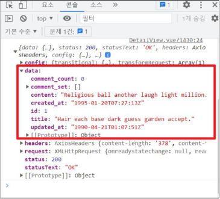  

<br>  

`views/DetailView.vue` 수정  
- 응답 받은 정보를 data에 저장  
- data에 담기까지 시간이 걸리므로 <mark>optional chaining</mark>을 활용해 데이터 표기  

```vue
// views/DetailView.vue  

<template>
  <div>
    <h1>Detail</h1>
    <p>글 번호 : {{ article?.id }}</p>
    <p>제목 : {{ article?.title }}</p>
    <p>내용 : {{ article?.content }}</p>
    <p>작성시간 : {{ article?.created_at }}</p>
    <p>수정시간 : {{ article?.updated_at }}</p>
  </div>
</template>

<script>
const API_URL = "http://127.0.0.1:8000"
import axios from 'axios'

export default {
  name: 'DetailView',
  data() {
    return {
      article: null
    }
  },
  created() {
    this.getArticleDetail()
  },
  methods: {
    getArticleDetail() {
      axios({
        method: 'GET',
        url: `${API_URL}/api/v1/articles/${this.$route.params.id}/`
      })
      .then((response) => {
        // console.log(response)
        this.article = response.data
      })
      .catch((error) => {
        console.log(error)
      })
    }
  }
}
</script>

```

<br>  

최종 결과 확인  

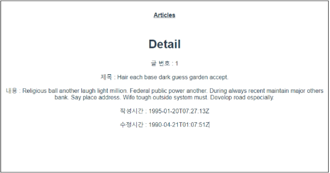