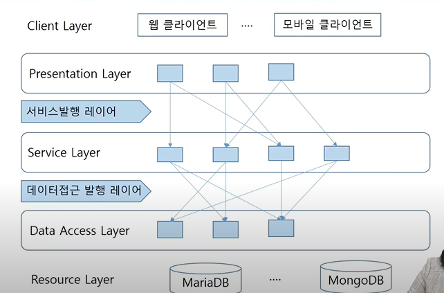

# 자바 디자인 패턴

**기본적인 자바 디자인 패턴을 공부하기 위해선 Java API Document를 참고할 것!**

### 왜 배울까?  

2학기 프로젝트를 진행함에 있어서 필요할 것  
- 선구자가 말하는 것을 이해하는데 도움이 될 것 
- 나중에 실제로 고객이 원하는 것을 만들기 위한 준비가 필요하다. (큰 그림이 필요하다.) 
- 그 외 등 ... 

우리는 당연하게 프레임워크를 통해서 디자인 패턴을 사용하고 있었다.  

## 목차

1. 디자인 패턴 Overview  
2. 생성 패턴
3. 구조 패턴
4. 행위 패턴  

## 디자인 패턴 Overview  

분석, **설계**, 솔루션, 구현, 테스트, 반복 ...  
주로 설계에 치중되어 있다.  

1. 아키텍처와 패턴
2. 방법론과 패턴
3. 객체지향 설계 SOLID  
4. 디자인 패턴 개요  

디자인 패터은 계속해서 바뀌고 있으며, 이에 대해서 너무 얽매일 필요는 없다.  
다만 어떤 한 것이 있고, 이를 이해하고 필요한 것을 활용할 수 있는가가 중요한 것이다.  

## 아키텍처와 패턴

> The History of IT System  

IT System의 역사  
- 1960 ~ 1980: Fragile(Mainframe)  
- 1990 ~ 2000: Robust, Distributed  
- 2010 ~ : Resilient/Anti-fragile, Cloud Native   

Antifragile  
- Auto scailing
사용자가 많아지면, 그 때 비용이 증가하는 것(효율성)
- Mocroservices(stateless)  
서비스를 가장 작은 단위로 쪼갠다.  
- Chaos engineering  
서비스를 많이 쪼개었기에 관계가 복잡해짐
- Continuous Deployments(CD)  
해당되는 서비스를 자동으로 늘리거나 줄인다?  
pipeline?  
애플리케이션의 변경 사항을 자동으로 빠르게 배포하는 방식  
소프트웨어 개발자와 운영팀 간의 협업과의 자동화를 강조, 애플리케이션의 품질 향상, 소프트웨어 배포 주기 단축, 사용자 피드백 획득 등을 목표로 함.  

  

> Cloud Native Architecture  

확장 가능한 아키텍처  
- 시스템의 수평적 확장에 유연  
- 확정된 서버로 시스템의 부하분산, 가용성 보장  
- 시스템 또는 서비스 애플리케이션 단위의 패키지(컨테이너 기반 패키지: Docke,r, k8s)  

탄력적 아키텍처  
- 서비스 생성, 통합, 배포, 비즈니스 환경 변화에 대응 시간 단축  
- 분할된 서비스 구조 
- 무상태 통신 프로토콜  
- 서비스의 추가와 삭제 자동 감지  
- 변경된 서비스 요청에 따라 사용자 요청 처리  

장애 격리 (Fault isolation)  
- 특정 서비스에 오류가 발생해도 다른 서비스에 영향 주지 않음.  

   

> Architecture Pattern  

아키텍처 패턴이란?  
- 소프트웨어 아키텍처의 공통적인 발생 문제에 대한 일반적인, 재사용 가능한 해결책  
- 디자인 패턴과 비슷한지만 더 넓은 범위  
- 컴퓨터 하드웨어 성능 제한, 비즈니스 위험의 최소화와 고가용성(HA), 모니터링 등 소프트웨어 공학의 다양한 문제 해결  
- 일부 아키텍처 패턴은 소프트웨어 프레임워크 안에 구현  

아키텍처 패턴  
- Action Domain Resposor(Model-View-View-Model, Model-View-Controller 등)(중요!)  
- Layer(중요!)  
- EDA(Event-driven architecture)  
- Hexagonal architecture  
- MicroService architecture  
- Entity- contory-boundary  
- Service-oriented architecture  

...

<a href="https://en.wikipedia.org/wiki/Architectural_pattern">https://en.wikipedia.org/wiki/Architectural_pattern</a>

  

> JavaEE Architecture  

  

> Layer Pattern  

  

  

> MVC Pattern  

Model  
- 애플리케이션 상태의 캡슐화  
- 상태 쿼리에 대한 응답  
- 애플리케이션의 기능 표현  
- 변경을 view에 통지  

View  
- 모델을 화면에 시각적으로 표현  
- 모델에게 업데이트 요청  
- 사용자가 입력을 컨트롤러에 전달  
- 컨트롤러가 view를 선택하도록 허용  

Controller  
- 요청 입력 값 체크  
- 사용자 액션을 모델 업데이트와 mapping  
- 일정 범위에 모델 데이터 저장  
- 응답에 대한 view 선택  

  

  

## 2 방법론과 패턴  

방법론: Model(process) + Notation(산출물) tool + 경험론  

  

## 객체 지향 설계 SOlID 

> 객체 지향 특징  

Abstraction  
- 복잡한 현실세계를 사용 요구에 맞게 단순화  

Encapsulation  
- 구현은 감추고 사용법 제공  

Polymorphism  
- 객체의 다형성: 상속을 전제로 부모타입의 자식 생성자로 다양한 객체 생성  
- 메소드의 다형성: 부모타입의 메소드를 상속 받은 자식 클래스에서 재정의, 부모 타입의 객체 사용 베소드 호출 시 재정의된 메소드 응답  

클래스 종류  
- Concrete Class  
- Abstract Class  
- Interface(상속보다는 대게 Interface를 선호한다.)  

Cohesion(응집도)와 Coupling(결합도)  
- High Cohesion: 한 모듈 내부의 처리 요소들은 서로 관련도가 높게  
- Loosely Coupling: 서로 다른 모듈 간에 성호 의존은 느슨하게  

  

> SOLID  

Single Response Principle(단일책임의 원칙)  
- 객체는 단 하나의 책임만을 가져야 한다.  

Open Closed Principle(개방페쇄원칙)  
- 소프트웨어 요소는 확장에는 열려있으나 변경에는 닫혀 있어야 한다.  
- 기존의 코드를 변경하지 않으면서 기능을 추가할 수 있도록 설계  

Liskov Substitution Principle(리스코프 치환 원칙)  
- 프로그램의 객체는 프로그램의 정확성을 깨뜨리지 않으면서 하위 타입의 인스턴스를 바꿀 수 있어야 한다.  

Interface Segregation Principle(인터페이스 분리 원칙)  
- 특정 클라이언트를 위한 인터페이스 여러 개가 범용 인터페이스 하나보다 낫다.  
- 클라이언트가 자신이 이용하지 않는 메서드에 의존하지 않아야 한다.  

Dependency inversion Principle(의존관계 역전 원칙)  
- 추상화에 의존해야지, 구체화에 의존하면 안된다.  
- 소프트웨어 모듈들을 분리하는 특정 형식을 지칭한다. 이 원칙을 다르면, 상위 계층(정책 결정)이 하위 계층(세부 사항)에 의존하는 전통적인 의존관계를 반전(역전)시킴으로써 상위 계층이 하위 계층의 구현으로부터 독립  

  

## 4. 디자인 패턴 개요  

> 의미와 역사  

디자인 패턴 ?
- 소프트웨어 공학의 소프트웨어 디자인에서 특정 문맥에서 공통적으로 발생하는 문제에 대해 재사용 가능한 해결책  

역사  
- 건축적 개념으로서의 패턴은 크리스토퍼 알렉산더가 창안  
- 1987년 켄트 벡과 워드 커닝햄은 프로그래밍, 구체적으로 패턴 언어에 패턴을 적용하는 개념에 관한 실험을 시작  
    - OOPSLA 컨퍼런스에서 자신들의 결과를 제시  
- 1994년 Erich Gamma, Rhichard Helm, Ralph Johnson, Johon Vlisides 등 4인 (GOF, Gang of Four) - "디자인 패턴(Design Patterns: Elements of Reusable Object-Oriented Software)" 출간  
- JEE, .NET 등의 아키텍처 구성을 위한 패턴들도 발표(Idiom)

  

>  구성과 분류  

디자인 패턴 주요 구성  
- Pattern 이름  
- Problem
- Solution  
- consequences  

분류  
- 생성 패턴: 객체의 생성에 관련된 패턴  
- 구조 패턴: 클래스를 조합해 더 큰 구조를 만드는 패턴  
- 행위 패턴: 알고리즘이나 책임의 분배에 관한 패턴  

  

  

## 생성 패턴(Creational Pattern)  

1. Singleton Pattern  
2. Factory Method Pattern  
3. Builder Pattern  

  

## 1. Singleton Pattern

Problem
- 해당 클래스 타입의 오브젝트가 단 하나만 생성되어야 하고, 이 오브젝트를 모든 client가 접근할 수 있어야 한다.  

Solution  
- Class 정의 시  
    - Constructor는 private으로 정의한다.  
    - private, static variable를 선언한다.  
    - 해당 instance를 리턴하는 public, static method를 정의한다.  

Consequences  
- 유일한 인스턴스를 캡슐화해서 인스턴스 접근 방법, 시점 통제  
- 다중 스레드 애플리케이션에서 lazy initialzation 로직 생성단계는 동기화 필요  
- 적극적인 초기화: eager initialization보다 getInstance로 늦은 초기화 선호(Synchronized Block 이용)  
- 이유: 실제로 인스턴스에접근하지 않는다면 생성작업을 피할 수 있다.  
    - getInstance()에서 필요 시 복잡하고 조건적인 생성 로직을 포함할 수 있다.  

  

  

## 2. Factory Method pattern  

Problem
- 클래스는 생성해야 하는 객체의 클래스를 예상할 수 없다.  
- 클래스는 자신이 생성하는 객체를 하위 클래스가 지정하기를 원한다.  
- 복잡한 생성 로직이 있거나 응집도를 높이기 위해서 생성 책임을 분리해야 한다.  

Solution  
- 인스턴스를 만드는 방법은 상위 클래스에서 결정하고 인스턴스를 실제로 생성하는 일은 하위 클래스에서 결정한다.  
- '구체적인 제품 생성'을 순수하게 객체 생성의 역할을 하는 '공장'을 통해서 한다.  

Consequences  
- Creation requester class와 실질적으로 생성될 concrete product object간 독립성 유지  
- Product class은 다이나믹하게 변경될 수 있다.  
- 복잡한 생성에 대한 책임을 응집도가 높은 헬퍼 객체로 분리  
- 잠재적으로 복잡한 로직 은닉  
- Factory는 종종 Singleton 패턴을 사용하여 접근  

  

  

## 3. Builder  Pattern  

Problem  
- 복잡한 객체의 생성과정과 표현을 분리  
- 많은 Optional한 멤버 변수(혹은 파라미터)나 지속성 없는 상태 값들을 대해 처리해야 한다.  

Solution  
- 빌더 클래스를 Static Nested Class로 생성  
- 빌더 클래스의 생성자는 public으로 하여, 필수 값들에 대해 생성자의 파라미터로 전달  
- 옵셔널한 값들에 대해서는 각각의 속성마다 메소드로 제공하며, 메소드의 리턴 값이 빌더 객체 자신  
- 빌더 클래스 내에 build() 메소드를 정의하여 클라이언트 프로그램에게 최종 생성된 결과물  
- build()를 통해서만 객체 생성을 제공하기 때문에 생성 대상이 되는 클래스의 생성자는 private  

Consequences  
- 객체들을 단계별로 생성하거나 생성 단계들을 연기하거나 재귀적으로 단계들을 실행할 수 있다.  
- 제품들의 다양한 표현을 만들 때 같은 생성 코드를 재사용할 수 있다.  
- 단일 책임 원칙. 제품의 비즈니스 로직에서 복잡한 생성 코드를 고립시킨다.  
- 복잡도 증가  

  

## 구조 패턴(Structural Pattern)  

1. Flyweight Pattern  
2. Proxy Pattern  
3. Adapter Pattern  

## 1. FlyWeight Pattern  

Problem  
- 인스턴스를 공유시키면서 불필요한 인스턴스를 생성하지 않게 한다.  
- 인스턴스를 최대한 필요한 곳끼리 공유를 시켜서 인스턴스의 생성을 막아 메모리의 사용량을 가볍게  

Solution  
- '공유(Sharing)'를 통하여 대량의 객체들을 효과적으로 지원  
- Flyweight: 공유에 사용할 API 선언  
- FlyweightFactory: Flyweight 객체를 생성하고 관리. Flyweight가 적절히 공유되도록 보장해야 한다.  

Consequences
- 많은 객체를 만들 때 성능을 향상시킬 수 있다.  
- 많은 객체를 만들 때 메모리를 줄일 수 있다.  
- 특정 인스터스에 다르게 처리  

## 2. Proxy Pattern  

Problem  
- 기존 특정 객체를 수정하지 않고 특정 객체에 접근을 제어하거나 기능을 추가해야 한다.  
- 다른 객체로의 접근을 통제하기 위해서 다른 객체의 대리자 또는 다른 객체로의 정보 보유자를 제공  

Solution  
- Proxy: 실제로 참조할 대상에 대한 참조자를 관리한다, Subject와 동일한 인터페이스를 제공하며 실제 대상의 생성과 삭제를 책임진다.  
- Subject: RealSubject와 Proxy에 공통적인 인터페이스를 정의하고 있어, RealSubject가 요청되는 곳에 Proxy를 사용할 수 있게 한다.  
- RealSubject: 프록시를 대표하는 실제 객체이다.  

Consequences  
- 기존 코드를 변경하지 않고 새로운 기능 추가  
- 유연성 제공  
- 단일 책임의 원칙 준수  
- 복잡성이 있다고 해도 상속을 이용하지 않고 인터페이스를 추가해서 사용  

  

  

## 3. Adapter Pattern  

Problem  
- 클래스의 인터페이스를 사용자가 기대하는 다른 인터페이스로 변환  
- 호환성이 없는 인터페이스 때문에 함께 동작할 수 없는 클래스들이 함께 작동  

Solution  
- 컴포넌트의 원래 인터페이스를 중간의 adapter객체를 통해 다른 인터페이스로 변환  

Consequences  
- 프로그램의 기본 비즈니스 로직에서 인터페이스 또는 데이터 변환 코드를 분리  
- 기존 클래스 코드를 건들지 않고 클라이언트 인터페이스를 통해 어댑터와 작동  
- 만일 추가로 필요한 메소드가 있다면 어댑터에 빠르게 추가.  
- 코드의 복잡성이 증가  

  

## 행위 패턴 (Behaviroal Pattern)  

1. Strategy Pattern  
2. Template Method Pattern
3. Command Pattern  
4. chain of Responsibitlity Pattern  

  

1. Strategy Pattern  

Problem  
- 변하지만 서로 관련된 알고리즘(비즈니스 로직)이나 정책 설계  
- 이 알고리즘들을 해당 계열 안에서 상호 교체  

Solution  
- 각각의 알고리즘 정책 전략을 통해 인터페이스를 가진 독립된 클래스에 정의  

Consequences  
- 알고리즘을 적용하는 Context 객체에 전략을 담당하는 Strategy 객체가 결합(DIP)  
- Strategy 전략 인터페이스 ConcreteStrategy 구현(다형성, OCP)  
- 알고리즘이 많아질수록 관리해야 할 객체 수가 늘어난다.  
- 개발자는 적절한 전략을 선택하기 위해 전략 간의 차이점을 파악  

  

## 2. Template Method Pattern  

Problem  
- 부모 클래스에서 알고리즘의 골격을 정의하지만, 해당 알고리즘의 구조를 변경하지 않고, 자식 클래스들이 알고리즘의 특정 단계들을 재정의  
- 변하지 않는 기능(템플릿)은 상위 클래스에 만들어두고 자주 변경되며 확장할 기능은 하위 클래스에서 만들도록 하여, 상위의 메소드 실행 도앚ㄱ 순서는 고정하면서 세부 실행 내용은 다양화  

Solution  
- AbstractClass에서 변하지 않는 템프릿 메소드를 구현하고, 템플릿 메소드에서 돌아가는 추상 메소드를 선언한다.  
- ConcreteClass에서 AbstractClass를 상속하고 추상 메소드를 구체적으로 구현  
- 훅(hook) 메소드는 부모의 템플릿 메서드의 영향이나 순서를 제어하고 싶을 때 사용  

Consequences  
- 클라이언트가 대규모 알고리즘의 특정 부분만 재정의하도록 하여, 알고리즘의 다른 부분에 발생하는 변경 사항의 영향을 없도록 한다.  
- 상위 추상클래스로 로직을 공통화하여 코드의 중복을 줄일 수 있다.  
- 서브 클래스의 역할을 줄이고, 핵심 로직을 상위 클래스에서 관리하므로 관리가 용이  
- 유연성이 제한되고 알고리즘 구조가 복잡할 수록 템플릿 로직 형태를 유지하기 어려워진다.  

## 3. Command Pattern  

Problem  
- 다양한 요청이나 태스크 처리  

Solution  
- 각 태스크를 공통 인터페이스를 구현하는 하나의 클래스로 작성  
- Command: 오퍼레이션 수행에 필요한 인터페이스 선언  
- ConcreteCommand: Receiver 객체와 액션 간의 연결을 정의. 도한 처리 객체에 정의된 오퍼레이션을 호출하도로 Execute를 구현  
- Client: ConcreteCommand 객체를 생성하고 처리 객체로 정의  
- Invoker: 명령에게 처리를 수행할 것을 요청  
- Reciever: 요청에 관련된 오퍼레이션 수행 방법을 알고 있다.  

Consequences  
- 작업을 수행하는 객체와 작업을 요청하는 객체를 분리(SRP)  
- 기존 코드 수정 없이 새로운 리시버와 새로운 커맨드 추가가 가능(OCP)  
- 커맨드 단위의 별도의 액션 등이 가능하고 커맨드 상속 및 조합을 통해 더 정교한 커맨드를 구현  
- 코드 복잡성 증가  

  

  

## 4. Chain Of Responsibility Pattern  

Problem  
- 클라이언트의 요청에 대한 세세한 처리를 하나의 객체가 몽땅하는 것이 아닌, 여러 개의 처리 객체들로 나누고, 이들을 사슬(chain)처럼 연결해 집합 안에서 연쇄적으로 처리  

Solution  
- Handler: 요청을 처리하는 인터페이스를 정의하고, 다 처리자와의 연결을 구현한다, 연결고리에 연결된 다음 객체에게 다시 메시지를 보낸다.  
- ConcreteHandler: 책임져야 할 행위가 있다면 스스로 요청을 처리한다. 다음 처리자에 접근할 수 있다. 자신이 처리할 행위가 있으면 처리하고, 그렇지 않다면 처리를 요청  
- Client: ConcreteHandler 객체에게 필요한 요청을 보낸다.  

Consequences  
- 결합도를 낮추며 요청의 발신자와 수신자를 분리  
- 클라이언트가 처리 순서를 변경하거나 처리 객체의 집합 내부의 구조를 알 필요 없음  
- 집합 내의 처리 순서를 변경하거나 처리 객체를 추가 또는 삭제할 수 있어 유연성 향상  
- 새로운 요청에 대해 처리 객체 생성이 매우 편리  
- 집합 내부에서 사이클이 발생할 수 있다.  
- 디버깅 및 테스트가 어렵다.  

