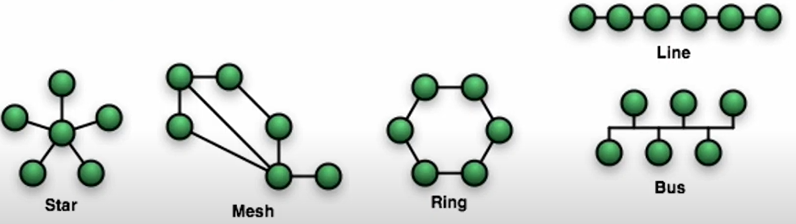
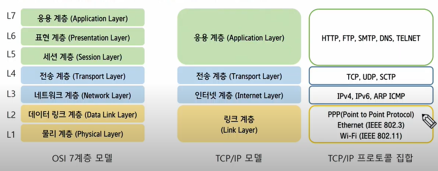
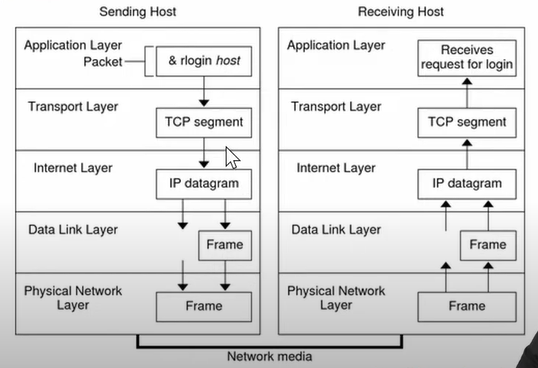
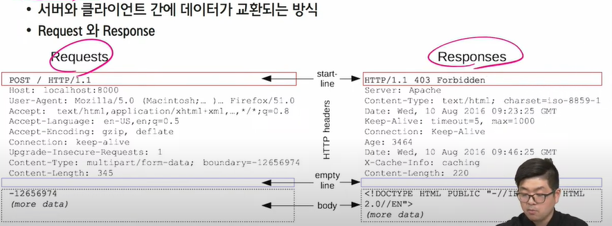
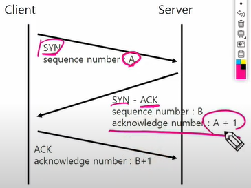
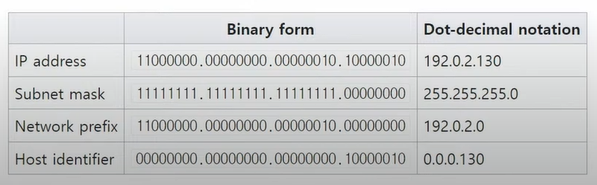
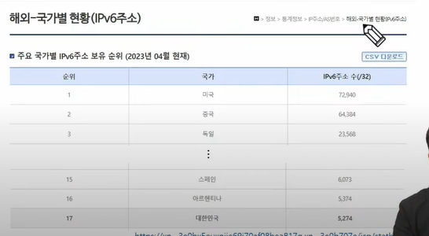

# Network  

## 네트워크 개요

> 네트워크란?  

두 개 이상의 컴퓨터 및 장치들이 연결되어 데이터를 주고 받을 수 있느 시스템 또는 구조  

 

> 네트워크 구성요소  

호스트(Host): 네트워크에 연결되어 데이터 통신이 가능한 장치, PC, 서버, 스마트폰 등이 포함된다. NIC(Network Interface Card: 랜카드)를 이용하여 네트워크에 연결된다.  

스위치(Switch): 네트워크 장치들을 연결한다. 네트워크 트래픽을 교환하고 전달  

라우터(Router): 여러 개의 네트워크를 연결. 패킷을 받아 최적의 경로를 선택하여 다른 네트워크로 전달하는 역할  

케이블 및 연결정치: 이더넷 케이블, 광섬유 케이블, RJ-45 커넥터 등이 네트워크 장치들을 연결하는 데 사용  

LAN: Local Area Network  
- 가정, 사무실 또는 건물과 같은 제한된 지리적 영역 내의 장치를 연결하여 리소스를 공유하고 서로 통신할 수 있는 네트워크 인프라  

WAN: Wide Area Network  
- 지리적으로 넓은 영역을 통과하는 네트워크를 의미, 여러 개의 LAN을 연결  
- 인터넷은 전세계의 네트워크와 장치를 연결하는 WAN으로 볼 수 있음  

  

> 네트워크 구성형태 (Network Topologies)  
- Star, Mesh, Bus, Ring, Tree, Line 등 다양한 형태가 존재  
- 효율성을 위해 이를 조합한 Hybird 형태의 네트워크를 구성  

  

<a href="https://ko.wikipedia.org/wiki/%EB%84%A4%ED%8A%B8%EC%9B%8C%ED%81%AC_%ED%86%A0%ED%8F%B4%EB%A1%9C%EC%A7%80">https://ko.wikipedia.org/wiki/%EB%84%A4%ED%8A%B8%EC%9B%8C%ED%81%AC_%ED%86%A0%ED%8F%B4%EB%A1%9C%EC%A7%80</a>  

Star: 주로 가정에서 쓰는 공유기  
Mesh: WAN을 구성하는 데 사용  

  

## 네트워크 모델  

> 네트워크 모델  

네트워크 통신 과정을 계층적으로 정의한 네트워크 통신 표준 모델  

## TCP/IP 모델

> 응용 계층 (Application Layer)  

응용 프로그램을 위한 정보(메시지) 교환 규칙 정의  

HTTP(Hypertext transfer Protocol): 웹 상에서 하이퍼텍스트 문서를 전송하기 위한 프로토콜 클라이언트와 웹 서버 간의 통신에 사용  

FTP(File Transfrer Protocol): 파일 전송을 위한 프로토콜  

SMTP(Simple Mail Transfer Protocol): 전자 메일의 송신을 위한 프로토콜, 메일 서버 간의 이메일 전송을 담당  

   

> 전송 계층(Transfer Layer)  

응용 프로그램을 위한 end-to-end 통신 서비스를 제공  

주요 프로토콜: TCP(Transfer Control Protolcol), UDP(User Datagram Protocol)  

TCP: 신뢰성 있는, 연결 지향적인 통신 및 데이터 전송, 패킷 재정렬 및 흐름 제어를 제공. 패킷 손실이 없으므로 파일전송(FTP), 웹서비스(HTTP) 등에 사용  

UDP: 패킷에 대한 확인 응답을 제공하지 않음. 신뢰성이 TCP에 낮은 반면, 오버헤드가 적어 비디오 및 음성 스트리밍에 적합  

   

> 인터넷 계층(Internet Layer)  

IP (Internet Protocol) 을 기반으로 사용  

데이터의 라우팅과 패킷 전송을 담당  
- 데이터를 패킷으로 분할하고, 목적지로의 경로를 결정하며, 패킷을 목적지까지 전송  

ICMP(Internet Control Message Protocol): 오류 보고, 혼잡 보고 등과 같은 다양한 네트워크 관련 기능에 사용  

   

> 링크 계층 (Link Layer)  

네트워크와 직접 연결되는 하드웨어적인 인터페이스를 제공  

PPP(Point to Point Protocol): 두 라우터 간의 직접적인 연결을 위해 일반적으로 사용  

Ethernet(IEEE.802.3): 유선 네트워크 프로토콜, LAN의 장치 간 데이터 전송 방식을 정의  

Wi-Fi(IEEE.802.11): 무선 네트워크 프로토콜  

  

## TCP/IP 프로토콜 데이터 통신  

사용자의 명령이나 메시지는 로컬 시스템의 TCP/IP 프로토콜 스택을 통과  

송신 호스트의 각 계층에 있는 프로토콜은 원본 데이터에 정보를 추가  

캡슐화(Encapsulation) - (TCP protocol)  
- 응용 계층: 데이터를 스트림 형태로 송신  
- 전송 계층: 응용 계층에서 받은 데이털르 세그먼트로 나누고 각 세그먼트에 헤더를 붙임  
- 인터넷 계층: 세그먼트를 패킷(IP 데이터그램) 단위로 만들고, 헤더에 송신 호스트의 IP 주소, 데이터 길이, 시퀀스 순서 등을 포함  
- 링크 계층: IP 데이터 그램 프레임으로 포맷, 전송이 정상적으로 이루졌는지 확인하는 CRC(Cyclic Redundancy Check)필드를 포함, 프레임 전송  

   

> TCP/IP 프로토콜 스택  

  

## 응용 계층 프로토콜  

HTTP(Hypertext Transfer protocol)  

HTML과 같은 하이퍼미디어 문서를 전송하기 위한 응용계층 프로토콜  

클라이언트-서버 모델을 따름  

상태 비보존(stateless) 프로토콜  
- 각각의 요청은 이전 요청과 독립적으로 처리  
- 모든 요청은 개별적으로 처리하고 응답을 반환한 후 클라이언트와 연결을 끊음  
- 서버는 클라이언트의 이전 요청이나 상태를 알지 못하며 
- 클라이언트도 서버와의 상태를 유지하지 않음  
- 클라이언트와 서버 간 상태를 공유해야 한다면 쿠키, 세션 등을 사용  

   

> HTTP 메시지  

<a href="https://developer.mozilla.org/ko/docs/Web/HTTP">https://developer.mozilla.org/ko/docs/Web/HTTP</a>

  

## 전송계층 프로토콜  

> 전송계층 (Transport)  

응용 프로그램을 위한 end-to-end 통신 서비스를 제공  

주요 프로토콜: TCP(Transmission Control Protocol), UDP(User Datagram Protocol)  

<a href="https://en.wikipedia.org/wiki/Transmission_Control_Protocol">https://en.wikipedia.org/wiki/Transmission_Control_Protocol</a>

  

## TCP  

> 3-way handshake  

TCP는 연결 지향적인 프로토콜. 연결이 확립된 후 데이터 전송이 가능   

연결을 확립하는 과정을 3-way handshake라 한다.  

1. 클라이언트는 서버에 연결 요청 (SYN)  
2. 서버 응답 및 연결 수락 (SYN-ACK)  
3. 클라잉너트 응답 및 연결 완료 (ACK)

  

## 인터넷계층 프로토콜  

IP Address
- 인터넷 규약 주소는 네트워크 장치(Host)를 식별하기 위해 사용하는 번호  

IPv4
- 주소가 32비트로 구성, 일반적으로 사용하는 IP 주소  
- 네트워크 ID, 호스트 ID로 구성됨  

서브넷 마스크 (Subnet Mask)  

  

   

IPv6  

주소가 128비트로 구성. IP 부족 해결, 보안 기능 추가, 패킷 크기 확장 등 ..

아직 많이 사용되고 있지 않음  

  

   

Division of the Ipv4 Classes  
- 넷 마스크 크기 고정, 가용 네트워크 및 호스트의 개수 고정  

   

CIDR(Classless Inter-Domain Routing)  
- 서브넷 마스크를 이용하여 할당된 네트워크를 논리적으로 분리하여 사용가능  
- 유연하게 서브넷을 구성할 수 있으므로 자원을 효율적으로 사용 가능  

<a href="https://cidr.xyz/">https://cidr.xyz/</a>