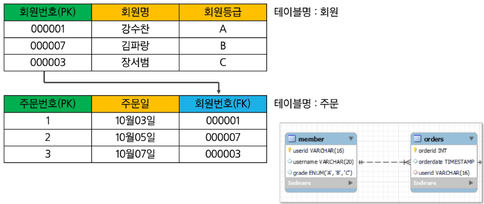

# DB  

## Database Modeling  

> 소프트웨어 개발 방법론(Software Development Life Cycle, SDLC)
1. 요구 분석
2. 시스템 명세
3. 설계
    - UI/UX 설계
    - DB 설계(Modeling)
4. 구현
5. 테스트
6. 유지보수 

  

> 데이터베이스 구성에 있어서 중요사항
1. 무결성
2. 확장성(유지보수)

  

> Database Modeling (데이터베이스 모델링)  

정보화 시스템을 구축하기 위해 어떤 데이터가 존재하는지 또는 업무에필요한 정보는 무엇인지 분석하는 방법  

관계형 데이터베이스는 이 '표'의 개념을 사용해서 데이터를 구성하는 방법을 사용  

  

 

> 데이터베이스 모델링 과정  

## 개념적 데이터베이스 모델링  

> Database Modeling (데이터 베이스 모델링)  

Database modeling 순서  

  

> 개념적 데이터베이스 모델링  

업무분석 단계에서 얻어진 내용을 토대로 우선 Entity를 추출하고 Entity내에 속성(Attribute)을 구성하며 Entity간의 관계를 정의해서 ER-Diagram을 정의하는 단계  

1. 사용자 부문의 처리현상을 분석한다.  
2. 중요 실체와 관계를 파악하여 ERD를 작성한다.  
3. 실체에 대한 상세 정의를 한다.  
4. 식별자를 정의하고, 식별자 업무규칙을 정한다.  
5. 실체별로 속성을 상세화한다.  
6. 필요한 속성 및 영역을 상세 정의한다.  
7. 속성에 대한 업무규칙을 정의한다.  
8. 각 단계를 마친 후 사용자와 함께 모델을 검토한다.  

   

   

개체 (Entity)  
- 사용자와 관계가 있는 주요 객체로써 업무 수행을 위해 데이터로 관리되어져야 하는 사람, 사물, 장소 사건 등을 개체(Entity) 라고 한다.  
- EX) 학생, 직원  

Entity 찾는 법  
- 영속적으로 존재하는 것(아닌 것은 변수로)  
- 새로 식별이 가능한 데이터 요소를 가짐(원자성)  
- Entity는 반드시 Attribute를 가져야 함  
- 명사적인 표현  

   

속성 (Attribute)   
- 저장할 필요가 있는 실체에 관한 정보  
- 개체(Entity)의 성질, 분류, 수량, 상태, 특성 등을 나타내는 세부사항  
- 개체에 포함되어 속성의 숫자는 10개 내외로 하는 것이 바람직함  
- 최종 DB 모델링 단계를 통해 테이블의 컬럼으로 활용  
- EX) 학생: 학번, 이름, 주민호, 전화번호, 주소, 입학일자, 학과  

속성의 유형  
- 기초 속성: 원래 갖고 있는 속성으로 현업에서 기본적으로 사용되는 속성  
- 추출 속성: 기초 속성으로부터 계산(가공)에 의해 얻어질 수 있는 속성  
- 설계 속성: 실제로 존재하지 않으나 시스템의 효율성을 도모하기 위해 설계자가 임의로 부여하는 속성  

   

식별자: 한 개체(Entity) 내에서 인스턴스를 유일하게 구분할 수 있는 단일 속성 또는 속성 그룹  
- 후보키(Candidate Key)
    - 개체 내에서 각각의 인스턴스를 구분할 수 있는 속성으로 기본키가 될 수 있는 후보 속성  
- 기본키(Primary Key)  
    - 개체(Entity)에서 각 인스턴스를 유일하게 식별하는데 가장 적합한 Key  
    - 기본키 설정 시 고려할 사항으로 해당 실체를 대표할 수 있을 것. 업무적으로 활용도가 높을 것, 길이가 짧을 것 등이 있다.  
- 대체키(Alternate Key)  
    - 후보키 중에서 기본키로 선정되지 않은 속성  
- 복합키(Composite Key)  
    - 하나의 속성으로 기본키가 될 수 없는 경우 둘 이상의 컬럼을 묶어서 식별자로 정의하는 경우  
- 대리키(Surrogate Key) 
    - 식별자가 너무 길거나 여러 개의 속성으로 구성되어 있는 경우에 인위적으로 추가할 식별자  

   

관계(Relation)  
- 정의  
    - 두 Entity간의 업무적인 연관성 또는 관련 사실 
- relation 분석  
    - 각 Entity간에 특정한 존재여부 결정  
    - 현재의 관계 뿐만 아니라 장래에 사용될 경우도 고려  

   

관계 (Relation)  
- E-R Diagram으로 관계를 설정하는 순서  
    1. 관계가 있는 두 실체를 실선으로 연결하고 관계를 부여  
    2. 관계 차수를 표시  
    3. 선택성을 표시  

- 차수성 (cardinality): 한 실체의 하나의 인스턴스가 다른 실체의 몇 개의 인스턴스와 관련될 수 있는가를 정의  
    - 경우에 따라 발생 횟수를 조사  
    - 양쪽 방향 모두 조사  

  

- 선택성 (optionality): 선택적으로(optional)인지 반드시 (mandatory)인지를 표시  
    - 일반적이고 상식적인 선에서 먼저 판단  
    - 항상 그 관계를 만족해야만 하는지 파악  
    - 관계가 만족되 않는 경우를 찾아보고 하나라도 만족되지 않는 경우가 있으면 optional로 표시  

  

   

차수성의 종류  
- 1:1 
    - 두 실체의 레코드가 서로 하나씩 대응  
- 1:N
    - 부모 실체의 하나의 레코드가 자식 실체이의 여러 레코드에 대응  
- N:N   
    - 양쪽 실체 간에 여러 개의 레코드와 관계를 맺을 수 있는 경우  

  

  

## 논리적 데이터베이스 모델링  

> 논리적 데이터 베이스 모델링  

개념적 데이터베이스 모델링 단계에서 정의된 ER-Diagram을 Mapping Rule을 적용하여 관계형 데이터베이스 이론에 입각한 스키마를 설계하는 단계와 이를 이용하여 필요하다면 정규하는 단계로 구성  

   

기본키(Primary Key)  
- 후보키 중 선택한 주 키  
- Null의 값을 가질 수 없다.(Not null)  
- 동일한 값이 중복해서 저장될 수 없다.(Unique)  

참조키, 이웃키 (Foreign Key)  
- 관계를 맺느 두 엔티티에서 서로 참조하는 릴레이션의 attribute로 지정되는 키  

   

Mapping Rule  
- 개념적 데이터베이스 모델링에서 도출된 개체 타입과 관계 타입 테이블 정의  

  

   

정규화(Normal Form, NF)  
- 정규화의 목적, 목표  
    - 중복 데이터를 없애고 관계를 단순하게 만든다.  
- 제 1 정규화(1NF): 원자성  
    - 모든 속성은 하나의 값만 가진다.  
- 제 2 정규화(2NF): 완전 함수적 종속(부분 종속 제거)  
    - 모든 속성은 기본키에 종속되어야 한다. 
- 제 3 정규화(3NF): 이행 종속 제거  
    - 기본키가 아닌 모든 속성 간에는 서로 종속될 수 없다.  

 

> 정규화

제 1정규화  
    - 1NF를 만족하는 도메인이 원자값이어야 한다.  
    - 반복되는 그룹 속성을 제거한 뒤 기본 테이블의 기본키르 추가해 새로운 테이블을 생성하고 기존의 테이블과 1:N 관계를 형성하는 과정  
    - 반복되는 그룹 속서이란 같은 성격과 내용의 컬림이 연속적으로 나타나는 컬럼을 말함  

정규화 적용 전 테이블  
- 문제점: 부수적인 데이터를 저장하기 위해 기본 데이터가 중복됨  

  

제 1 정규화에 의한 테이블 분리  

  

   

제 2 정규화  
- 복합키(Composite Primary Key) 전체적으로 의존하지 않는 속성 제거  
- 제 2 정규화의 대상이 되는 테이블은 키가 여러 컬럼으로 구성된 경우  
- 복합키의 일부분에 의해 종속되는 것을 부분적 함수 종속관계라하며 이를 제거하는 작업  

제 2 정규화에 의한 테이블 분리  

   

제 3 정규화  
- 기본키에 의존하지 않고 일반 컬럼에 의존하는 컬럼들을 제거한다.  
- 이행적 함수 종속관계를 갖는 컬럼을 제기하는 과정  

제 3 정규화에 의한 테이블 분리

   

최종 정규화 결과 관계 스키마  

  

  

## 물리적 데이터베이스 모델링  

> 물리적 데이터베이스 모델링  

논리적 데이터베이스 모델링 단계에서 얻어진 데이터베이스 스키마를 좀 더 효율적으로 구현하기 위한 작업  

DBMS 특성에 맞게 실제 데이터베이스 내의 개체들을 정의하는 단계  
- Column의 domain 설정(int, varchar, date, ...)

데이터 사용량 분석과 업무 프로세스 분석을 통해서 보다 효율ㅈ거인 데이터베이스가 될 수 있도록 효과적인 인덱스를 정의하고 상황에 따른 역정규화 작업을 수행  
- index, Trigger, 역정규화  

   

역정규화(DeNormalization)  
- 시스템 성능을 고려하여 기존 설계를 재구성하는 것  
- 정규화에 위배되는 행위  
- 테이블의 재구성  

역정규화 방법  
- 데이터 중복 (컬럼 역 정규화)  
- 조인 프로세스가 많아 시스템의 성능저하를 가져오는 경우  
- 파생 컬럼의 생성  
    - 기본적으로 테이블에 없는 컬럼을 숫자 연산이나 데이터 조작 드을 통해 조회할 때 새로운 정보를 보여주는 경우  
    - 판매테이블의 판매 금액 컬럼이나 성적 테이블의 총점과 평균  
- 테이블 분리  
    - 컬럼 기준으로 분리(컬럼 수)
    - 레코드 기준으로 분리 (레코드 양)  
- 요약 테이블 생성(Summary Table)
    - 조회의 프로세스를 줄이기 위해 요약된 정보만을 저장하는 테이블을 만드는 것  
- 테이블 통합  
    - 분리된 두 테이블이 시스템 성능에 영향을 끼칠 경우 고려  

## 동적 게시판 생성을 위한 모델링 실습(with Naver Cafe)  

생략...

MySQL임.