# OOP  

## S/W 품질과 OOAD  

> 품질 좋은 S/W란?  

모든 기업들이 목표로 하는 것: "품질"  

품질이 좋은 S/W의 조건  

- 분석이 분명하고, 쉬워야한다.  
    - 분명하면서 이해가 잘 되어야 한다. 
    - 복잡도가 낮아야 한다.  

- 설계간 탄탄해야 한다.     
    - 유지보수가 효과적이어야 한다.  
    - 테스트가 좋아야 한다.  
    - 확장이 쉬워야 한다.  

`분석/ 설계/ 구현에 빈틈이 없어야 한다.`  

구성원들이 같은 청사진을 갖고, 정형화된 개발 프로세스를 통해 빠르게 개발을 해야한다.  

- 개발하기 전 분석과 설계를 철저히 한다.  
- 분석과 설계에 miscommunication 없도록, 문서화 한다.  
- Agile 개발 프로세스  
- 코드리뷰/ TDD / Clean Code 등...

<hr>  

> OOAD(Object-Oriented Analysis and Design)  

OOAD  
- 객체기반으로 개발되는 S/W에 대한, 분석과 설계 방법을 뜻한다. 
- 분석, 설계의 산출물: Diagram 기반 모델링 언어를 통한 문서화  

OOAD 학습 목표  
- 객체지향개발을 학습한다.  
- 객체지향 모델링 언어를 학습한다.  
- 객체지향 분석과 설계를 직접하고, 모델링 언어로 산출물을 만들어낸다.  

<hr>  

## OOP 개요 1 - 객체지향이 개발에 필요했던 이유 1

> 절차 지향 개발  

커피숍 운영 시뮬레이션  
- 절차대로 개발한다.(알고리즘, 기능 위주)  

```java
public static void main(String[] args) {
    // TODO Auto-generated method stub  

    printMenu();

    Scanner sc = new Scanner(System.in);
    int n = sc.nextInt();
    sc.close();

    int cup = 0;
    if (n == 1) cup = makeAmericano();
    if (n == 2) cup = makeLatte();

    System.out.println(cup);
}
```

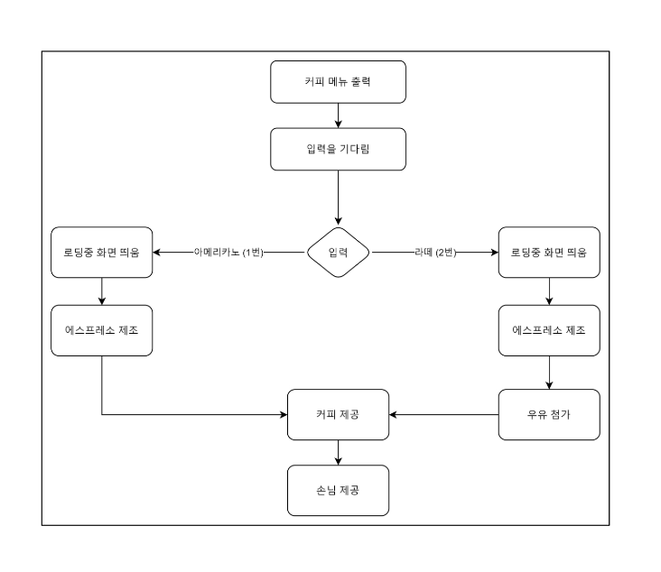  

혼자 개발하는데 지장이 없음

큰 규모의 커피숍을 운영하기 위해서는 세세하게 신경써야할 내용이 너무 많아짐.
- 독립적으로 수행하는 역할을 나누어 운영하는 시스템화가 필요하다.  

<br>  

> 3 명의 객체가 독립적인 역할을 수행 

세 명의 독립적인 역할을 수행  
- 담당 내용의 일부가 바뀌더라도, 다른 사람에게 영향을 받지 않음  

음식이 추가되더라도, 다른 사람에게 영향을 미치지 않음  

서빙 방법을 바꾸더라도, 다른 사람에게 영향을 안 끼침  

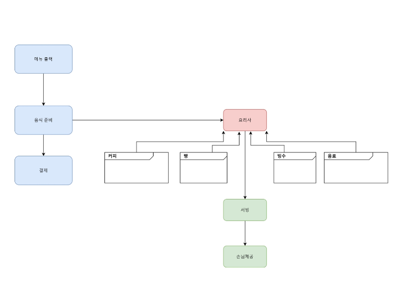  

<br>  

> 재사용성이 좋다.  

커피숍이 아닌 새로운 한정식집을 오픈해도 요리사만 교체하고, 다른 모듈을 그대로 재사용 가능  

<hr>  

> 절차지향개발  

함수 기반으로 절차적 프로그래밍  
- 여러 용도로 쓰이는 함수들이 많아짐으로써, 소스코드 변경 시, 여러 곳에 영향을 끼쳐 유지보수가 어렵다.  
- 협업이 어렵다.  
    - 역할 분배/ 기능 추가로 인해 Side Effect 논의 필요  

절차지향
- 데이터와 동작이 구분되어 있다.

객체지향  
- 데이터와 동작이 묶여 있다.
- 캡슐화

<hr>

## OOP 개요 2 - 객체지향 개발 방법이 필요했던 이유 2

> 재사용성에 대한 이해  

스타1 -> 스타2  
- 기존 함수를 그대로 사용 불가  
- 소스코드 분석 후 수정 필요.  

<hr>  

> 클래스의 등장  

객체 단위로 구현하기 시작  
- 클래스로 객체를 구현한다.  
- 클래스: 변수, 함수를 묶어준다. (캡슐화한다.)
- 클래스를 통해 객체를 만든다.
- 혼자서 모든 것을 해결하는 것이 아니라 객체끼리 협력

C언어  
- 전역변수 / 함수 중심의 개발  

C++ / Java / Python  
- 클래스 (전역변수 + 함수) 중심의 개발  

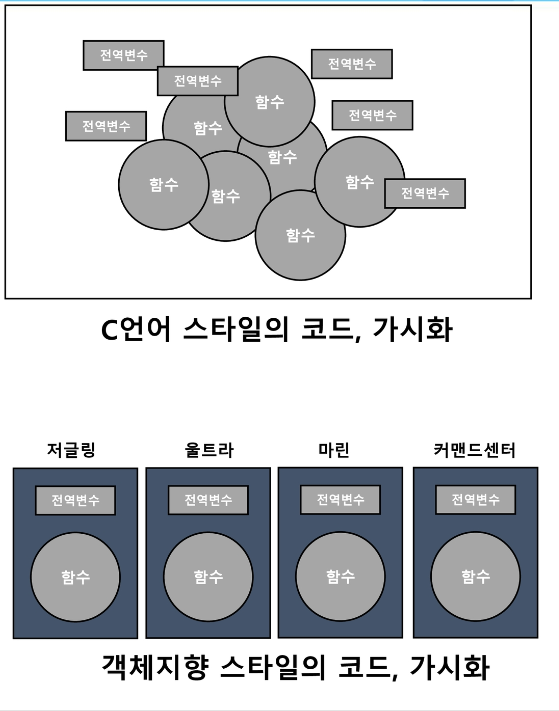  

<hr>  

> 객체 지향의 장점  

부속품과 같이 내부에 대한 학습없이, 그대로 가져다 쓸 수 있음  
- 재사용성이 좋다.  

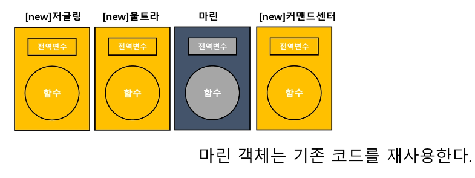

<hr>

> 정리. 객체지향의 장점  

유지보수성이 좋다.  
- 연관된 클래스만 코드를 변경하면 된다.  
- 절차지향에 비해, 유지보수하기 편리하다.  

재사용성이 좋음  
- 만들어 둔 객체를 다른 곳에서도 쓸 수 있음  
- 외부에서 만든 객체를 가져다 쓰기 편리하다.  

협업이 가능하다.  
- 절차지향에 비해, 담당 파트를 정하기 편리하다.  

<hr>  

## 클래스 다루기 - 클래스를 간단히 구현해본다. 

> Marine Class 제작  

용어 이해하기  

클래스 / 인스턴스(객체) / 필드 / 메서드  

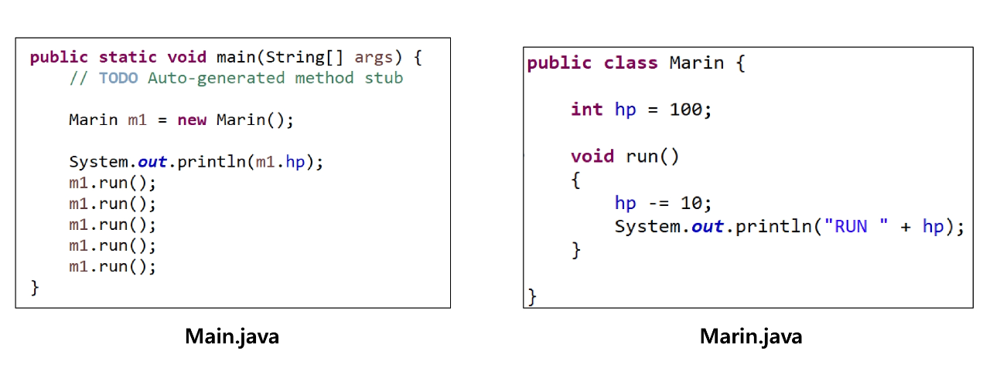  

```py
class Something:
    def __init__(self):
        self.var = 0

    def print(self):
        self.var -= 10

s = Something()
s.print()
```

<hr>  

> [도전] Class /Instance 생성  

Zergling Class ㅈ제작  
- hp, mana: 기본 값 80, 200
- attack 메서드  
    - hp 1 증가
    - mana 10 감소  
- move 메서드  
    - hp 10 감소
    - mana 5 증가  
- status 메서드  
    - 현재 hp와 mana 값 화면 출력  

Instance 2개 생성 후 동작 테스트하기  

```py
class Zergling:
    def __init__(self):
        self.hp = 80
        self.mana = 200

    def attack(self):
        self.hp += 1
        self.mana -= 10

    def move(self):
        self.hp -= 10
        self.mana += 5

    def status(self):
        print(f"hp: {self.hp} mana: {self.mana}")
```

<hr>

## Coupling: 어떤 모듈이 다른 모듈에 의존하는 정도  

> 변경하다의 의미  

소스코드가 **요구사항에 의해** 수정되는 것  
1. 메서드 / 필드 수정, 제거  
2. 메서드 / 필드 이름 변경  
3. Parameter / return 값 변경  
...

<hr>

> 클래스에서 의존  

A 클래스가 B 클래스에 도움을 받으며 동작될 때, A 클래스는 B 클래스가 없으면 안되는 상황이 된다.  

이 때 A클래스는 B클래스를 의존한다. 라고 표현한다.  

<hr>  

> 다른 클래스에 의존하면?  

A가 B Class에 의존할 때, 발생할 수 있는 일  
- 만약 B클래스의 변경이 일어나면, A 클래스도 변경을 해야할 수 있다.  

<hr>  

> 의존도 = 결합도 (Coupling)  

의존하는 정도를 결합도(Coupling)이라고 부른다.  

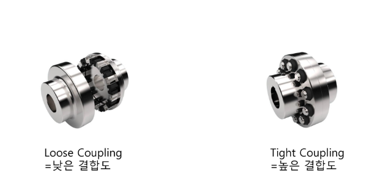  

<hr>  

> Server Code와 Client Code  

Server Code  
- Client 요청을 받으면, 처리해주는 코드  
- Library == Server Code  

Client Code  
- Server Code에게 일을 요청하는 코드  
- Library 사용자 == Client Code  

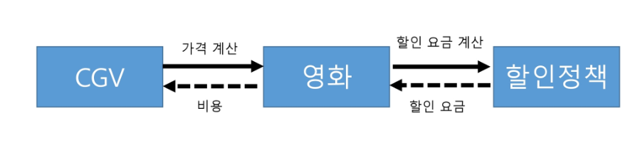  

<hr>  

> 도전 Calculator 제작  

Server Code 구현  
- Calcuator Class 제작  
- plus / minus / divide / multiple 메서드  
- 두 수를 받고, 계산 결과를 result 필드에 저장  

printResult 메서드
- result 결과를 화면에 출력  

Client Code 구현   
- 인스턴스 생성 후, 메서드 호출  
- printResult 메서드 호출하여 결과 확인  

```py
# 간단한 예시
class Calculator:
    def __init__(self):
        self.result = 0

    def plus(self, value):
        self.result += value

    def divide(self, value):
        if value == 0:
            print("0으로 나눌 수 없습니다!")
            return  
        self.result /= value
    
    def printResult(self):
        print(f"result: {self.result}")

a = Calculator()
a.plus(100)
a.printResult()
a.divide(10)
a.printResult()
```

<hr>  

## 캡슐화 - Server와 Client Code 관점에서 캡슐화를 이해한다.  

읽지 않는 Readme 내용  
- 해당 클래스를 사용할 때, divided에 0이 되지 않도록 하시오.
- result 변수를 사용하지 마시오.  

Server Code Level 에서 이를 제한해야 한다.  

<hr>

> 캡슐화  

캡슐
- 데이터와 필드를 넣는다.  
- 허용하는 데이터 / 필드로만, 데이터 제어 가능  
- 허용하지 않는 데이터 / 필드 접근 막음. 은닉한다.  

- 서버와 클리언트가 구분된다. (외부와 내부가 구분된다.)  
- 클라이언트에서는 서버의 인터페이스만 이용해서 동작시킨다.  
- 서버 측은 구현을 바꿀 수 있다. 변경사항에 대해 클라이언트가 여파가 없도록

[번외]
> 추상화

중요한 부분만 드러낸다.  

구체적인 것들은 감춰준다.  

<hr>

> 캡슐화의 장점  

- Server Code가 허용한 방법대로 Client Code를 작성하도록 유도한다.  


<hr>  

> 도전 GameMachine Class 제작  

캡슐화  

inputCoin(집어 넣을 코인 수)
- 코인은 최대 5개까지 넣을 수 있음  
- 입력된 코인이 10보다 클 수 없음  

playGame()  
- 1코인씩 감소된다.  

집어넣을 코인이 얼마나 되는지 확인할 수 있는 메서드가 필요  

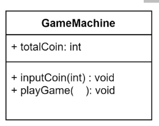

<hr>

> 상속 - OOP에서 상속의 의미

> 상속의 개념  

상속  
- 부모가 가진 요소들을 자식들이 물려받아 사용할 수 있음  

OOP 상속  
- 부모 / 자식 관계로 보기 어려움  
- 코드의 중복 받ㅇ지를 위해 공통적인 요소를 일반화 시킴  

```java
// 예시
class Machine {
    String ver;
}

class Robot extends Machine {
    void run() {
        System.out.println("HI");
    }
}

public class Main {
    public static void main(String[] args) {
        Robot a = new Robot();

        a.run();
        a.run();
        a.ver = "1.99";
    }
}
```

<hr>  

> 중복되는 코드의 문제점  

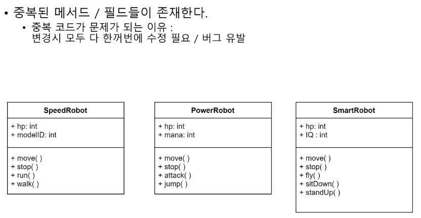

<hr>  

> 도전 Generalization (일반화) 시키기  

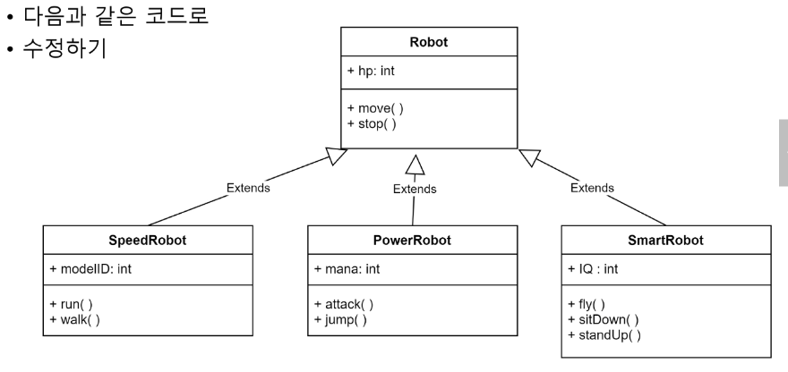

<hr>

> 용어 정리  

Super Class / Sub Class (상위 / 하위)  

Base Class / Derived Class (기원 / 종류)  

부모가 할 수 있는 것은 자식이 할 수 있어야 한다.(다형성)

<hr>  

객체와 분류 관계  

많은 표현이 있다.  
- 'is a' 관계   
- 국내: "is a kind of " 관계  
- 객체와 분류  

<hr>  

> Overloading / Overriding  

Overriding
- Super Class 메서드 재정의  

Overloading  
- 같은 이름의 메서드이지만, 다른 Argument로 함수 구분  

<hr>

> 다형성 - poly mrophism  

다양하게 변화하는 성질  

한 객체가 다양한 타입을 담을 수 있는 형태  
- 상속 관계 구현하여 다형성  

[참고]  

함수 바인딩  

컴파일 바인딩 (이른 바인딩)

런타임 바인딩 (늦은 바인딩) 

<hr>

## Interface 개요 - OOP에서 interface 개념잡기  

> Interface 의미  

접점  
- 두 개 시스템 사이의 경계면  

<hr>  

> S/W Interface  
- 내부에 접근하기 위한 공통적인 형태  
- 사용자는 Interface만 알고 있으면, 쉽게 함수를 사용할 수 있다.  
- 표준 규격을 만들어 놓고, 표준 규격을 사용하는 Server 코드로 구현해둠  
- 어떤 전기를 쓸지는 Client Code에서 선택  

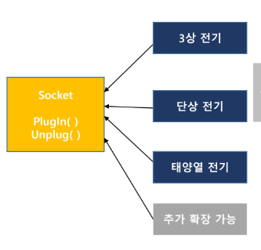


... 이하 내용은 추후에 공부하도록 하자!
