# Information Secuirty

## 보안 분야  

- Web Hacking 
- Reverse Engineering  
- Network  
- Cryptography
- Digital Forensic
- System Hacking  

<hr>  

## Cryptography 

어떤 정보를 보호하기 위한 방법  

Plaintext(평문)  
- 보호해야할 데이터, 메시지  

Ciphertext(암호문)  
- 평문을 암호적으로 변환한 것  

<hr> 

> Caesar Cipar(카이사르,시저 암호)  

로마의 황제 율리우스 카이사르가 사용한 암호 방식으로 고전 암호 방식 중 하나  

```
A -> C
B -> D
C -> E
...
```

```py
def main():
    chipher_text = "IFMMP TTBGZ"

    ## ROT - 1 ~ 25
    
    for rot_count in range(1, 27):
        print(f"rot_count: {rot_count}", end=" ")

        for chipher_char in chipher_text:
            if chipher_char == " ":
                print(" ", end="")
                continue
                
            print(chr((ord(chipher_char) + rot_count) % 26 + ord("A")), end="")
        
        print()

if __name__ == '__main__':
    main()
```
<hr>

> Subsititution Cipher  

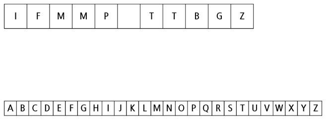  

<hr>  

> RON-T  

Rotation N의 의미로 N만큼 이동시켜 만드는 암호  

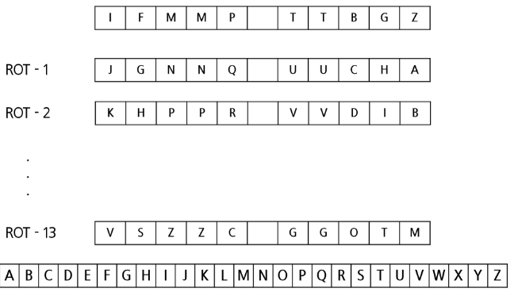  

<hr>  

> Symmetric-key  

암호화, 복호화에 동일한 키를 사용하는 암호 방식  

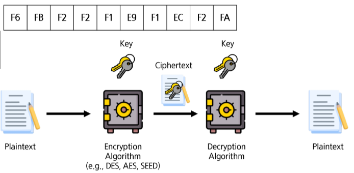  

```
A xor B = C  
C xor B = A
```

<hr>  

> Asymmetric-key  

암호화, 복호화에 서로 다른 키를 사용하는 방식  
- 소수, 소인수분해, 타원 곡선, 모듈러  

Public Key: 외부에 노출되어 사용하는 키  
Private Key: 내부에서만 사용되는 키  

<br>  

> Asymmetric-key (Encryption with public key)  
암호화, 복호화에 서로 다른 키를 사용하는 방식  

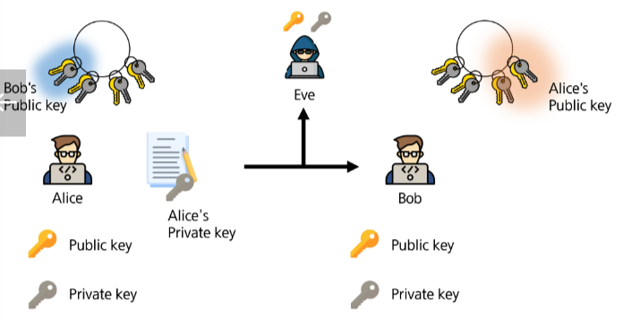  

<hr>

> Encoding / Decoding  

어떤 데이터를 온전히 보내기 위한 방법  
- 사용하는 시스템마다 처리 방식이 다를 수 있다.  

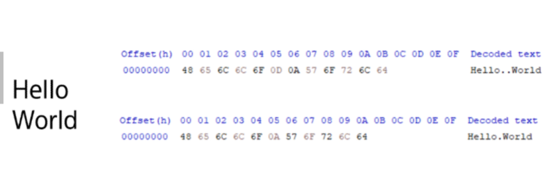  

<hr>  

> Hash  

어떤 데이터를 정해진 크기로 변환하는 것  

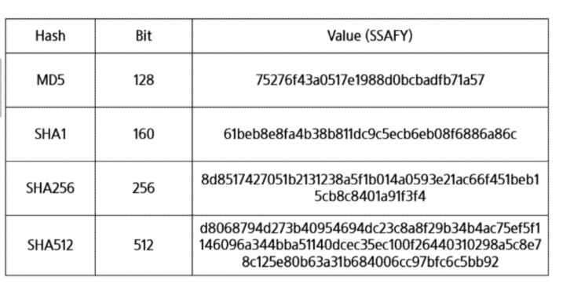  

<br>  

> Hash - 구성 원칙  

|원칙|설명|
|:---:|:---:|
|압축성|다양한 길이의 데이터에 고정된 크기를 출력해야 한다.|
|효율성|어떤 입력 값에도 적은 자원과 계산 속도가 빨라야 한다.|
|단방향성|해시 결과 값으로 입력값을 계산하는 것이 불가능 해야 한다.|  
|충돌회피성|하나의 해시값으로 서로 다른 입력 값을 찾기 어려워야 한다. <br> 입력 값 하나와 해시 값을 통해 다른 입력 값을 찾기 어려워야 한다.|

<hr>

## Digital Forensic

> Ransomeware  

  

파일을 암호화되었다고 전문가의 도움없이 복호화하려는 시도.  

더 이상 진행이 되지 않게 하고자 서버의 전원을 차단하는 행위  

비트코인과 같은 금전적 요구에 응하는 행위  

<br>  

휘발성 & 비휘발성  

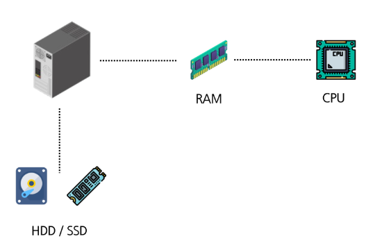  

<br>  

RSA Algorithm(Ron Riveest, Adi Shamir, Leonard Adleman)  

서로 다른 두 소수를 이용해 소인수 분해하기 어려운 값을 생성하여 암호화하는 방식  

- 143이라는 수를 소인수 분해한다면?  
- 98257655989라는 수를 소인수분해 한다면?  
- 300 자리 이상의 소수를 사용한다.  

<hr>

> Volatility  

<a href="https://github.com/volatilityfoundation/volatility3">https://github.com/volatilityfoundation/volatility3</a>

<hr>

FTK Imager / EnCase  

<a href="https://www.exterro.com/ftk-imager">https://www.exterro.com/ftk-imager</a>

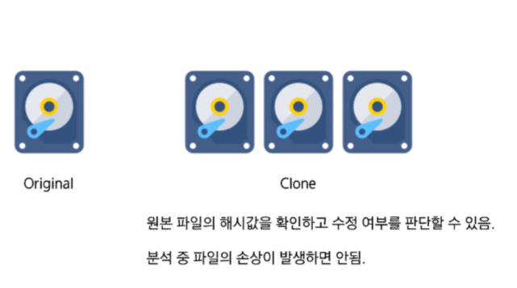

<hr>

## Reverse Engineering  

> Reverse Engineering  

어떤 바이너리, 코드 등을 분석하여 핵심 기능을 파악하는 것  

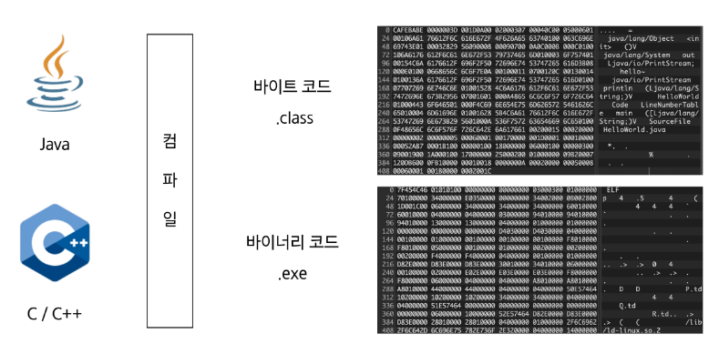

<hr>  

> Register  

RAX: 산술 연산, 함수의 리턴 값을 저장  
RBX: 데이터의 주소를 가리키는 포인터  
RCX: 반복문의 횟수와 같은 루프  
RDX: 산술 연산, I/O 명령  
RSI: 데이터의 복사나 조작 시 Source 주소  
RDI: 데이터의 복사나 조작 시 Destination 주소  
RBP: 스택의 시작 지점 
RSP: 스택의 끝 지점  

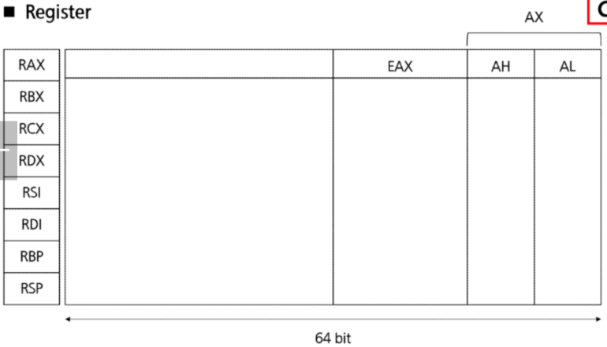

<hr>  

> Assembly Language  

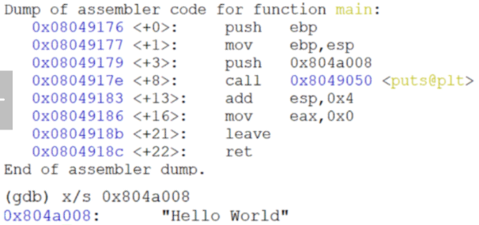
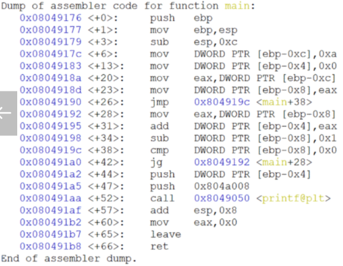  

<hr>  

> Reverse Engineering  

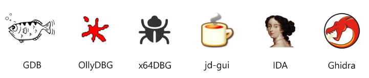

<hr>

## System Hacking (Pwnable)  

> Buffer Overflow  

데이터의 저장 크기를 넘겨 시스템 주소를 조작하는 방법  

```cpp
# include <stdio.h>

int main(void) {
    char char_list[16];
    int num = 0xAAAAAAAA;

    printf(">>>");
    scanf("%s", char_list);

    printf("%x\n", num);
    return 0;
}
```

<hr>

## Network Hacking  

> Dos (Denial of Service)  

특정 서버의 서비스를 제공하지 못하게 하는 공격  

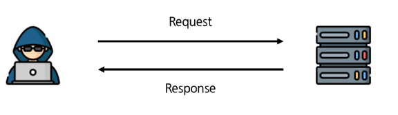
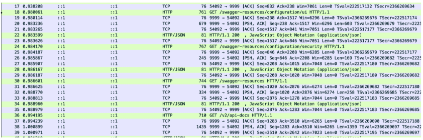
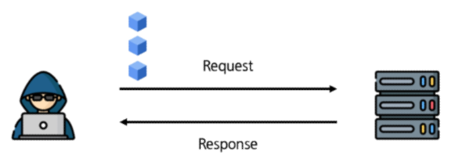
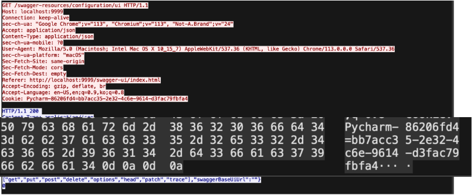
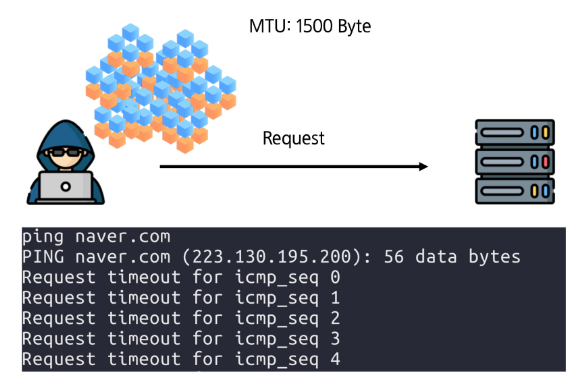

<hr>  

> DoS (Denial of Service) - Land Attack  

특정 서버의 서비스를 제공하지 못하게 하는 공격 Local Area Network Denial Attack  

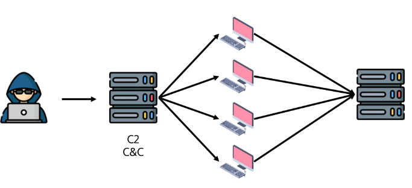

<hr>  

> DDos(Distributed Denial of Service)  
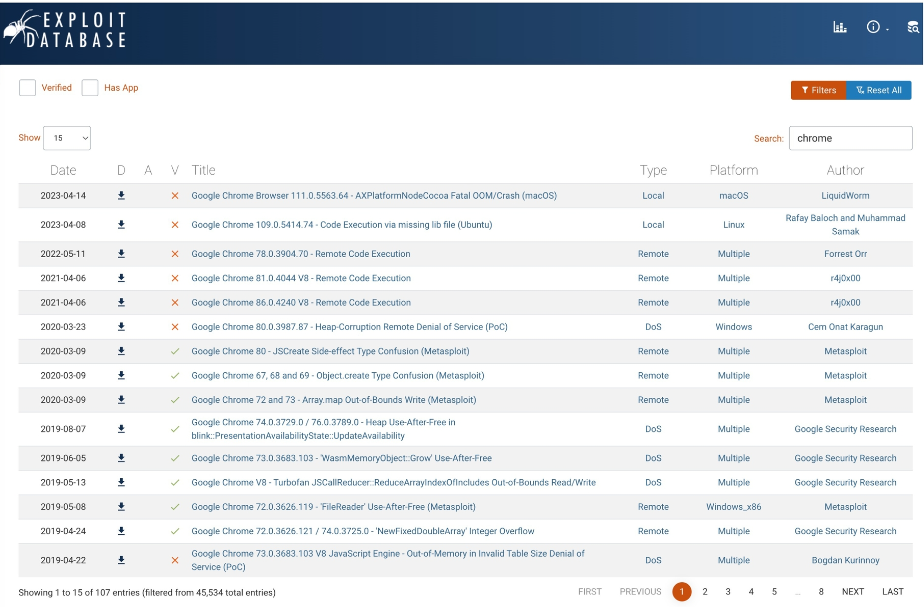

<hr>  

> DRDos(Distributed Reflection Denial of Service)  
특정 서버의 서비스를 제공하지 못하게 하는 공격  

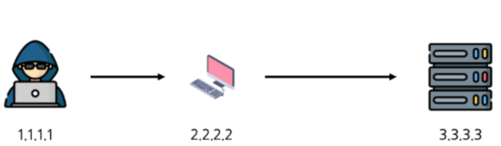  

...

<hr>

## Web Hacking  

> Web Hacking  

웹 서비스에서 제공되는 포인트 (Front, Back, DB, ...)의 취약점을 찾아 권한을 우회하고 정보를 탈취하는 행위  

XSS(Cross-Site Scripting)

SQLi(SQL Injection)  

<hr>  

> XSS(Cross-Site Scripting)  
웹 서비스에서 악성 스크립트를 삽입하여 쿠키, 세션 등을 탈취할 수 있는 공격 기법  

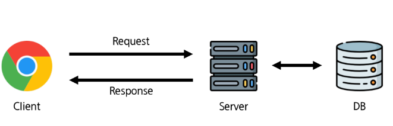

```html 
<html>
  <head>
  </head>
  <body>
    <h1> XSS Test </h1>
    <script>alert('SSAFY')</script>
  </body>
</html>
```

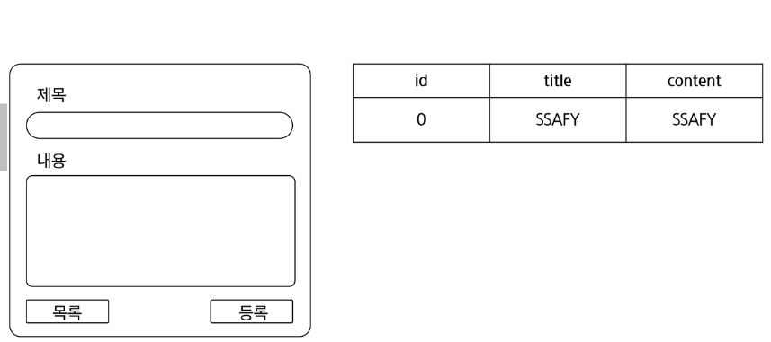  
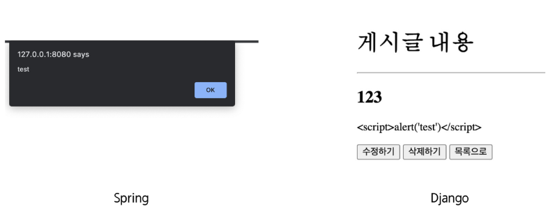
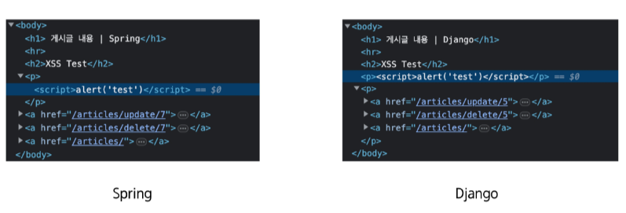
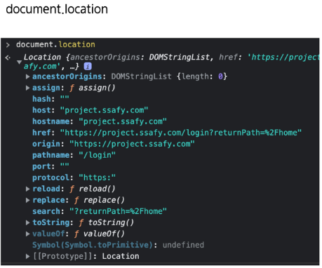

<br>  

> SQLi(SQL Injection)  

웹 서비스에서 SQL 구문을 삽입하여 정보를 탈취할 수 있는 공격 기법  

```sql
SEELCT * FROM user WHERE id = "SSAFY" AND password = 'SSAFY'
```