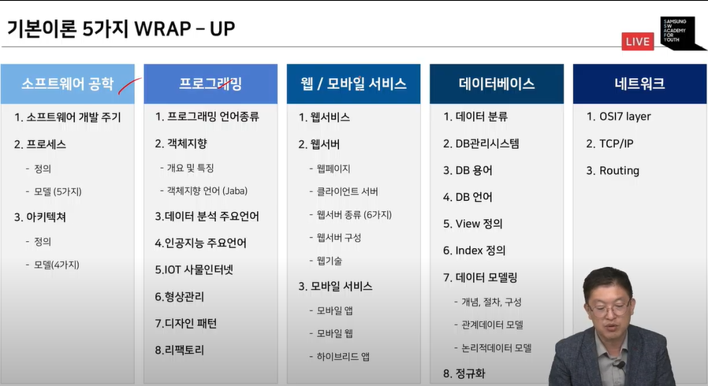
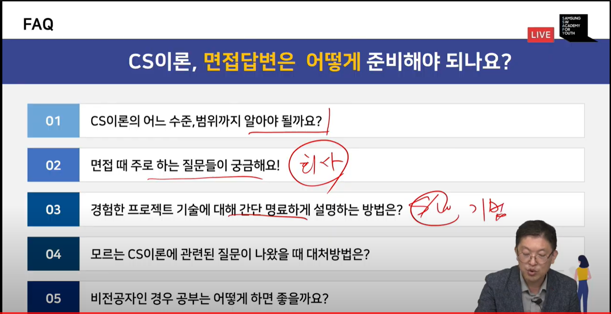
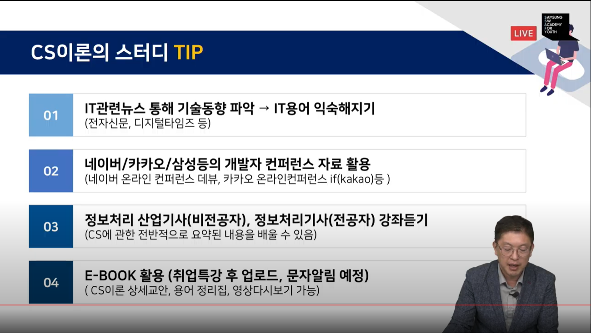

# CS 기본

> CS 기본이론의 필요성  
1. 컴퓨터(시스템)에 대한 이해 (컴퓨터와 제대로 소통하기)
2. 자료구조, 알고리즘 활용법(일의 효율을 높이기)
3. Coder에서 Developer로 성장  
4. 기업목적에 다른 기본적 CS 지식이 필요(게임회사, SNS 회사 등...)

> CS 개요  

|건축|목적|소프트웨어|
|:---:|:---:|:---:|
|건축도면|어떻게 만드느냐|소프트웨어 공학|
|건축도구|무엇으로 만드느냐|프로그래밍언어/프레임워크|
|주거/오피스/호텔/창고|왜 만드느냐|데이터(데이터베이스/빅데이터)|

> CS 이론 5가지

1. 소프트웨어 공학
2. 프로그래밍
3. 데이터베이스
4. 컴퓨터 시스템
5. 네트워크

### 소프트웨어 공학

> 소프트웨어 공학 기출문제

1. 소프트웨어 위기에 대해서 설명하시오.
2. 소프트웨어 공학이 필요한 이유는 무엇인지 설명하시오.
3. 소프트웨어 개발 경험과 소프트웨어 개발 시 적용한 개발 방법론이 있다면 설명하시오.
4. 소프트웨어 프로젝트 진행 경험에 대해서 설명하시오.

   

> 소프트웨어 개발 생명 주기

계획 단게에서 유지보수 단계에 이르기까지 일어나는 일련의 절차  

1. 정의 단계  
타당성 > 개발 계획 > 요구사항 분석  
- 사용자의 요구사항 확인 및 타당성 검토
- 개발에 필요한 요구사항 명세화
2. 개발 단계  
설계 > 개발 > 테스트
- 코딩을 통한 프로그램 개발
- 단위/통합/시스템/인수/설치 테스트
3. 유지보수 단계
유지보수 > 폐기  
- 시스템 운영 및 운영 중 발생한 문제점들에 대한 유지보수
- 새로운 시스템 개발로 인한 기존 시스템 폐기  

  

> 소프트웨어 개발프로세스 정의 

사용자의 요구사항을 SW로 구현하기 위한 절차, 과정  
사용자의 목적을 이루기 위한 기획, 프로젝트 관리 드을 포함한 절차, 과정, 방법  

소프트웨어개발 7단계: 계획 -> 요구분석 -> 설계 -> 구현 -> 테스트 -> 반영 -> 유지보수  

  

> 소프트웨어 위기에 대해서 설명하시오.  

소프트웨어의 위기란?  
소프트웨어 공학 초기에 사용된 용어로 정돈된 주체가 되기 이전에 사용. 급격한 컴퓨터 계산용량과 문제의 복잡성이 증가함에 따라 발생한 충격을 서술하기 위하여 사용. 본질적으로, 이는 정확하고 이해할 수 있고, 검증 가능한 컴퓨터 프로그램을 작성하는 것이 얼마나 어려운가를 뜻한다.

  

> 소프트웨어 프로세스 모델(1)

1. 폭포수 모델  
2. 프로토타입 모델  
3. 나선형 모델  
4. 통합프로세스 모델  

   

> 소프트웨어 프로세스 모델(2)  

1. 애자일 프로세스 모델  
- 애자일(agile): 날렵한, 민첩함  
- 고객의 요구에 민첩하게 대응하고 그때그때 주어지는 문제를 풀어나가는 방법론  
- 애자일의 기본 가치(애자일 선언문)  
- 프로세스와 도구 중심이 아닌, 상호 소통 중시  
- 문서 중심이 아닌, 실행 가능한 소프트웨어 중시  
- 계약과 협상 중심이 아닌, 고객과의 협력 중시  
- 계획 중심이 아닌, 변화에 대한 민첩한 대응 중시  
- 수익의 영향력이 더욱 커진 모습  

  

> 소프트웨어 공학이 필요한 이유는 무엇인지 설명하시오.  
ex) 소프트웨어 공학은 소프트웨어 개발, 운용, 유지보수 등 단계를 체계적으로 다루는 학문이라고 합니다. 제가 생각하는 소프트웨어 공학은 SSAFY에서 진행했던 프로젝트에서 단기간에 원하는 목적으로 이루기 위해서 소프트웨어를 기획하고, 설계하고, 구현하고, 테스트하고, 보완하는 과정을 걸쳤는데, 이 과정을 체계적으로 정리하고, 이를 공유하느 과정이 하나의 소프트웨어 공학이 아닌가 생각합니다.  

  

> 소프트웨어 아키텍처의 종류  

1. 데이터 중심형 모델  
2. Client-Server 모델  
3. Layering 모델  
4. Model/View/Controller 모델  

   

### 프로그래밍 언어

> 프로그래밍 기출 문제  

5. 자바와 c의 차이를 설명하시오.  
6. JVM 가비지컬렉션 동작 과정을 설명하시오.  
7. JAVA에 적용된 OOP에 대해서 설명하시오.
8. 형상관리 활용 경험을 설명하시오.  
9. 리팩토링이란 무엇인지 설명하시오.  

  

> 객체지향(1)  

객체지향 개요  
- 소프트웨어 객체는 현실 세계의 객체를 필드와 메서드로 모델링한 것  
- 소프트웨어 객체는 상태를 필드(Field)로 정의하고, 동작을 메서드(Method)로 정의  
- 필드는 객체 내부에 '선언된 변수'를 의미하고, 메서드는 개체 내부에 '정의된 동작'를 의미함  

절차지향  
- 일련된 동작을 순서에 맞추어 단계적으로 실행하도록 명령어를 나열  
- 데이터를 정의하는 방법보다는 명령어의 순서와 흐름에 중점  

객체지향  
- 현실 세계를 객체 단위로 프로그래밍하며, 객체 필드(데이터)와 메서드(코드)를 하나로 묶어서 표현  
- 유연하며, 유지, 보수가 간편하며, 직관적으로 코드를 분석할 수 있다.

  

> 객체지향 프로그래밍 언어 - java  

- Interpreted 환경  
- 한 개 이상의 thread를 사용할 수 있다.
- 동적으로 program을 변화시킬 수 있다.
- Code 자체적으로 Security를 보장  

1. Java Virtual Machine  
2. Garbage Collection  
3. Process의 개념  
4. Thread의 개념  

멀티태스킹, 멀티프로세싱, CPU 멀티 thread, 멀티 thread ...
 
- 병행성 문제 -> Thread에서의 동기화로 해결  

  

> 형상관리(1)  

주요 기능: 버전관리, 리비전 관리, 소스관리, 소스코드 관리  

SVN, git  

  

> 빌드도구  
소스코드를 컴파일, 테스트, 정저 분석 등을 실시하여 실행 가능한 애플리케이션으로 자동 생성하는 프로그램 (프로젝트를 진해앟며 시간이 지남에 따라 라이브러리의 버전을 자동으로 동기화)  

ANT, MAVEN, Gradle

  

> 디자인 패턴  

주자 사용하는 설계 형태를 정형화해서 이를 유형별로 설계 템플릿을 만들어둔 것  
많은 개발자들이 경험상 체득한 설계 지식을 검증하고 이를 추상화하여 일반화한 템플릿  
클래스 라이브러리 구현 시, 다자인 패턴이 적용된다.  

  

> 디자인 패턴의 3요소  

- Creational Patterns
- Structural Patterns
- Behavioral Patterns

  

> 리팩토링  

설계 계선  
나쁜 구조를 개선하는 것  
- 결과의 변경없이 코드만 변경  

  

### 자료구조  

자료를 효율적으로 표현하고 저장하고 처리할 수 있도록 정리하는 것  

  

### 데이터베이스  

12. View에 대해 설명하시오.  
13. 인덱스에 대해 설명하시오.  
14. No SQL의 장점을 설명하시오.  

  

> 데이터 종류  

1. 정형 데이터  
2. 비정형 데이터  
3. 반정형 데이터  

   

> 데이터베이스 용어  

1. 스키마  
- 데이터베이스에 저장되는 데이터 구조와 제약조건을 정의한 것  
2. 인스턴스  
- 스키마에 따라 데이터 베이스에 실제로 저장된 값  
3. 데이터 독립성  
- 하위 스키마를 변경하더라도 상위 스키마가 영향 받지 않는 특성  
- 논리적 데이터 독립성 - 개념 스키마가 변경되어도 외부 스키마는 영향 X
- 물리적 데이터 독립성 - 내부 스키마가 변경되어도 개념 스키마는 영향 X

  

> View의 정의  

관계형 데이터베이스의 데이터베이스 언어 SQL에서 하나 이상의 테이블(또는 다른 뷰)에서 원하는 모든 데이터를 선태갛여, 그들을 사용자 정의하여 나타낸 것  

데이터를 실제로 저장하지 않고 논리적으로만 존재하는 테이블이지만, 일반 테이블과 동일한 방법으로 사용함.  

  

> 인덱스의 정의  

데이터베이스 분야에 있어서 테이블에 대한 동작의 속도를 높여주는 자료구조  
인덱스는 테이블 내의 1개의 컬럼, 혹은 여러 개의 컬럼을 이용하여 생성  
고속의 검색 동작뿐만 아니라 레코드 접근과 관련 효율적인 순서를 매김. 동작에 대한 기초를 제공  

  

> 제약조건  

1. 무결성 제약조건
2. 개체 무결성 제약조건  
3. 참조 무결성 제약조건  

  

> 데이터 모델의 개념  

- 데이터 모델링  
- 2단계 데이터 모델링  
- 개체-관계 모델  
- 개체-관계 다이어그램  

  

> 이상(anomaly) 현상: 불피룡한 데이터 중복으로 인해 릴레이션에 대한 데이터 삽입, 수정, 삭제 연산 수행할 때 발생할 수 있는 부작용  

  

> 정규화와 정규형  

정규화  
- 함수 종석성을 이용해 릴레이션을 연관성이 있는 속성들로만 구성되도록 분해해서 이상 현상이 발생하지 않는 바람직한 릴레이션으로 만들어가는 과정  
- 정규화를 통해서 릴레이션은 무손실 분해되어야 함  

정규형  
- 릴레이션이 정규화된 정도로 각 정규형마다 제약조건이 존재  
- 릴레이션의 특성을 고려하여 적합한 정규형을 선택  

  

> 분산 데이터베이스  

데이터베이스 종류   
- 중앙 집중식 데이터베이스 시스템  
- 분산 데이터베이스 시스템  

분산 데이터베이스의 주요 목표  
- 분산 데이터 독립성  
    - 데이터베이스가 분산되어 있음을 사용자가 인식하지 못하게 하는 것   
    - 분산 투명성이 보장되어야 함  

  

> NoSQL  
관계 데이터베이스만 고집하지말고 필요에 따라 다른 특성을 제공하는 데이터베이스를 사용하는 것이 좋다는 의미로 이해  

  

> 관계형 데이터베이스 VS NoSQL  

관계형 데이터베이스  
- 장점  
    - 트랜잭션을 통해 일관성을 유지하고, 외래키로 테이블 간의 관계를 표현함으로써 조인과 같은 복잡한 질의 처리가 가능  
- 단점  
    - 빠른 속도로 증가하는 대량의 비정형 데이터를 저장하는 확장성 측면에서 비효율적  

NoSQL  
- 장점  
    - 트랜잭션 기능을 제공하지 않고 스키마도 없기 때문에 자유롭게 구조를 바꾸며 대랴의 비정형 데이터를 빠르고 확장하고 처리할 수 있음  
- 단점  
    - SQL 대신 별도의 분석 기술을 이용해 데이터 속에 숨겨진 의미를 찾아야 함  

  

> 데이터엔지니어링  

빅데이터 처리 과정과 기술  

데이터 소스 -> 수집 -> 저장 -> 처리 -> 분석 -> 표현  

  

### 컴퓨터 시스템  

> 폰 노이만 구조  

개요  
- CPU, 메모리, 입출력장치, 저장장치가 버스로 연결되어 있는 구조  
- 프로그램은 하드디스크와 같은 저장 장치에 담겼으나, 폰노이만 구조의 가장 큰 특징은 저장장치에서 바로 실행할 수 없고 메모리로 가지고 올라와야 실행이 가능함.

  

> 컴퓨터 시스템 구성요소  
- 프로세서
- 버스
- 레지스터
- 메모리
- 주변장치  

  

> 운영체제 아키텍처  
- 모놀리지 커널  
- 마이크로 커널  

  

> 커널  

프로세스 관리, 메모리 관리, 저장장치 관리와 같은 운영체제의 핵심적인 기능을 모아 놓은 것  

- 단일형 구조 커널  
- 계층형 구조 커널  
- 마이크로 구조 커널  

  

> 가상머신  

가상머신의 정의  
- 운영체제와 응용 프로그램 사이에서 작동하는 프로그램  
- 가상 머신을 설치하면 응용 프로글매이 모두 동일한 환경에서 수행 가능  

  

> 시스템의 주요개념  

캐시  
- 고속 메모리  
- 캐시 적종(cache hit) - 참조하는 정보가 캐시 메모리에 있는 경우  
- 캐시 실패(cache miss) - 참조하는 정보가 메모리에 없는 경우  
- 메모리 참조의 상당수가 캐시 적중되어야 성능이 향성 가능  
- 캐시의 예 - L1과 L2의 프로세서 캐시  
- 메인 메모리의 일정 부분을 할당해 2차 저장소의 데이터를 캐시하는데 사용  

버퍼
- 장치들 사이에 혹은 서로 다른 속도로 동작하는 프로세서 사이에서 데이터를 전송할 때 일시저으로 데이터를 보관하는 저장 영역  
- 소프트웨어와 하드웨어 장치들이 데이터를 비동기적으로 전송하게 함으로써 시스템 성능 향상 

스플링  
- 한 프로세서와 저속 또는 버퍼가 제한된 입출력 장치 사이에 디스크와 같은 중간 매개체를 두는 기술  

풀링  

인터럽트  

인터럽트 종류 
- 외부 인터럽트
- 내부 인터럽트
- 시그널 

  

> 리눅스  

  

### 네트워크  

15. https://www.test.com 이라면 어떻게 동작하는지 설명하시오.  
16. IPv4, IPv6의 차이를 설명하시오.  

  

> OSI7

물리 -> 데이터 링크 -> 네트워크 -> 전송 -> 세션 -> 표현 -> 응용  

  

> TCP/IP  

프로토콜의 필요성  
- 네트워크는 서로 다른 기종의 컴퓨터로 구성되어 있어 각 네트워크 간에 공통으로 사용할 수 있는 프로토콜의 필요성이 대두  

프로토콜의 정의  
- 컴퓨터 간의 통신이 가능하도록 표준화하여 채택한 통신규약  

TCP/IP의 정의  
- 네트워크와 네트워크를 연결하는 데 사용하는 프로토콜인 TCP/IP는 '전송 제어 프로토콜(TCP)'과 인터넷 프로콜(IP)을 의미  
- 인터넷에서 사용하는 응용 프로그램의 대부분이 TCP/IP 프로토콜을 이용하여 데이터를 교환  

> http 프로토콜  

  

### 보안  

> 서비스 거부 공격(DoS)

> 스니핑  

> 스푸핑

> 세션하이재킹

> SSL

> IPSec

