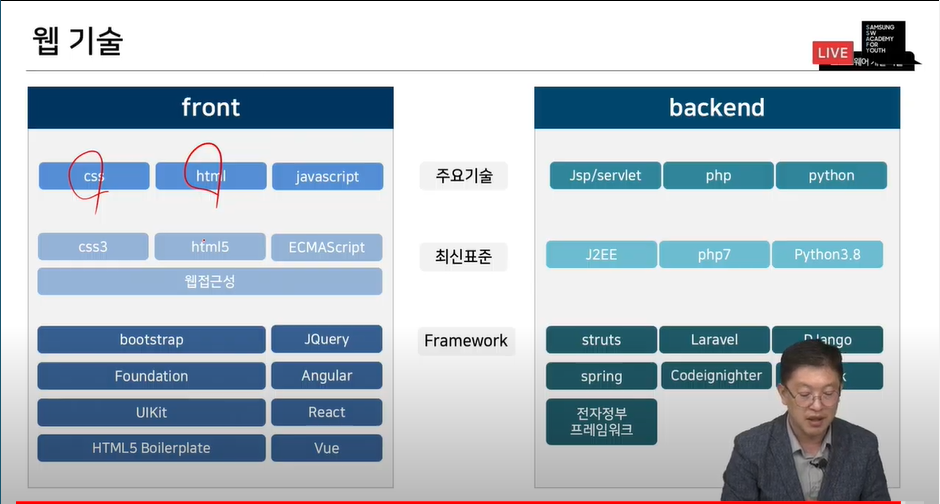
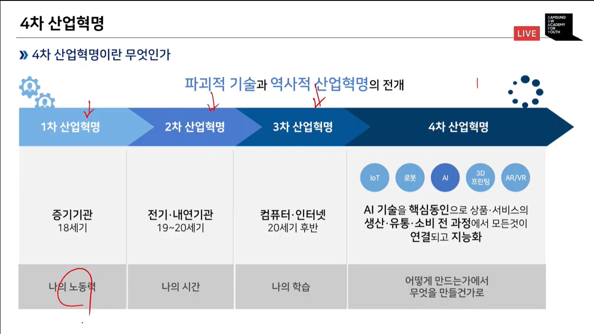
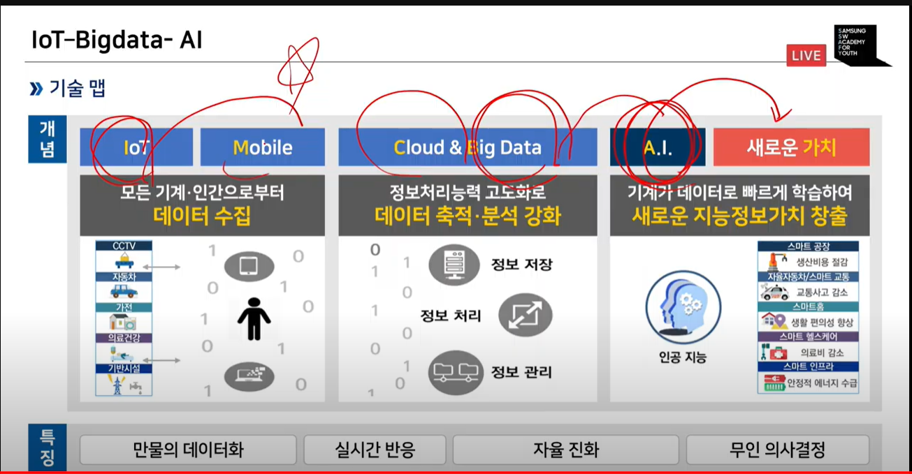
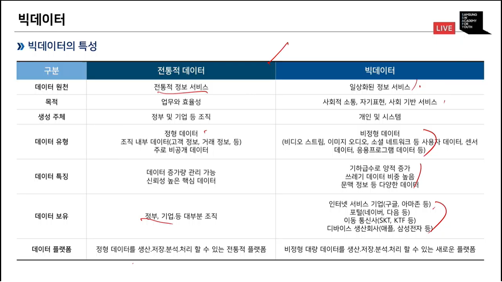
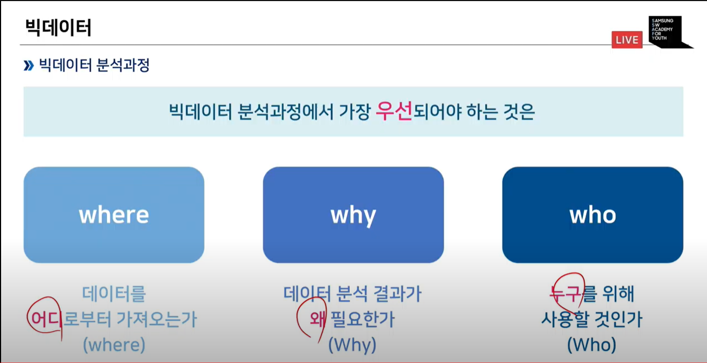
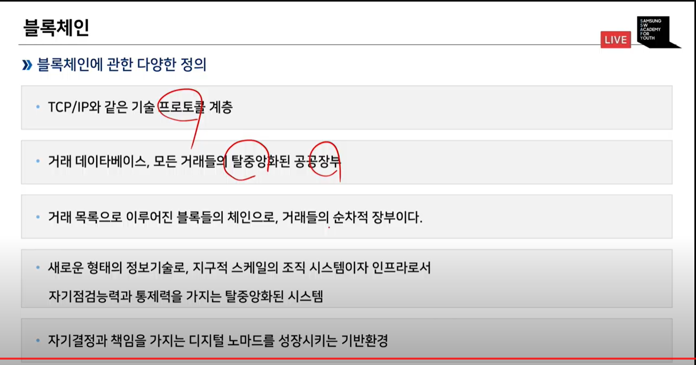

# 소프트웨어 프로젝트 관리

> PMBOK 5 프로세스 그룹  

1. 시작 그룹
2. 기획 그룹
3. 실행 그룹
4. 통제 그룹
5. 종료 그룹  

> PMBOK의 9가지 관점  

1. 통합
2. 범위
3. 시간
4. 비용
5. 품질
6. 인적자원
7. 통신
8. 위협
9. 조달 

  

#### 소프트웨어 프로세스 모델 
> 애자일 프로세스 모델  
> 스크럼
> XP(extreme Programming)
> Lean

### 웹 페이지

> 정적 웹 페이지
> 동적 웹 페이지

### 클라이언트-서버  

> 클라이언트-서버 모델 기반
> 서버 프로그램
> 클라이언트 프로그램  

### 웹 서버의 종류  
> Apache web server - .then HTTP web server  
> Apache Tomcat  
> Microsoft사의 Internet Information Service(IIS) Windows Server  
> Nginx web server  
> Lighttpd
> Jigsaw

### FrontEnd

> HTML의 기능  

- 멀티미디어 기능 
- 그래픽 기능  
- 3차원 그래피 구현 방법  
- 통신
- 장치 접근  
- 오프라인 및 저장소  
- 시맨틱  
- 웹의 성능 극대화 및 통합  

 

> CSS

 

> Javascript  

 

> Ajax  
pros
- 페이지 이동없이 고속으로 화면을 전환할 수 있다.  
- 서버처리를 기다리지 않고, 비동기 요청이 가능하다.  
- 수신하는 데이터 양을 줄일 수 있고, 클라이언트에게 처리를 위임할 수 있다.

cons  
- HTTP 클라이언트의 기능이 한정  
- 페이지 이동 없는 통시능로 인한 보안상의 문제점  
- 스크립트로 작성되므로 디버깅이 용이하지 않음  
- 요청을 남발하면 역으로 서버 부하가 늘 수 있음  
- 동일-출처 정책으로 인해 다른 도메인과 통신이 불가능  

 

> JQuery

 

> React

 

> Vue

 

> Angular  

  

### Backend - Java based  

> JSP  
> 아파치 스트럿츠  
> 스프링 프레임워크(Spring Framework)

### Backend - PHP based  
> Code Ignighter
> Lalavel

### Backend - Python
> Flask
> Django  

# 소프트웨어 개발 기술  

### 모바일 서비스  

시스템 소프트웨어
- 모바일 운영체제(OS): 모바일 단말기용 시스템 소프트웨어  

애플리케이션
- 다운로드 애플리케이션
- 모바일 웹브라우저  
- 내장 애플리케이션  

모바일 운영체제
- 휴대폰에서 PC 운영체제와 같은 역할을 수행  
- 스마트폰의 프로세서, 메모리, 화면 등의 하드웨어를 관리하고 운영  
- 모바일 애플리케이션이 실행되는 소프트웨어 플랫폼 역할  
- 공개형 모바일 운영체제가 대세  

### FrontEnd Mobile  
모바일 애플리케이션의 특징 
- 즉시연결성  
- 지역성  
- 전달성  
- 개인화  

  

> React Native  

> Flutter  

> 안드로이드  
- 리눅스 커널 

### 빅데이터 산업의 이해  

> 인공지능 모델  
- 규칙 기반 모델  
- 지식 기반 모델

> 추천시스템  
- 협업 기반 추천
- 콘텐츠 기반 추천  

> IoT

> 4차 산업혁명  

> 빅데이터  

> 블록체인 

> 클라우드 컴퓨팅, 엣지 컴퓨팅