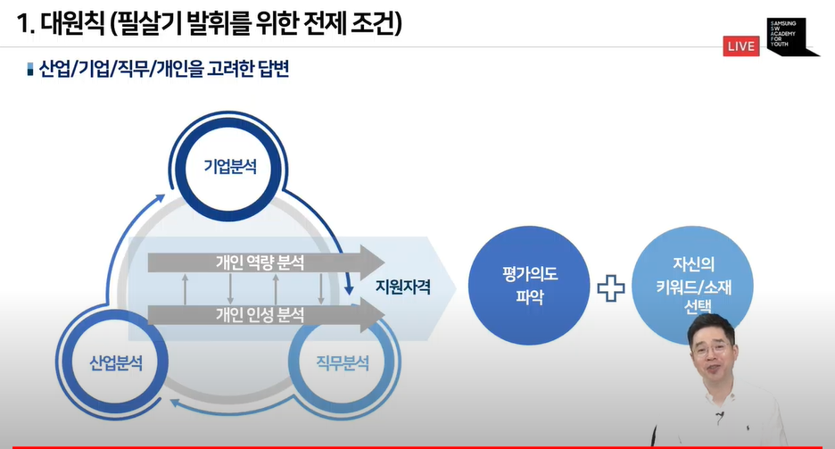
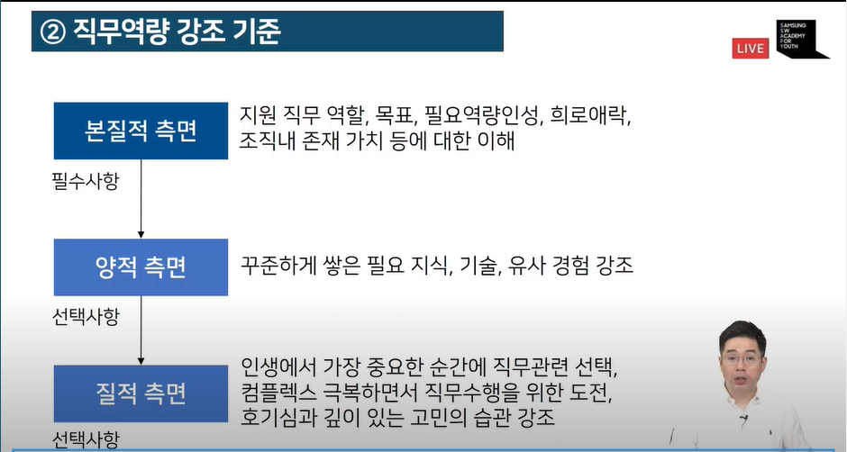

# 인성면접

1. 전략적인 지원  
2. 전문성 부각  
3. 실전형 대비  

인성면접: 업무 성과에 영향을 미치는 모든 요소를 점검하는 과정  

평가요소
- 직무역량
- 기반역량
- 인성
- 로열티

#### 대표 질문 유형 6가지  

1. 개인 필수 질문 유형(면접 전 반드시 체크해야 하는 핵심 질문)  
- 자기 소개
- 회사 지원 동기
- 하고 싶은 업무가 무엇인가?
- 지원 직무가 무엇이라 생각하는가?
- 본인이 채용되어야 하는 이유는?
- 입사 후 이루고자 하는 포부가 있다면?
- 묻고 싶은 질문이 있는가?
- 마지막으로 하고 싶은 말?

  

  

#### 기본 점검사항  
1. 강점을 강점화하라.  
2. 답변의 시작은 경청  
3. 인정하고 긍정으로 - 본인에게 불리한 질문을 스스로 만들지 말아야 한다.
4. 자신감과 겸손함 - 자신있는 질문에는 겸손하게, 자신없는 부분에게 자신있게
- 면접관도 인간이다. 자신있는 부분에는 건드리지 않고, 부족한 부분은 공격한다.  

  

### 인성면접 필살기  

1. 대원칙 (전제 조건)  
2. 선언 - 증명 - 각인
3. 차별화 (조각 내기)

지원 기업/직무/질문 내에서  

-  필살기란? 내가 가지고 있는 모습 중 특히 더 의미와 가치를 부각시켜야 하는 **가장 나다움**  

내 답변에는 왜 **나는** 없을까? - **산업, 기업, 직무**와 연결되는 나만의 **키워드**와 **스토리**가 미흡하기 때문  

  

비전 제시 Process  
- 지원한 직무에서 명확한 목표를 제시하고, 그러한 목표가 지원회사에 왜 필요한지 당위성을 강조  

  

### 면접에 대한 대응 

1. 평가 의도 파악  
  

기반역량  
- 높은 성과를 발휘하는 지원직무 현직자들이 공통적으로 발휘하는 행동패턴
- 회사 직무소개에서 대부분 기반역량의 중요성 강조  

Loyalty  
- 지원 회사/직무 선택 이유, 입사 후 구체저인 목표와 실행계획을 회사와 연결하여 강조함으로써 지속적인 근무의지 강조  

키워드 선정(평가 의도 파악) process  
- 고정형으로, 선택형으로, 강제형으로 답변해야하는 것인지 확인해야 한다.  

### 평가 지표 점검  

  

[중요도 1순위] 인재상/핵심가치  
  

[중요도 2순위] 역량 사전  
네이버에 직무 역량사전 검사하기  

[중요도 3순위] 배포자료  

  

### 소재  
1. 가장 좋은 소재  

지원 직무와 관련된 소재가 중요한 것이 아니다.  

2. 증명을 위한 생각/행동/성과 반영  

3. 조각 내기
  

### 차별화  

1. 키워드 차별화 

2. 노하우와 차별화  
강조하는 키워드에 대한 상과 외에 해당 키워드의 **능숙도**를 강조하면서 최고가 될 수 있다는 모습 제시  

3. 목적의 차별화  
결과보다 과정과 의도를 통해 차별화를 시도  
때로는 **간접적인 메시지 전달**이 더욱 신뢰도와 호감도가 높다는 점

4. 필요성의 차별화  

자신의 가치는 자신이 증명하고 어필할 수 있어야 한다.  
- 나의 어떠한 키워드가 특히 어떤한 이유로 때문에 지원 회사 지원 직무에 꼭 필요하거나 도움이 될 수 있다는 것을 증명.

5. 깨달음의 차별화  
우리가 생각하고 기대하는 것보다 평가자는 우리의 답변을 이해하기 어렵다.  

6. 답변 차별화 적용방법  

### 상황 대처  

  

공백기 1개월 단위로 얘기해 보세요.

꼼꼼하지 않다. 대신 느리다. 이런 식으로 말하기  
강민혁 단점 검색해보기 